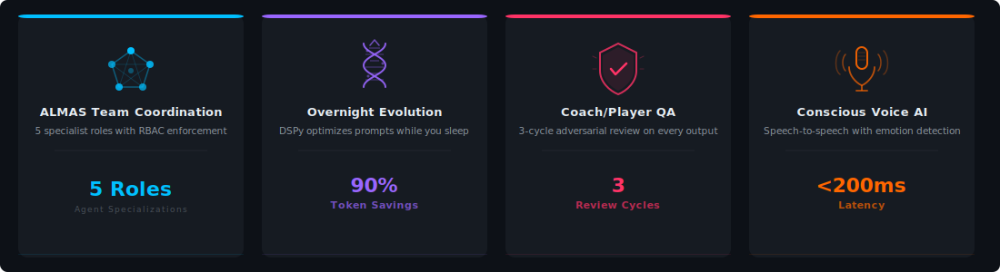
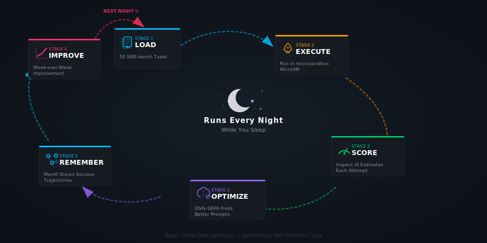

<div align="center">


<br><br>

[](https://opensource.org/licenses/Apache-2.0)
[](https://github.com/Ghenghis/Super-Goose/actions)
[](https://github.com/Ghenghis/Super-Goose/actions/workflows/release.yml)
[](https://discord.gg/goose-oss)
[](https://github.com/Ghenghis/Super-Goose/pkgs/container/super-goose)
[](https://ghenghis.github.io/Super-Goose/)

</div>

---

<div align="center">

### What is Super-Goose?

**Super-Goose merges 16 state-of-the-art open-source projects into the first self-evolving, voice-enabled, production-grade AI agent platform.** Built on Block's Goose core in Rust, it orchestrates multi-agent teams, optimizes its own prompts overnight, enforces security policies, and talks to you through a natural voice interface.

</div>

---

## How Super-Goose Works

<div align="center">

</div>

<br>

When you give Super-Goose a task — by **voice** or **text** — here's what happens:

| Step | What Happens | Tools Involved |
|:--:|:--|:--|
| **1** | Your request enters the **Planner**, which breaks it into structured steps with dependencies | Goose Core, LangGraph |
| **2** | The **ALMAS Team Coordinator** assigns each step to the right specialist agent | 5 agents: Architect, Developer, QA, Security, Deployer |
| **3** | Each agent executes in an isolated **MicroVM sandbox** with snapshot/restore | microsandbox, Arrakis |
| **4** | Every line of generated code passes through **security scanning** and **AST-aware analysis** | Semgrep, ast-grep, CrossHair |
| **5** | The **Coach/Player QA** system reviews output in up to 3 adversarial cycles | Coach (precise), Player (creative) |
| **6** | Approved code gets a **PR-Agent review** and full **observability traces** | PR-Agent, Langfuse |
| **7** | Overnight, the **Self-Evolution Engine** analyzes all attempts and optimizes prompts | DSPy, Inspect AI, Mem0 |

---

## The 16 Integrated Tools

<div align="center">

</div>

<br>

<div align="center">

</div>

<br>

<table>
<tr>
<td width="50%" valign="top">

### Core Agent Layer
| # | Tool | What It Does |
|:-:|:--|:--|
| 1 | **Goose Core** | Rust agent engine with MCP protocol, multi-provider LLM support |
| 2 | **Aider** | AI pair programmer with 14 code editing strategies |
| 3 | **LangGraph** | Graph-based workflows with checkpoint/resume and time-travel |
| 4 | **OpenHands** | Sandboxed execution with browser automation |
| 5 | **Pydantic-AI** | Type-safe structured outputs with runtime validation |
| 6 | **Conscious** | Voice-first interface with emotion detection (8 emotions) |

</td>
<td width="50%" valign="top">

### Self-Evolution Engine
| # | Tool | What It Does |
|:-:|:--|:--|
| 7 | **DSPy** | Bayesian prompt optimization (MIPROv2, GEPA) |
| 8 | **Inspect AI** | UK AISI evaluation framework for scoring agent quality |
| 9 | **Mem0** | Graph memory (Neo4j + Qdrant) with trajectory recall |

### Sandbox & Execution
| # | Tool | What It Does |
|:-:|:--|:--|
| 10 | **microsandbox** | MicroVM isolation with <200ms boot, MCP-native |
| 11 | **Arrakis** | VM snapshots for Language Agent Tree Search (LATS) |

</td>
</tr>
<tr>
<td width="50%" valign="top">

### Governance & Observability
| # | Tool | What It Does |
|:-:|:--|:--|
| 12 | **Langfuse** | Distributed tracing with token/cost/latency dashboards |
| 13 | **Semgrep** | Policy-as-code security scanning on every diff |
| 14 | **PR-Agent** | AI-powered code review, test generation, changelogs |

</td>
<td width="50%" valign="top">

### Code Quality & Verification
| # | Tool | What It Does |
|:-:|:--|:--|
| 15 | **ast-grep** | AST-aware structural code search and refactoring |
| 16 | **CrossHair** | Formal verification with Z3 symbolic execution |

</td>
</tr>
</table>

---

## Why Stage 5?

<div align="center">

</div>

<br>

Current AI coding agents operate at **Stage 4** — a single model, static prompts, no memory, no quality review. Super-Goose breaks through to **Stage 5**:

<table>
<tr>
<th width="25%">Dimension</th>
<th width="35%">Stage 4 (Current)</th>
<th width="40%">Stage 5 (Super-Goose)</th>
</tr>
<tr><td><strong>Architecture</strong></td><td>Single agent</td><td>5 specialist roles + orchestrator</td></tr>
<tr><td><strong>Memory</strong></td><td>None — starts fresh every time</td><td>Graph memory with trajectory recall</td></tr>
<tr><td><strong>Prompts</strong></td><td>Static forever</td><td>DSPy-compiled, improve nightly</td></tr>
<tr><td><strong>Quality</strong></td><td>No review — user sees all errors</td><td>Coach/Player adversarial review (3 cycles)</td></tr>
<tr><td><strong>Voice</strong></td><td>Text only</td><td>Moshi 7B speech-to-speech (<200ms)</td></tr>
<tr><td><strong>Security</strong></td><td>None</td><td>Semgrep + CrossHair on every diff</td></tr>
<tr><td><strong>Sandbox</strong></td><td>Docker containers</td><td>MicroVM isolation (<200ms boot)</td></tr>
<tr><td><strong>Observability</strong></td><td>None</td><td>Langfuse traces + OpenTelemetry spans</td></tr>
</table>

---

## The ALMAS 5-Agent Team

<div align="center">

</div>

<br>

Every task flows through **five specialist agents** in sequence, each with **role-based access control (RBAC)**:

| Role | Responsibility | Access |
|:--|:--|:--|
| **Architect** | Creates design docs, PLAN.md, architecture decisions | Read all, write docs only |
| **Developer** | Writes code, runs builds, creates implementations | Full code access |
| **QA Engineer** | Runs tests, checks coverage ≥ 80%, validates quality | Read all, write tests only |
| **Security** | Runs cargo audit, Semgrep scans, vulnerability checks | Read all, scan tools only |
| **Deployer** | Builds release artifacts, manages deployment | Build/deploy access only |

Each agent's file access and command execution is validated against its role capabilities before proceeding. Failed validations block the operation and trigger a feedback loop.

---

## Self-Evolution: The Overnight Gym

<div align="center">

</div>

<br>

Super-Goose **gets better over time** — automatically. Every night, the Overnight Gym:

| Phase | What Happens |
|:--|:--|
| **Load** | Pulls 50 benchmark tasks from SWE-bench Verified |
| **Execute** | Runs each task in an isolated microsandbox MicroVM |
| **Score** | Inspect AI evaluates every attempt with model-graded metrics |
| **Optimize** | DSPy GEPA analyzes patterns across all attempts, compiles better prompts |
| **Remember** | Mem0 stores successful trajectories as entity-relationship graphs |
| **Improve** | Week-over-week improvement tracked for regression detection |

The result: **90%+ token savings** through progressive 3-layer context disclosure, and measurably better prompts every week.

---

## Coach/Player Quality Gate

Every output goes through a **dual-model adversarial review** before you see it:

<table>
<tr>
<td width="50%" align="center">

### The Player
*Temperature 0.7 — Creative*

Executes the task with full tool access. Generates code, tests, and documentation. Optimized for **breadth and creativity**.

</td>
<td width="50%" align="center">

### The Coach
*Temperature 0.3 — Precise*

Reviews against quality standards: compilation, tests, security, coverage ≥ 90%. Optimized for **accuracy and rigor**.

</td>
</tr>
</table>

If rejected, the Player self-improves with Coach feedback and retries — up to **3 cycles**. This catches errors that single-pass agents miss.

---

## Conscious: Voice-First Interface

<table>
<tr>
<td width="60%">

Super-Goose speaks. The **Conscious** voice AI companion provides:

- **Moshi 7B Engine** — native speech-to-speech, no transcription step
- **<200ms Latency** — real-time conversation
- **Emotion Detection** — Wav2Vec2 tracking 8 emotions at 85-90% accuracy
- **13 Personality Profiles** — each with 20+ behavioral sliders
- **Intent Routing** — CHAT (conversational) vs ACTION (execute via Goose)
- **Device Control** — SSH, 3D printing, network scanning

Voice commands are routed through GooseBridge to the full 16-tool platform — everything you can do by text, you can do by voice.

Repository: [github.com/Ghenghis/Conscious](https://github.com/Ghenghis/Conscious)

</td>
<td width="40%" align="center">

### Voice Stats

| Metric | Value |
|:--|--:|
| Latency | <200ms |
| Emotions | 8 tracked |
| Accuracy | 85-90% |
| Profiles | 13 |
| Sliders | 20+ each |

</td>
</tr>
</table>

---

## Enterprise Capabilities

<table>
<tr>
<td width="25%" align="center">

### Orchestrator
Dependency graphs, parallel execution, priority scheduling, auto-retry

</td>
<td width="25%" align="center">

### Checkpointing
LangGraph SQLite snapshots. Resume from any state. Time-travel debugging.

</td>
<td width="25%" align="center">

### Supply Chain
cosign signing, Syft SBOM, Trivy scanning, OpenSSF Scorecard

</td>
<td width="25%" align="center">

### CI/CD
GitHub Actions pipelines. Smart change detection. All platforms.

</td>
</tr>
</table>

---

## Performance

| Metric | Value |
|:--|--:|
| **Sandbox Boot Time** | <200ms |
| **Voice Latency** | <200ms |
| **Token Savings** | 90%+ |
| **Quality Gate Cycles** | 3 |
| **Specialist Agents** | 5 |
| **Integrated Tools** | 16 |
| **Bridge Modules** | 16 |
| **Emotion Accuracy** | 85-90% |
| **Personality Profiles** | 13 |

---

## Project Scale

Super-Goose is a major extension of [Block's Goose](https://github.com/block/goose), adding **230K+ lines of meaningful code and documentation** across 1,400+ new files:

| Metric | Value |
|:--|--:|
| **Rust Code** | 165K+ lines across 7 workspace crates |
| **Test Functions** | ~2,100 (`#[test]` + `#[tokio::test]`) |
| **Memory + Agent Tests** | 208 (all passing) |
| **Commits Ahead** | 177 beyond upstream Block/goose |
| **New Files** | 1,410+ added to the fork |
| **CI/CD Workflows** | 43 GitHub Actions pipelines |
| **Docker Image** | `ghcr.io/ghenghis/super-goose` (linux/amd64) |

### Phase 6: Memory System

The memory system provides **cross-session context retention** with 4 memory tiers:

| Tier | Purpose | Decay |
|:--|:--|--:|
| **Working** | Short-term LRU cache for current conversation | 0.70 |
| **Episodic** | Session history and conversation context | 0.90 |
| **Semantic** | Long-term facts and knowledge | 0.99 |
| **Procedural** | Learned patterns and procedures | 0.98 |

- **Real Embeddings** — Candle sentence-transformer (all-MiniLM-L6-v2, 384-dim) with hash fallback
- **Mem0 Dual-Write** — Local memory + graph memory (Neo4j/Qdrant) when available
- **Consolidation** — Automatic Working→Episodic→Semantic promotion
- **Persistence** — Cross-session recall via `~/.config/goose/memory/memories.json`
- **`/memory` Command** — Stats, clear, save subcommands

### Phase 6.3: Human-in-the-Loop (HITL)

Interactive session control with breakpoints and plan approval:

| Feature | Description |
|:--|:--|
| **Breakpoints** | Tool-level, pattern-based (regex), periodic (every N turns), on-error |
| **Plan Approval** | Gate execution until user reviews and approves the plan |
| **Feedback Injection** | Inject user guidance mid-execution via `/resume [feedback]` |
| **State Inspection** | `/inspect` shows turn count, breakpoints, plan status, memory stats |
| **Slash Commands** | `/pause`, `/resume`, `/breakpoint`, `/inspect`, `/plan` |

### Phase 6.4: Agent Benchmarks (goose-bench)

Built-in benchmark framework for measuring and tracking agent quality:

| Feature | Description |
|:--|:--|
| **BenchmarkSuite** | 6 builtin tasks (code generation, refactoring, bug fix, test writing, documentation, multi-step) |
| **5 Evaluator Criteria** | Contains, Matches (regex), ToolCalled, FileExists, Custom functions |
| **Regression Detection** | Automatic comparison against baselines with configurable thresholds |
| **Reporting** | BenchmarkReport with pass/fail rates, task-level breakdowns, performance deltas |

### Phase 7: Task Graph Engine & Skill Registry

LangGraph-inspired DAG execution and composable skill system:

<table>
<tr>
<td width="50%" valign="top">

**Task Graph (graph.rs)**
- DAG with typed nodes: ToolCall, Prompt, Conditional, SubGraph, ParallelFork, Join
- Cycle detection via DFS, topological sort via Kahn's algorithm
- GraphExecutor with retry support and node state tracking
- Mermaid diagram export for visualization
- 18 unit tests

</td>
<td width="50%" valign="top">

**Skill Registry (skill_registry.rs)**
- SkillMetadata with 10 categories and typed parameters
- Search/discovery API with multi-criteria filtering
- Recursive dependency resolution with circular dep detection
- SkillPipeline for chaining skills with I/O validation
- 4 builtins: code-review, test-generator, docs-generator, security-audit
- 20 unit tests

</td>
</tr>
</table>

### Phase 8: Extended Thinking & Agentic Swarms

Chain-of-thought deliberation and multi-agent swarm orchestration:

<table>
<tr>
<td width="50%" valign="top">

**Extended Thinking (extended_thinking.rs)**
- ThinkingSession with structured chain-of-thought reasoning
- 10 step types: Decomposition, Hypothesis, Evaluation, Verification, Synthesis, Reflection, etc.
- 7 thinking patterns: Linear, TreeOfThought, ReAct, Reflexive, StepBack, LeastToMost, SelfDebate
- Configurable budget (steps, time, tokens, depth)
- Confidence tracking with auto-termination
- 12 unit tests

</td>
<td width="50%" valign="top">

**Agentic Swarms (swarm.rs)**
- Multi-agent Swarm with 10 typed roles (Coder, Tester, Reviewer, Architect, etc.)
- 6 routing strategies: RoundRobin, LeastBusy, SkillBased, PerformanceBased, Hybrid, Random
- BatchProcessor for parallel task execution
- Inter-agent messaging with typed messages
- EMA-based performance tracking per agent
- 16 unit tests

</td>
</tr>
</table>

---

## Quick Start

### Prerequisites

- **Rust** 1.79+ with `cargo`
- **Python** 3.10+ with `pip`
- **Docker** & Docker Compose (for infrastructure services)

### Install

```bash
git clone https://github.com/Ghenghis/Super-Goose.git
cd Super-Goose
cargo build --release
pip install dspy inspect_ai mem0ai crosshair-tool semgrep aiohttp
docker compose -f docker-compose.stage6.yml up -d
cargo run --release --bin goose
```

### Downloads

Pre-built binaries are available from the [Releases](https://github.com/Ghenghis/Super-Goose/releases) page:

| Platform | CLI | Desktop |
|:--|:--|:--|
| **Docker** | `ghcr.io/ghenghis/super-goose:v1.24.04` | — |
| **Windows** | `goose-x86_64-pc-windows-msvc.zip` | `Goose-win32-x64.zip` |
| **macOS ARM** | `goose-aarch64-apple-darwin.tar.bz2` | `Goose.dmg` |
| **macOS Intel** | `goose-x86_64-apple-darwin.tar.bz2` | `Goose-intel.dmg` |
| **Linux x86** | `goose-x86_64-unknown-linux-gnu.tar.bz2` | `.deb` / `.rpm` |
| **Linux ARM** | `goose-aarch64-unknown-linux-gnu.tar.bz2` | — |

### Docker

Pull the official Super-Goose Docker image from [GitHub Container Registry](https://github.com/Ghenghis/Super-Goose/pkgs/container/super-goose):

```bash
# Latest
docker pull ghcr.io/ghenghis/super-goose:latest

# Specific version
docker pull ghcr.io/ghenghis/super-goose:v1.24.04

# Run the CLI
docker run --rm -it ghcr.io/ghenghis/super-goose:latest goose

# Run the server (goosed) on port 3284
docker run -d -p 3284:3284 ghcr.io/ghenghis/super-goose:latest goosed
```

The Docker image includes both `goose` (CLI) and `goosed` (API server) binaries built from Rust on a minimal Debian runtime. Published for `linux/amd64` on every release.

---

## Infrastructure

Super-Goose's backend services run on Docker Compose:

| Service | Purpose | Port |
|:--|:--|--:|
| **Neo4j** | Graph memory for Mem0 | 7474 |
| **Qdrant** | Vector search for Mem0 | 6333 |
| **PostgreSQL** | Langfuse database | 5432 |
| **ClickHouse** | Langfuse analytics | 8123 |
| **Redis** | Langfuse cache | 6379 |
| **MinIO** | Langfuse blob storage | 9000 |
| **Langfuse** | Observability dashboard | 3000 |

---

## Contributing

Super-Goose is a fork of [Block's Goose](https://github.com/block/goose) with 16 integrated tools and a 4-tier memory system. Contributions are welcome — see the [Issues](https://github.com/Ghenghis/Super-Goose/issues) page.

---

## License

[Apache License 2.0](LICENSE) — Based on [Goose](https://github.com/block/goose) by Block, Inc.

---

<div align="center">

**Built with Rust + Python + Go**

[Releases](https://github.com/Ghenghis/Super-Goose/releases) &bull; [Docker](https://github.com/Ghenghis/Super-Goose/pkgs/container/super-goose) &bull; [Docs](https://ghenghis.github.io/Super-Goose/) &bull; [Discord](https://discord.gg/goose-oss) &bull; [Issues](https://github.com/Ghenghis/Super-Goose/issues)

</div>
