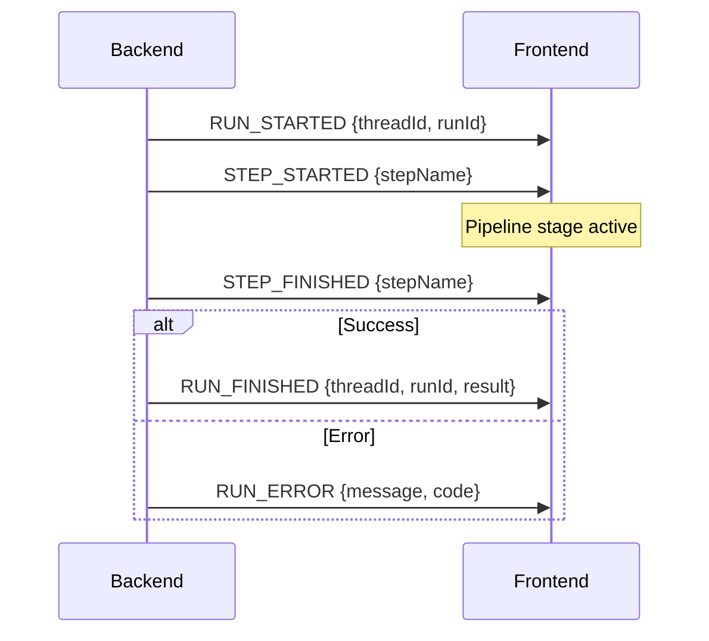
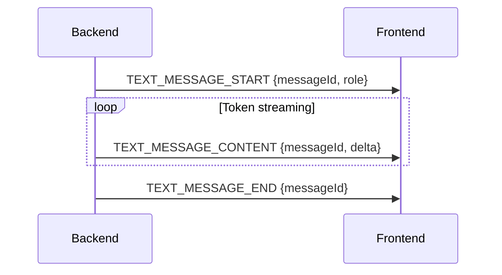
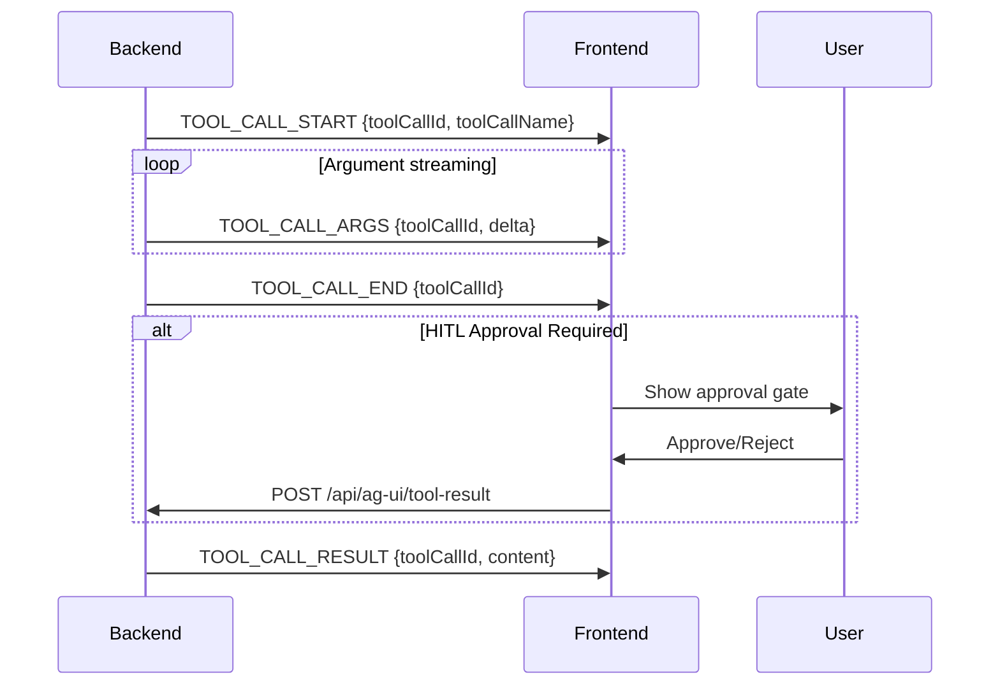
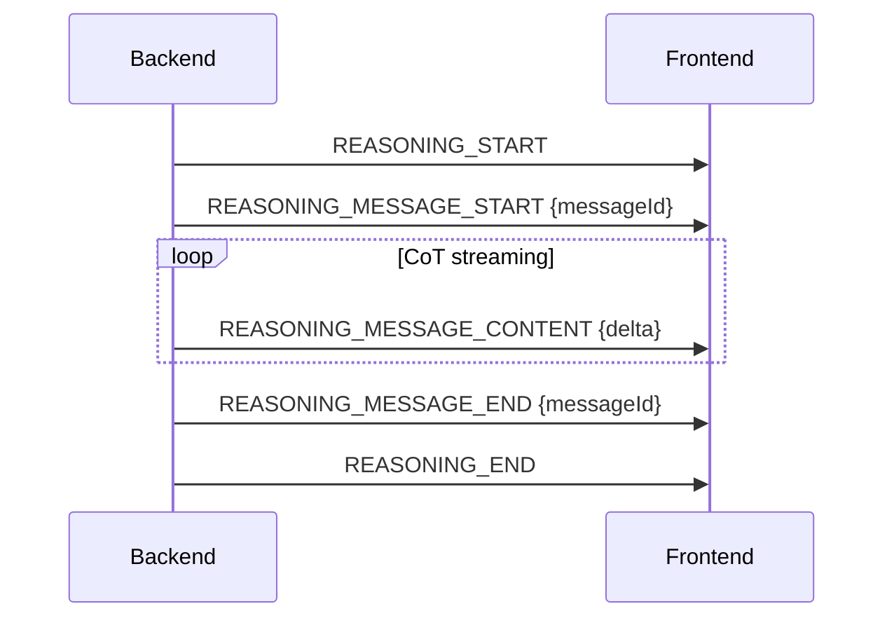
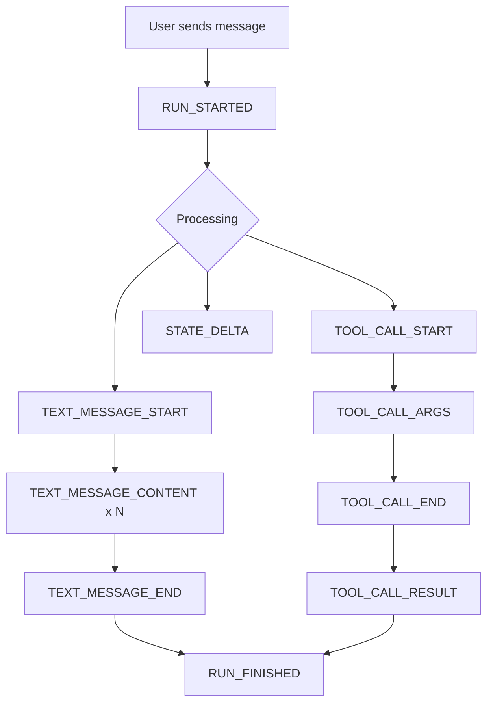
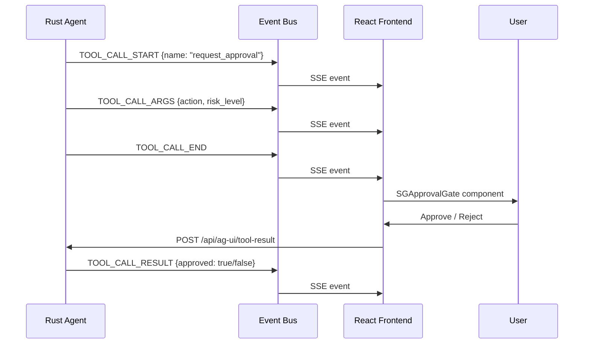

# AG-UI Protocol Reference

**Version**: 1.0 (Super-Goose v1.24.7)
**Date**: 2026-02-15

The AG-UI (Agent-User Interaction) protocol provides standardized streaming
communication between the Rust backend (`goosed`) and the React frontend via
Server-Sent Events (SSE).

---

## Architecture

```
                          ┌──────────────────────────────┐
                          │   React Frontend (Electron)  │
                          │                              │
                          │  useAgUi() ◄── EventSource   │
                          │     │                        │
                          │     ▼                        │
                          │  AgentState / Messages /     │
                          │  ToolCalls / Activities      │
                          └──────────┬───────────────────┘
                                     │ SSE
                          GET /api/ag-ui/stream
                                     │
                          ┌──────────▼───────────────────┐
                          │   Rust Backend (goosed)      │
                          │                              │
                          │  broadcast::Sender<String>   │
                          │  (capacity = 4096)           │
                          │     ▲           ▲            │
                          │     │           │            │
                          │  reply.rs    POST endpoints  │
                          │  (agent      /tool-result    │
                          │   execution) /abort          │
                          │              /message        │
                          └──────────────────────────────┘
```

## Event Categories (28 types)

### Lifecycle (5 events)

Control the start and end of agent runs and pipeline steps.



| Event | Fields | Description |
|-------|--------|-------------|
| `RUN_STARTED` | `threadId`, `runId` | Agent begins processing a request |
| `RUN_FINISHED` | `threadId`, `runId`, `result` | Agent completed successfully |
| `RUN_ERROR` | `message`, `code` | Agent encountered an error |
| `STEP_STARTED` | `stepName` | Pipeline stage begins (planning, execution, review) |
| `STEP_FINISHED` | `stepName` | Pipeline stage completed |

### Text Messages (4 events)

Stream assistant responses token-by-token.



| Event | Fields | Description |
|-------|--------|-------------|
| `TEXT_MESSAGE_START` | `messageId`, `role` | New message begins |
| `TEXT_MESSAGE_CONTENT` | `messageId`, `delta` | Incremental text chunk |
| `TEXT_MESSAGE_END` | `messageId` | Message complete |
| `TEXT_MESSAGE_CHUNK` | `messageId`, `delta` | Alternative chunked delivery |

### Tool Calls (5 events)

Track tool invocations with incremental argument streaming and results.



| Event | Fields | Description |
|-------|--------|-------------|
| `TOOL_CALL_START` | `toolCallId`, `toolCallName` | Tool invocation begins |
| `TOOL_CALL_ARGS` | `toolCallId`, `delta` | Incremental JSON arguments |
| `TOOL_CALL_END` | `toolCallId` | Arguments complete |
| `TOOL_CALL_RESULT` | `toolCallId`, `content` | Tool execution result |
| `TOOL_CALL_CHUNK` | `toolCallId`, `delta` | Alternative chunked args |

### State (3 events)

Push agent state updates to frontend, replacing polling.

| Event | Fields | Description |
|-------|--------|-------------|
| `STATE_SNAPSHOT` | Full agent state object | Complete state replacement |
| `STATE_DELTA` | JSON Patch operations (RFC 6902) | Incremental state update |
| `MESSAGES_SNAPSHOT` | `messages[]` | Full conversation snapshot |

**JSON Patch format** (used by `STATE_DELTA`):
```json
{
  "type": "STATE_DELTA",
  "delta": [
    {"op": "replace", "path": "/core_type", "value": "structured"},
    {"op": "replace", "path": "/status", "value": "running"}
  ]
}
```

### Activity (2 events)

Track background activities (OTA builds, autonomous tasks, CI monitoring).

| Event | Fields | Description |
|-------|--------|-------------|
| `ACTIVITY_SNAPSHOT` | `activities[]` | All active activities |
| `ACTIVITY_DELTA` | JSON Patch operations | Incremental activity update |

### Reasoning (7 events)

Stream chain-of-thought reasoning from extended thinking models.



| Event | Fields | Description |
|-------|--------|-------------|
| `REASONING_START` | — | Reasoning block begins |
| `REASONING_MESSAGE_START` | `messageId` | Individual reasoning step |
| `REASONING_MESSAGE_CONTENT` | `delta` | Streaming reasoning text |
| `REASONING_MESSAGE_END` | `messageId` | Step complete |
| `REASONING_MESSAGE_CHUNK` | `delta` | Alternative chunked delivery |
| `REASONING_END` | — | Reasoning block complete |
| `REASONING_ENCRYPTED_VALUE` | `ciphertext` | Encrypted reasoning (privacy) |

### Special (2 events)

Extension points for custom functionality.

| Event | Fields | Description |
|-------|--------|-------------|
| `RAW` | `payload` | Unstructured event pass-through |
| `CUSTOM` | `name`, `value` | Named custom events |

**Custom event names used by Super-Goose**:
- `heartbeat` — Connection keepalive
- `ota_restart` — OTA binary swap detected
- `pipeline_stage` — Pipeline visualization update
- `safety_alert` — Safety envelope trigger
- `cost_update` — Session cost tracking

---

## Backend Implementation

### Event Bus (`state.rs`)

```
AppState
  └── ag_ui_tx: broadcast::Sender<String>  (capacity: 4096)
```

Three emission helpers:
- `emit_ag_ui_event_typed()` — Strongly-typed AG-UI event
- `emit_ag_ui_event()` — Raw JSON string event
- `emit_bridged_event()` — Legacy event wrapped as AG-UI

### SSE Handler (`ag_ui_stream.rs`)

The `GET /api/ag-ui/stream` endpoint uses `tokio::select!` to multiplex:
1. AG-UI broadcast channel events
2. Periodic heartbeat (30s interval)
3. Client disconnect detection

```
ag_ui_stream_handler()
  ├── Subscribe to broadcast channel
  ├── tokio::select! loop
  │   ├── ag_ui_rx.recv() → Forward to SSE
  │   ├── heartbeat_interval.tick() → Send CUSTOM heartbeat
  │   └── client disconnect → Break
  └── Return SSE stream
```

### REST Endpoints

| Method | Path | Description |
|--------|------|-------------|
| `GET` | `/api/ag-ui/stream` | SSE event stream |
| `GET` | `/api/ag-ui/state` | Current agent state snapshot |
| `GET` | `/api/ag-ui/activities` | Current activities |
| `GET` | `/api/ag-ui/messages` | Conversation messages |
| `POST` | `/api/ag-ui/tool-result` | Submit tool call result (HITL) |
| `POST` | `/api/ag-ui/abort` | Abort current run |
| `POST` | `/api/ag-ui/message` | Send user message |

### Agent Execution Events (`reply.rs`)

During `Agent.reply()`, the following AG-UI events are emitted:



---

## Frontend Implementation

### `useAgUi` Hook (`ui/desktop/src/ag-ui/useAgUi.ts`)

The primary hook for consuming AG-UI events. Returns:

```typescript
interface UseAgUiReturn {
  // Lifecycle
  runId: string | null;
  isRunning: boolean;
  currentStep: string | null;

  // Messages
  messages: AgUiMessage[];

  // State (replaces polling)
  agentState: AgentState;

  // Tool calls (with HITL)
  activeToolCalls: ToolCallState[];
  pendingApprovals: ToolCallApproval[];
  approveToolCall: (toolCallId: string) => void;
  rejectToolCall: (toolCallId: string) => void;

  // Activity
  activities: ActivityMessage[];

  // Reasoning (CoT stream)
  reasoning: ReasoningMessage[];

  // Custom events
  customEvents: CustomEvent[];

  // Connection
  connected: boolean;
  error: Error | null;
}
```

### Event Verification (`verifyEvents.ts`)

Runtime validation utility that checks:
- Required fields present for each event type
- Correct enum values
- JSON Patch operations are valid RFC 6902
- Message IDs are consistent across start/content/end sequences

### Migration from Legacy

| Legacy | AG-UI Replacement |
|--------|-------------------|
| `useAgentStream` (SSE) | `useAgUi` (SSE) |
| `useSuperGooseData` (5s polling) | `useAgUi` push events |
| Custom IPC events | AG-UI typed events |
| `AgentStreamEvent` variants | `AgUiEventType` enum |

---

## HITL (Human-in-the-Loop) Flow

AG-UI models approval gates as special tool calls:



---

## File Reference

| File | Lines | Purpose |
|------|-------|---------|
| `ui/desktop/src/ag-ui/types.ts` | 601 | TypeScript type definitions (28 events) |
| `ui/desktop/src/ag-ui/useAgUi.ts` | 1001 | React hook consuming SSE stream |
| `ui/desktop/src/ag-ui/verifyEvents.ts` | — | Runtime event validation |
| `ui/desktop/src/ag-ui/index.ts` | — | Barrel exports |
| `crates/goose-server/src/routes/ag_ui_stream.rs` | — | SSE handler + REST endpoints |
| `crates/goose-server/src/state.rs` | — | Broadcast channel + emission helpers |
| `crates/goose/src/agents/reply.rs` | — | Agent execution event emission |
| `docs/AG-UI-ADOPTION-PLAN.md` | 194 | Migration plan from legacy IPC |

---

## Ecosystem Compatibility

The AG-UI protocol is designed for interoperability with:
- **CopilotKit** — React components for AI copilots
- **LangGraph** — Multi-agent orchestration
- **CrewAI** — Collaborative AI agent framework

Future phases include:
- A2A Agent Card at `/.well-known/agent-card.json`
- A2UI generative component rendering via CUSTOM events
- External CopilotKit frontend support
