# Super-Goose Architecture

> Comprehensive architecture reference for Super-Goose, a fork of [Block Inc's Goose](https://github.com/block/goose) AI coding agent enhanced with enterprise agentic capabilities, cross-session learning, OTA self-build, autonomous operations, and a multi-panel Electron UI.

---

## Table of Contents

1. [System Overview](#1-system-overview)
2. [Crate Architecture](#2-crate-architecture)
3. [Agent Core System](#3-agent-core-system)
4. [Learning Engine](#4-learning-engine)
5. [UI Layout System](#5-ui-layout-system)
6. [Enterprise Features](#6-enterprise-features)
7. [OTA Self-Build Pipeline](#7-ota-self-build-pipeline)
8. [Autonomous Daemon](#8-autonomous-daemon)
9. [Pipeline Visualization](#9-pipeline-visualization)
10. [Data Flow](#10-data-flow)

---

## 1. System Overview

Super-Goose is structured as a Rust backend powering an Electron/React desktop application, with communication over Server-Sent Events (SSE) and WebSocket channels.

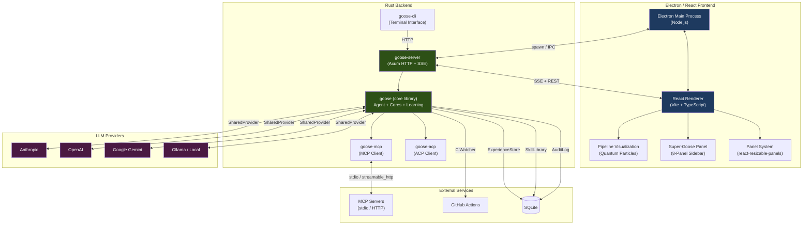

### Technology Stack

| Layer | Technology | Details |
|-------|-----------|---------|
| **Backend** | Rust (edition 2021) | Workspace with 7 crates, async via Tokio |
| **Frontend** | Electron + React 18 | TypeScript, Vite bundler, Tailwind CSS |
| **Communication** | SSE / WebSocket | Real-time streaming from backend to UI |
| **Database** | SQLite (via sqlx) | ExperienceStore, SkillLibrary, AuditLog, ReflectionStore |
| **AI Protocol** | MCP + ACP | Model Context Protocol and Agent Communication Protocol |
| **Build** | Cargo + Electron Forge | Cross-platform builds (Windows, macOS, Linux) |
| **CI/CD** | GitHub Actions | ci-main.yml, ci-comprehensive.yml, release workflows |

---

## 2. Crate Architecture

The Rust workspace contains 7 crates with clearly defined responsibilities and dependency relationships.

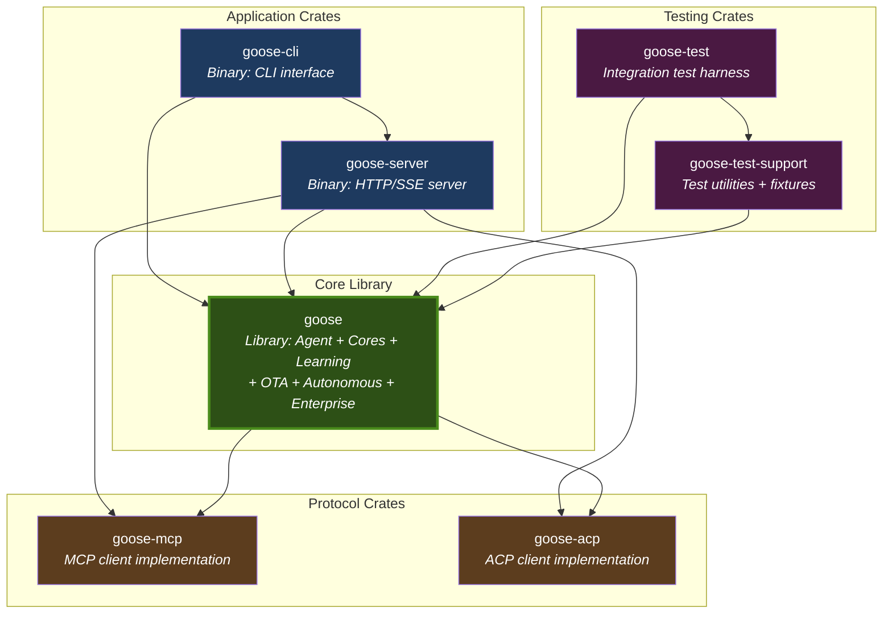

### Crate Details

| Crate | Type | Description |
|-------|------|-------------|
| **goose** | Library | Core agent logic, 6 execution cores, learning engine, OTA pipeline, autonomous daemon, enterprise features |
| **goose-cli** | Binary | Terminal-based interface, readline input, streaming output |
| **goose-server** | Binary | Axum-based HTTP server with SSE streaming, session management, REST API |
| **goose-mcp** | Library | Model Context Protocol client for stdio and streamable HTTP transports |
| **goose-acp** | Library | Agent Communication Protocol client for agent-to-agent messaging |
| **goose-test** | Binary | Integration test runner with end-to-end scenario support |
| **goose-test-support** | Library | Shared test utilities, mock providers, fixture generation |

### Key Dependencies

| Dependency | Version | Purpose |
|-----------|---------|---------|
| `tokio` | 1.49 | Async runtime |
| `axum` | latest | HTTP framework for goose-server |
| `sqlx` | latest | Async SQLite driver |
| `rmcp` | 0.14.0 | MCP protocol implementation |
| `serde` / `serde_json` | 1.0 | Serialization framework |
| `regex` | 1.12 | Pattern matching for guardrails, routing |

---

## 3. Agent Core System

The Agent Core System provides hot-swappable execution strategies. Each core implements the `AgentCore` trait and wraps a different problem-solving paradigm. The system lives in `crates/goose/src/agents/core/` (11 files).

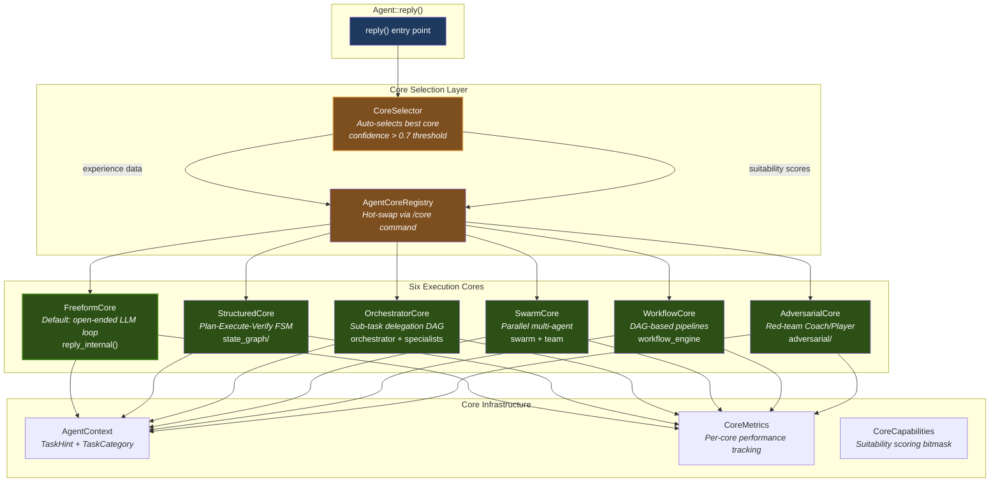

### Core Descriptions

| Core | Strategy | Use Case | Key Capabilities |
|------|----------|----------|-----------------|
| **FreeformCore** | Open-ended LLM loop | General chat, research, exploration | `freeform_chat`, `persistent_learning` |
| **StructuredCore** | Plan-Execute-Verify FSM | Code generation, test-fix cycles | `code_generation`, `testing`, `state_machine` |
| **OrchestratorCore** | Sub-task delegation DAG | Large refactoring, multi-file changes | `multi_agent`, `code_generation` |
| **SwarmCore** | Parallel multi-agent | Parallel analysis, broad searches | `parallel_execution`, `multi_agent` |
| **WorkflowCore** | DAG-based pipelines | Repeatable workflows, CI/CD tasks | `workflow_templates`, `state_machine` |
| **AdversarialCore** | Red-team Coach/Player | Security audits, quality reviews | `adversarial_review`, `testing` |

### CoreSelector Algorithm

```
1. Categorize task via keyword analysis -> TaskCategory
2. Query ExperienceStore for best core in that category
3. If data_points >= min_experiences (default: 3):
     -> Use historical winner (source: "experience")
4. Else:
     -> Fall back to static suitability scores from AgentCoreRegistry (source: "suitability")
5. If confidence > 0.7:
     -> Switch active core in registry
6. Return SelectionResult { core_type, confidence, rationale, source }
```

### AgentCoreRegistry

The registry manages core lifecycle and provides the `/core` and `/cores` slash commands:

- `/cores` -- list all registered cores with capabilities
- `/core <name>` -- hot-swap to a specific core
- Auto-fallback: if a non-freeform core fails, execution falls back to FreeformCore

### Source Files

| File | Lines | Description |
|------|-------|-------------|
| `mod.rs` | ~100 | Module root, `AgentCore` trait, `CoreType` enum, `CoreCapabilities`, `CoreOutput` |
| `freeform.rs` | ~80 | FreeformCore wrapping `reply_internal()` |
| `structured.rs` | ~120 | StructuredCore with plan/execute/verify FSM |
| `orchestrator_core.rs` | ~130 | OrchestratorCore with sub-task DAG |
| `swarm_core.rs` | ~120 | SwarmCore for parallel execution |
| `workflow_core.rs` | ~130 | WorkflowCore for template pipelines |
| `adversarial_core.rs` | ~120 | AdversarialCore Coach/Player review |
| `registry.rs` | ~200 | AgentCoreRegistry with hot-swap |
| `selector.rs` | ~180 | CoreSelector with experience-based selection |
| `context.rs` | ~100 | AgentContext, TaskHint, TaskCategory |
| `metrics.rs` | ~80 | CoreMetrics and CoreMetricsSnapshot |

---

## 4. Learning Engine

The Learning Engine provides cross-session intelligence through four components that work together to remember outcomes, extract patterns, and build a library of reusable strategies.

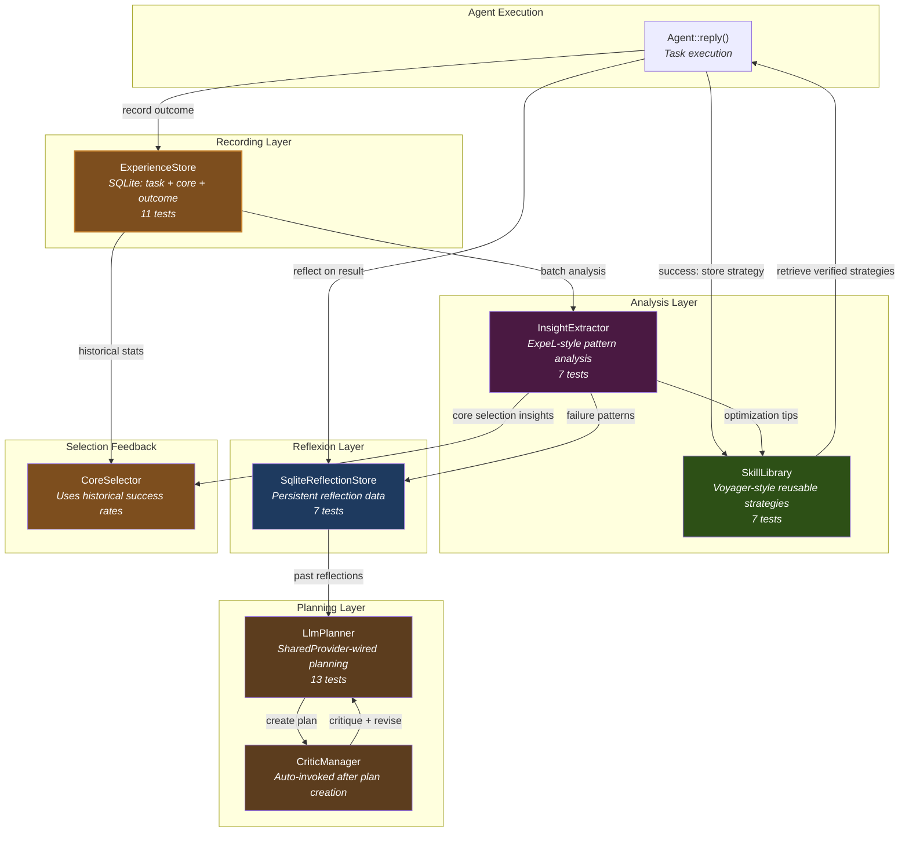

### Component Details

| Component | File | Storage | Purpose |
|-----------|------|---------|---------|
| **ExperienceStore** | `experience_store.rs` | SQLite | Records task, core_type, succeeded, turns_used, cost_dollars, time_ms, task_category, insights, tags |
| **InsightExtractor** | `insight_extractor.rs` | In-memory | Analyzes accumulated experiences to extract three insight types: core selection, failure patterns, optimization opportunities |
| **SkillLibrary** | `skill_library.rs` | SQLite | Stores verified reusable strategies with name, description, steps, prerequisites, verified flag. Only verified strategies are retrieved. |
| **SqliteReflectionStore** | `persistence/reflection_store.rs` | SQLite | Persists Reflexion loop data: reflections, self-assessments, improvement plans |

### Agent Struct Integration

The learning stores are integrated into the `Agent` struct using interior mutability:

```
Agent {
    experience_store: Mutex<Option<Arc<ExperienceStore>>>,
    skill_library: Mutex<Option<Arc<SkillLibrary>>>,
    ...
}
```

- **Lazy initialization**: `init_learning_stores()` takes `&self` and initializes on first call via `reply()`
- **Thread-safe**: `Mutex<Option<Arc<...>>>` pattern allows shared access across async tasks
- **Commands**: `/experience`, `/experience stats`, `/skills`, `/insights`

---

## 5. UI Layout System

The frontend uses `react-resizable-panels` to provide a flexible, persistent panel layout with 4 zones.

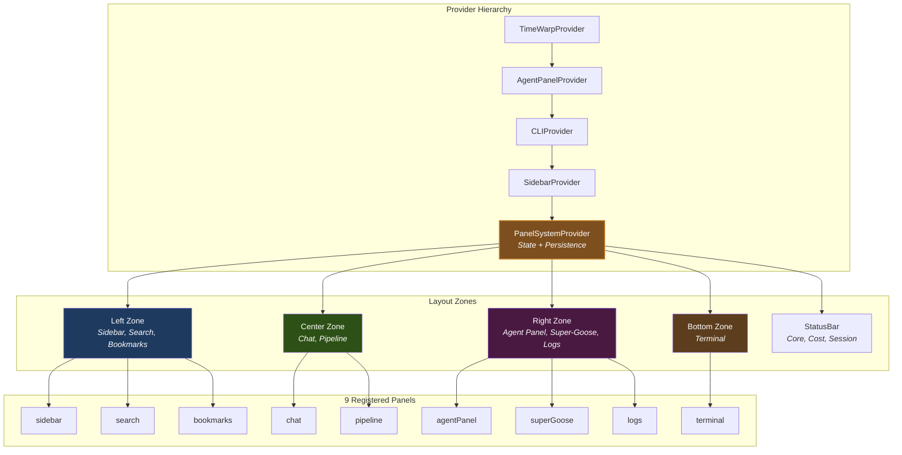

### Layout Presets

| Preset | Left | Center | Right | Bottom | Description |
|--------|------|--------|-------|--------|-------------|
| **Focus** | Hidden | Chat 100% | Hidden | Hidden | Distraction-free chat |
| **Standard** | Sidebar 20% | Chat 60% | Hidden | Terminal 20% | Default development layout |
| **Full** | Sidebar 15% | Chat 45% | Agent 25% | Terminal 15% | All panels visible |
| **Agent** | Hidden | Chat 50% | Agent 50% | Hidden | Agent-focused interaction |
| **Custom** | User-defined | User-defined | User-defined | User-defined | Saved to localStorage |

### Super-Goose 8-Panel Sidebar

Located in `ui/desktop/src/components/super/`, the sidebar provides enterprise-grade dashboards:

| Panel | Component | Purpose |
|-------|-----------|---------|
| **Dashboard** | `DashboardPanel.tsx` | System overview, metrics, status |
| **Studios** | `StudiosPanel.tsx` | Workspace/project management |
| **Agents** | `AgentsPanel.tsx` | Active agent monitoring |
| **Marketplace** | `MarketplacePanel.tsx` | Extension discovery/install |
| **GPU** | `GPUPanel.tsx` | GPU resource monitoring |
| **Connections** | `ConnectionsPanel.tsx` | MCP server management |
| **Monitor** | `MonitorPanel.tsx` | Real-time performance monitoring |
| **Settings** | `SGSettingsPanel.tsx` | Super-Goose configuration |

All Super-Goose panels use `data-super="true"` attribute and `sg-*` CSS custom properties for dual color scoping, keeping stock Goose styles untouched.

---

## 6. Enterprise Features

Enterprise capabilities are implemented across 5 phases in the `crates/goose/src/` directory.

```mermaid
graph TD
    subgraph "Phase 1: Security Guardrails"
        GE["GuardrailsEngine<br/><i>Parallel async scanning</i>"]
        D1["PromptInjectionDetector<br/><i>50+ regex patterns</i>"]
        D2["PiiDetector<br/><i>Email, SSN, CC (Luhn), Phone</i>"]
        D3["JailbreakDetector<br/><i>DAN, DevMode, Bypass</i>"]
        D4["TopicDetector<br/><i>Violence, Drugs, Hate</i>"]
        D5["KeywordDetector<br/><i>Exact, Phrase, Fuzzy (Levenshtein)</i>"]
        D6["SecretDetector<br/><i>30+ patterns: AWS, GitHub, API keys</i>"]
    end

    subgraph "Phase 2: MCP Gateway"
        MGW["McpGateway<br/><i>Unified MCP endpoint</i>"]
        RTR["McpRouter<br/><i>Multi-server routing</i>"]
        PRM["PermissionManager<br/><i>Function-level ACL</i>"]
        CRD["CredentialStore<br/><i>Org/User/Session scopes</i>"]
        AUD["AuditLogger<br/><i>Redacted audit trail</i>"]
        BND["BundleManager<br/><i>Tool grouping per user</i>"]
    end

    subgraph "Phase 3: Observability"
        OBS["Observability<br/><i>OpenTelemetry GenAI conventions</i>"]
        CT["CostTracker<br/><i>30+ model pricing, session tracking</i>"]
        GM["GenAiMetrics<br/><i>Tokens, latency, errors</i>"]
        MM["McpMetrics<br/><i>Tool calls, server health</i>"]
        PX["PrometheusExporter<br/><i>Prometheus + Grafana dashboards</i>"]
    end

    subgraph "Phase 4: Policy Rule Engine"
        PE["PolicyEngine<br/><i>YAML-based rule evaluation</i>"]
        RE["RuleEngine<br/><i>26 condition types, 11 actions</i>"]
        LD["PolicyLoader<br/><i>YAML loading + hot-reload</i>"]
    end

    subgraph "Phase 5: Prompt Patterns"
        PM["PromptManager<br/><i>14 patterns, 5 categories</i>"]
        PL["PatternLibrary<br/><i>Reasoning, Structure, Safety, Task, Meta</i>"]
        TE["TemplateEngine<br/><i>Variable substitution + validation</i>"]
    end

    GE --> D1
    GE --> D2
    GE --> D3
    GE --> D4
    GE --> D5
    GE --> D6

    MGW --> RTR
    MGW --> PRM
    MGW --> CRD
    MGW --> AUD
    MGW --> BND

    OBS --> CT
    OBS --> GM
    OBS --> MM
    CT --> PX

    PE --> RE
    PE --> LD

    PM --> PL
    PM --> TE

    style GE fill:#8b1a1a,color:#fff
    style MGW fill:#1e3a5f,color:#fff
    style OBS fill:#2d5016,color:#fff
    style PE fill:#7d4e1e,color:#fff
    style PM fill:#4a1942,color:#fff
```

### Phase 1: Security Guardrails

Located in `crates/goose/src/guardrails/` (10 files).

| Detector | Patterns | Detection Method |
|----------|----------|-----------------|
| **PromptInjectionDetector** | 50+ | RegexSet parallel matching |
| **PiiDetector** | Email, SSN, CC, Phone | Regex + Luhn validation for credit cards |
| **JailbreakDetector** | DAN, DevMode, Bypass | RegexSet with sensitivity multipliers |
| **TopicDetector** | Violence, Drugs, Hate | Keyword lists with blocklist/allowlist modes |
| **KeywordDetector** | User-defined | Exact, phrase, fuzzy (Levenshtein distance) matching |
| **SecretDetector** | 30+ | AWS, GitHub, OpenAI, Anthropic, Azure, Generic keys |

Configuration: `GuardrailsConfig` with `Sensitivity` (Low/Medium/High), `FailMode` (FailClosed/FailOpen), and per-detector enable/disable.

### Phase 2: MCP Gateway

Located in `crates/goose/src/mcp_gateway/` (7 files).

- **McpRouter**: Server registration, tool discovery, health tracking, tool search
- **PermissionManager**: Policy-based ACL with wildcard patterns, user/group/role subjects, priority evaluation, expiring allow-lists
- **CredentialStore**: Organization-shared, per-user, and per-session credentials with expiration
- **AuditLogger**: Buffered writes with argument redaction for privacy
- **BundleManager**: Group tools into bundles with rate limiting per bundle

### Phase 3: Observability

Located in `crates/goose/src/observability/` (7 files).

- **Semantic Conventions**: Implements OpenTelemetry GenAI conventions (35+ attributes) plus MCP-specific and Goose-specific extensions
- **CostTracker**: Pre-loaded pricing for 30+ models (Anthropic Claude, OpenAI GPT, Google Gemini, Mistral, Cohere, Bedrock, Ollama); supports cached token pricing and custom pricing overrides
- **Export Formats**: JSON, CSV, Markdown, Prometheus text format, Grafana dashboard JSON

### Phase 4: Policy Rule Engine

Located in `crates/goose/src/policies/` (6 files).

| Category | Condition Types |
|----------|----------------|
| **String** | Contains, Matches (regex), Equals, StartsWith, EndsWith, IsEmpty, IsNotEmpty |
| **Numeric** | GreaterThan, GreaterThanOrEqual, LessThan, LessThanOrEqual, Between |
| **Collection** | InList, NotInList, HasKey, HasLength, ArrayContains |
| **Temporal** | Before, After, WithinLast |
| **Logical** | And, Or, Not |
| **Special** | Always, Never, Custom |

**Total: 26 condition types, 11 action types** (Block, Warn, Log, Notify, RequireApproval, Modify, RateLimit, Delay, AddMetadata, Webhook, Custom).

Features: YAML loading, hot-reload via `notify` crate, severity-based rule ordering, dry-run mode, fail-open/fail-closed modes, regex caching.

### Phase 5: Prompt Patterns

Located in `crates/goose/src/prompts/` (4 files).

| Category | Patterns |
|----------|----------|
| **Reasoning** | Chain of Thought, Tree of Thought, Self-Consistency |
| **Structure** | Role Definition, Output Formatting, Few-Shot Examples |
| **Safety** | Guardrail Instructions, Boundary Setting, Ethical Guidelines |
| **Task** | Code Generation, Code Review, Summarization |
| **Meta** | Self-Reflection, Uncertainty Expression |

**14 pre-built patterns** with a `PatternBuilder` API for fluent construction and a `TemplateEngine` for variable substitution with type validation.

---

## 7. OTA Self-Build Pipeline

The OTA (Over-The-Air) system enables Super-Goose to update itself through a validated pipeline. Located in `crates/goose/src/ota/` (7 modules, 90 tests).

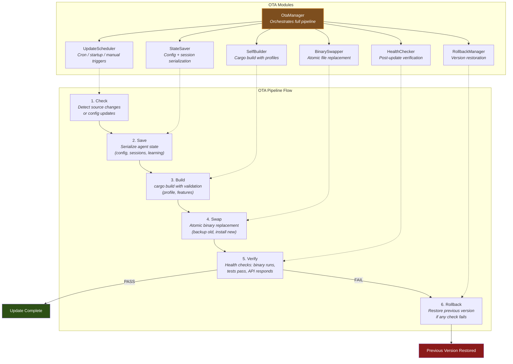

### Module Details

| Module | File | Purpose |
|--------|------|---------|
| **OtaManager** | `mod.rs` | Orchestrates the full update pipeline, manages `UpdateStatus` state machine |
| **UpdateScheduler** | `update_scheduler.rs` | Cron-like scheduling, startup checks, manual triggers via `SchedulerConfig` and `UpdatePolicy` |
| **StateSaver** | `state_saver.rs` | Serializes config, sessions, and learning data to `StateSnapshot` |
| **SelfBuilder** | `self_builder.rs` | Runs `cargo build` with configurable `BuildConfig` and `BuildProfile` (Dev/Release/Custom) |
| **BinarySwapper** | `binary_swapper.rs` | Atomic binary replacement with backup, records `SwapRecord` |
| **HealthChecker** | `health_checker.rs` | Post-update checks: binary executes, test suite passes, HTTP API responds; produces `HealthReport` |
| **RollbackManager** | `rollback.rs` | Restores previous binary from backup, records `RollbackRecord` with `RollbackReason` |

### Update Status State Machine

```
Idle -> Checking -> SavingState -> Building -> Swapping -> HealthChecking -> Completed
                                                                         \-> RollingBack -> RolledBack
                                                                         \-> Failed
```

---

## 8. Autonomous Daemon

The Autonomous Daemon provides scheduled, self-directed task execution. Located in `crates/goose/src/autonomous/` (8 modules, 86 tests).

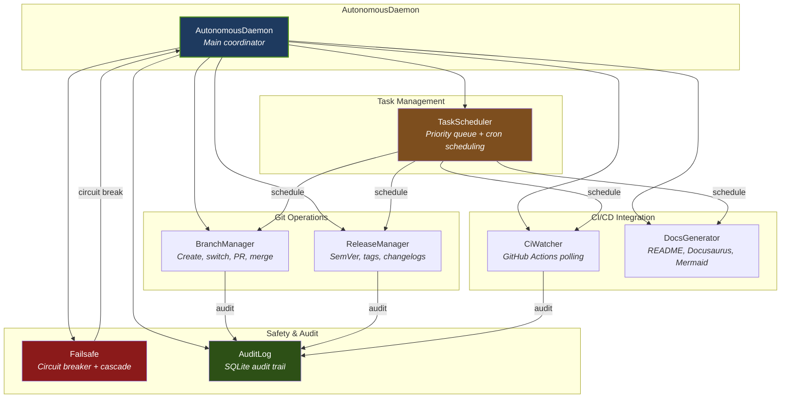

### Module Details

| Module | File | Purpose |
|--------|------|---------|
| **AutonomousDaemon** | `mod.rs` | Main coordinator with `Mutex`-protected components, running state via `AtomicBool` |
| **TaskScheduler** | `scheduler.rs` | Priority queue with `ActionType` enum, `Schedule` (cron/interval/once), `TaskStatus` tracking |
| **BranchManager** | `branch_manager.rs` | Git operations: create branch, switch, create `PullRequestSpec`, merge; returns `GitOpResult` |
| **ReleaseManager** | `release_manager.rs` | `SemVer` parsing, `BumpType` (Major/Minor/Patch), `ChangelogEntry` generation, `ReleaseSpec` |
| **DocsGenerator** | `docs_generator.rs` | Generate `DocSection` content, `FeatureEntry` tables, `MermaidDiagram` generation |
| **CiWatcher** | `ci_watcher.rs` | Poll GitHub Actions for `CiRun` status via `CiWatcherConfig`, returns `CiStatus` |
| **Failsafe** | `failsafe.rs` | `CircuitBreaker` with `CircuitState` (Closed/Open/HalfOpen), cascade detection via `FailsafeConfig` |
| **AuditLog** | `audit_log.rs` | SQLite-backed `AuditEntry` recording with `ActionOutcome` (Success/Failure/Skipped) |

---

## 9. Pipeline Visualization

The Pipeline Visualization renders a real-time animated view of agent activity, reading directly from `ChatState`. Located in `ui/desktop/src/components/pipeline/` (4 source files, 69 tests).

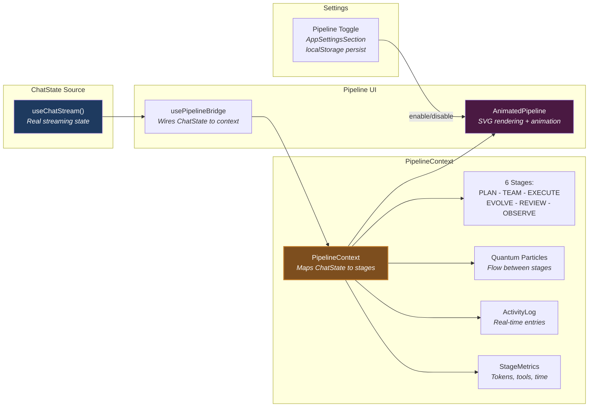

### Pipeline Stages

| Stage | Maps From | Description |
|-------|-----------|-------------|
| **PLAN** | Agent thinking/planning | Initial task analysis and strategy |
| **TEAM** | Agent selecting core/tools | Team assembly and core selection |
| **EXECUTE** | Tool calls, code generation | Active execution of the plan |
| **EVOLVE** | Learning store updates | Strategy evolution from outcomes |
| **REVIEW** | Reflexion/critique | Quality review and self-assessment |
| **OBSERVE** | Metrics recording | Observability and telemetry |

### Particle System

Each particle has: `id`, `fromStage`, `toStage`, `progress` (0..1), `color`, `size`, `speed`. Particles flow between active stages to visualize agent workflow transitions.

### Pipeline Modes

| Mode | Trigger | Visual |
|------|---------|--------|
| **active** | Agent is processing | Animated particles flowing |
| **waiting** | Idle, awaiting input | Gentle pulse animation |
| **error** | Execution error | Red glow effect |
| **complete** | Task finished | Completion sweep animation |

---

## 10. Data Flow

The complete request lifecycle from user input to response delivery:

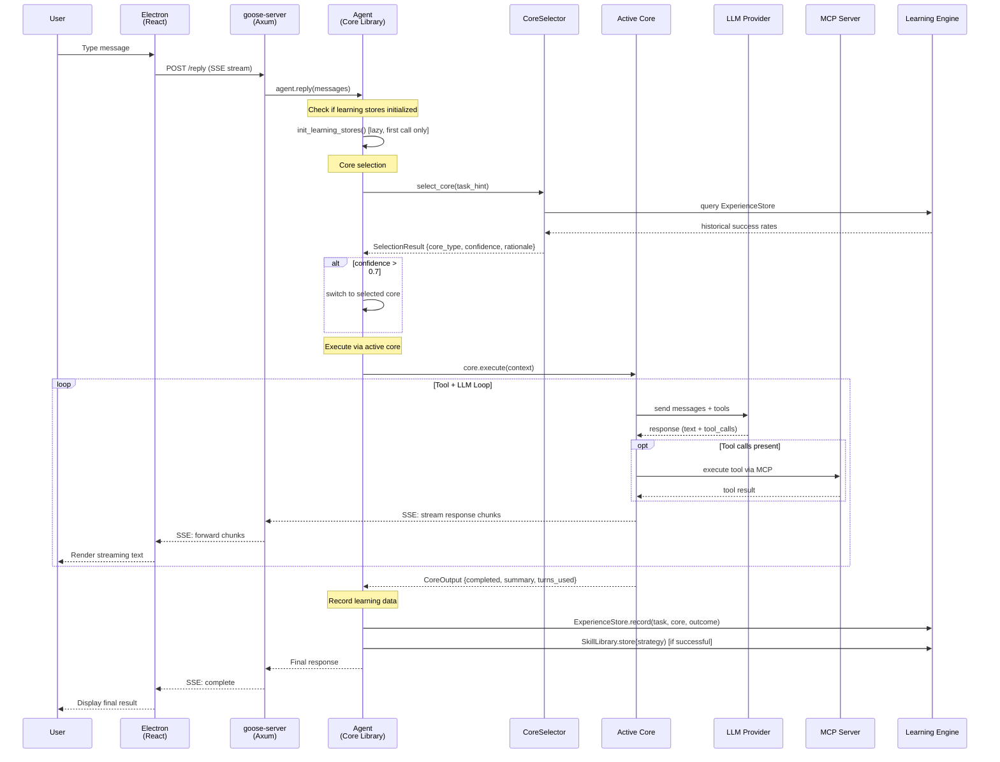

### Extension System (3-Tier)

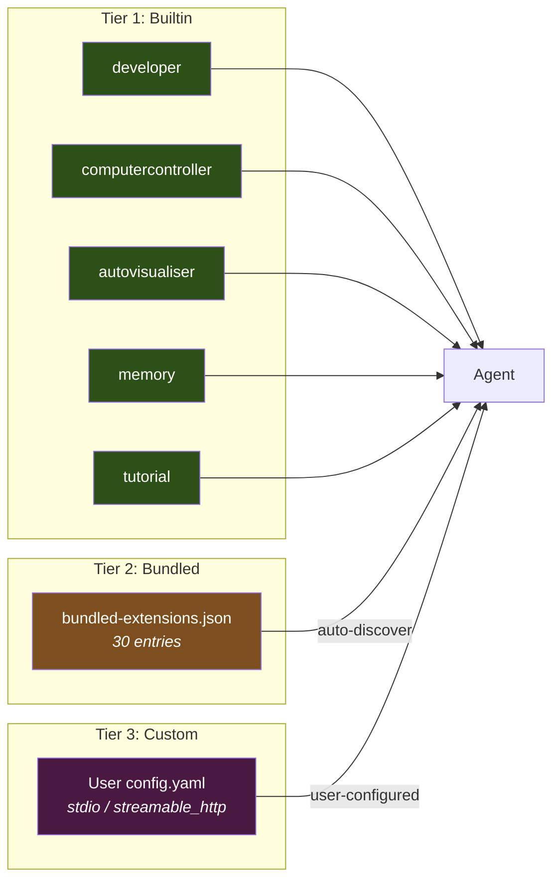

### Feature Flags

| Flag | Default | Scope |
|------|---------|-------|
| `memory` | ON | Memory extension, bookmarks, HITL, extended thinking |
| `swarm-experimental` | OFF | Swarm features (empty stub) |
| Reflexion, Guardrails, Cost Tracking | Always compiled | Not feature-gated |

---

## Test Coverage Summary

| Module | Tests | Status |
|--------|-------|--------|
| Agent Core System | 87 | All passing |
| Learning Engine | 52 | All passing |
| OTA Self-Build | 90 | All passing |
| Autonomous Daemon | 86 | All passing |
| Pipeline Visualization (Vitest) | 69 | All passing |
| Super-Goose Panel (Vitest) | 11 | All passing |
| Frontend (total Vitest) | 2,097 | All passing |
| Playwright E2E | 291 passed, 68 skipped | Zero failures |
| Rust Backend (total) | 1,754 passed (of 1,763) | 9 pre-existing failures (JWT crypto + evolution) |
| TypeScript (tsc --noEmit) | Clean | Zero errors |

---

## Directory Structure

```
G:\goose/
  crates/
    goose/                          # Core library
      src/
        agents/
          core/                     # 11 files: 6 cores + registry + selector + context + metrics
          experience_store.rs       # SQLite cross-session learning
          insight_extractor.rs      # ExpeL-style pattern analysis
          skill_library.rs          # Voyager-style reusable strategies
          persistence/
            reflection_store.rs     # Reflexion data store
        ota/                        # 7 modules: OTA self-build pipeline
        autonomous/                 # 8 modules: Autonomous daemon
        guardrails/                 # Enterprise Phase 1: Security detectors
        mcp_gateway/                # Enterprise Phase 2: MCP routing + ACL
        observability/              # Enterprise Phase 3: OpenTelemetry + cost
        policies/                   # Enterprise Phase 4: Rule engine
        prompts/                    # Enterprise Phase 5: Prompt patterns
    goose-cli/                      # CLI binary
    goose-server/                   # HTTP/SSE server binary
    goose-mcp/                      # MCP protocol client
    goose-acp/                      # ACP protocol client
    goose-test/                     # Integration test runner
    goose-test-support/             # Test utilities
  ui/desktop/
    src/
      components/
        pipeline/                   # Real-time pipeline visualization
        super/                      # 8-panel Super-Goose sidebar
        GooseSidebar/               # Agent panel (8 components)
        timewarp/                   # TimeWarp bar (8 components)
        settings/enterprise/        # Enterprise settings (7 panels)
      styles/
        main.css                    # sg-* design tokens (255 lines)
```

---

## Build and Run

### Prerequisites

- Rust toolchain (edition 2021)
- Node.js (v24 or earlier recommended; v25+ requires cross-zip patch)
- Windows: `LIB` environment variable pointing to Windows SDK and MSVC paths

### Backend

```bash
cargo build -p goose-cli -p goose-server
cargo test --workspace
```

### Frontend

```bash
cd ui/desktop
npm install --include=dev
npm run make   # Electron Forge build
```

### Docker

```bash
docker build -t super-goose .
docker run -p 3284:3284 super-goose
```
