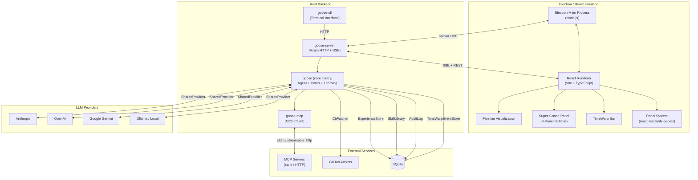
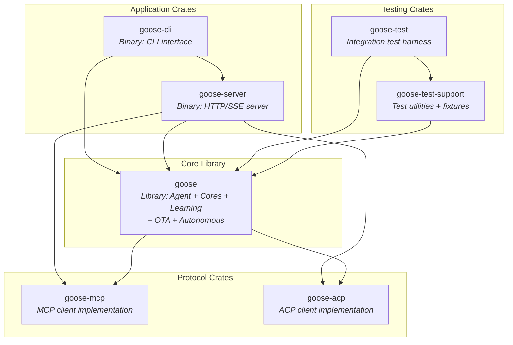
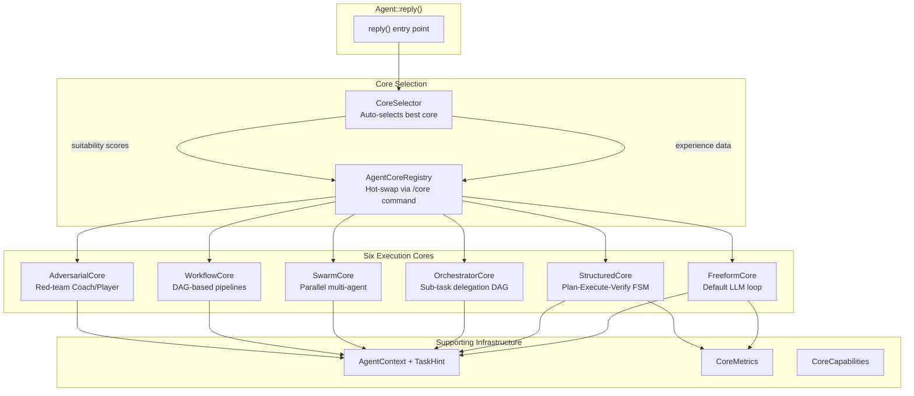
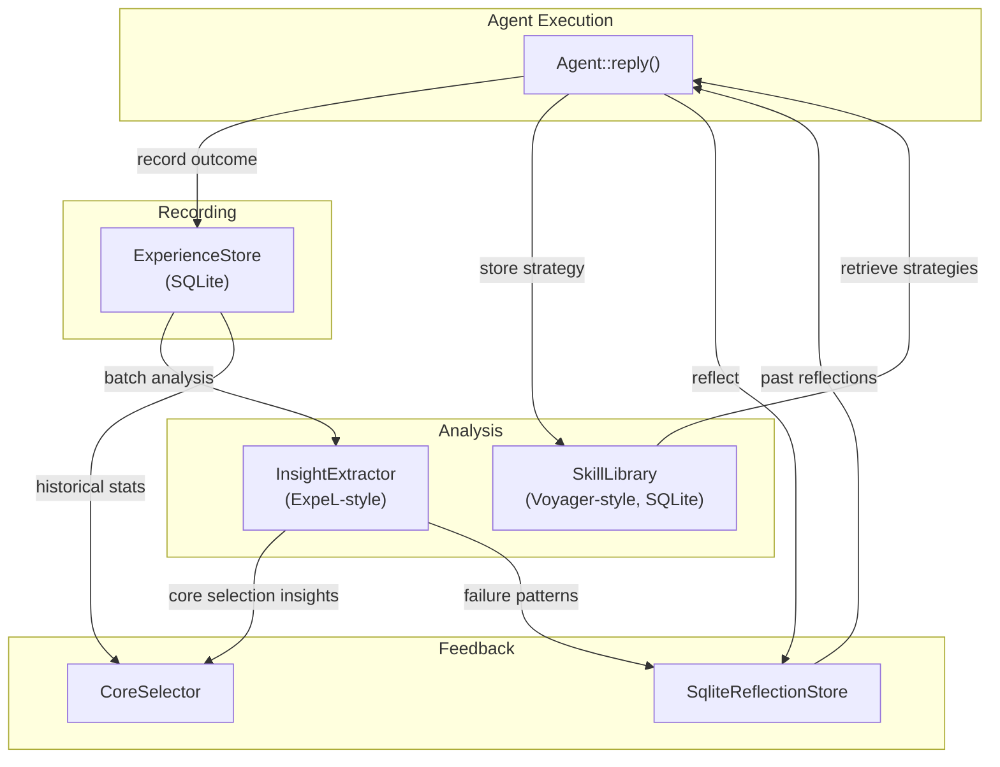
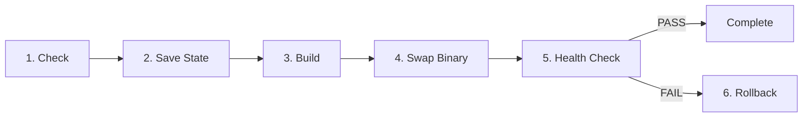
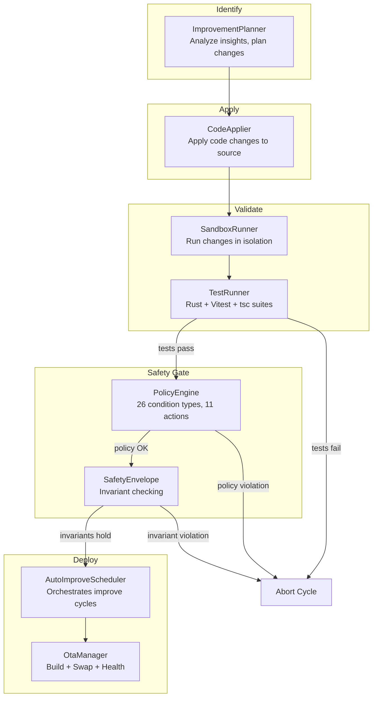
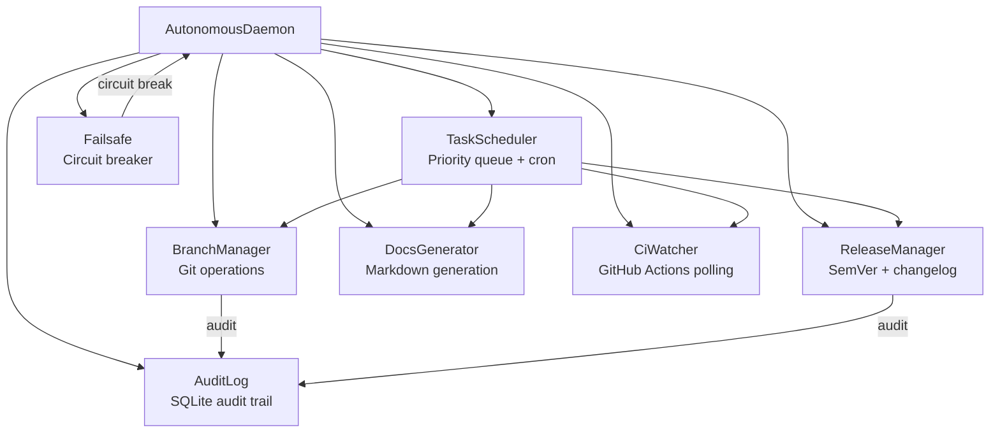
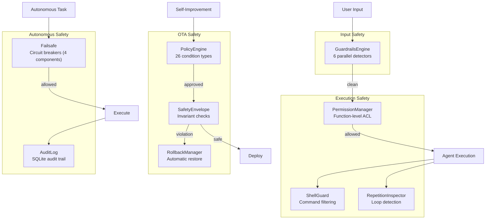
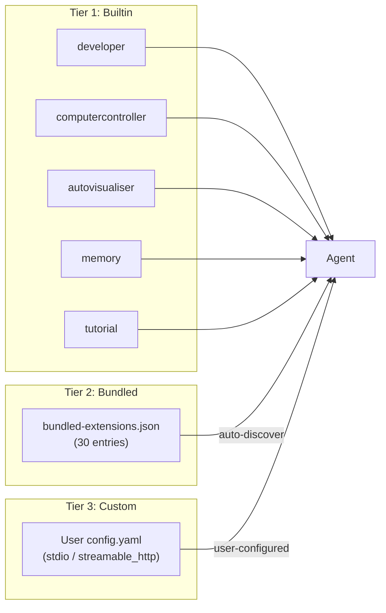
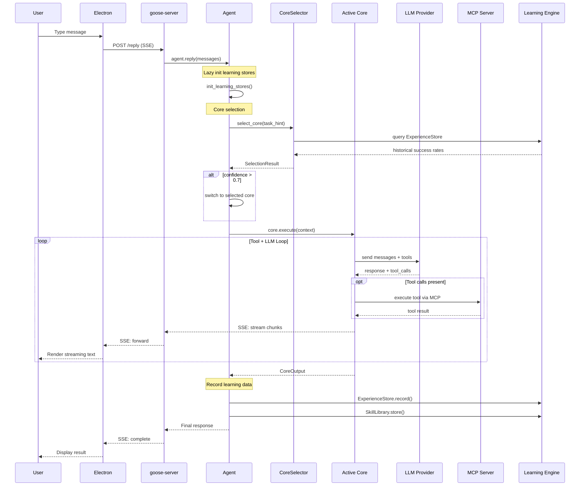

# Super-Goose Architecture

> Architecture reference for Super-Goose, a fork of [Block Inc's Goose](https://github.com/block/goose) AI coding agent enhanced with cross-session learning, OTA self-build, autonomous operations, and a multi-panel Electron UI.

---

## Table of Contents

1. [System Overview](#1-system-overview)
2. [Crate Architecture](#2-crate-architecture)
3. [Agent Core System](#3-agent-core-system)
4. [Learning Engine](#4-learning-engine)
5. [OTA Self-Build Pipeline](#5-ota-self-build-pipeline)
6. [Self-Improvement Pipeline](#6-self-improvement-pipeline)
7. [Autonomous Daemon](#7-autonomous-daemon)
8. [Safety Architecture](#8-safety-architecture)
9. [API Layer](#9-api-layer)
10. [Frontend Architecture](#10-frontend-architecture)
11. [Extension System](#11-extension-system)
12. [TimeWarp Event Store](#12-timewarp-event-store)
13. [Compaction Manager](#13-compaction-manager)
14. [Data Flow](#14-data-flow)

---

## 1. System Overview

Super-Goose is structured as a Rust backend powering an Electron/React desktop application, with communication over Server-Sent Events (SSE) and REST endpoints.



### Technology Stack

| Layer | Technology | Details |
|-------|-----------|---------|
| **Backend** | Rust (edition 2021) | Workspace with 7 crates, async via Tokio |
| **Frontend** | Electron + React 18 | TypeScript, Vite bundler, Tailwind CSS |
| **Communication** | SSE / REST | Real-time streaming from backend to UI |
| **Database** | SQLite (via sqlx + rusqlite) | ExperienceStore, SkillLibrary, AuditLog, ReflectionStore, TimeWarpEventStore |
| **AI Protocol** | MCP + ACP | Model Context Protocol and Agent Communication Protocol |
| **Build** | Cargo + Electron Forge | Cross-platform builds (Windows, macOS, Linux) |
| **CI/CD** | GitHub Actions | ci-main.yml, ci-comprehensive.yml, release workflows |

---

## 2. Crate Architecture

The Rust workspace contains 7 crates with clearly defined responsibilities.



### Crate Details

| Crate | Type | Description |
|-------|------|-------------|
| **goose** | Library | Core agent logic, 6 execution cores, learning engine, OTA pipeline, autonomous daemon, compaction, timewarp |
| **goose-cli** | Binary | Terminal-based interface, readline input, streaming output |
| **goose-server** | Binary | Axum-based HTTP server with SSE streaming, session management, 28 route modules |
| **goose-mcp** | Library | Model Context Protocol client for stdio and streamable HTTP transports |
| **goose-acp** | Library | Agent Communication Protocol client for agent-to-agent messaging |
| **goose-test** | Binary | Integration test runner with end-to-end scenario support |
| **goose-test-support** | Library | Shared test utilities, mock providers, fixture generation |

### Key Modules in `goose` Crate

```
crates/goose/src/
  agents/
    core/            # 11 files: 6 cores + registry + selector + context + metrics
    experience_store.rs
    insight_extractor.rs
    skill_library.rs
    agent.rs         # Main Agent struct and reply() entry point
    persistence/     # SqliteReflectionStore
  ota/               # 14 files: OTA self-build + self-improvement pipeline
  autonomous/        # 8 files: Autonomous daemon
  compaction/        # CompactionManager
  timewarp/          # TimeWarpEventStore
  guardrails/        # Security detectors
  observability/     # OpenTelemetry + cost tracking
  policies/          # YAML rule engine
  hooks/             # Lifecycle hooks
  config/            # Configuration management
```

---

## 3. Agent Core System

The Agent Core System provides hot-swappable execution strategies. Each core implements the `AgentCore` trait and wraps a different problem-solving paradigm. Located in `crates/goose/src/agents/core/` (11 files).



### Core Descriptions

| Core | Strategy | Use Case |
|------|----------|----------|
| **FreeformCore** | Open-ended LLM loop | General chat, research, exploration |
| **StructuredCore** | Plan-Execute-Verify FSM | Code generation, test-fix cycles |
| **OrchestratorCore** | Sub-task delegation DAG | Large refactoring, multi-file changes |
| **SwarmCore** | Parallel multi-agent | Parallel analysis, broad searches |
| **WorkflowCore** | DAG-based pipelines | Repeatable workflows, CI/CD tasks |
| **AdversarialCore** | Red-team Coach/Player | Security audits, quality reviews |

### CoreSelector Algorithm

```
1. Categorize task via keyword analysis -> TaskCategory
2. Query ExperienceStore for best core in that category
3. If data_points >= min_experiences (default: 3):
     -> Use historical winner (source: "experience")
4. Else:
     -> Fall back to static suitability scores from AgentCoreRegistry
5. If confidence > 0.7:
     -> Switch active core in registry
6. Return SelectionResult { core_type, confidence, rationale }
```

Task categories: `general`, `code-test-fix`, `large-refactor`, `multi-file-complex`, `review`, `devops`, `documentation`, `pipeline`.

### Slash Commands

- `/cores` -- list all registered cores with capabilities
- `/core <name>` -- hot-swap to a specific core (accepts aliases: `struct`, `orch`, `swarm`, `wf`, `coach`)
- Auto-fallback: if a non-freeform core fails, execution falls back to FreeformCore

---

## 4. Learning Engine

The Learning Engine provides cross-session intelligence through four components. Located in `crates/goose/src/agents/`.



### Component Details

| Component | Storage | Purpose |
|-----------|---------|---------|
| **ExperienceStore** | SQLite (sqlx) | Records task, core_type, succeeded, turns_used, cost_dollars, time_ms, task_category, insights, tags |
| **InsightExtractor** | In-memory | Analyzes accumulated experiences. Three insight types: CoreSelection, FailurePattern, Optimization |
| **SkillLibrary** | SQLite (sqlx) | Stores verified reusable strategies with steps, preconditions, success_rate. Only verified strategies are retrieved |
| **SqliteReflectionStore** | SQLite | Persists Reflexion loop data: reflections, self-assessments, improvement plans |

### Integration with Agent

```
Agent {
    experience_store: Mutex<Option<Arc<ExperienceStore>>>,
    skill_library: Mutex<Option<Arc<SkillLibrary>>>,
}
```

- **Lazy initialization**: `init_learning_stores()` on first `reply()` call
- **Thread-safe**: `Mutex<Option<Arc<...>>>` for shared async access
- **Slash commands**: `/experience [stats]`, `/skills`, `/insights`

---

## 5. OTA Self-Build Pipeline

The OTA system enables Super-Goose to update itself through a validated pipeline. Located in `crates/goose/src/ota/` (14 files, 198 tests).



### OtaManager Orchestration

The `OtaManager` struct orchestrates the full pipeline:

| Step | Module | Action |
|------|--------|--------|
| Check | `UpdateScheduler` | Cron, startup, or manual trigger |
| Save | `StateSaver` | Serialize config, sessions, learning data to `StateSnapshot` |
| Build | `SelfBuilder` | `cargo build` with configurable `BuildConfig` and `BuildProfile` |
| Swap | `BinarySwapper` | Atomic binary replacement with backup, records `SwapRecord` |
| Verify | `HealthChecker` | Binary runs, tests pass, API responds; produces `HealthReport` |
| Rollback | `RollbackManager` | Restore previous binary from backup |

### Update Status State Machine

```
Idle -> Checking -> SavingState -> Building -> Swapping -> HealthChecking -> Completed
                                                                          \-> RollingBack -> RolledBack
                                                                          \-> Failed
```

---

## 6. Self-Improvement Pipeline

Beyond basic OTA binary updates, the self-improvement pipeline enables the agent to identify weaknesses, plan improvements, apply code changes in a sandbox, test them, and deploy if safe. These modules extend the OTA system.



### Module Details

| Module | File | Purpose |
|--------|------|---------|
| **ImprovementPlanner** | `improvement_planner.rs` | Analyzes InsightExtractor output; produces `ImprovementPlan` with prioritized `Improvement` items and `RiskLevel` |
| **CodeApplier** | `code_applier.rs` | Applies `CodeChange` items (Add, Modify, Delete, Move) to source files; produces `ApplyResult` |
| **SandboxRunner** | `sandbox_runner.rs` | Executes changes in an isolated environment via `SandboxConfig`; returns `SandboxResult` |
| **TestRunner** | `test_runner.rs` | Runs configurable test suites (`TestRunConfig`); aggregates `TestSuiteResult` with failure details |
| **PolicyEngine** | `policy_engine.rs` | Evaluates `PolicyRule` items against changes; 26 condition types, 11 action types, severity ordering |
| **SafetyEnvelope** | `safety_envelope.rs` | Checks invariants (`InvariantType`) before deployment; produces `SafetyReport` |
| **AutoImproveScheduler** | `auto_improve.rs` | Orchestrates full improve cycles (`ImproveCycle`) with `CycleStatus` tracking |

### Slash Commands

- `/self-improve` -- trigger an improvement cycle
- `/self-improve --dry-run` -- plan without applying
- `/self-improve status` -- show current cycle status

---

## 7. Autonomous Daemon

The Autonomous Daemon provides scheduled, self-directed task execution. Located in `crates/goose/src/autonomous/` (8 files, 86 tests).



### Module Details

| Module | Purpose |
|--------|---------|
| **TaskScheduler** | Priority queue with `ActionType` enum, `Schedule` (cron/interval/once), `TaskStatus` tracking |
| **BranchManager** | Create branch, switch, create `PullRequestSpec`, merge; returns `GitOpResult` |
| **ReleaseManager** | `SemVer` parsing, `BumpType` (Major/Minor/Patch), `ChangelogEntry` generation |
| **DocsGenerator** | Generate `DocSection` content, `FeatureEntry` tables, `MermaidDiagram` generation |
| **CiWatcher** | Poll GitHub Actions for `CiRun` status via `CiWatcherConfig` |
| **Failsafe** | `CircuitBreaker` with states Closed/Open/HalfOpen, cascade detection |
| **AuditLog** | SQLite-backed `AuditEntry` with `ActionOutcome` (Success/Failure/Skipped) |

### Slash Commands

- `/autonomous start` -- start the daemon
- `/autonomous stop` -- stop the daemon
- `/autonomous status` -- show running state, pending tasks, circuit breaker status

---

## 8. Safety Architecture

Safety is enforced at multiple layers to prevent uncontrolled behavior.



### GuardrailsEngine Detectors

| Detector | Method |
|----------|--------|
| **PromptInjectionDetector** | 50+ regex patterns via RegexSet |
| **PiiDetector** | Email, SSN, Credit Card (Luhn), Phone |
| **JailbreakDetector** | DAN, DevMode, Bypass patterns |
| **TopicDetector** | Violence, Drugs, Hate keyword lists |
| **KeywordDetector** | Exact, Phrase, Fuzzy (Levenshtein) |
| **SecretDetector** | 30+ patterns: AWS, GitHub, OpenAI, Azure keys |

### Rollback Chain

If any post-deployment health check fails:

1. `HealthChecker` detects failure (binary doesn't run, tests fail, API unresponsive)
2. `RollbackManager` restores backed-up binary
3. `AuditLog` records the rollback with `RollbackReason`
4. `UpdateScheduler` records failure, applies exponential backoff

---

## 9. API Layer

The `goose-server` exposes 28 route modules via Axum. Located in `crates/goose-server/src/routes/`.

### Route Catalog

| Module | Endpoints | Purpose |
|--------|-----------|---------|
| **reply** | `POST /reply` | Main SSE streaming endpoint for agent replies |
| **agent** | Agent management | Agent lifecycle, configuration |
| **agent_stream** | `GET /agent/stream` | SSE stream for real-time agent events |
| **session** | Session CRUD | Create, list, delete sessions |
| **settings** | `GET/POST/DELETE /settings/*` | Backend settings with SSE change notifications |
| **learning** | `GET /learning/*` | Experience stats, insights, skills queries |
| **ota_api** | `GET/POST /ota/*` | OTA status, trigger updates, autonomous control |
| **cost** | `GET /cost/*` | Cost tracking and budget management |
| **features** | `GET/POST /features/*` | Feature flags (reflexion, guardrails, budget, critic) |
| **extensions** | `GET/POST /extensions/*` | Extension management CRUD |
| **enterprise** | `GET/POST /enterprise/*` | Enterprise settings (gateway, hooks, memory, policies, observability) |
| **config_management** | Config CRUD | Configuration key-value management |
| **orchestrator** | Orchestration | Multi-agent orchestration endpoints |
| **schedule** | Scheduling | Task scheduling endpoints |
| **setup** | Initial setup | First-run configuration |
| **status** | Health check | Server health and version info |
| **telemetry** | Analytics | Telemetry data collection |
| **tunnel** | Tunneling | Network tunnel management |
| **prompts** | Prompt CRUD | Prompt template management |
| **recipe** | Recipe management | Recipe creation and execution |
| **dictation** | Voice input | Speech-to-text integration |
| **action_required** | User prompts | Actions requiring user confirmation |
| **mcp_app_proxy** | MCP proxy | MCP server proxy for app connections |
| **mcp_ui_proxy** | MCP proxy | MCP server proxy for UI connections |
| **errors** | Error handling | Shared error response types |

### Settings SSE

The settings module provides Server-Sent Events for real-time change notifications:

```
GET /settings/stream -> SSE stream of { key, value } changes
POST /settings/:key  -> Set value, broadcast SSE event
DELETE /settings/:key -> Remove value, broadcast SSE event
POST /settings/bulk   -> Bulk update, broadcast SSE events
```

Frontend panels subscribe to the SSE stream and update reactively when backend settings change.

---

## 10. Frontend Architecture

The frontend is an Electron + React 18 application using TypeScript, Vite, and Tailwind CSS.

### Component Structure

```
ui/desktop/src/
  components/
    super/                    # Super-Goose 8-panel sidebar
      DashboardPanel.tsx      # System overview, metrics
      StudiosPanel.tsx        # Workspace management
      AgentsPanel.tsx         # Active agent monitoring
      MarketplacePanel.tsx    # Extension discovery
      GPUPanel.tsx            # GPU resource monitoring
      ConnectionsPanel.tsx    # MCP server management
      MonitorPanel.tsx        # Performance monitoring
      SGSettingsPanel.tsx     # Super-Goose configuration
      AutonomousDashboard.tsx # Autonomous daemon control
      shared/                 # SGCard, SGBadge, SGStatusDot, SGMetricCard, SGEmptyState
    features/                 # Feature panels (wired to /features API)
      BudgetPanel.tsx         # Cost budget management
      CriticManagerPanel.tsx  # Auto-critique settings
      GuardrailsPanel.tsx     # Security guardrail toggles
      ReflexionPanel.tsx      # Reflexion loop settings
    timewarp/                 # TimeWarp timeline components
      TimeWarpBar.tsx         # Main bar container
      TimelineTrack.tsx       # Event timeline rendering
      BranchSelector.tsx      # Branch switching UI
      TransportControls.tsx   # Play/pause/rewind controls
      EventInspector.tsx      # Event detail viewer
      TimeWarpMinimap.tsx     # Overview minimap
      TimeWarpContext.tsx      # React context provider
    settings/
      enterprise/             # Enterprise settings panels
        GatewayPanel.tsx
        GuardrailsPanel.tsx
        HooksPanel.tsx
        MemoryPanel.tsx
        PoliciesPanel.tsx
        ObservabilityPanel.tsx
      ModeSelector.tsx        # Core mode selection (wired to backend)
    cli/                      # CLI integration
      EmbeddedTerminal.tsx
      CLIContext.tsx
      CLIPreferencesPanel.tsx
    pipeline/                 # Pipeline visualization (4 source files)
    tools/                    # Tool management
      ToolsBridgePanel.tsx
  hooks/
    useAgentStream.ts         # SSE subscription to /agent/stream
    useSuperGooseData.ts      # Polling for super-goose panel data
    useTimeWarpEvents.ts      # TimeWarp event subscription
    useCostTracking.ts        # Cost tracking hook
    useChatStream.ts          # Chat SSE stream
  utils/
    backendApi.ts             # Centralized API client
    settingsBridge.ts         # Settings read/write via backend API
    cliManager.ts             # CLI process management
    terminalManager.ts        # Terminal process management
```

### State Management

- **React Context**: TimeWarpProvider, AgentPanelProvider, CLIProvider, SidebarProvider, PanelSystemProvider
- **SSE Streams**: `useAgentStream` for real-time agent events, settings SSE for reactive config updates
- **localStorage**: Panel layout persistence, feature toggle state (migrating to backend)

### Design System

Super-Goose panels use `sg-*` CSS custom properties (60 variables, 255 lines in `main.css`) scoped to `.super-goose-panel` to avoid polluting stock Goose styles.

---

## 11. Extension System

Extensions follow a 3-tier architecture:



| Tier | Source | Transport | Count |
|------|--------|-----------|-------|
| **Builtin** | Compiled Rust | In-process | 5 |
| **Bundled** | `bundled-extensions.json` | stdio / streamable_http | 30 |
| **Custom** | User `config.yaml` | stdio / streamable_http | Variable |

### Feature Flags

| Flag | Default | Scope |
|------|---------|-------|
| `memory` | ON | Memory extension, bookmarks, HITL, extended thinking |
| `swarm-experimental` | OFF | Swarm features (empty stub) |
| Reflexion, Guardrails, Cost Tracking | Always compiled | Not feature-gated |

---

## 12. TimeWarp Event Store

TimeWarp provides Fusion 360-style time-travel through AI sessions, enabling users to navigate, fork, and replay session history. Located in `crates/goose/src/timewarp/`.

### Backend: `TimeWarpEventStore`

SQLite-backed store with two tables:

- **timewarp_events**: `id, session_id, branch_id, event_type, label, detail, agent_id, timestamp, metadata`
- **timewarp_branches**: `id, session_id, name, parent_branch_id, fork_event_id, created_at, is_active`

Event types: `message`, `tool_call`, `edit`, `checkpoint`, `branch_point`, `error`, `milestone`.

Operations: `record_event`, `get_events` (with branch filter and pagination), `delete_event`, `create_branch`, `set_active_branch`, `get_stats`.

### Frontend Components

| Component | Purpose |
|-----------|---------|
| `TimeWarpBar` | Main container, attaches to bottom of chat |
| `TimelineTrack` | Renders events on a horizontal timeline |
| `BranchSelector` | Switch between branches |
| `TransportControls` | Play/pause/step/rewind controls |
| `EventInspector` | Detailed view of a selected event |
| `TimeWarpMinimap` | Zoomed-out overview of the full timeline |
| `TimeWarpContext` | React context provider for TimeWarp state |

### Hook: `useTimeWarpEvents`

Subscribes to backend TimeWarp events and maintains synchronized frontend state.

---

## 13. Compaction Manager

The CompactionManager provides context management for long-running sessions, summarizing older messages to stay within token limits. Located in `crates/goose/src/compaction/`.

### Configuration

| Setting | Default | Description |
|---------|---------|-------------|
| `trigger_threshold` | 0.85 | Token usage ratio that triggers compaction |
| `target_reduction` | 0.50 | Target reduction ratio |
| `preserve_recent_messages` | 10 | Number of recent messages to keep intact |
| `preserve_system_prompts` | true | Always keep system prompts |
| `strategy` | Summarize | One of: Summarize, Truncate, Selective, Hybrid |

### Compaction Flow

1. `should_compact(current_tokens, max_tokens)` checks against `trigger_threshold`
2. `compact(messages)` partitions messages into preserved (recent, system, critical) and summarizable
3. Summarizable messages are condensed into a summary string
4. `CompactionResult` records original_tokens, compacted_tokens, reduction_percent
5. History of all compactions is tracked for statistics

### Integration

The `Agent::reply()` loop calls `check_if_compaction_needed()` and triggers `compact_messages()` when the threshold is exceeded. The `CompactionManager.record_compaction()` method tracks compactions done through the legacy `compact_messages` path.

---

## 14. Data Flow

The complete request lifecycle from user input to response:



---

## Test Coverage

| Module | Tests | Status |
|--------|-------|--------|
| Agent Core System | 87 | All passing |
| Learning Engine | 52 | All passing |
| OTA Self-Build | 198 | All passing |
| Autonomous Daemon | 86 | All passing |
| TimeWarp | 8 | All passing |
| Frontend Vitest | 2,278 | All passing |
| Playwright E2E | 291 passed, 68 skipped | Zero failures |
| Rust Backend | 1,862 passed | 9 pre-existing failures (JWT crypto) |
| TypeScript (tsc) | Clean | Zero errors |

---

## Build and Run

### Prerequisites

- Rust toolchain (edition 2021)
- Node.js (v24 or earlier; v25+ requires cross-zip patch)
- Windows: `LIB` environment variable pointing to Windows SDK and MSVC paths

### Backend

```bash
cargo build -p goose-cli -p goose-server
cargo test --workspace
```

### Frontend

```bash
cd ui/desktop
npm install --include=dev
npm run make   # Electron Forge build
```

### Docker

```bash
docker build -t super-goose .
docker run -p 3284:3284 super-goose
```
