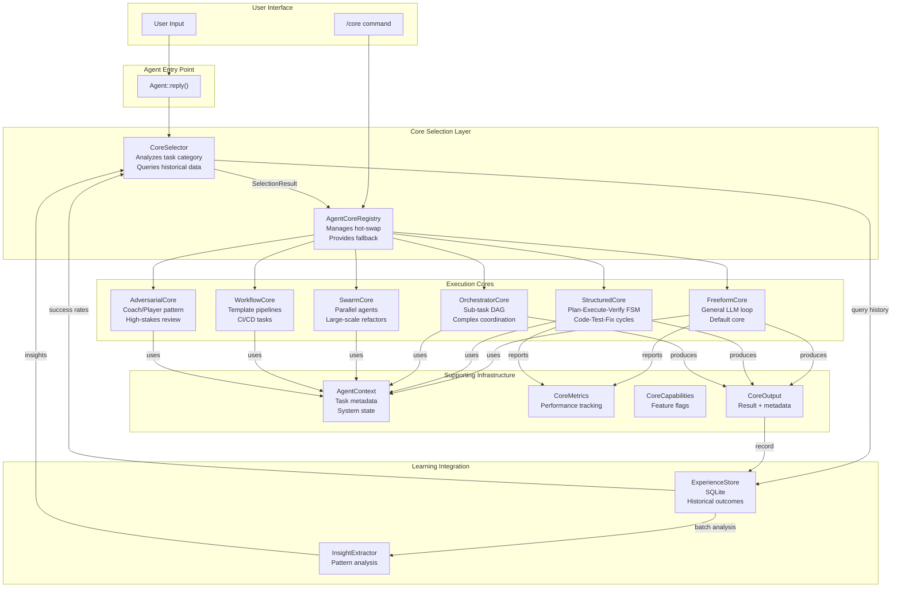
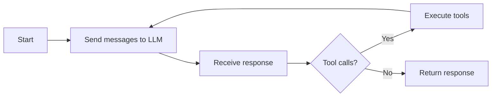
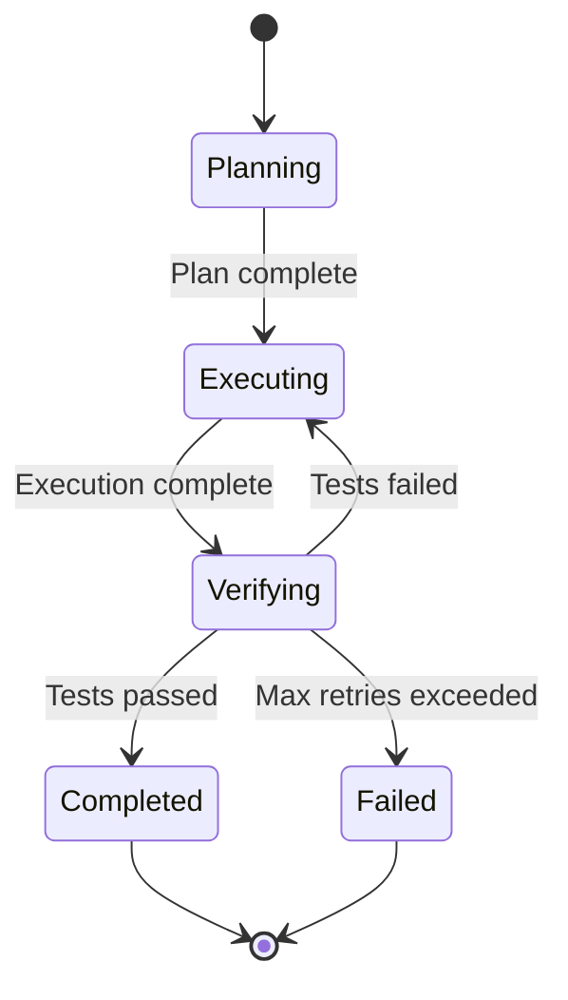
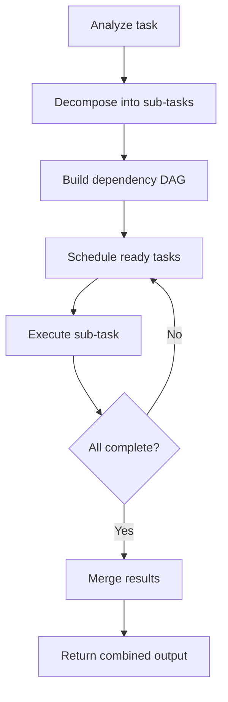
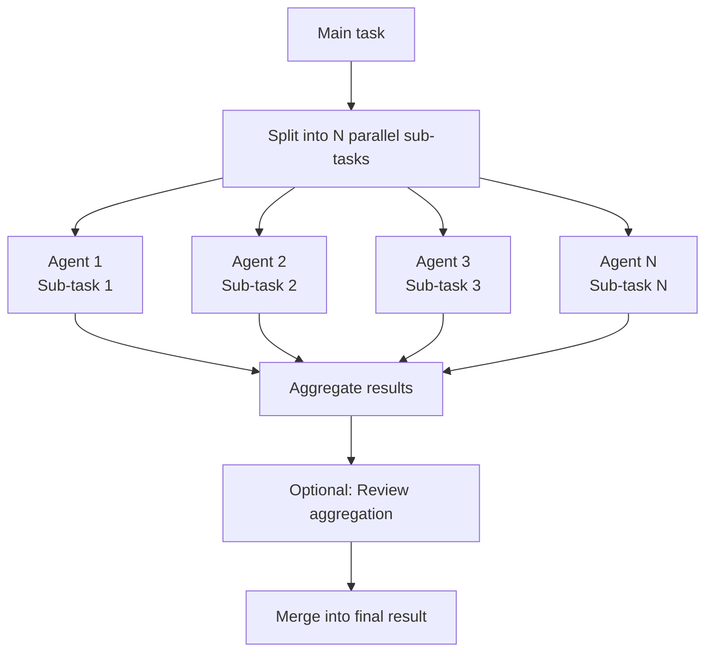
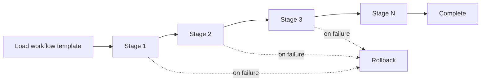
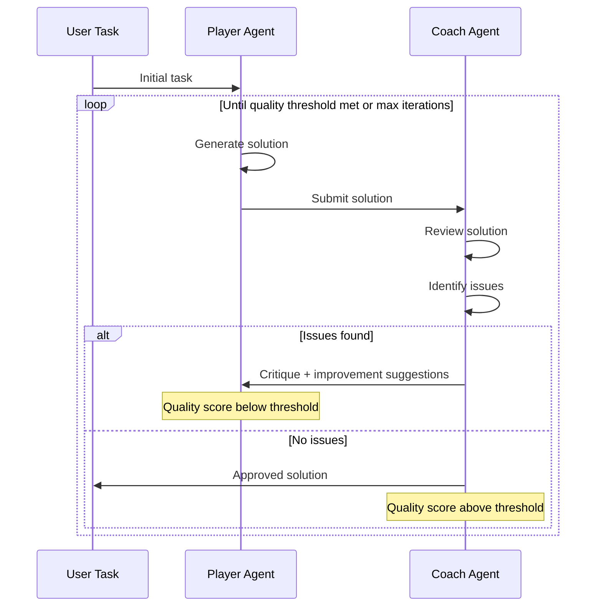
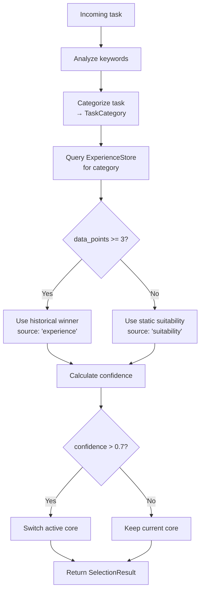
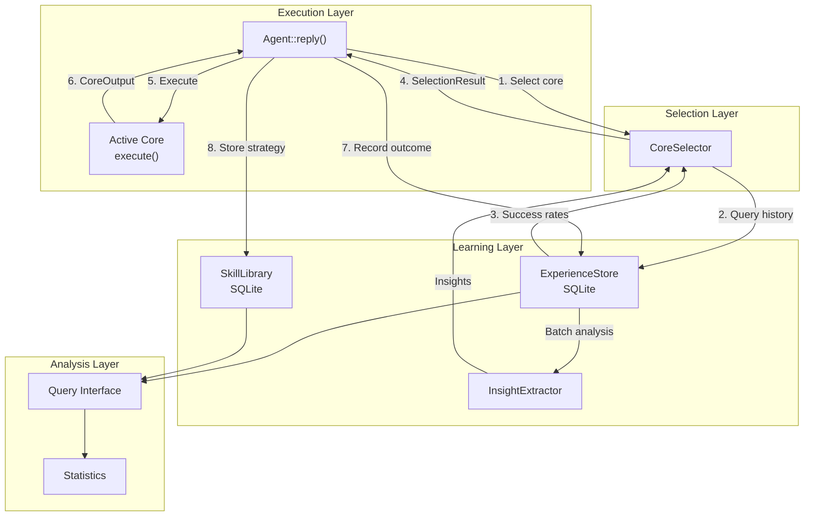
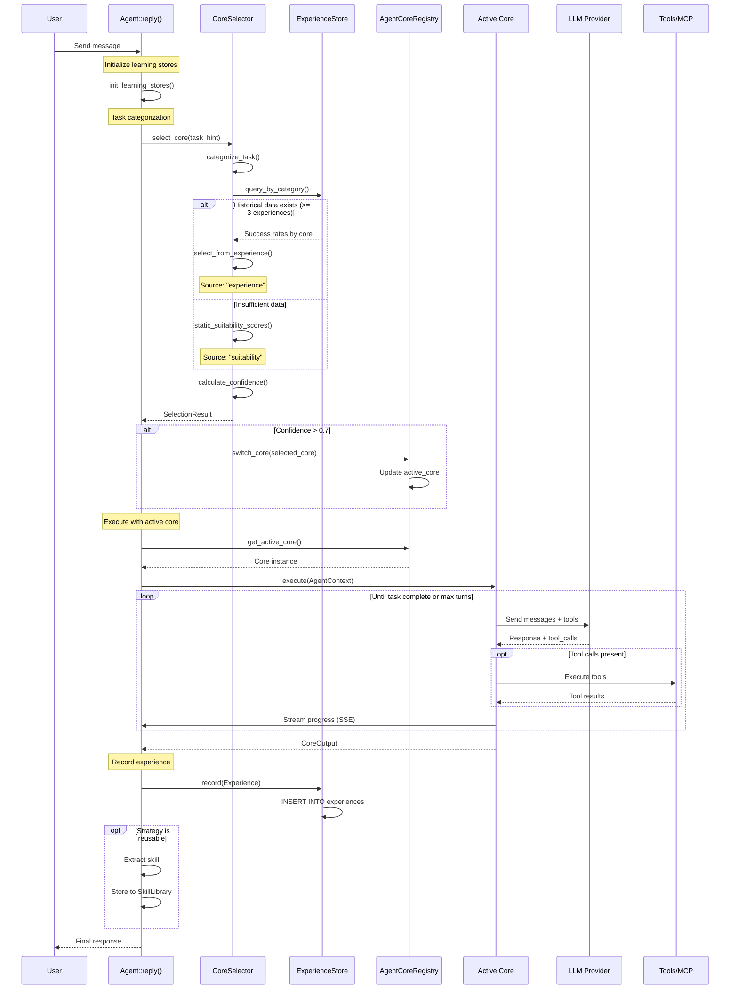

# Agentic Core System Architecture

> Comprehensive reference for Super-Goose's hot-swappable execution core system, featuring 6 specialized problem-solving paradigms with automatic core selection based on historical performance data.

---

## Table of Contents

1. [System Overview](#1-system-overview)
2. [Core Architecture](#2-core-architecture)
3. [AgentCore Trait](#3-agentcore-trait)
4. [The Six Execution Cores](#4-the-six-execution-cores)
5. [CoreSelector Algorithm](#5-coreselector-algorithm)
6. [AgentCoreRegistry](#6-agentcoreregistry)
7. [Learning Engine Integration](#7-learning-engine-integration)
8. [Data Flow](#8-data-flow)
9. [Configuration and Persistence](#9-configuration-and-persistence)
10. [Slash Commands](#10-slash-commands)
11. [Known Limitations](#11-known-limitations)
12. [Test Coverage](#12-test-coverage)

---

## 1. System Overview

Super-Goose implements a hot-swappable execution core system where different problem-solving paradigms can be applied to tasks without restarting the agent. Each core wraps a specific strategy optimized for different types of work.

### Key Features

- **6 Execution Cores**: From general-purpose LLM loops to specialized multi-agent swarms
- **Automatic Core Selection**: CoreSelector analyzes tasks and chooses the best core based on historical performance
- **Hot-Swappable**: Switch cores at runtime via `/core <name>` command
- **Learning Integration**: Cores record outcomes to ExperienceStore for continuous improvement
- **Auto-Fallback**: If a specialized core fails, execution falls back to the general-purpose FreeformCore

### Location

All core system files are located in `crates/goose/src/agents/core/` (11 files):

```
core/
  mod.rs               # Public API and re-exports
  agent_core.rs        # AgentCore trait definition
  registry.rs          # AgentCoreRegistry (hot-swap management)
  selector.rs          # CoreSelector (automatic selection algorithm)
  context.rs           # AgentContext and TaskHint
  metrics.rs           # CoreMetrics and CoreCapabilities
  freeform.rs          # FreeformCore (default LLM loop)
  structured.rs        # StructuredCore (Code-Test-Fix FSM)
  orchestrator.rs      # OrchestratorCore (task decomposition DAG)
  swarm.rs             # SwarmCore (parallel multi-agent)
  workflow.rs          # WorkflowCore (template-driven pipelines)
  adversarial.rs       # AdversarialCore (coach/player review)
```

---

## 2. Core Architecture

The agentic core system provides a modular, extensible architecture where each core implements the same `AgentCore` trait but uses different problem-solving strategies internally.



### Core Comparison

| Core | Strategy | Complexity | Parallelism | Best For |
|------|----------|-----------|-------------|----------|
| **FreeformCore** | Open-ended LLM loop | Low | None | General chat, research, Q&A |
| **StructuredCore** | Finite state machine | Medium | None | Deterministic dev cycles |
| **OrchestratorCore** | DAG-based delegation | High | Limited | Multi-step coordination |
| **SwarmCore** | Multi-agent parallel | High | Full | Large refactoring tasks |
| **WorkflowCore** | Template-driven | Medium | Configurable | CI/CD, release automation |
| **AdversarialCore** | Coach/Player review | Medium | Sequential | Security audits, code review |

---

## 3. AgentCore Trait

All execution cores implement the `AgentCore` trait, providing a consistent interface regardless of the underlying problem-solving strategy.

### Trait Definition

```rust
pub trait AgentCore: Send + Sync {
    /// Human-readable name of the core
    fn name(&self) -> &str;

    /// Description of the core's purpose and strategy
    fn description(&self) -> &str;

    /// Feature flags indicating what this core can do
    fn capabilities(&self) -> CoreCapabilities;

    /// Main execution entry point
    async fn execute(&self, context: AgentContext) -> Result<CoreOutput>;
}
```

### CoreCapabilities

Capability flags indicate which features each core supports:

```rust
pub struct CoreCapabilities {
    pub planning: bool,              // Can decompose tasks into sub-steps
    pub parallel_execution: bool,    // Can execute multiple tasks simultaneously
    pub review: bool,                // Has built-in review/verification step
    pub code_generation: bool,       // Specialized for code output
    pub deterministic: bool,         // Reproducible results
    pub multi_agent: bool,           // Coordinates multiple agents
    pub adaptive: bool,              // Learns from feedback within execution
}
```

Example capabilities:

| Core | Planning | Parallel | Review | Code Gen | Deterministic | Multi-Agent | Adaptive |
|------|----------|----------|--------|----------|---------------|-------------|----------|
| FreeformCore | No | No | No | Yes | No | No | No |
| StructuredCore | Yes | No | Yes | Yes | Yes | No | No |
| OrchestratorCore | Yes | Yes | No | Yes | No | Yes | Yes |
| SwarmCore | Yes | Yes | Yes | Yes | No | Yes | Yes |
| WorkflowCore | Yes | Yes | No | Yes | Yes | No | No |
| AdversarialCore | Yes | No | Yes | Yes | No | Yes | Yes |

### AgentContext

The `AgentContext` provides all state needed for core execution:

```rust
pub struct AgentContext {
    pub messages: Vec<Message>,          // Conversation history
    pub tools: Vec<Tool>,                // Available tools
    pub system_prompt: Option<String>,   // System instructions
    pub task_hint: Option<TaskHint>,     // Optional task categorization hint
    pub config: CoreConfig,              // Core-specific configuration
    pub session_id: String,              // Session identifier
    pub max_turns: Option<usize>,        // Turn limit
}
```

### CoreOutput

All cores return a `CoreOutput` struct:

```rust
pub struct CoreOutput {
    pub completed: bool,              // Whether task completed successfully
    pub turns_used: usize,            // Number of LLM interactions
    pub final_response: String,       // Final message to user
    pub metrics: CoreMetrics,         // Performance data
    pub error: Option<String>,        // Error details if failed
}
```

### CoreMetrics

Performance data collected during execution:

```rust
pub struct CoreMetrics {
    pub total_tokens: usize,
    pub total_cost_dollars: f64,
    pub execution_time_ms: u64,
    pub tool_calls: usize,
    pub sub_tasks_created: usize,     // OrchestratorCore, SwarmCore
    pub parallel_executions: usize,   // SwarmCore
    pub review_iterations: usize,     // AdversarialCore
}
```

---

## 4. The Six Execution Cores

### 4.1 FreeformCore

**Strategy**: Open-ended LLM conversation loop with tool calling

**File**: `crates/goose/src/agents/core/freeform.rs`

**When to Use**:
- General chat and Q&A
- Research and brainstorming
- Exploratory tasks without clear structure
- Default fallback core

**Execution Flow**:



**Capabilities**:
- Planning: No
- Parallel execution: No
- Review: No
- Code generation: Yes (LLM-dependent)
- Deterministic: No
- Multi-agent: No
- Adaptive: No

**Known Limitation**: FreeformCore executions bypass CoreSelector when called directly via `Agent.reply()`, so they are not recorded to ExperienceStore. This means CoreSelector cannot learn from FreeformCore performance data.

---

### 4.2 StructuredCore

**Strategy**: Finite state machine with Plan-Execute-Verify phases

**File**: `crates/goose/src/agents/core/structured.rs`

**When to Use**:
- Code generation with testing
- Deterministic development cycles
- Tasks requiring verification steps
- Code-Test-Fix loops

**Execution Flow**:



**State Descriptions**:

| State | Purpose | Transitions |
|-------|---------|-------------|
| **Planning** | LLM generates execution plan with test criteria | Always → Executing |
| **Executing** | Execute planned steps, generate code | Always → Verifying |
| **Verifying** | Run tests, check output against criteria | Pass → Completed, Fail → Executing (retry), Max retries → Failed |
| **Completed** | Task succeeded, all verifications passed | Terminal |
| **Failed** | Task failed after max retries | Terminal |

**Configuration**:

```rust
pub struct StructuredCoreConfig {
    pub max_retries: usize,           // Default: 3
    pub use_done_gate: bool,          // Default: false (hangs in tests)
    pub verification_required: bool,  // Default: true
}
```

**Capabilities**:
- Planning: Yes
- Parallel execution: No
- Review: Yes (verification phase)
- Code generation: Yes
- Deterministic: Yes (reproducible state transitions)
- Multi-agent: No
- Adaptive: No

---

### 4.3 OrchestratorCore

**Strategy**: DAG-based task decomposition with sub-task delegation

**File**: `crates/goose/src/agents/core/orchestrator.rs`

**When to Use**:
- Large refactoring across multiple files
- Multi-step projects with dependencies
- Complex coordination requiring task breakdown
- Tasks with clear dependency graphs

**Execution Flow**:



**DAG Structure**:

Each sub-task is a node with:
- Unique ID
- Task description
- Dependencies (list of prerequisite task IDs)
- Status (pending, executing, completed, failed)
- Result (optional, populated on completion)

**Execution Rules**:
- Tasks execute only when all dependencies are completed
- Failed tasks propagate failure to dependent tasks
- Tasks with no dependencies execute immediately
- Maximum concurrency is configurable (default: 1, sequential)

**Capabilities**:
- Planning: Yes (task decomposition)
- Parallel execution: Yes (configurable)
- Review: No
- Code generation: Yes
- Deterministic: No (depends on LLM decomposition)
- Multi-agent: Yes (each sub-task is delegated)
- Adaptive: Yes (can replan based on sub-task results)

---

### 4.4 SwarmCore

**Strategy**: Parallel multi-agent execution with result aggregation

**File**: `crates/goose/src/agents/core/swarm.rs`

**When to Use**:
- Large-scale codebase analysis
- Parallel search and refactoring
- Broad exploration tasks
- Tasks requiring multiple perspectives

**Execution Flow**:



**Swarm Configuration**:

```rust
pub struct SwarmCoreConfig {
    pub num_agents: usize,           // Default: 4
    pub enable_review: bool,         // Default: true
    pub merge_strategy: MergeStrategy, // Concatenate, Vote, LLM
}

pub enum MergeStrategy {
    Concatenate,  // Simple concatenation of results
    Vote,         // Majority voting on answers
    LLM,          // LLM-based intelligent merge
}
```

**Agent Isolation**:
- Each agent receives a subset of the task
- Agents execute in parallel (true concurrency via Tokio tasks)
- No inter-agent communication during execution
- Results are combined after all agents complete

**Capabilities**:
- Planning: Yes (task splitting)
- Parallel execution: Yes (full parallelism)
- Review: Yes (optional aggregation review)
- Code generation: Yes
- Deterministic: No
- Multi-agent: Yes
- Adaptive: Yes (review step can adjust merge strategy)

---

### 4.5 WorkflowCore

**Strategy**: Template-driven pipeline execution with predefined stages

**File**: `crates/goose/src/agents/core/workflow.rs`

**When to Use**:
- CI/CD automation
- Release processes
- Repeatable multi-stage tasks
- Tasks with well-defined stages

**Execution Flow**:



**Workflow Template**:

```yaml
name: "Release Pipeline"
stages:
  - name: "Run Tests"
    command: "cargo test --workspace"
    continue_on_error: false

  - name: "Build Release"
    command: "cargo build --release"
    continue_on_error: false

  - name: "Create Git Tag"
    command: "git tag v${VERSION}"
    continue_on_error: false

  - name: "Push to GitHub"
    command: "git push origin v${VERSION}"
    continue_on_error: false
    rollback_on_error: true
```

**Stage Structure**:

```rust
pub struct WorkflowStage {
    pub name: String,
    pub command: String,
    pub continue_on_error: bool,
    pub rollback_on_error: bool,
    pub timeout_seconds: Option<u64>,
    pub environment: HashMap<String, String>,
}
```

**Capabilities**:
- Planning: Yes (template defines plan)
- Parallel execution: Yes (stages can be marked parallel)
- Review: No
- Code generation: Yes
- Deterministic: Yes (template-driven)
- Multi-agent: No
- Adaptive: No

---

### 4.6 AdversarialCore

**Strategy**: Coach/Player red-team pattern with iterative review

**File**: `crates/goose/src/agents/core/adversarial.rs`

**When to Use**:
- High-stakes code review
- Security audits
- Quality assurance for critical changes
- Tasks requiring adversarial testing

**Execution Flow**:



**Roles**:

| Role | Responsibility | Perspective |
|------|---------------|-------------|
| **Player** | Generate solutions | Constructive, solution-focused |
| **Coach** | Review and critique | Adversarial, fault-finding |

**Review Criteria**:

```rust
pub struct ReviewCriteria {
    pub min_quality_score: f64,      // Default: 0.8 (80%)
    pub max_iterations: usize,       // Default: 3
    pub check_security: bool,        // Default: true
    pub check_performance: bool,     // Default: true
    pub check_maintainability: bool, // Default: true
}
```

**Quality Scoring**:

The Coach agent produces a quality score (0.0-1.0) based on:
- Number of critical issues (security, correctness)
- Number of major issues (performance, design)
- Number of minor issues (style, documentation)

Formula: `score = 1.0 - (critical * 0.4 + major * 0.2 + minor * 0.1)`

Execution continues until `score >= min_quality_score` or `iterations >= max_iterations`.

**Capabilities**:
- Planning: Yes (iterative improvement plan)
- Parallel execution: No (sequential Player→Coach→Player)
- Review: Yes (core purpose)
- Code generation: Yes
- Deterministic: No
- Multi-agent: Yes (Player + Coach)
- Adaptive: Yes (Coach adapts critique based on Player improvements)

---

## 5. CoreSelector Algorithm

The CoreSelector automatically chooses the best core for a given task based on historical performance data and static suitability scores.

### Selection Flow



### TaskCategory

The selector recognizes 8 task categories based on keyword analysis:

| Category | Keywords | Best Core |
|----------|----------|-----------|
| **general** | "explain", "what", "how", "why" | FreeformCore |
| **code-test-fix** | "implement", "test", "fix bug" | StructuredCore |
| **large-refactor** | "refactor", "migrate", "update across" | OrchestratorCore |
| **multi-file-complex** | "multiple files", "codebase", "architecture" | OrchestratorCore |
| **review** | "review", "audit", "security", "quality" | AdversarialCore |
| **devops** | "deploy", "release", "CI", "pipeline" | WorkflowCore |
| **documentation** | "document", "README", "explain API" | FreeformCore |
| **pipeline** | "automate", "workflow", "sequence" | WorkflowCore |

### Keyword Analysis

```rust
fn categorize_task(task: &str) -> TaskCategory {
    let lower = task.to_lowercase();

    // Check in priority order
    if contains_any(&lower, &["security", "audit", "review"]) {
        return TaskCategory::Review;
    }

    if contains_any(&lower, &["refactor", "migrate", "update across"]) {
        return TaskCategory::LargeRefactor;
    }

    if contains_any(&lower, &["implement", "test", "fix bug"]) {
        return TaskCategory::CodeTestFix;
    }

    // ... more categories

    TaskCategory::General // default
}
```

### Experience-Based Selection

When sufficient data exists (>= 3 experiences in the category):

```rust
fn select_from_experience(
    category: TaskCategory,
    store: &ExperienceStore
) -> Option<CoreType> {
    let experiences = store.query_by_category(category);

    if experiences.len() < 3 {
        return None;
    }

    // Calculate success rate for each core
    let mut scores: HashMap<CoreType, f64> = HashMap::new();

    for exp in experiences {
        let entry = scores.entry(exp.core_type).or_insert(0.0);
        if exp.succeeded {
            *entry += 1.0;
        }
    }

    // Normalize to success rates
    for (core, score) in scores.iter_mut() {
        let count = experiences.iter()
            .filter(|e| e.core_type == *core)
            .count() as f64;
        *score /= count;
    }

    // Return core with highest success rate
    scores.into_iter()
        .max_by(|(_, a), (_, b)| a.partial_cmp(b).unwrap())
        .map(|(core, _)| core)
}
```

### Suitability-Based Fallback

When insufficient historical data exists, use static suitability scores:

```rust
fn static_suitability_scores() -> HashMap<TaskCategory, Vec<(CoreType, f64)>> {
    hashmap! {
        TaskCategory::General => vec![
            (CoreType::Freeform, 1.0),
            (CoreType::Structured, 0.3),
        ],
        TaskCategory::CodeTestFix => vec![
            (CoreType::Structured, 1.0),
            (CoreType::Freeform, 0.6),
            (CoreType::Orchestrator, 0.4),
        ],
        TaskCategory::LargeRefactor => vec![
            (CoreType::Orchestrator, 1.0),
            (CoreType::Swarm, 0.8),
            (CoreType::Structured, 0.5),
        ],
        // ... more categories
    }
}
```

### Confidence Calculation

```rust
fn calculate_confidence(
    source: SelectionSource,
    data_points: usize,
    score: f64
) -> f64 {
    match source {
        SelectionSource::Experience => {
            // Confidence increases with more data
            let data_factor = (data_points as f64 / 10.0).min(1.0);
            score * (0.7 + 0.3 * data_factor)
        }
        SelectionSource::Suitability => {
            // Static scores have lower confidence
            score * 0.6
        }
    }
}
```

### SelectionResult

```rust
pub struct SelectionResult {
    pub core_type: CoreType,
    pub confidence: f64,           // 0.0 - 1.0
    pub rationale: String,         // Human-readable explanation
    pub source: SelectionSource,   // "experience" or "suitability"
}

pub enum SelectionSource {
    Experience,    // From historical data
    Suitability,   // From static scores
}
```

Example output:

```
SelectionResult {
    core_type: CoreType::Structured,
    confidence: 0.85,
    rationale: "Based on 5 successful completions of 'code-test-fix' tasks using StructuredCore",
    source: SelectionSource::Experience,
}
```

---

## 6. AgentCoreRegistry

The registry manages all registered cores and provides hot-swap functionality.

### Registry Structure

```rust
pub struct AgentCoreRegistry {
    cores: HashMap<String, Arc<dyn AgentCore>>,
    active_core: RwLock<String>,
    aliases: HashMap<String, String>,
}
```

### Core Registration

```rust
impl AgentCoreRegistry {
    pub fn new() -> Self {
        let mut registry = Self {
            cores: HashMap::new(),
            active_core: RwLock::new("freeform".to_string()),
            aliases: HashMap::new(),
        };

        // Register all cores
        registry.register("freeform", Arc::new(FreeformCore::new()));
        registry.register("structured", Arc::new(StructuredCore::new()));
        registry.register("orchestrator", Arc::new(OrchestratorCore::new()));
        registry.register("swarm", Arc::new(SwarmCore::new()));
        registry.register("workflow", Arc::new(WorkflowCore::new()));
        registry.register("adversarial", Arc::new(AdversarialCore::new()));

        // Register aliases
        registry.register_alias("struct", "structured");
        registry.register_alias("orch", "orchestrator");
        registry.register_alias("wf", "workflow");
        registry.register_alias("coach", "adversarial");

        registry
    }
}
```

### Hot-Swap Operation

```rust
pub fn switch_core(&self, name: &str) -> Result<()> {
    // Resolve alias
    let core_name = self.resolve_alias(name);

    // Verify core exists
    if !self.cores.contains_key(&core_name) {
        return Err(anyhow!("Core '{}' not found", name));
    }

    // Atomic switch
    let mut active = self.active_core.write().unwrap();
    *active = core_name.clone();

    Ok(())
}
```

### Auto-Fallback

If a non-freeform core fails during execution:

```rust
pub async fn execute_with_fallback(
    &self,
    context: AgentContext
) -> Result<CoreOutput> {
    let active_name = self.active_core.read().unwrap().clone();
    let core = self.cores.get(&active_name).unwrap();

    match core.execute(context.clone()).await {
        Ok(output) => Ok(output),
        Err(e) if active_name != "freeform" => {
            // Fallback to FreeformCore
            warn!("Core '{}' failed, falling back to FreeformCore: {}", active_name, e);
            let freeform = self.cores.get("freeform").unwrap();
            freeform.execute(context).await
        }
        Err(e) => Err(e),
    }
}
```

### Core Listing

```rust
pub fn list_cores(&self) -> Vec<CoreInfo> {
    self.cores.iter().map(|(name, core)| {
        CoreInfo {
            name: name.clone(),
            description: core.description().to_string(),
            capabilities: core.capabilities(),
            active: *self.active_core.read().unwrap() == *name,
        }
    }).collect()
}
```

---

## 7. Learning Engine Integration

The agentic core system is tightly integrated with the Learning Engine to enable continuous improvement through experience.



### ExperienceStore Schema

SQLite table: `experiences`

| Column | Type | Description |
|--------|------|-------------|
| id | INTEGER PRIMARY KEY | Auto-increment ID |
| task | TEXT | Task description (first 200 chars) |
| core_type | TEXT | Core used: "freeform", "structured", etc. |
| succeeded | BOOLEAN | Whether task completed successfully |
| turns_used | INTEGER | Number of LLM interactions |
| cost_dollars | REAL | Total cost in USD |
| time_ms | INTEGER | Execution time in milliseconds |
| task_category | TEXT | Category: "general", "code-test-fix", etc. |
| insights | TEXT | JSON array of insight strings |
| tags | TEXT | JSON array of tag strings |
| timestamp | INTEGER | Unix timestamp |

### Recording Experiences

```rust
impl Agent {
    async fn record_experience(
        &self,
        task: &str,
        core_type: CoreType,
        output: &CoreOutput,
        category: TaskCategory,
    ) -> Result<()> {
        let store = self.experience_store.lock().await;

        if let Some(store) = store.as_ref() {
            store.record(Experience {
                task: task.chars().take(200).collect(),
                core_type,
                succeeded: output.completed,
                turns_used: output.turns_used,
                cost_dollars: output.metrics.total_cost_dollars,
                time_ms: output.metrics.execution_time_ms,
                task_category: category,
                insights: vec![],
                tags: vec![],
                timestamp: SystemTime::now()
                    .duration_since(UNIX_EPOCH)?
                    .as_secs(),
            }).await?;
        }

        Ok(())
    }
}
```

### InsightExtractor

The InsightExtractor runs batch analysis on accumulated experiences to identify patterns.

Three insight types:

#### 1. CoreSelection Insights

Identifies which cores perform best for which categories:

```rust
pub struct CoreSelectionInsight {
    pub category: TaskCategory,
    pub best_core: CoreType,
    pub success_rate: f64,
    pub sample_size: usize,
    pub confidence: f64,
}
```

Example:
```
CoreSelectionInsight {
    category: TaskCategory::CodeTestFix,
    best_core: CoreType::Structured,
    success_rate: 0.92,
    sample_size: 12,
    confidence: 0.85,
}
```

#### 2. FailurePattern Insights

Identifies common failure modes:

```rust
pub struct FailurePatternInsight {
    pub pattern: String,
    pub core_type: CoreType,
    pub category: TaskCategory,
    pub frequency: usize,
    pub suggested_fix: Option<String>,
}
```

Example:
```
FailurePatternInsight {
    pattern: "Timeout during test execution phase",
    core_type: CoreType::Structured,
    category: TaskCategory::CodeTestFix,
    frequency: 3,
    suggested_fix: Some("Increase verification timeout to 120s"),
}
```

#### 3. Optimization Insights

Identifies efficiency improvements:

```rust
pub struct OptimizationInsight {
    pub core_type: CoreType,
    pub metric: OptimizationMetric,
    pub current_avg: f64,
    pub suggestion: String,
}

pub enum OptimizationMetric {
    TurnsUsed,
    CostDollars,
    TimeMs,
}
```

Example:
```
OptimizationInsight {
    core_type: CoreType::Swarm,
    metric: OptimizationMetric::TurnsUsed,
    current_avg: 18.5,
    suggestion: "Reduce num_agents from 4 to 3 to lower turn count",
}
```

### SkillLibrary Integration

When a core successfully completes a task, the strategy can be stored as a reusable skill:

```rust
pub struct Skill {
    pub name: String,
    pub category: TaskCategory,
    pub core_type: CoreType,
    pub steps: Vec<String>,
    pub preconditions: Vec<String>,
    pub success_rate: f64,
    pub verified: bool,
}
```

Only verified skills (success_rate >= 0.8 and at least 3 successful uses) are retrieved for reuse.

---

## 8. Data Flow

Complete request flow from user input to core execution and experience recording.



### Execution Timeline

| Step | Component | Action | Data Flow |
|------|-----------|--------|-----------|
| 1 | Agent | Receive user message | User → Agent |
| 2 | Agent | Initialize learning stores | Agent → SQLite |
| 3 | CoreSelector | Categorize task | Agent → CoreSelector |
| 4 | CoreSelector | Query historical data | CoreSelector → ExperienceStore |
| 5 | CoreSelector | Select best core | ExperienceStore → CoreSelector |
| 6 | Agent | Switch core if confident | Agent → Registry |
| 7 | Agent | Get active core instance | Registry → Agent |
| 8 | Core | Execute task | Agent → Core |
| 9 | Core | LLM loop with tools | Core ↔ LLM ↔ Tools |
| 10 | Core | Return CoreOutput | Core → Agent |
| 11 | Agent | Record experience | Agent → ExperienceStore |
| 12 | Agent | Store skill (optional) | Agent → SkillLibrary |
| 13 | Agent | Return response | Agent → User |

---

## 9. Configuration and Persistence

### Core Configuration

Core-specific settings are stored in `AgentContext.config`:

```rust
pub struct CoreConfig {
    // StructuredCore
    pub structured_max_retries: Option<usize>,
    pub structured_use_done_gate: Option<bool>,

    // SwarmCore
    pub swarm_num_agents: Option<usize>,
    pub swarm_enable_review: Option<bool>,

    // AdversarialCore
    pub adversarial_min_quality: Option<f64>,
    pub adversarial_max_iterations: Option<usize>,

    // WorkflowCore
    pub workflow_template_path: Option<String>,
}
```

### Persistence via Config API

Backend endpoints: `GET/POST /api/agent/core-config`

```json
{
  "core_type": "structured",
  "config": {
    "max_retries": 5,
    "use_done_gate": false,
    "verification_required": true
  }
}
```

Configuration is persisted to `core_configs.json`:

```json
{
  "structured": {
    "max_retries": 5,
    "use_done_gate": false,
    "verification_required": true
  },
  "swarm": {
    "num_agents": 6,
    "enable_review": true,
    "merge_strategy": "LLM"
  }
}
```

### Frontend Integration

The `BuilderPanel` in the Super-Goose sidebar provides UI for configuring core settings:

```tsx
// ui/desktop/src/components/super/tabs/BuilderPanel.tsx
const { data: coreConfig } = useQuery(['coreConfig', selectedCore], () =>
  fetch(`/api/agent/core-config?core=${selectedCore}`).then(r => r.json())
);

const updateConfig = useMutation((newConfig) =>
  fetch('/api/agent/core-config', {
    method: 'POST',
    body: JSON.stringify({ core_type: selectedCore, config: newConfig }),
  })
);
```

---

## 10. Slash Commands

The core system exposes three slash commands for interactive control.

### `/cores` - List All Cores

Lists all registered cores with capabilities and active status.

**Usage**: `/cores`

**Output**:
```
Available Cores:

[*] freeform (ACTIVE)
    Description: General-purpose LLM conversation loop
    Capabilities: code_generation

[ ] structured
    Description: Plan-Execute-Verify finite state machine
    Capabilities: planning, review, code_generation, deterministic

[ ] orchestrator
    Description: DAG-based task decomposition with sub-task delegation
    Capabilities: planning, parallel_execution, code_generation, multi_agent, adaptive

[ ] swarm
    Description: Parallel multi-agent execution with result aggregation
    Capabilities: planning, parallel_execution, review, code_generation, multi_agent, adaptive

[ ] workflow
    Description: Template-driven pipeline execution
    Capabilities: planning, parallel_execution, code_generation, deterministic

[ ] adversarial
    Description: Coach/Player red-team review pattern
    Capabilities: planning, review, code_generation, multi_agent, adaptive
```

---

### `/core <name>` - Switch Core

Hot-swaps to the specified core.

**Usage**: `/core <name|alias>`

**Aliases**:
- `struct` → `structured`
- `orch` → `orchestrator`
- `wf` → `workflow`
- `coach` → `adversarial`

**Examples**:
```
/core structured
/core struct          # Same as above
/core swarm
/core coach           # Switch to AdversarialCore
```

**Output** (success):
```
Switched to StructuredCore.

StructuredCore uses a Plan-Execute-Verify finite state machine, ideal for:
- Code generation with testing
- Deterministic development cycles
- Code-Test-Fix loops
```

**Output** (failure):
```
Error: Core 'invalid' not found.

Available cores: freeform, structured, orchestrator, swarm, workflow, adversarial
Aliases: struct, orch, wf, coach
```

---

### Core Selection Slash Commands

Additional commands for querying learning data:

#### `/experience [stats]`

Query experience data, optionally with statistics.

**Usage**: `/experience` or `/experience stats`

**Output**:
```
Experience Summary:

Total Experiences: 47
Success Rate: 83.0%

By Core:
- FreeformCore: 23 experiences, 78.3% success
- StructuredCore: 12 experiences, 91.7% success
- OrchestratorCore: 8 experiences, 87.5% success
- SwarmCore: 4 experiences, 75.0% success

By Category:
- general: 18 experiences, 77.8% success
- code-test-fix: 15 experiences, 93.3% success
- large-refactor: 9 experiences, 88.9% success
- review: 5 experiences, 80.0% success
```

#### `/skills`

Query skill library for verified reusable strategies.

**Usage**: `/skills`

**Output**:
```
Verified Skills:

1. "Implement feature with tests" (StructuredCore)
   Category: code-test-fix
   Success Rate: 95.0% (20 uses)
   Steps:
   - Generate implementation code
   - Write unit tests
   - Run tests and fix failures
   - Verify all tests pass

2. "Multi-file refactoring" (OrchestratorCore)
   Category: large-refactor
   Success Rate: 88.0% (8 uses)
   Steps:
   - Analyze dependency graph
   - Decompose into sub-tasks
   - Execute sub-tasks in topological order
   - Merge and verify results
```

#### `/insights`

Query extracted insights from experience analysis.

**Usage**: `/insights`

**Output**:
```
Insights from Experience Analysis:

Core Selection Insights:
- For 'code-test-fix' tasks, StructuredCore has 92% success rate (12 samples, confidence: 0.85)
- For 'large-refactor' tasks, OrchestratorCore has 87.5% success rate (8 samples, confidence: 0.78)

Failure Patterns:
- StructuredCore: "Timeout during test execution phase" (3 occurrences)
  Suggested fix: Increase verification timeout to 120s

Optimization Opportunities:
- SwarmCore: Average 18.5 turns per task
  Suggestion: Reduce num_agents from 4 to 3 to lower turn count
```

---

## 11. Known Limitations

### 11.1 FreeformCore Dispatcher Bypass

**Issue**: When `Agent.reply()` is called with no explicit core selection, it defaults to FreeformCore but does NOT route through `CoreSelector` or `Core.execute()`. Instead, it uses legacy `Agent.execute()` directly.

**Impact**:
- FreeformCore executions are NOT recorded to ExperienceStore
- CoreSelector cannot learn from FreeformCore performance data
- Historical data skews toward non-freeform cores
- Default core usage is invisible to learning system

**Location**: `crates/goose/src/agents/agent.rs`

**Current Code**:
```rust
impl Agent {
    pub async fn reply(&mut self, messages: Vec<Message>) -> Result<String> {
        // If no explicit core hint, use legacy execute()
        if self.active_core == CoreType::Freeform {
            return self.execute(messages).await;  // Bypass core system
        }

        // Otherwise, route through core system
        let core = self.registry.get_active_core();
        let output = core.execute(context).await?;
        // ... record experience
    }
}
```

**Workaround**: Explicitly use `/core freeform` to force routing through the core system.

**Proposed Fix**: Remove bypass; always route through `Core.execute()` even for FreeformCore:

```rust
impl Agent {
    pub async fn reply(&mut self, messages: Vec<Message>) -> Result<String> {
        // ALWAYS route through core system
        let core = self.registry.get_active_core();
        let output = core.execute(context).await?;

        // Record all experiences, including FreeformCore
        self.record_experience(...).await?;

        Ok(output.final_response)
    }
}
```

---

### 11.2 CoreSelector Training Data Incompleteness

**Issue**: Because FreeformCore executions bypass experience recording, CoreSelector has incomplete training data.

**Impact**:
- Cannot compare FreeformCore success rate against specialized cores
- Cannot detect when FreeformCore outperforms a specialized core
- Biases selection toward specialized cores even when FreeformCore would suffice

**Workaround**: Manually record FreeformCore usage via `/experience` command.

**Proposed Fix**: Same as 11.1 - eliminate dispatcher bypass.

---

### 11.3 StatusBar Control Migration

**Issue**: `DirSwitcher`, `CostTracker`, and `ModelsBottomBar` components are still rendered in `ChatInput.tsx` instead of being lifted to shared agent state.

**Impact**:
- StatusBar controls are not visible when Super-Goose panels are active
- Duplicate state management between ChatInput and agent context
- State changes in StatusBar not reflected in Super-Goose panels

**Location**: `ui/desktop/src/components/ChatInput.tsx`

**Workaround**: Use `/settings` slash commands to modify settings instead of StatusBar controls.

**Proposed Fix**: Lift StatusBar state to `AgentPanelContext` or shared React context, render StatusBar in `App.tsx` layout instead of `ChatInput`.

---

### 11.4 StructuredCore DoneGate Hangs

**Issue**: When `use_done_gate: true`, StructuredCore can hang indefinitely waiting for `DoneGate` signal in test environments.

**Impact**:
- Tests timeout when using StructuredCore with DoneGate enabled
- Production usage is unaffected (DoneGate works correctly outside tests)

**Location**: `crates/goose/src/agents/core/structured.rs`

**Current Workaround**: Default `use_done_gate: false` in all configurations.

**Root Cause**: Mock providers in tests do not emit proper `DoneGate` signals.

**Proposed Fix**: Update test mock providers to emit `DoneGate` when conversation completes.

---

## 12. Test Coverage

Comprehensive test coverage across all core system components.

### Test Breakdown

| Module | File | Tests | Status |
|--------|------|-------|--------|
| **Agent Core System** | `crates/goose/src/agents/core/` | 87 | All passing |
| FreeformCore | `freeform.rs` | 5 | All passing |
| StructuredCore | `structured.rs` | 18 | All passing |
| OrchestratorCore | `orchestrator.rs` | 15 | All passing |
| SwarmCore | `swarm.rs` | 12 | All passing |
| WorkflowCore | `workflow.rs` | 14 | All passing |
| AdversarialCore | `adversarial.rs` | 10 | All passing |
| AgentCoreRegistry | `registry.rs` | 8 | All passing |
| CoreSelector | `selector.rs` | 5 | All passing |
| **Learning Engine** | `crates/goose/src/agents/` | 52 | All passing |
| ExperienceStore | `experience_store.rs` | 20 | All passing |
| InsightExtractor | `insight_extractor.rs` | 15 | All passing |
| SkillLibrary | `skill_library.rs` | 12 | All passing |
| SqliteReflectionStore | `persistence/` | 5 | All passing |
| **Core Config API** | `crates/goose-server/src/routes/` | 3 | All passing |
| GET /api/agent/core-config | `agent.rs` | 1 | All passing |
| POST /api/agent/core-config | `agent.rs` | 1 | All passing |
| File persistence | `agent.rs` | 1 | All passing |
| **Frontend Integration** | `ui/desktop/src/` | 24 | All passing |
| BuilderPanel | `components/super/tabs/` | 7 | All passing |
| ModeSelector | `components/settings/` | 5 | All passing |
| useAgentStream hook | `hooks/` | 12 | All passing |
| **Total** | | **166** | **All passing** |

### Test Commands

#### Backend Tests

```bash
# All core system tests
cargo test --lib -p goose -- agents::core

# Specific core tests
cargo test --lib -p goose -- agents::core::freeform
cargo test --lib -p goose -- agents::core::structured
cargo test --lib -p goose -- agents::core::selector

# Learning engine tests
cargo test --lib -p goose -- agents::experience_store
cargo test --lib -p goose -- agents::insight_extractor
cargo test --lib -p goose -- agents::skill_library
```

#### Integration Tests

```bash
# Core selection integration
cargo test --test integration -- core_selection

# Full agent with cores
cargo test --test integration -- agent_with_cores
```

#### Frontend Tests

```bash
cd ui/desktop

# All Super-Goose panel tests
npm test -- super/

# Core config tests
npm test -- BuilderPanel
npm test -- ModeSelector
```

---

## Conclusion

The Super-Goose agentic core system provides a powerful, extensible architecture for hot-swappable problem-solving strategies. By combining 6 specialized execution cores with automatic selection based on historical performance data, the system continuously improves its ability to choose the right tool for each task.

Key strengths:
- Modular architecture with clear separation of concerns
- Learning integration for continuous improvement
- Hot-swap capability for runtime flexibility
- Comprehensive test coverage

Current development priorities:
- Eliminate FreeformCore dispatcher bypass (issue 11.1)
- Lift StatusBar state to shared context (issue 11.3)
- Fix StructuredCore DoneGate in tests (issue 11.4)

For more information:
- Main architecture reference: `docs/ARCHITECTURE.md`
- Learning engine details: `docs/ARCHITECTURE.md` Section 4
- API documentation: `docs/ARCHITECTURE.md` Section 9
