# OpenClaw × Super-Goose Pipeline Diagrams

## Full Pipeline Architecture

```mermaid
graph TB
    subgraph PLAN["📋 PLAN — Task Decomposition"]
        CS[CoreSelector] --> LG[LangGraph]
        CS --> WF[WorkflowCore YAML]
    end

    subgraph TEAM["👥 TEAM — ALMAS Agent Assignment"]
        GT[GooseTeam MCP] --> AF[antfarm Patterns]
        AF --> EG[engram Shared Memory]
        GT --> ARCH[Architect 🏗️]
        GT --> DEV[Developer 💻]
        GT --> QA[QA ✅]
        GT --> SEC[Security 🛡️]
        GT --> DEP[Deploy 🚀]
    end

    subgraph EXECUTE["⚡ EXECUTE — Sandboxed Execution"]
        IC[ironclaw WASM Sandbox] --> MCP_B[openclaw-mcp-plugin Bridge]
        MCP_B --> SKILLS[awesome-openclaw-skills]
        IC --> TOOLS[MCP Tool Calls]
    end

    subgraph EVOLVE["🧬 EVOLVE — Memory & Learning"]
        MU[memU Episodic Memory] --> ES[ExperienceStore]
        MS[memsearch Vector Search] --> ES
        ES --> SL[SkillLibrary]
        ES --> RF[Reflexion]
    end

    subgraph REVIEW["🔍 REVIEW — Security & Quality"]
        AG[Archestra Gateway] --> CW[clawsec Scanning]
        CW --> AC[AdversarialCore Coach]
        AC --> PI[Prompt Injection Defense]
    end

    subgraph OBSERVE["📊 OBSERVE — Monitoring"]
        CR[ClawRouter Cost Optimizer] --> LF[Langfuse Traces]
        OS[openclaw-studio Patterns] --> AP[Agent Panel UI]
        MC[mission-control RBAC] --> TW[TimeWarp Events]
    end

    PLAN --> TEAM
    TEAM --> EXECUTE
    EXECUTE --> EVOLVE
    EVOLVE --> REVIEW
    REVIEW --> OBSERVE
    OBSERVE -.->|Feedback Loop| PLAN

    style PLAN fill:#38BDF8,color:#000
    style TEAM fill:#818CF8,color:#000
    style EXECUTE fill:#FBBF24,color:#000
    style EVOLVE fill:#A78BFA,color:#000
    style REVIEW fill:#F472B6,color:#000
    style OBSERVE fill:#34D399,color:#000
```

## ALMAS Agent Team Architecture

## Integration Tiers

## 4-Phase Roadmap

## Docker Compose Architecture

---

*Diagrams for Super-Goose v1.24.06+ OpenClaw integration planning*
