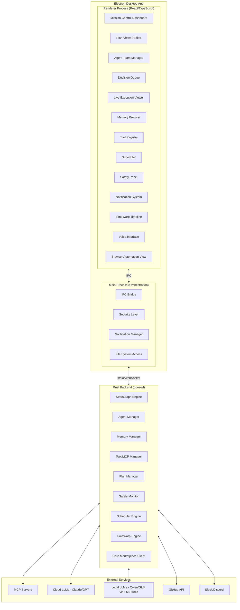

# Super-Goose Agentic GUI — L3+ Blueprint

**Version:** 1.0 — February 2026
**Project:** Super-Goose (Enhanced Fork of Block/Goose)
**Target:** L3–L5+ Agentic Autonomy via GUI
**Stack:** Rust Backend + Electron Desktop + React/TypeScript Frontend

---

## 1. Executive Summary

**Question:** How useful can we design the Super-Goose GUI to be fully Agentic at L3+?

**Answer:** Yes, this is achievable today at L3–L4, with L5 partially reachable depending on model capability and safety guardrails. The GUI becomes the **command bridge** — not just a chat window, but an autonomous operations center where agents plan, execute, self-correct, and report while the user observes, approves, or overrides at any level.

The key insight: **the GUI is not the agent — the GUI is the agent's cockpit.** At L3+, the interface must surface the agent's internal state, planning, tool use, memory, and decision-making in real-time so the user can seamlessly shift between observing (L4/L5) and collaborating (L3).

---

## 2. Autonomy Level Definitions (Applied to Super-Goose GUI)

### L1 — Tool User (Chatbot)

- User types prompt, agent responds
- No state, no memory, no planning
- Single-turn interaction
- **GUI = chat window** (this is where stock Goose starts)

### L2 — Tool Orchestrator

- Agent can chain multiple tools (MCP servers, file system, terminal)
- User must approve each step
- Short-horizon planning within a single task
- **GUI = chat + tool call panels + output viewer**

### L3 — Collaborator (TARGET MINIMUM)

- Agent plans multi-step workflows autonomously
- Agent maintains state and context across steps
- Agent asks for human input only at decision points
- Agent can self-correct on failures within a plan
- **GUI = mission control dashboard with plan viewer, approval gates, live execution**

### L4 — Approver Mode (TARGET STANDARD)

- Agent operates independently on open-ended goals
- User is only engaged for blockers, credentials, or high-impact decisions
- Agent has persistent memory across sessions
- Agent monitors environments and triggers actions proactively
- **GUI = autonomous operations center with notification system, audit trail, override controls**

### L5 — Full Autonomy (TARGET STRETCH)

- Agent pursues long-horizon goals over hours/days
- Agent creates new tools, workflows, and strategies
- Agent coordinates with other agents
- No human-in-the-loop required (but human can observe/intervene)
- **GUI = fleet command center with agent team management, goal tracking, safety killswitch**

---

## 3. The L3+ Agentic GUI — Complete Feature Map

### 3.1 Mission Control Dashboard (Core View)

The primary interface — replaces the simple chat window with a multi-panel operations center.

```
┌─────────────────────────────────────────────────────────────────────┐
│  SUPER-GOOSE — Mission Control                          [≡] [−] [×]│
├──────────┬──────────────────────────────────┬───────────────────────┤
│          │                                  │                       │
│  AGENTS  │   WORKSPACE / EXECUTION          │  CONTEXT PANEL        │
│          │                                  │                       │
│  ▸ Lead  │   [Plan View] [Code] [Terminal]  │  ▸ Active Files       │
│  ▸ Coder │   [Browser]  [Preview] [Diff]    │  ▸ Git Status         │
│  ▸ QA    │                                  │  ▸ Memory / Recall    │
│  ▸ Docs  │   ┌──────────────────────────┐   │  ▸ Tool Registry      │
│  ▸ Ops   │   │                          │   │  ▸ Cost Tracker       │
│          │   │  [Active workspace area]  │   │  ▸ Session History    │
│ ──────── │   │                          │   │                       │
│ MISSIONS │   │  Code editor / terminal / │   │ ──────────────────── │
│          │   │  browser / diff view      │   │                       │
│  ● Build │   │                          │   │  DECISION QUEUE       │
│    API   │   │                          │   │                       │
│  ○ Fix   │   └──────────────────────────┘   │  ⚠ Approve DB schema  │
│    auth  │                                  │    change? [Y] [N]    │
│  ✓ Setup │   EXECUTION LOG                  │                       │
│    Docker│   ├─ 14:23 Analyzing codebase    │  ⚠ Install 3 new     │
│          │   ├─ 14:24 Planning 7 steps      │    deps? [Y] [N] [?] │
│ ──────── │   ├─ 14:25 Writing auth.ts       │                       │
│ SCHEDULE │   ├─ 14:26 Running tests ███░ 60%│  ──────────────────── │
│          │   └─ 14:27 Waiting for approval  │  SAFETY MONITOR       │
│  ◷ Daily │                                  │  CPU: 34%  MEM: 2.1G  │
│    tests │                                  │  Tokens: 12.4k/$0.08  │
│  ◷ PR    │                                  │  Risk: LOW ●          │
│    review│                                  │  [KILL] [PAUSE] [LOG] │
│          │                                  │                       │
├──────────┴──────────────────────────────────┴───────────────────────┤
│ [💬 Chat] Ask anything...                              [⌘K] [Send] │
└─────────────────────────────────────────────────────────────────────┘
```

### 3.2 Plan Viewer & Editor (L3 Core Feature)

The agent's thinking becomes visible and editable.

**What it shows:**
- Hierarchical task decomposition (goal → subtasks → steps)
- Current step highlighted with progress indicator
- Dependency graph between steps (Mermaid/D3 rendered)
- Estimated time and token cost per step
- Confidence score per step (agent's self-assessment)

**What the user can do:**
- Approve/reject the plan before execution starts
- Reorder steps via drag-and-drop
- Add/remove/modify steps inline
- Set approval gates on specific steps ("ask me before deploying")
- Fork the plan at any point (TimeWarp integration)
- Bookmark plan states for rollback

```
PLAN: Build Authentication System                    [Edit] [Fork] [Run]
━━━━━━━━━━━━━━━━━━━━━━━━━━━━━━━━━━━━━━━━━━━━━━━━━━━━━━━━━━━━━━━━━━━━━━

  1. ✅ Analyze existing codebase              [3.2k tokens] [12s]
  2. ✅ Design auth schema                     [1.8k tokens] [8s]
  3. 🔄 Implement JWT middleware    ███████░░░  [est. 4.5k]  [~30s]
     ├─ 3a. ✅ Create token utils
     ├─ 3b. 🔄 Add middleware to routes        ← CURRENT
     └─ 3c. ○ Write refresh token logic
  4. ⏳ Write integration tests                 [est. 3.0k]  [~20s]
  5. ⏳ Update API documentation                [est. 1.5k]  [~10s]
  6. ⚠️ Deploy to staging (APPROVAL REQUIRED)   [est. 0.5k]  [~5s]
  7. ⏳ Run smoke tests on staging              [est. 2.0k]  [~15s]

  Total: ~16.5k tokens | ~$0.12 estimated | ~1m 40s
  Confidence: 87% (auth patterns well-understood)
```

### 3.3 Agent Team Manager (L3–L4)

Visual management of the multi-agent team (ALMAS architecture from Super-Goose).

**Per Agent:**
- Name, role, model backend (Claude/GPT/Qwen/GLM/local)
- Current status (idle/working/waiting/error)
- Active task assignment
- Token usage + cost
- Message log (inter-agent communication visible)
- Performance metrics (success rate, retry count)

**Team Operations:**
- Spawn new specialist agents on demand
- Assign/reassign tasks between agents
- Set priority levels per agent
- View inter-agent message bus in real-time
- Pause/resume/terminate individual agents
- Hot-swap model backends per agent (e.g., switch Coder from Claude to Qwen 3)

```
AGENT TEAM                                          [+ Add Agent]
━━━━━━━━━━━━━━━━━━━━━━━━━━━━━━━━━━━━━━━━━━━━━━━━━━━━━━━━━━━━━━━

  🟢 Lead Agent        claude-opus-4-6        PLANNING
     └─ Decomposing "Build auth system" → 7 subtasks
     └─ Tokens: 3,241 | Cost: $0.04

  🟡 Coder Agent       qwen3-32b (local)       CODING
     └─ Writing: src/middleware/jwt.ts
     └─ Tokens: 8,450 | Cost: $0.00 (local)

  ⚪ QA Agent           claude-sonnet-4-5       IDLE
     └─ Queued: Run tests after step 3 completes
     └─ Tokens: 0

  🟢 Docs Agent        glm-4.7 (local)         WRITING
     └─ Drafting: docs/api/auth.md
     └─ Tokens: 2,100 | Cost: $0.00 (local)

  ⚪ Ops Agent          claude-haiku-4-5        STANDBY
     └─ Will activate for deployment step
     └─ Tokens: 0

  ─────────────────────────────────────────────
  Team Total: 13,791 tokens | $0.04 | 4/5 active
```

### 3.4 Decision Queue & Approval System (L3–L4 Bridge)

The mechanism that makes L3→L4 a smooth gradient rather than a hard switch.

**How it works:**
- Agent runs autonomously until it hits a decision requiring user input
- Decisions are queued in a sidebar panel with priority levels
- User can batch-approve, reject, or modify decisions
- Each decision shows: what the agent wants to do, why, what alternatives were considered, risk level

**Decision Types:**
- **Approve/Deny**: Simple gate (e.g., "Install 3 new npm packages?")
- **Choose**: Agent presents options, user picks (e.g., "Use JWT or session-based auth?")
- **Provide**: Agent needs information (e.g., "What's the database connection string?")
- **Review**: Agent completed work, wants sign-off (e.g., "Review this migration script")
- **Override**: Agent failed and needs manual guidance (e.g., "Tests failing, here's the error")

**Autonomy Slider (per mission):**

```
USER CONTROL ◄━━━━━━━●━━━━━━━━━━━► FULL AUTO
   L1  L2  L3  [L4]  L5

Current: L4 — Agent operates independently, asks only for blockers
  ✅ File operations          — auto-approved
  ✅ Package installs         — auto-approved (within allowlist)
  ✅ Git commits              — auto-approved (to feature branch)
  ⚠️ Database schema changes  — requires approval
  ⚠️ External API calls       — requires approval
  🛑 Production deploys       — always requires approval
  🛑 Credential access        — always requires approval

  [Configure Rules...]
```

### 3.5 Live Execution Viewer (L3+)

Real-time visibility into what the agent is doing, like watching a live coding session.

**Panels:**
- **Code Editor**: Shows files being written/modified in real-time with syntax highlighting, diff markers
- **Terminal**: Live command output (build, test, install)
- **Browser**: Embedded browser showing web preview or agent's web browsing (Agent S / Browser-Use style)
- **Diff View**: Side-by-side before/after for every file change
- **Preview**: Live preview of web apps, documents, or outputs being generated

**Controls:**
- Pause execution at any point (agent freezes mid-action)
- Step through actions one at a time (debugging mode)
- Rewind to any previous state (TimeWarp integration)
- Inject changes mid-execution (user edits a file, agent adapts)
- Speed controls (fast-forward through known-good steps)

### 3.6 Memory & Context System (L4+)

Persistent, searchable, manageable memory that survives across sessions.

**Memory Types:**
- **Project Memory**: Codebase understanding, architecture decisions, past changes
- **User Preferences**: Coding style, tech stack preferences, approval patterns
- **Skill Library**: Learned procedures and patterns (Voyager-style)
- **Conversation History**: Searchable past interactions with semantic recall
- **Error Memory**: Past failures and their solutions (never repeat the same mistake)

**GUI Elements:**
- Memory browser with search/filter/tag
- Memory editor (user can correct or delete memories)
- Memory confidence indicators (how sure the agent is about each memory)
- "Forget this" button on any memory
- Import/export memories (Core Marketplace integration)
- Memory usage visualization (what's taking context window space)

```
MEMORY BROWSER                              [Search...] [+ Add]
━━━━━━━━━━━━━━━━━━━━━━━━━━━━━━━━━━━━━━━━━━━━━━━━━━━━━━━━━━━━━━

  📁 Project: super-goose
  ├─ 🧠 "Uses Rust + Electron architecture"        [98%] [×]
  ├─ 🧠 "ALMAS team coordination with 5 roles"     [95%] [×]
  ├─ 🧠 "Dave prefers Docker-first, local-first"   [99%] [×]
  ├─ 🧠 "RTX 3090 Ti available for local models"   [99%] [×]
  └─ 🧠 "Auth uses JWT with refresh tokens"        [72%] [×]

  📁 Skills Library (12 learned procedures)
  ├─ 🔧 "Rust MCP server creation"                 [91%]
  ├─ 🔧 "Electron IPC secure pattern"              [88%]
  └─ 🔧 "Docker multi-stage build for Rust"        [94%]

  📁 Error Patterns (7 recorded)
  ├─ ⚠️ "Borrow checker: use Arc<Mutex<T>>"        [85%]
  └─ ⚠️ "Electron: CSP blocks inline scripts"      [90%]
```

### 3.7 Tool & MCP Registry (L3+)

Visual management of all tools and MCP servers available to agents.

**Features:**
- Browse installed MCP servers with descriptions and capabilities
- Enable/disable tools per agent or per mission
- Test tool connections with one-click health checks
- View tool usage statistics (most used, error rates)
- Install new MCP servers from marketplace
- Create custom tool wrappers visually

```
TOOL REGISTRY                               [Search...] [+ Install]
━━━━━━━━━━━━━━━━━━━━━━━━━━━━━━━━━━━━━━━━━━━━━━━━━━━━━━━━━━━━━━━━━

  🟢 filesystem          Built-in     Read/write files        [12 calls]
  🟢 terminal            Built-in     Execute commands        [45 calls]
  🟢 browser             Built-in     Web browsing            [3 calls]
  🟢 git                 MCP Server   Version control         [8 calls]
  🟢 docker              MCP Server   Container management    [2 calls]
  🟡 database            MCP Server   PostgreSQL access       [0 calls]  ⚠ Untested
  🔴 deploy              MCP Server   Staging deploy          [Error]    [Retry]

  Available to Install:
  ├─ 📦 sentry-mcp       Error tracking integration
  ├─ 📦 github-mcp       GitHub API (issues, PRs, actions)
  └─ 📦 slack-mcp        Team notifications
```

### 3.8 Scheduling & Triggers (L4+)

Agents that work while you sleep.

**Capabilities:**
- Schedule recurring tasks (daily tests, weekly code audits, PR reviews)
- Event-driven triggers (new PR opened → auto-review, CI fails → auto-investigate)
- File watcher triggers (config changed → validate, new file → auto-lint)
- Time-based triggers with cron expressions
- Webhook ingestion (GitHub, Slack, custom)
- Conditional chains (if tests pass → deploy staging → if staging healthy → notify user)

**GUI:**

```
SCHEDULED MISSIONS                          [+ New Schedule]
━━━━━━━━━━━━━━━━━━━━━━━━━━━━━━━━━━━━━━━━━━━━━━━━━━━━━━━━━━━

  ◷ Daily Test Suite         Every day 6:00 AM      [Active]
    └─ Last run: ✅ 2/13 6:00 AM (all passed)
    └─ Next run: 2/14 6:00 AM

  ◷ PR Auto-Review           On new PR              [Active]
    └─ Last triggered: PR #47 "Add auth" → Approved ✅
    └─ Reviews today: 3

  ◷ Weekly Security Audit    Every Monday 8:00 AM   [Active]
    └─ Last run: ⚠️ 2/10 — 2 medium vulns found
    └─ Next run: 2/17 8:00 AM

  ◷ Cost Report              Every Friday 5:00 PM   [Paused]
    └─ Last run: 2/7 — $4.32 total spend
```

### 3.9 Safety & Killswitch Panel (ALL LEVELS)

Non-negotiable safety controls that are always visible and always functional.

**Always-On Elements:**
- **KILL button**: Immediately terminates all agent activity (red, prominent, never hidden)
- **PAUSE button**: Freezes all agents, preserves state for resume
- **Risk Level indicator**: Real-time assessment (LOW/MEDIUM/HIGH/CRITICAL)
- **Token/Cost tracker**: Running total with budget limits and alerts
- **Sandbox indicator**: Shows if agents are operating in sandbox vs. real environment
- **Undo last action**: Reverses the most recent agent action (TimeWarp integration)

**Safety Rules Engine:**
- File path restrictions (agents can't touch system files)
- Network restrictions (allowlist of domains agents can access)
- Cost limits (per-session, per-day, per-month budgets)
- Rate limiting (max operations per minute)
- Sensitive data detection (auto-redact secrets in logs)
- Audit trail (every action logged with timestamp, agent, tool, inputs, outputs)

### 3.10 Notification System (L4+)

How agents communicate when the user isn't watching.

**Channels:**
- In-app toast notifications (task complete, approval needed, error occurred)
- System tray notifications (Windows)
- Optional: Slack/Discord webhook integration
- Optional: Email digest (daily summary of agent activity)
- Sound alerts (configurable per event type)

**Notification Categories:**
- 🟢 **Info**: Task completed successfully
- 🟡 **Approval**: Decision needs your input
- 🟠 **Warning**: Something unexpected happened, agent is handling it
- 🔴 **Error**: Agent is stuck and needs help
- ⚫ **Critical**: Safety violation detected, agent terminated

### 3.11 Core Marketplace Integration (L4–L5)

From your Core Marketplace concept — buying/selling/sharing agent configurations.

**In the GUI:**
- Browse available cores with ratings, reviews, cost-to-build
- One-click install of community cores
- Core editor for customizing agent personalities, skills, and tool access
- Export your core configuration for sharing/selling
- Core versioning with rollback
- Core reviewer dashboard (for marketplace maintainers)

### 3.12 TimeWarp / Version Control Integration (ALL LEVELS)

From your Fusion 360-style timeline concept — full time-travel for agent sessions.

**Timeline Bar (always visible at bottom):**

```
━━━━●━━━━━━●━━━━●━━━━━━━━━●━━━━━●━━━━━━━━━━●━━━━━━━━━━━━━━━━━━━●━━
  Start   Plan   Code    Test   Fix     Deploy              Now ▶
          v1     auth    fail   auth    staging
                                bug

  [⟵] [⟶] [Bookmark] [Branch] [Compare] [Restore]
```

**Capabilities:**
- Click any point to view agent state at that moment
- Branch from any point to explore alternative approaches
- Compare two points side-by-side (code diff, plan diff, state diff)
- Bookmark important milestones
- Restore to any previous state (full rollback)
- Export timeline as documentation

### 3.13 Multi-Workspace Support (L3+)

Run multiple independent missions simultaneously.

**Features:**
- Tabbed workspaces (like browser tabs)
- Each workspace has its own agent team, plan, and execution state
- Cross-workspace agent sharing (QA agent reviews work from both workspaces)
- Workspace templates (pre-configured for common workflows)
- Workspace snapshots (save and restore entire workspace state)

### 3.14 Voice Interface (L3+)

Leveraging the existing Conscious voice system from Super-Goose.

**Capabilities:**
- Voice commands for common actions ("pause all agents", "approve that", "show me the plan")
- Agent voice narration of what it's doing (optional, toggleable)
- Dictation mode for providing context or instructions
- Wake word activation ("Hey Goose, ...")
- Voice-to-approval ("Yes, approve it" for decision queue items)

### 3.15 Browser Automation View (L4+)

Integrating Agent S / Browser-Use / UI-TARS style computer use capabilities.

**Features:**
- Embedded browser panel showing agent's web browsing in real-time
- Screenshot capture of each step for audit trail
- User can take control of the browser at any time ("takeover mode")
- DOM inspector showing what the agent sees
- Action replay (watch what the agent did on a website, step by step)
- Login credential manager (user provides credentials, agent uses them safely)

---

## 4. Architecture for L3+ GUI

### 4.1 Component Architecture



### 4.2 IPC Protocol (Electron ↔ Rust)

All communication between the Electron GUI and the Rust backend uses a typed message protocol over stdio or WebSocket:

```
Message Types:
  → plan.created          Agent created a new plan
  → plan.step.started     Agent started executing a step
  → plan.step.completed   Agent completed a step
  → plan.step.failed      Agent failed on a step
  → agent.spawned         New agent created
  → agent.status          Agent status changed
  → agent.message         Inter-agent communication
  → decision.required     Agent needs user input
  → decision.resolved     User responded to decision
  → tool.called           Agent invoked a tool
  → tool.result           Tool returned result
  → memory.updated        Memory changed
  → safety.alert          Safety monitor triggered
  → timewarp.checkpoint   New checkpoint created
  → execution.log         General execution log entry
  → cost.update           Token/cost counter updated
```

### 4.3 State Management (Frontend)

```
React State Architecture:
  ├─ MissionStore        — Active missions, plans, progress
  ├─ AgentStore          — Agent team state, status, messages
  ├─ DecisionStore       — Pending decisions queue
  ├─ ExecutionStore      — Live logs, terminal output, code changes
  ├─ MemoryStore         — Memory browser state
  ├─ ToolStore           — Tool registry, health status
  ├─ ScheduleStore       — Scheduled tasks, triggers
  ├─ SafetyStore         — Risk level, budget, alerts
  ├─ TimeWarpStore       — Timeline state, checkpoints, branches
  ├─ SettingsStore       — User preferences, autonomy level config
  └─ NotificationStore   — Toast queue, history
```

---

## 5. What Each Autonomy Level Enables in the GUI

| Feature                        | L1 | L2 | L3 | L4 | L5 |
|-------------------------------|----|----|----|----|-----|
| Chat interface                | ✅ | ✅ | ✅ | ✅ | ✅ |
| Tool call visualization       | — | ✅ | ✅ | ✅ | ✅ |
| Plan viewer (read-only)       | — | — | ✅ | ✅ | ✅ |
| Plan editor (modify/reorder)  | — | — | ✅ | ✅ | ✅ |
| Decision queue                | — | — | ✅ | ✅ | ✅ |
| Agent team manager            | — | — | ✅ | ✅ | ✅ |
| Live execution viewer         | — | — | ✅ | ✅ | ✅ |
| Autonomy slider               | — | — | ✅ | ✅ | ✅ |
| Memory browser                | — | — | ✅ | ✅ | ✅ |
| TimeWarp timeline             | — | — | ✅ | ✅ | ✅ |
| Scheduled/triggered missions  | — | — | — | ✅ | ✅ |
| Proactive notifications       | — | — | — | ✅ | ✅ |
| Background operation          | — | — | — | ✅ | ✅ |
| Browser automation view       | — | — | — | ✅ | ✅ |
| Multi-workspace               | — | — | — | ✅ | ✅ |
| Agent self-spawning           | — | — | — | — | ✅ |
| Agent tool creation           | — | — | — | — | ✅ |
| Cross-agent coordination      | — | — | — | — | ✅ |
| Goal decomposition autonomy   | — | — | — | — | ✅ |
| Core Marketplace operations   | — | — | — | — | ✅ |

---

## 6. What Users Can Do Seamlessly at L3+

### Workflow: "Build Me a Full-Stack Feature"

1. User types: "Add user authentication with JWT to the Express API"
2. Agent instantly shows a 7-step plan with time/cost estimates
3. User glances at plan, adjusts one step, hits "Run"
4. Coder agent starts writing code — visible in real-time in the code panel
5. QA agent queues up, waiting for code to be ready
6. Agent hits a decision: "Use bcrypt or argon2 for password hashing?"
7. Decision appears in sidebar — user taps "argon2"
8. Agent continues. Tests run. One fails.
9. Agent self-corrects — shows the fix in diff view
10. Tests pass. Agent asks for deployment approval.
11. User approves. Ops agent deploys to staging.
12. Smoke tests run automatically. All green.
13. Timeline bar shows the entire journey — user can revisit any point.

**Total user interaction: 4 clicks + 1 text input. Everything else was autonomous.**

### Workflow: "Monitor and Fix While I Sleep"

1. User configures: "Every night at 2 AM, pull latest main, run full test suite, fix any failures, open PR"
2. Schedule created with safety rules: max $5 spend, no production changes, no new dependencies without approval
3. At 2 AM, Goose wakes up, pulls code, runs tests
4. 3 tests fail. Coder agent analyzes and fixes.
5. QA agent verifies fixes. All pass.
6. Docs agent updates CHANGELOG.
7. Ops agent opens PR with detailed description.
8. Morning: User sees notification — "Nightly run complete. PR #52 ready for review. 3 tests fixed. Cost: $0.89"
9. User reviews PR in GitHub or in the GUI diff viewer.

### Workflow: "Research and Recommend"

1. User: "Research the best auth libraries for our Rust backend, compare them, and recommend one"
2. Lead agent creates research plan
3. Browser agent searches GitHub, docs, benchmarks
4. Coder agent writes test implementations with top 3 candidates
5. QA agent runs benchmarks
6. Docs agent writes comparison report
7. Result appears in workspace as a formatted document with benchmarks, pros/cons, and a recommendation
8. User reads report, asks follow-up questions in chat

### Workflow: "Refactor This Entire Module"

1. User drops a folder path and says "Refactor this module to use the new pattern from docs/architecture.md"
2. Agent reads both the module and the architecture doc
3. Creates a 15-step refactoring plan with risk assessment
4. User approves plan (or modifies it)
5. Agent executes step-by-step, each change visible in diff view
6. TimeWarp creates checkpoints at each step
7. Tests run after each step to ensure nothing breaks
8. If a step fails, agent shows the rollback option
9. User can scrub the timeline to compare before/after at any point
10. Final PR includes all changes with commit-per-step history

---

## 7. Technical Feasibility Assessment

### What's Achievable Today (February 2026)

| Component                    | Feasibility | Technology                        |
|-----------------------------|-------------|-----------------------------------|
| Plan viewer/editor           | ✅ Ready     | React + D3 for dependency graphs  |
| Agent team management        | ✅ Ready     | Already in ALMAS architecture     |
| Decision queue               | ✅ Ready     | React state + IPC                 |
| Live execution viewer        | ✅ Ready     | xterm.js + Monaco editor          |
| Memory browser               | ✅ Ready     | SQLite + vector search (Mem0)     |
| Tool/MCP registry            | ✅ Ready     | Already in Goose MCP framework    |
| TimeWarp timeline            | ✅ Ready     | Event sourcing + Git integration  |
| Safety/killswitch            | ✅ Ready     | Process management + IPC          |
| Scheduling/triggers          | ✅ Ready     | Cron + file watchers + webhooks   |
| Notifications                | ✅ Ready     | Electron notifications API        |
| Voice interface              | ✅ Ready     | Already in Conscious module       |
| Browser automation           | 🟡 Partial   | Browser-Use/Agent S integration   |
| Autonomy slider              | ✅ Ready     | Config + rule engine              |
| Core Marketplace             | 🟡 Partial   | Needs backend infrastructure      |
| Agent self-spawning (L5)     | 🟡 Partial   | Needs careful safety design       |
| Agent tool creation (L5)     | 🔴 Research  | DSPy/EvoAgentX experimental       |
| Full L5 autonomy             | 🔴 Research  | Model capability limitations      |

### Hardware Requirements (Your Setup)

- **RTX 3090 Ti (24GB)**: Run Qwen 3 32B or GLM-4.7 for local Coder/Docs agents
- **128GB RAM**: Comfortable for Electron + multiple local model instances
- **4TB NVMe**: Plenty for project data, memory stores, and model weights
- **Optional Tesla P40**: Second model slot for parallel local inference
- **Cloud LLMs**: Claude Opus/Sonnet for Lead agent reasoning, complex planning

---

## 8. Implementation Priority (Phased Rollout)

### Phase 1: L3 Foundation (Weeks 1–4)

- Mission Control dashboard layout
- Plan viewer with approval gates
- Agent team panel (status + messages)
- Decision queue sidebar
- Live execution log
- Safety panel (kill/pause/cost)
- Basic TimeWarp checkpoints

### Phase 2: L3 Complete (Weeks 5–8)

- Plan editor (drag-drop reorder, add/remove steps)
- Full diff viewer integration
- Memory browser (view/search/delete)
- Tool registry with health checks
- Multi-workspace tabs
- Voice commands (basic set)

### Phase 3: L4 Expansion (Weeks 9–14)

- Scheduling engine + trigger system
- Notification system (in-app + system tray + webhooks)
- Browser automation panel
- Autonomy slider with configurable rules
- Background operation mode (minimize to tray)
- Full TimeWarp with branching and compare

### Phase 4: L5 Experimental (Weeks 15–20)

- Agent self-spawning with safety constraints
- Skill library (Voyager-style learned procedures)
- Core Marketplace client
- Cross-workspace agent coordination
- Long-horizon goal tracking
- Agent-created tool wrappers (sandboxed)

---

## 9. Key Design Principles

1. **Progressive Disclosure**: Start simple (chat), reveal complexity as needed. New users see L2, power users access L5.

2. **Always Interruptible**: User can pause, rewind, or kill at any moment. No agent action is irreversible without explicit approval.

3. **Transparency Over Magic**: Every agent action is visible. No black-box decisions. The user always knows what happened and why.

4. **Dense Information**: Following Super-Goose's control-panel aesthetic — maximize information density, minimize wasted space.

5. **Local-First**: Everything works offline with local models. Cloud is optional enhancement, never a requirement.

6. **Cost-Aware**: Every token, every API call, every dollar is tracked and visible. Budget limits enforced automatically.

7. **Fail Gracefully**: When agents fail, the GUI shows exactly what happened, what was tried, and presents clear recovery options.

8. **Session Continuity**: Close the app, reopen tomorrow — everything is exactly where you left it. Agents resume from checkpoints.

---

## 10. Comparison: Super-Goose L3+ GUI vs. Competition

| Feature                         | Super-Goose L3+ | Cursor | Claude Code | GitHub Copilot | ChatGPT Agent |
|--------------------------------|-----------------|--------|-------------|----------------|---------------|
| Multi-agent teams               | ✅               | ❌      | ❌ (single)  | ❌              | ❌             |
| Visual plan editor              | ✅               | ❌      | ❌           | ❌              | ❌             |
| Autonomy level control          | ✅ (L1–L5)       | L2     | L2–L3       | L1–L2          | L3–L4         |
| Time-travel / rollback          | ✅               | ❌      | ❌           | ❌              | ❌             |
| Local-first / offline           | ✅               | ❌      | ✅           | ❌              | ❌             |
| Scheduling / triggers           | ✅               | ❌      | ❌           | ❌              | ✅             |
| Browser automation              | ✅               | ❌      | ❌           | ❌              | ✅             |
| Agent marketplace               | ✅               | ❌      | ❌           | ❌              | ❌             |
| Cost tracking                   | ✅               | Partial | ❌           | ❌              | ❌             |
| Voice interface                 | ✅               | ❌      | ❌           | ❌              | ✅             |
| Multi-model hot-swap            | ✅               | ❌      | ❌           | ❌              | ❌             |
| Open source                     | ✅               | ❌      | ❌           | ❌              | ❌             |

---

## 11. Conclusion

**L3+ is not only possible — it's the natural evolution of what Super-Goose already has.** The ALMAS team architecture, EvoAgentX self-evolution, Coach/Player QA, Conscious voice interface, and MCP infrastructure are all building blocks for an L3+ agentic GUI. The missing piece is the **GUI itself being designed as a command center** rather than a chat window.

At L3, users collaborate with agents through visible plans and approval gates. At L4, they observe and intervene only when needed. At L5 (stretch), agents operate independently while the GUI serves as a monitoring and audit interface.

The result: Super-Goose becomes the first open-source, local-first, multi-agent desktop application with a fully agentic GUI at L3–L5 autonomy — something that doesn't exist in the market today.
