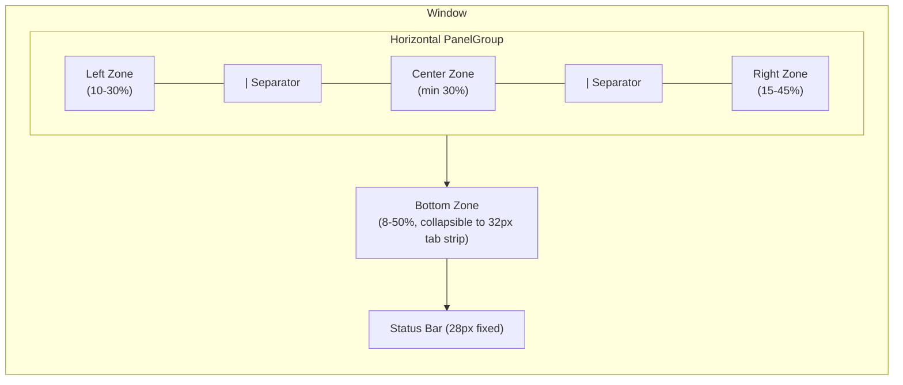

# UI Panel System

Dockable, resizable, IDE-like layout system built with **react-resizable-panels** v4.6.2.

---

## Table of Contents

1. [Overview](#overview)
2. [Zone Architecture](#zone-architecture)
3. [Panel Registry](#panel-registry)
4. [Layout Presets](#layout-presets)
5. [State Management](#state-management)
6. [Lock/Unlock System](#lockunlock-system)
7. [ResizableLayout Component](#resizablelayout-component)
8. [CSS Integration](#css-integration)
9. [Testing](#testing)

---

## Overview

The Panel System replaces the original fixed `Sidebar + SidebarInset` layout with a fully
resizable, zone-based layout inspired by VS Code and JetBrains IDEs. Users can resize zones,
switch between layout presets, toggle individual panels on and off, and lock the layout to
prevent accidental changes.

```
+-------+--------------------+--------+
|       |                    |        |
| Left  |      Center        | Right  |   <-- Horizontal PanelGroup
| Zone  |       Zone         |  Zone  |
|       |                    |        |
+-------+--------------------+--------+
|            Bottom Zone               |   <-- Below horizontal group
+--------------------------------------+
|            Status Bar (28px)         |   <-- Fixed height, always visible
+--------------------------------------+
```

### File inventory

| File | Purpose |
|------|---------|
| `PanelSystem/types.ts` | TypeScript types, constants (`LAYOUT_STORAGE_KEY`, heights) |
| `PanelSystem/PanelRegistry.tsx` | Central catalog of all 9 dockable panels |
| `PanelSystem/PanelLayoutPresets.tsx` | 5 named layout presets (Focus, Standard, Full, Agent, Custom) |
| `PanelSystem/PanelSystemProvider.tsx` | React context provider -- global layout state + actions |
| `PanelSystem/PanelContainer.tsx` | Per-panel wrapper with header, drag grip, min/max/close buttons |
| `PanelSystem/PanelToolbar.tsx` | StatusBar widget -- preset selector, lock toggle, panel toggles |
| `PanelSystem/index.ts` | Barrel re-exports for clean imports |
| `ResizableLayout.tsx` | Main orchestrator -- `Group`, `Panel`, `Separator` from react-resizable-panels |
| `zones/LeftZone.tsx` | Wraps AppSidebar |
| `zones/CenterZone.tsx` | Wraps React Router Outlet (always visible) |
| `zones/RightZone.tsx` | Tabbed right panel (Agent, SuperGoose, Search, Bookmarks) |
| `zones/BottomZone.tsx` | Collapsible bottom panel (Pipeline, Terminal, Logs) |
| `zones/StatusBar.tsx` | Fixed 28px bar at window bottom, hosts PanelToolbar |

All source files live under:

```
ui/desktop/src/components/Layout/
  PanelSystem/
    types.ts
    PanelRegistry.tsx
    PanelLayoutPresets.tsx
    PanelSystemProvider.tsx
    PanelContainer.tsx
    PanelToolbar.tsx
    index.ts
  ResizableLayout.tsx
  zones/
    LeftZone.tsx
    CenterZone.tsx
    RightZone.tsx
    BottomZone.tsx
    StatusBar.tsx
```

---

## Zone Architecture

The layout is divided into four zones plus a fixed status bar:

| Zone | Orientation | Required | Default Panels |
|------|-------------|----------|----------------|
| **Left** | Vertical strip | No | `sidebar` |
| **Center** | Main content | Yes (always visible) | `chat` |
| **Right** | Vertical strip, tabbed | No | `agentPanel`, `superGoose`, `search`, `bookmarks` |
| **Bottom** | Horizontal strip, tabbed | No | `pipeline`, `terminal`, `logs` |
| **StatusBar** | Fixed 28px strip | Yes (always visible) | PanelToolbar + chat controls |

### Zone layout relationship



### Zone state model

Each zone tracks its runtime state via the `ZoneState` interface:

```typescript
interface ZoneState {
  panels: PanelId[];       // Which panels are docked here, in tab order
  sizePercent: number;     // Current size as % of parent PanelGroup
  collapsed: boolean;      // Whether this zone is collapsed to 0-width/height
  visible: boolean;        // Whether this zone renders at all
  activePanel?: PanelId;   // Which tab is active (for multi-panel zones)
}
```

**Center zone invariant:** The center zone can never be collapsed, hidden, or have its
`chat` panel removed. It always remains visible with `minSize={30}`.

---

## Panel Registry

All dockable panels are registered in `PANEL_REGISTRY` (type `Record<PanelId, PanelConfig>`).
Components use `LazyPlaceholder` stubs that are resolved at render time by the zone containers
to avoid circular dependency issues.

| id | title | icon | defaultZone | minSize% | maxSize% | collapsible | closable | order |
|----|-------|------|-------------|----------|----------|-------------|----------|-------|
| `sidebar` | Sidebar | `PanelLeft` | left | 10 | 30 | true | **false** | 0 |
| `chat` | Chat | `MessageSquare` | center | 30 | -- | **false** | **false** | 0 |
| `pipeline` | Pipeline | `Workflow` | bottom | 8 | 40 | true | true | 0 |
| `terminal` | Terminal | `TerminalSquare` | bottom | 10 | 50 | true | true | 1 |
| `logs` | Logs | `ScrollText` | bottom | 8 | 40 | true | true | 2 |
| `agentPanel` | Agent | `Bot` | right | 15 | 40 | true | true | 0 |
| `superGoose` | Super-Goose | `Sparkles` | right | 15 | 45 | true | true | 1 |
| `search` | Search | `Search` | right | 15 | 35 | true | true | 2 |
| `bookmarks` | Bookmarks | `Bookmark` | right | 15 | 35 | true | true | 3 |

**9 panels total.** `sidebar` and `chat` are permanent (not closable). The other 7 can be
toggled on/off via the PanelToolbar.

### Helper functions

| Function | Signature | Purpose |
|----------|-----------|---------|
| `getPanelsForZone` | `(zone) => PanelConfig[]` | All panels for a zone, sorted by `order` |
| `getPanelConfig` | `(id) => PanelConfig \| undefined` | Lookup by panel ID |
| `getAllPanelIds` | `() => PanelId[]` | All registered IDs |
| `getToggleablePanels` | `() => PanelConfig[]` | Closable panels for the toolbar toggle list |

---

## Layout Presets

Five named presets let users instantly switch between common layouts.

| Preset | id | Icon | Left | Center | Right | Bottom | Use case |
|--------|----|------|------|--------|-------|--------|----------|
| **Focus** | `focus` | `Maximize` | hidden | 100% (chat) | hidden | hidden | Distraction-free chat |
| **Standard** | `standard` | `Layout` | 15% (sidebar) | 85% (chat) | hidden | 25% (pipeline) | Default layout |
| **Full** | `full` | `LayoutDashboard` | 15% (sidebar) | 50% (chat) | 35% (agentPanel) | 30% (pipeline, terminal) | All panels visible |
| **Agent** | `agent` | `Bot` | 12% (sidebar) | 53% (chat) | 35% (agentPanel, superGoose) | 25% (pipeline) | Multi-agent workflows |
| **Custom** | `custom` | `Settings2` | user-saved | user-saved | user-saved | user-saved | Persisted personal layout |

The `standard` preset is the default on first load (`DEFAULT_PRESET_ID = 'standard'`).
The `custom` preset falls back to Standard zone configuration if no saved layout exists.

### Preset detail: Standard

```
+----------+---------------------------+
| sidebar  |          chat             |
|  (15%)   |          (85%)            |
|          |                           |
+----------+---------------------------+
|        pipeline (25%)                |
+--------------------------------------+
|          Status Bar                  |
+--------------------------------------+
```

### Preset detail: Agent

```
+--------+---------------------+-----------+
|sidebar |       chat          | agentPanel|
| (12%)  |       (53%)         | superGoose|
|        |                     |   (35%)   |
+--------+---------------------+-----------+
|           pipeline (25%)                  |
+-------------------------------------------+
|            Status Bar                     |
+-------------------------------------------+
```

### Helper functions

| Function | Signature | Purpose |
|----------|-----------|---------|
| `getPresetById` | `(id) => LayoutPreset \| undefined` | Lookup preset by ID |
| `getDefaultPreset` | `() => LayoutPreset` | Returns `PRESET_STANDARD` |
| `buildZonesFromPreset` | `(preset, overrides?) => Record<LayoutZone, ZoneState>` | Create zone config with optional partial overrides |

---

## State Management

### PanelSystemProvider

The `PanelSystemProvider` is a React context provider that wraps the entire application.
It holds the full `LayoutState`, exposes mutation actions, and persists to localStorage.

```typescript
interface LayoutState {
  zones: Record<LayoutZone, ZoneState>;  // left, center, right, bottom
  presetId: string;                       // 'focus' | 'standard' | 'full' | 'agent' | 'custom'
  locked: boolean;                        // Whether resize handles are active
}
```

### Initialization priority

1. `initialLayout` prop (if provided -- used in tests)
2. `localStorage.getItem('sg-layout-v1')` (persisted layout from previous session)
3. `buildDefaultLayout()` (Standard preset, locked=true)

### localStorage persistence

- **Key:** `sg-layout-v1` (constant `LAYOUT_STORAGE_KEY`)
- **Debounce:** 300ms via `setTimeout` in a `useEffect` that watches `layout`
- **Format:** Full `LayoutState` JSON
- **Error handling:** Silently fails if localStorage is full or unavailable

### Context value

The `usePanelSystem()` hook returns the `PanelSystemContextValue`:

```typescript
interface PanelSystemContextValue extends PanelSystemActions {
  layout: LayoutState;                                    // Current snapshot
  isLocked: boolean;                                      // Convenience alias
  panels: Record<PanelId, PanelConfig>;                   // Full registry
  presets: LayoutPreset[];                                // All 5 presets
  isPanelVisible: (panelId: PanelId) => boolean;          // Query
  getPanelZone: (panelId: PanelId) => LayoutZone | null;  // Query
}
```

### Actions

| Action | Signature | Behavior |
|--------|-----------|----------|
| `updateZone` | `(zone, Partial<ZoneState>)` | Partial merge, marks preset as `custom` |
| `toggleZoneCollapsed` | `(zone)` | Flips `collapsed` flag, marks `custom` |
| `toggleZoneVisible` | `(zone)` | Flips `visible` flag, marks `custom` |
| `setActivePanel` | `(zone, panelId)` | Sets the active tab within a zone |
| `movePanel` | `(panelId, from, to)` | Moves a panel between zones, auto-shows target zone |
| `togglePanel` | `(panelId)` | Adds/removes panel; hides empty zones (except center) |
| `applyPreset` | `(presetId)` | Loads preset zones; for `custom`, loads from localStorage |
| `toggleLocked` | `()` | Toggles layout lock state |
| `setLocked` | `(boolean)` | Sets lock state directly |
| `resetLayout` | `()` | Resets to Standard preset, locked=true |
| `saveCustomLayout` | `()` | Marks current layout as `custom` (triggers persist via effect) |
| `handlePanelResize` | `(sizes[])` | Maps `PanelGroup.onLayout` callback sizes to zone percentages |

**Key behavior:** Any zone modification (update, toggle, move) automatically sets
`presetId` to `'custom'`, preserving the user's intent that they have deviated from a
named preset.

---

## Lock/Unlock System

The layout starts in **locked** mode by default.

| State | Resize handles | Drag grip | Panel toggles | Preset selector | Save behavior |
|-------|----------------|-----------|---------------|-----------------|---------------|
| **Locked** | Hidden (1px border line) | Hidden | Hidden | Visible | No resize events |
| **Unlocked** | Visible (`Separator` component, cursor changes) | Visible (`GripVertical` icon) | Visible in StatusBar | Visible | Debounced 300ms to localStorage |

### Locked mode

When locked, the `ResizeHandle` component renders a simple `<div>` with `w-px` or `h-px`
styling instead of the interactive `<Separator>` from react-resizable-panels. The
`PanelContainer` header hides the drag grip, and the `PanelToolbar` hides the "Panels"
dropdown toggle list.

### Unlocked mode

When unlocked:
- `<Separator>` components appear with `cursor-col-resize` / `cursor-row-resize`
- Hover effect widens the separator from 4px to 6px with an accent-colored indicator dot
- `PanelContainer` shows a `GripVertical` icon for future drag-and-drop support
- The PanelToolbar shows a "Panels" dropdown with visibility toggles for all closable panels
- Each toggle shows a green/gray dot indicating current visibility

### StatusBar toggle

The lock button in the StatusBar shows:
- `Lock` icon + "Locked" text when locked
- `Unlock` icon + "Unlocked" text (with highlighted background) when unlocked
- Tooltip: `Unlock layout (Ctrl+Shift+L)` / `Lock layout (Ctrl+Shift+L)`

---

## ResizableLayout Component

`ResizableLayout` is the main orchestrator component that composes the zone layout using
three primitives from `react-resizable-panels`:

| Primitive | react-resizable-panels export | Usage |
|-----------|-------------------------------|-------|
| `Group` | `PanelGroup` (aliased as `Group`) | Container for horizontally-split panels |
| `Panel` | `Panel` | A resizable panel within a group |
| `Separator` | `PanelResizeHandle` (aliased as `Separator`) | Draggable divider between panels |

### Component tree

```
ResizableLayout
  div.flex.flex-col.h-full.w-full
    div.flex-1.min-h-0
      Group (orientation="horizontal", id="sg-main-horizontal")
        Panel (id="left-zone")    -- conditional on left.visible
          LeftZone > leftContent (AppSidebar)
        ResizeHandle (horizontal)
        Panel (id="center-zone")  -- always rendered
          CenterZone > centerContent (Outlet)
        ResizeHandle (horizontal)
        Panel (id="right-zone")   -- conditional on right.visible && right.panels.length > 0
          RightZone (tabbed panel container)
    BottomZone                    -- conditional on bottom.visible && bottom.panels.length > 0
    StatusBar                     -- always rendered
```

### Props

| Prop | Type | Description |
|------|------|-------------|
| `leftContent` | `ReactNode` | AppSidebar content |
| `centerContent` | `ReactNode` | Router Outlet + ChatSessionsContainer |
| `rightPanelComponents` | `Partial<Record<PanelId, ReactNode>>` | Panel components for the right zone |
| `bottomPanelComponents` | `Partial<Record<PanelId, ReactNode>>` | Panel components for the bottom zone |
| `statusBarContent` | `ReactNode` | Extra status bar items (model bar, cost tracker, etc.) |
| `className` | `string` | Additional CSS classes |

### Panel constraints

| Zone | Panel ID | minSize | maxSize | collapsible | collapsedSize |
|------|----------|---------|---------|-------------|---------------|
| Left | `left-zone` | 10 | 30 | true | 0 |
| Center | `center-zone` | 30 | -- | -- | -- |
| Right | `right-zone` | 15 | 45 | true | 0 |

The Bottom zone renders outside the horizontal `Group` and manages its own height via
the `BottomZone` component (collapsible to a 32px tab strip).

### Zone components

**LeftZone** -- Simple wrapper (`div.h-full.overflow-hidden.flex.flex-col`) for AppSidebar.

**CenterZone** -- Simple wrapper (`div.h-full.overflow-hidden.flex.flex-col.min-w-0`) for the
Router Outlet. Cannot be collapsed or closed.

**RightZone** -- Tabbed container. When multiple panels exist in the right zone, a tab strip
appears at the top. Each tab shows the panel's Lucide icon and title. Clicking a tab calls
`setActivePanel('right', panelId)`.

**BottomZone** -- Collapsible tabbed container. Features:
- Always shows a 32px tab strip (`BOTTOM_TAB_STRIP_HEIGHT`)
- Tabs for each panel with icon + title
- Clicking a tab when collapsed auto-expands the zone
- Chevron toggle button for collapse/expand
- Panel content area hidden when collapsed

**StatusBar** -- Fixed 28px bar (`STATUS_BAR_HEIGHT`). Contains:
- Left side: Chat-specific controls passed as `children` (working directory, cost, model, mode, extensions)
- Right side: `PanelToolbar` (preset selector, lock toggle, panel toggles)

### PanelContainer

Wraps individual panels with a 32px header (`PANEL_HEADER_HEIGHT`):
- Drag grip (`GripVertical`) -- only when unlocked
- Panel icon + title
- Action buttons: Minimize (`Minimize2`), Maximize (`Maximize2`), Close (`X`)
- Header is hidden for the center zone when locked (keeps chat clean)

### PanelToolbar

Renders in the StatusBar. Three sections:
1. **Preset selector** -- Dropdown showing all 5 presets with icons and descriptions,
   plus a "Reset to default" option
2. **Lock toggle** -- Button with `Lock`/`Unlock` icon
3. **Panel toggles** (only when unlocked) -- Dropdown listing all closable panels with
   green/gray visibility dots

---

## CSS Integration

### Design token system

The Panel System uses the stock Goose design tokens for its own styling:

| Token pattern | Example usage |
|---------------|---------------|
| `bg-background-default` | Panel and zone backgrounds |
| `bg-background-muted` | Tab strips, panel headers |
| `bg-background-medium` | Hover states |
| `border-border-default` | Zone separators, panel borders |
| `text-text-default` | Active tab text |
| `text-text-muted` | Inactive tab text, icons |
| `bg-accent` | Resize handle hover color |

### Tailwind CSS v4

All styling uses Tailwind utility classes. Key patterns:

- `flex flex-col h-full w-full min-h-0` -- Standard zone container
- `flex-1 min-h-0 overflow-auto` -- Content area within a zone
- `shrink-0` -- Fixed-height elements (tab strips, headers, status bar)
- `transition-colors duration-150` -- Smooth hover/active transitions
- `cursor-col-resize` / `cursor-row-resize` -- Resize handle cursors
- `select-none` -- Prevent text selection in headers/tab strips

### Dual color system

The Panel System supports the Super-Goose dual color scoping:

- **Stock Goose panels** (sidebar, chat, pipeline, terminal, logs) use standard
  `bg-background-*`, `text-text-*`, `border-border-*` tokens
- **Super-Goose panels** (superGoose, agentPanel) use `sg-*` tokens when rendered
  inside `[data-super="true"]` containers. These tokens are defined in `main.css`
  and scoped to `.super-goose-panel` selectors

This ensures the stock Goose color scheme remains untouched while Super-Goose panels
get their own dark theme with gold, indigo, and emerald accent colors.

### Constants

| Constant | Value | Usage |
|----------|-------|-------|
| `STATUS_BAR_HEIGHT` | 28px | Status bar fixed height |
| `PANEL_HEADER_HEIGHT` | 32px | Per-panel header bar |
| `BOTTOM_TAB_STRIP_HEIGHT` | 32px | Bottom zone tab strip when collapsed |
| `LAYOUT_STORAGE_KEY` | `'sg-layout-v1'` | localStorage persistence key |
| `DEFAULT_PRESET_ID` | `'standard'` | Initial preset on first load |

---

## Testing

Tests live in `ui/desktop/src/components/Layout/__tests__/` and use Vitest + React Testing Library.

### Test files and counts

| Test file | Tests | What it covers |
|-----------|-------|----------------|
| `PanelSystemProvider.test.tsx` | 24 | Context initialization, lock/unlock, zone actions, panel toggle, preset application, localStorage persistence, initial layout override, error when used outside provider |
| `PanelRegistry.test.tsx` | 15 | 9-panel registration, zone grouping, sort order, panel lookup, closable/collapsible flags, icon and title validation, minSizePercent validation |
| `PanelLayoutPresets.test.tsx` | 13 | 5-preset validation, zone visibility per preset, size invariants, center zone never collapsed, preset lookup, default preset, `buildZonesFromPreset` with overrides |
| `AppLayout.test.tsx` | 12 | Provider hierarchy rendering, ResizableLayout mount, AppSidebar in left zone, Outlet rendering, TimeWarpBar, sidebar trigger, new window button, session selection navigation |
| **Total** | **64** | |

### Running the tests

```bash
cd ui/desktop
npx vitest run --reporter=verbose src/components/Layout/__tests__/
```

### Test patterns

**PanelSystemProvider tests** use `renderHook` from `@testing-library/react` with a
provider wrapper. localStorage is mocked with `vi.fn()` spies. Debounced persistence
is tested with `vi.waitFor()` with a 500ms timeout.

**PanelRegistry tests** are pure function tests -- no React rendering needed. They
validate the static `PANEL_REGISTRY` object and its helper functions.

**PanelLayoutPresets tests** are also pure function tests validating each preset's
zone configuration and helper functions.

**AppLayout tests** mock all external dependencies (react-router-dom, contexts, sidebar,
PanelSystem, lucide-react icons) and verify the component hierarchy renders correctly.
