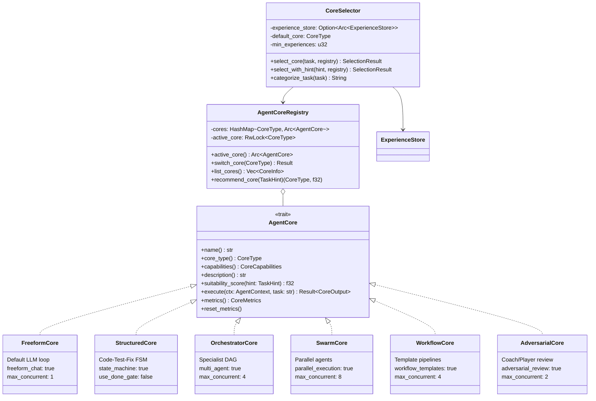
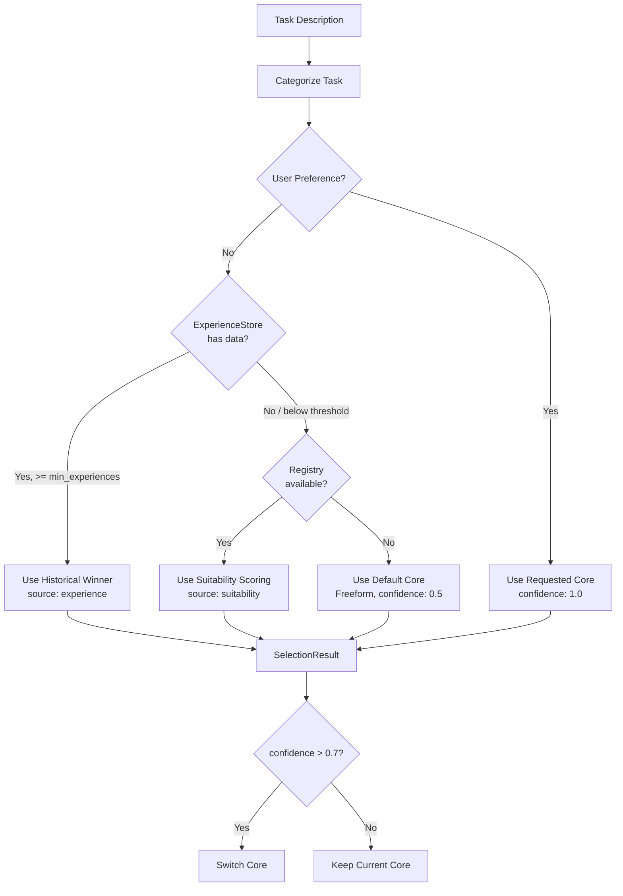
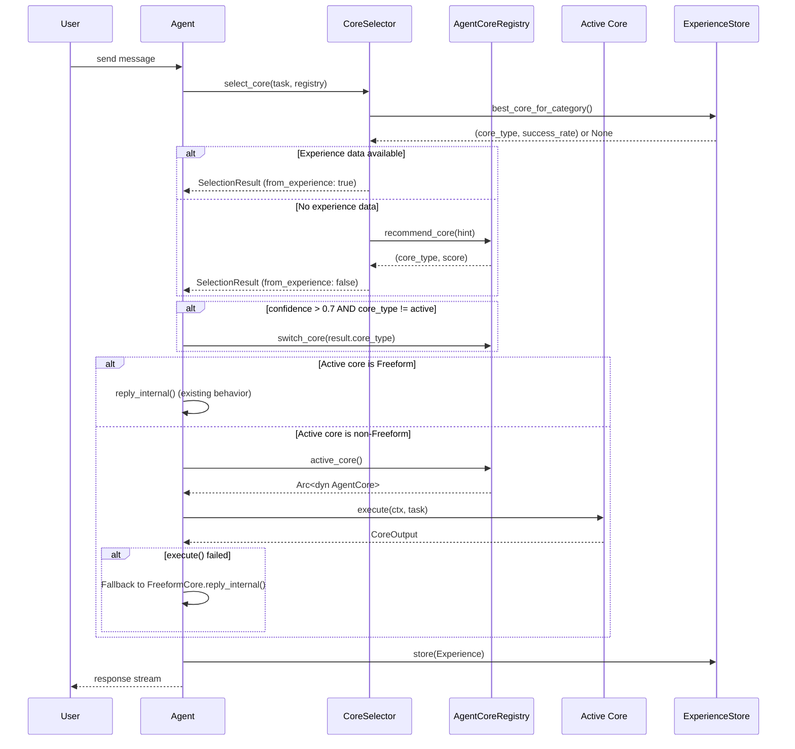
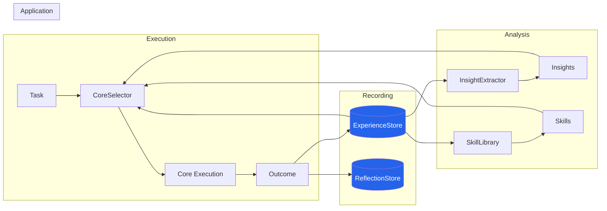

# Agentic Cores System

## Overview

Super-Goose implements a **6-core agentic system** that provides hot-swappable execution strategies for different task types. Each core wraps a distinct subsystem and exposes a unified `AgentCore` trait interface, enabling the agent to dynamically select and switch between execution strategies at runtime.

The system is built on three pillars:

1. **AgentCore trait** -- the uniform interface every core implements
2. **AgentCoreRegistry** -- runtime management and hot-swap via `/core` commands
3. **CoreSelector** -- automatic core selection using historical experience data and suitability scoring



---

## AgentCore Trait

Every execution core implements the `AgentCore` trait, defined in `crates/goose/src/agents/core/mod.rs`. The trait is `Send + Sync` and uses `async_trait` for async execution.

```rust
#[async_trait]
pub trait AgentCore: Send + Sync {
    fn name(&self) -> &str;
    fn core_type(&self) -> CoreType;
    fn capabilities(&self) -> CoreCapabilities;
    fn description(&self) -> &str;
    fn suitability_score(&self, hint: &TaskHint) -> f32;
    async fn execute(&self, ctx: &mut AgentContext, task: &str) -> Result<CoreOutput>;
    fn metrics(&self) -> CoreMetrics;
    fn reset_metrics(&self);
}
```

### Key Types

| Type | Purpose |
|------|---------|
| `CoreType` | Enum: `Freeform`, `Structured`, `Orchestrator`, `Swarm`, `Workflow`, `Adversarial` |
| `CoreCapabilities` | Struct of booleans describing what a core can do (code gen, testing, multi-agent, etc.) |
| `CoreOutput` | Execution result: `completed`, `summary`, `turns_used`, `artifacts`, `metrics` |
| `AgentContext` | Shared state passed to cores: provider, extensions, cost tracker, conversation, working dir |
| `TaskHint` | Describes a task for suitability scoring: category, estimated file count, parallelism hints |
| `TaskCategory` | Enum: `General`, `CodeTestFix`, `MultiFileComplex`, `LargeRefactor`, `Review`, `DevOps`, `Documentation`, `Pipeline` |
| `CoreMetrics` | Atomic counters for executions, success/fail, turns, cost, time |
| `CoreMetricsSnapshot` | Serializable point-in-time snapshot of `CoreMetrics` |

### CoreType Parsing

`CoreType` supports lenient string parsing with aliases:

| CoreType | Accepted Strings |
|----------|-----------------|
| `Freeform` | `freeform`, `free`, `chat`, `auto` |
| `Structured` | `structured`, `struct`, `graph`, `ctf`, `code-test-fix` |
| `Orchestrator` | `orchestrator`, `orch`, `multi` |
| `Swarm` | `swarm`, `parallel` |
| `Workflow` | `workflow`, `wf`, `template`, `pipeline` |
| `Adversarial` | `adversarial`, `adv`, `coach`, `review` |

---

## Core Implementations

### Summary Table

| Core | Best For | Key Capability | Suitability Peak | Max Concurrent |
|------|----------|----------------|-------------------|----------------|
| **FreeformCore** | General chat, research, open-ended tasks | `freeform_chat` | General (0.9) | 1 |
| **StructuredCore** | Deterministic code-test-fix loops | `state_machine` | CodeTestFix (0.95) | 1 |
| **OrchestratorCore** | Complex multi-file with specialists | `multi_agent` | MultiFileComplex (0.95) | 4 |
| **SwarmCore** | Large-scale parallel refactoring | `parallel_execution` | LargeRefactor (0.95) | 8 |
| **WorkflowCore** | CI/CD, deploy, template pipelines | `workflow_templates` | Pipeline (0.95) | 4 |
| **AdversarialCore** | Code review, security audits | `adversarial_review` | Review (0.95) | 2 |

---

### FreeformCore

**File:** `crates/goose/src/agents/core/freeform.rs`

The default core. Wraps the Agent's existing `reply_internal()` loop, giving the LLM full autonomy to decide tool usage, iteration count, and strategy. This is "classic Goose" behavior with all subsystems active: reflexion, guardrails, memory, HITL, compaction, and checkpointing.

**Capabilities:**
- Code generation, testing, freeform chat, persistent learning
- No multi-agent, no parallel execution, no state machine

**Suitability Scores:**
| Category | Score |
|----------|-------|
| General | 0.9 |
| Documentation | 0.8 |
| CodeTestFix | 0.5 |
| DevOps | 0.5 |
| MultiFileComplex | 0.4 |
| Review | 0.4 |
| LargeRefactor | 0.3 |
| Pipeline | 0.3 |

---

### StructuredCore

**File:** `crates/goose/src/agents/core/structured.rs`

Wraps the `state_graph::StateGraph` to provide a deterministic **Code --> Test --> Fix** loop with optional DoneGate validation. Ideal for well-defined coding tasks where the goal is clear.

**Configuration:**
- `max_iterations: 10`
- `max_fix_attempts: 3`
- `use_done_gate: false` -- DoneGate runs shell commands which hang in test environments; callbacks handle pass/fail instead

**Execution Flow:**
1. Detect project type from task keywords or working directory (Rust/Python/Node)
2. Create `StateGraph` with configuration
3. Run the graph with three callbacks: `generate_code`, `run_tests`, `fix_failures`
4. Collect artifacts (generated files, fixed files)
5. Return success/failure with iteration count

**Suitability Scores:**
| Category | Score |
|----------|-------|
| CodeTestFix | 0.95 |
| MultiFileComplex | 0.5 |
| LargeRefactor | 0.4 |
| Pipeline | 0.4 |
| General | 0.3 |
| Review | 0.3 |
| Documentation | 0.2 |
| DevOps | 0.2 |

---

### OrchestratorCore

**File:** `crates/goose/src/agents/core/orchestrator_core.rs`

Wraps `AgentOrchestrator` to decompose complex tasks into a **DAG of specialist sub-tasks**, then coordinates execution with dependency tracking and handoffs.

**Specialist Roles:** `Code`, `Test`, `Security`, `Docs`, `Deploy`

**Task Decomposition** (heuristic, keyword-based):
- Code tasks auto-include a Test dependency
- Security review depends on Code completion
- Docs depend on Code and Test completion
- Deploy depends on everything else

**Execution Flow:**
1. Decompose task into specialist sub-tasks with dependency graph
2. Create orchestrator workflow with UUID task tracking
3. Add tasks with dependency edges
4. Start workflow and execute task loop
5. Track `WorkflowStatus::Completed` or iteration limit

**Suitability Scores:**
| Category | Score |
|----------|-------|
| MultiFileComplex | 0.95 |
| DevOps | 0.8 |
| LargeRefactor | 0.7 |
| Pipeline | 0.7 |
| CodeTestFix | 0.6 |
| Review | 0.5 |
| Documentation | 0.4 |
| General | 0.3 |

---

### SwarmCore

**File:** `crates/goose/src/agents/core/swarm_core.rs`

Wraps `Swarm` + `BatchProcessor` + `TeamCoordinator` to distribute work across multiple agents running **in parallel**, with inter-agent communication and conflict detection.

**Swarm Roles:** `Architect`, `Coder`, `Tester`, `Reviewer`, `Documenter`, `SecurityAnalyst`, `Deployer`, `Researcher`, `Coordinator`

**Configuration:**
- `max_agents: 10`
- `routing: SkillBased`
- `inter_agent_communication: true`
- `task_timeout: 300s`
- `min_performance: 0.5`

**Parallelism Bonus:** Tasks with `benefits_from_parallelism: true` get a +0.15 suitability boost.

**Execution Flow:**
1. Decompose task into parallelizable sub-tasks with role assignment
2. Create swarm with SkillBased routing
3. Create agents for required roles (deduplicated)
4. Route tasks to agents by capability matching
5. Execute via BatchProcessor with concurrency of 4
6. Collect per-role results and metrics

**Suitability Scores:**
| Category | Base Score | With Parallelism |
|----------|-----------|-----------------|
| LargeRefactor | 0.95 | 1.0 |
| MultiFileComplex | 0.7 | 0.85 |
| Review | 0.5 | 0.65 |
| Documentation | 0.5 | 0.65 |
| CodeTestFix | 0.4 | 0.55 |
| Pipeline | 0.4 | 0.55 |
| DevOps | 0.3 | 0.45 |
| General | 0.2 | 0.35 |

---

### WorkflowCore

**File:** `crates/goose/src/agents/core/workflow_core.rs`

Wraps `WorkflowEngine` to execute predefined **workflow templates** (FullStack, Microservice, ComprehensiveTesting, etc.) with task dependency management and progress tracking.

**Template Matching:**
| Task Pattern | Template |
|-------------|----------|
| "fullstack", "webapp" | `fullstack_webapp` |
| "microservice", "service", "api" | `microservice` |
| "comprehensive test", "test suite" | `comprehensive_testing` |
| "deploy", "release", "ci", "pipeline" | `microservice` |
| "test", "verify", "validate" | `comprehensive_testing` |
| (default) | `fullstack_webapp` |

**Language/Framework Detection:** Automatically detects Rust, Python, TypeScript, Java, Go and their frameworks (React, Vue, Actix, Django, Express, Spring) from task description.

**Execution Flow:**
1. Match task to workflow template
2. Build execution config with language/framework detection
3. Create orchestrator and workflow engine
4. Verify template exists, execute workflow
5. Poll execution loop until completion/failure/cancellation
6. Collect artifacts and task-level results

**Suitability Scores:**
| Category | Score |
|----------|-------|
| Pipeline | 0.95 |
| DevOps | 0.9 |
| MultiFileComplex | 0.6 |
| Documentation | 0.6 |
| CodeTestFix | 0.5 |
| LargeRefactor | 0.5 |
| Review | 0.3 |
| General | 0.2 |

---

### AdversarialCore

**File:** `crates/goose/src/agents/core/adversarial_core.rs`

Wraps `ReviewCycle` to execute tasks where a **Player agent** does the work and a **Coach agent** reviews it. Nothing reaches the user without Coach approval (unless max review cycles are exhausted). Supports self-improvement where Player learns from Coach feedback between cycles.

**Quality Levels:**
| Level | Trigger Keywords | Max Cycles |
|-------|-----------------|------------|
| Strict | "production", "security audit", "release", "critical" | 5 |
| Default | (general) | 3 |
| Relaxed | "prototype", "draft", "quick", "rough" | 3 |

**Review Outcomes:** `Approved`, `Rejected`, `MaxCyclesReached`, `Error`

**Execution Flow:**
1. Determine quality level from task keywords
2. Build `AdversarialConfig` with appropriate review cycle count
3. Create `ReviewCycle` and execute with review
4. Player produces work, Coach reviews with quality score and suggestions
5. If not approved, Player incorporates feedback (self-improvement loop)
6. Repeat until approved or max cycles reached
7. Build summary with per-cycle quality scores and improvement trend

**Suitability Scores:**
| Category | Score |
|----------|-------|
| Review | 0.95 |
| CodeTestFix | 0.6 |
| MultiFileComplex | 0.5 |
| LargeRefactor | 0.5 |
| DevOps | 0.4 |
| Documentation | 0.4 |
| General | 0.3 |
| Pipeline | 0.3 |

---

## CoreSelector

**File:** `crates/goose/src/agents/core/selector.rs`

The `CoreSelector` automatically selects the best core for a given task using a three-tier strategy:

### Selection Strategy



### Task Categorization

The selector uses keyword analysis to classify tasks:

| Category | Keywords |
|----------|----------|
| `code-test-fix` | "test" + "fix", "code" + "test", "debug", "bug fix" |
| `large-refactor` | "refactor" + ("all" / "many" / "every" / "entire" / "across") |
| `review` | "review", "security", "audit" |
| `devops` | "deploy", "release", "ci/cd", "pipeline" |
| `documentation` | "doc", "readme", "comment" |
| `general` | "research", "explain", "understand", "help me", or fallback |

### SelectionResult

```rust
pub struct SelectionResult {
    pub core_type: CoreType,       // The selected core
    pub rationale: String,         // Human-readable explanation
    pub from_experience: bool,     // Whether based on historical data
    pub category: String,          // Detected task category
    pub confidence: f64,           // 0.0 - 1.0
}
```

### Selection Sources

| Source | When Used | Confidence |
|--------|----------|------------|
| **User preference** | User explicitly set `/core <name>` | 1.0 (always) |
| **Experience** | ExperienceStore has >= 3 data points for the category | Historical success rate |
| **Suitability** | No experience data, registry available | Static suitability score |
| **Default** | No store, no registry | 0.5 (Freeform) |

### Configuration

- **Default core:** `Freeform`
- **Minimum experiences threshold:** 3 (configurable via `min_experiences`)
- **Confidence threshold for core switch:** 0.7 (in Agent dispatch logic)

---

## AgentCoreRegistry

**File:** `crates/goose/src/agents/core/registry.rs`

The registry manages all core instances and provides runtime hot-swapping.

### Initialization

On creation (`AgentCoreRegistry::new()`), all 6 cores are instantiated and registered. `FreeformCore` is the default active core.

### Commands

| Command | Action |
|---------|--------|
| `/core <name>` | Switch the active core (e.g., `/core structured`) |
| `/cores` | List all registered cores with active marker |

### `/cores` Output Format

```
Available cores:

 > freeform -- Default LLM loop with full autonomy (active)
   structured -- Code-Test-Fix state machine with DoneGate validation
   orchestrator -- Multi-agent orchestrator with specialist DAG
   swarm -- Parallel agent swarm with role specialization
   workflow -- Template workflow engine
   adversarial -- Coach/Player adversarial review

Switch with: /core <name>
Names: freeform, structured, orchestrator, swarm, workflow, adversarial
```

### API

| Method | Description |
|--------|-------------|
| `active_core()` | Get the currently active `Arc<dyn AgentCore>` |
| `active_core_type()` | Get the `CoreType` of the active core |
| `switch_core(CoreType)` | Hot-swap to a different core |
| `get_core(CoreType)` | Get a core without switching |
| `list_cores()` | List all registered cores with info |
| `list_cores_with_metrics()` | List cores with current metric snapshots |
| `recommend_core(TaskHint)` | Auto-select best core using suitability scores |
| `reset_all_metrics()` | Reset metrics for every core |
| `register_core(CoreType, Arc)` | Register a custom core |
| `core_count()` | Number of registered cores |

---

## Core Dispatch in Agent::reply()

When the agent receives a message, the dispatch logic follows this sequence:



**Key behaviors:**
- CoreSelector runs before every dispatch
- Non-freeform cores dispatch through `core.execute()`
- If `execute()` fails, the agent auto-fallbacks to FreeformCore
- Experience data is recorded for both success and failure paths (learning loop closed)

---

## Learning Engine Integration

The learning engine provides cross-session memory that feeds back into core selection.

### Architecture

```mermaid
flowchart TB
    subgraph "Learning Engine"
        ES[ExperienceStore<br>SQLite]
        IE[InsightExtractor<br>ExpeL-style]
        SL[SkillLibrary<br>Voyager-style]
        RS[SqliteReflectionStore<br>Reflexion]
    end

    subgraph "Agent Execution"
        A[Agent::reply] --> CS[CoreSelector]
        CS --> ES
        A --> |records outcome| ES
        A --> |records reflection| RS
    end

    subgraph "Analysis Pipeline"
        ES --> IE
        IE --> |insights| CS
        ES --> SL
        SL --> |skills| A
    end

    subgraph "Commands"
        C1[/experience] --> ES
        C2[/experience stats] --> ES
        C3[/skills] --> SL
        C4[/insights] --> IE
    end
```

### ExperienceStore

**File:** `crates/goose/src/agents/experience_store.rs`

SQLite-backed cross-session storage of task execution outcomes. Each record captures:

| Field | Type | Description |
|-------|------|-------------|
| `experience_id` | String (UUID) | Unique identifier |
| `task` | String | Task description |
| `core_type` | CoreType | Which core was used |
| `succeeded` | bool | Whether the task completed successfully |
| `turns_used` | u32 | Number of turns/iterations |
| `cost_dollars` | f64 | Execution cost |
| `time_ms` | u64 | Wall-clock time |
| `task_category` | String | Detected category (e.g., "code-test-fix") |
| `insights` | Vec\<String\> | Extracted insights |
| `tags` | Vec\<String\> | Searchable tags |
| `created_at` | DateTime\<Utc\> | Timestamp |

**Key method:** `best_core_for_category(category) -> Option<(String, f64)>` -- returns the core with the highest success rate for a category, requiring at least 3 data points.

**Agent integration:** Stored as `Mutex<Option<Arc<ExperienceStore>>>` on the Agent struct. Initialized lazily via `init_learning_stores()` which takes `&self` (interior mutability via Mutex).

### InsightExtractor

**File:** `crates/goose/src/agents/insight_extractor.rs`

ExpeL-style pattern analysis across accumulated experiences. Extracts actionable insights in these categories:

| Category | Description |
|----------|-------------|
| `CoreSelection` | Which core to use for which task type |
| `FailurePattern` | Patterns that lead to failures |
| `Optimization` | Cost/time optimization strategies |
| `TaskDecomposition` | Decomposition patterns that lead to success |
| `BestPractice` | General best practices |

Each `Insight` includes confidence (0.0-1.0), evidence count, applicable categories, and related core type.

### SkillLibrary

**File:** `crates/goose/src/agents/skill_library.rs`

Voyager-style reusable strategy library. A `Skill` represents a learned approach with:

- Name, description, recommended core
- Step-by-step approach (ordered list)
- Preconditions (when to use)
- Task patterns (keyword matching)
- Use/attempt counts and success rate
- **Verified status** -- only skills that have been used successfully are retrievable

**Key design:** Only verified skills are returned during retrieval, preventing untested strategies from being applied to production tasks.

### SqliteReflectionStore

Persistent storage for Reflexion loop data, enabling the agent to learn from self-reflection across sessions.

### Commands

| Command | Description |
|---------|-------------|
| `/experience` | Show recent experiences |
| `/experience stats` | Show aggregate statistics per core per category |
| `/skills` | List verified skills from the SkillLibrary |
| `/insights` | Show extracted insights from the InsightExtractor |

---

## Learning Feedback Loop



The feedback loop operates as follows:

1. **Task arrives** -- CoreSelector queries ExperienceStore for the best core
2. **Core executes** -- Selected core processes the task
3. **Outcome recorded** -- Success/failure, cost, time, turns stored in ExperienceStore
4. **Insights extracted** -- InsightExtractor analyzes patterns across experiences
5. **Skills learned** -- Successful strategies saved to SkillLibrary (verified on use)
6. **Future tasks benefit** -- CoreSelector uses accumulated data for better selection

---

## AgentContext

**File:** `crates/goose/src/agents/core/context.rs`

The `AgentContext` struct is passed to every core during execution, providing access to shared Agent state without the core owning the Agent:

| Field | Type | Description |
|-------|------|-------------|
| `provider` | `SharedProvider` | LLM provider (shared, swappable) |
| `extension_manager` | `Arc<ExtensionManager>` | Tool/extension access |
| `cost_tracker` | `Arc<CostTracker>` | Budget enforcement |
| `conversation` | `Conversation` | Current conversation history |
| `session_id` | `String` | Session identifier |
| `working_dir` | `PathBuf` | Working directory for file operations |
| `cancel_token` | `Option<CancellationToken>` | Graceful shutdown |
| `system_prompt` | `String` | Base + injected context |
| `metadata` | `HashMap<String, String>` | Core-specific arbitrary state |

Helper methods: `is_cancelled()`, `is_over_budget()`.

---

## CoreMetrics

**File:** `crates/goose/src/agents/core/metrics.rs`

Thread-safe atomic counters for tracking core performance:

| Metric | Type | Description |
|--------|------|-------------|
| `total_executions` | AtomicU32 | Total runs |
| `successful` | AtomicU32 | Successful completions |
| `failed` | AtomicU32 | Failed executions |
| `total_turns` | AtomicU64 | Sum of all turns |
| `total_cost_microdollars` | AtomicU64 | Sum of cost (1 microdollar = $0.000001) |
| `total_time_ms` | AtomicU64 | Sum of wall-clock time |

`CoreMetricsSnapshot` provides a serializable view with computed averages (success_rate, avg_turns, avg_cost_dollars, avg_time_ms).

---

## File Inventory

All core system files reside in `crates/goose/src/agents/core/`:

| File | Purpose |
|------|---------|
| `mod.rs` | `AgentCore` trait, `CoreType` enum, `CoreCapabilities`, `CoreOutput` |
| `context.rs` | `AgentContext`, `TaskHint`, `TaskCategory` |
| `freeform.rs` | `FreeformCore` -- default LLM loop |
| `structured.rs` | `StructuredCore` -- Code-Test-Fix FSM |
| `orchestrator_core.rs` | `OrchestratorCore` -- specialist DAG |
| `swarm_core.rs` | `SwarmCore` -- parallel agents |
| `workflow_core.rs` | `WorkflowCore` -- template pipelines |
| `adversarial_core.rs` | `AdversarialCore` -- Coach/Player review |
| `registry.rs` | `AgentCoreRegistry` -- hot-swap management |
| `selector.rs` | `CoreSelector` -- auto-selection logic |
| `metrics.rs` | `CoreMetrics`, `CoreMetricsSnapshot` |

Learning engine files in `crates/goose/src/agents/`:

| File | Purpose |
|------|---------|
| `experience_store.rs` | `ExperienceStore` -- SQLite cross-session learning |
| `insight_extractor.rs` | `InsightExtractor` -- ExpeL-style pattern analysis |
| `skill_library.rs` | `SkillLibrary` -- Voyager-style reusable strategies |
| `reflexion.rs` | `SqliteReflectionStore` -- persistent Reflexion data |

---

## Test Coverage

**Total: 139 tests (87 core + 52 learning)**

### Core Tests (87)

| Module | Tests | Key Assertions |
|--------|-------|----------------|
| `mod.rs` | 4 | CoreType display, parsing, all(), capabilities default |
| `context.rs` | 6 | TaskHint categorization, AgentContext cancellation |
| `freeform.rs` | 3 | Basics, suitability scoring, description |
| `structured.rs` | 9 | Basics, suitability, project type detection, code gen, test execution, full execute, metrics |
| `orchestrator_core.rs` | 12 | Basics, suitability, decomposition (6 cases), execute (3 variants), metrics |
| `swarm_core.rs` | 9 | Basics, suitability parallelism bonus, decomposition (3 cases), agent dedup, execute (2 variants), metrics |
| `workflow_core.rs` | 11 | Basics, suitability, template matching (4 cases), config building (2 cases), execute, metrics |
| `adversarial_core.rs` | 11 | Basics, suitability, quality levels (3 cases), config building (3 cases), execute (2 variants), metrics |
| `registry.rs` | 8 | Default core, switch, list, count, recommend (2 cases), format list, get_core |
| `selector.rs` | 11 | Default fallback, categorization (3 cases), experience-based, registry fallback, TaskHint, threshold, format, user override, category mapping, edge cases |
| `metrics.rs` | 4 | Record + snapshot, reset, display, empty |

### Learning Engine Tests (52)

| Module | Tests | Key Assertions |
|--------|-------|----------------|
| `experience_store.rs` | 11 | Store/retrieve, category query, best core, stats, tags, insights, time range |
| `insight_extractor.rs` | 7 | Core selection insights, failure patterns, optimization, empty data, mixed data |
| `skill_library.rs` | 7 | Store/retrieve, verified-only retrieval, use count tracking, keyword matching, success rate |
| `reflexion.rs` | 7 | Store/retrieve reflection data, session queries, persistence |
| Planner tests | 13 | LlmPlanner with SharedProvider, CriticManager integration, fallback to SimplePatternPlanner |
| Other learning | 7 | SqliteReflectionStore persistence, cross-session data |

All 139 tests pass: `cargo test --lib -p goose -- core::` (87 core) and learning module tests (52 learning).
