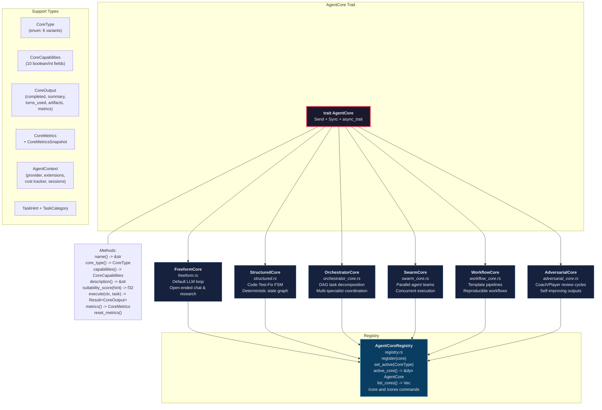
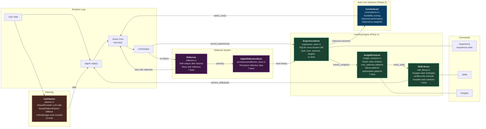
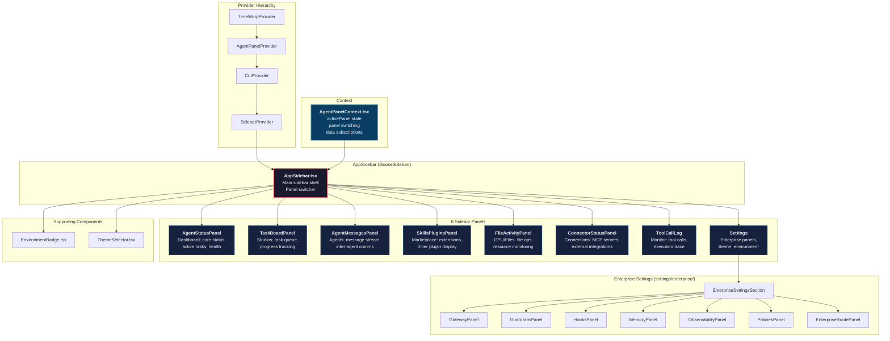
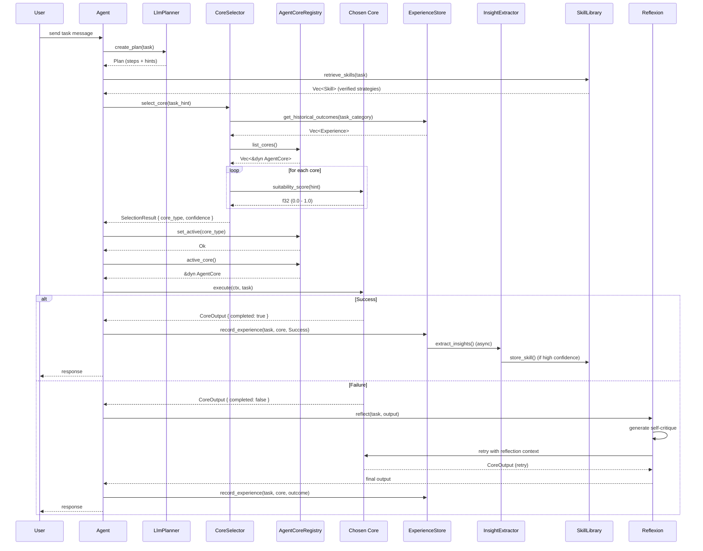

# Super-Goose Agentic Core System -- Architecture

> Comprehensive architecture reference for the Super-Goose multi-core agent system,
> learning engine, sidebar panels, and dispatch pipeline.

---

## Table of Contents

1. [AgentCore Trait and Implementations](#1-agentcore-trait-and-implementations)
2. [Learning Engine Pipeline](#2-learning-engine-pipeline)
3. [8-Panel Sidebar Architecture](#3-8-panel-sidebar-architecture)
4. [Core Dispatch Flow](#4-core-dispatch-flow)
5. [Test Coverage](#5-test-coverage)
6. [File Tree](#6-file-tree)

---

## 1. AgentCore Trait and Implementations

The `AgentCore` trait provides a unified interface for six distinct execution strategies.
Each core wraps an existing subsystem and can be hot-swapped at runtime via `/core <name>`.
The `AgentCoreRegistry` manages all registered cores and provides the active core to `Agent::reply()`.



### Core Capabilities Matrix

| Core | Code Gen | Testing | Multi-Agent | Parallel | Workflow | Adversarial | Freeform | State Machine |
|------|----------|---------|-------------|----------|----------|-------------|----------|---------------|
| FreeformCore | yes | -- | -- | -- | -- | -- | **yes** | -- |
| StructuredCore | **yes** | **yes** | -- | -- | -- | -- | -- | **yes** |
| OrchestratorCore | yes | yes | **yes** | -- | -- | -- | -- | -- |
| SwarmCore | yes | yes | **yes** | **yes** | -- | -- | -- | -- |
| WorkflowCore | yes | yes | -- | -- | **yes** | -- | -- | yes |
| AdversarialCore | yes | yes | **yes** | -- | -- | **yes** | -- | -- |

---

## 2. Learning Engine Pipeline

The Learning Engine provides cross-session intelligence. It records task outcomes, extracts
reusable insights, and builds a verified skill library. The `CoreSelector` uses historical
data from the `ExperienceStore` to auto-select the best core for each new task.



### Data Flow Summary

1. **Record**: After each task, `Agent` writes an experience entry (task description, chosen core, outcome, duration) into `ExperienceStore` (SQLite).
2. **Extract**: `InsightExtractor` periodically analyzes stored experiences to identify patterns -- which cores succeed for which task categories, common failure modes, and optimization opportunities.
3. **Build Skills**: High-confidence, verified task strategies are promoted into the `SkillLibrary` for future retrieval.
4. **Reflect**: On failure, `Reflexion` generates a self-critique, stores it in `SqliteReflectionStore`, and retries the task with the reflection context appended.
5. **Auto-Select**: `CoreSelector` combines suitability scores from each core's `suitability_score()` method with historical success rates from `ExperienceStore` to pick the optimal core.

---

## 3. 8-Panel Sidebar Architecture

The Super-Goose desktop UI features an expandable sidebar with eight panels, managed by
`AgentPanelContext` and rendered through `AppSidebar`.



---

## 4. Core Dispatch Flow

This sequence diagram shows the complete path from user input through core selection,
registry lookup, execution, and learning feedback.



### Dispatch Phases

| Phase | Component | Action |
|-------|-----------|--------|
| 1. Planning | `LlmPlanner` | Decomposes task into steps, generates `TaskHint` |
| 2. Skill Lookup | `SkillLibrary` | Retrieves verified strategies matching the task |
| 3. Core Selection | `CoreSelector` | Scores all cores using suitability + historical data |
| 4. Registry Activation | `AgentCoreRegistry` | Sets the chosen core as active |
| 5. Execution | Active `AgentCore` | Runs `execute(ctx, task)` with the core's strategy |
| 6. Learning | `ExperienceStore` | Records outcome for future selection improvement |
| 7. Reflection | `Reflexion` | On failure: self-critique, retry, then record |

---

## 5. Test Coverage

All tests verified passing as of 2026-02-12.

| Module | File(s) | Tests | Status |
|--------|---------|-------|--------|
| Core (6 cores + registry + selector) | `core/*.rs` | 87 | ALL PASS |
| ExperienceStore | `experience_store.rs` | 11 | ALL PASS |
| InsightExtractor | `insight_extractor.rs` | 7 | ALL PASS |
| SkillLibrary | `skill_library.rs` | 7 | ALL PASS |
| ReflectionStore | `persistence/reflection_store.rs` | 7 | ALL PASS |
| Reflexion | `reflexion.rs` | 7 | ALL PASS |
| Planner | `planner.rs` | 13 | ALL PASS |
| **Backend Total** | -- | **139** | **ALL PASS** |
| Frontend Vitest | `ui/desktop/src/**/*.test.*` | 2086 | ALL PASS |
| SuperGoosePanel (Sidebar) | `GooseSidebar/__tests__/` | 11 | ALL PASS |
| Pipeline Visualization | `pipeline/__tests__/` | 58 | ALL PASS |

### Running the Tests

```bash
# Backend -- all agentic core tests
cargo test --lib -p goose -- core::

# Backend -- learning engine tests
cargo test --lib -p goose -- experience_store::
cargo test --lib -p goose -- insight_extractor::
cargo test --lib -p goose -- skill_library::
cargo test --lib -p goose -- reflexion::
cargo test --lib -p goose -- reflection_store::
cargo test --lib -p goose -- planner::

# Backend -- all 139 tests at once
cargo test --lib -p goose

# Frontend -- all Vitest tests
cd ui/desktop && npx vitest run

# Frontend -- sidebar panel tests only
cd ui/desktop && npx vitest run src/components/GooseSidebar/

# Frontend -- pipeline visualization tests only
cd ui/desktop && npx vitest run src/components/pipeline/
```

---

## 6. File Tree

All files created or modified for the Agentic Core System, Learning Engine, and supporting
UI components.

```
crates/goose/src/agents/
+-- core/                              # Agentic Core System (Phase 1)
|   +-- mod.rs                         # AgentCore trait, CoreType enum, CoreCapabilities,
|   |                                  #   CoreOutput, re-exports
|   +-- context.rs                     # AgentContext, TaskHint, TaskCategory
|   +-- freeform.rs                    # FreeformCore -- default LLM loop
|   +-- structured.rs                  # StructuredCore -- Code-Test-Fix state graph
|   +-- orchestrator_core.rs           # OrchestratorCore -- DAG multi-specialist
|   +-- swarm_core.rs                  # SwarmCore -- parallel agent teams
|   +-- workflow_core.rs               # WorkflowCore -- template pipelines
|   +-- adversarial_core.rs            # AdversarialCore -- Coach/Player review
|   +-- registry.rs                    # AgentCoreRegistry -- registration, hot-swap,
|   |                                  #   /core and /cores commands
|   +-- metrics.rs                     # CoreMetrics, CoreMetricsSnapshot
|   +-- selector.rs                    # CoreSelector, SelectionResult
|
+-- persistence/                       # Persistence Layer
|   +-- mod.rs                         # Module root
|   +-- memory.rs                      # In-memory message store
|   +-- sqlite.rs                      # SQLite session persistence
|   +-- reflection_store.rs            # SqliteReflectionStore (7 tests)
|
+-- experience_store.rs                # ExperienceStore -- SQLite cross-session learning
|                                      #   (task, core, outcome, insights) (11 tests)
+-- insight_extractor.rs               # InsightExtractor -- ExpeL-style pattern analysis
|                                      #   (core selection, failure, optimization) (7 tests)
+-- skill_library.rs                   # SkillLibrary -- Voyager-style verified strategies
|                                      #   (7 tests)
+-- reflexion.rs                       # Reflexion -- self-critique + retry (7 tests)
+-- planner.rs                         # LlmPlanner + SimplePatternPlanner + CriticManager
|                                      #   (13 tests)
+-- agent.rs                           # Agent struct (experience_store, skill_library fields)
+-- mod.rs                             # Module declarations

ui/desktop/src/components/
+-- GooseSidebar/                      # 8-Panel Sidebar System
|   +-- index.ts                       # Barrel exports
|   +-- AppSidebar.tsx                 # Main sidebar shell + panel switcher
|   +-- AgentPanelContext.tsx           # React context for panel state
|   +-- AgentStatusPanel.tsx           # Dashboard panel
|   +-- TaskBoardPanel.tsx             # Studios / task queue panel
|   +-- AgentMessagesPanel.tsx         # Agent messages panel
|   +-- SkillsPluginsPanel.tsx         # Marketplace / extensions panel
|   +-- FileActivityPanel.tsx          # File activity / GPU panel
|   +-- ConnectorStatusPanel.tsx       # MCP connections panel
|   +-- ToolCallLog.tsx                # Tool call monitor panel
|   +-- EnvironmentBadge.tsx           # Environment indicator
|   +-- ThemeSelector.tsx              # Theme picker
|   +-- __tests__/                     # 11 test files
|       +-- AgentMessagesPanel.test.tsx
|       +-- AgentPanelContext.test.tsx
|       +-- AgentStatusPanel.test.tsx
|       +-- ConnectorStatusPanel.test.tsx
|       +-- FileActivityPanel.test.tsx
|       +-- SkillsPluginsPanel.test.tsx
|       +-- TaskBoardPanel.test.tsx
|       +-- ToolCallLog.test.tsx
|       +-- AppSidebar.test.tsx
|       +-- ThemeSelector.test.tsx
|       +-- EnvironmentBadge.test.tsx
|
+-- pipeline/                          # Pipeline Visualization (9/10 complete)
|   +-- index.ts                       # Barrel exports
|   +-- AnimatedPipeline.tsx           # Quantum particle animation
|   +-- PipelineContext.tsx            # Pipeline state context
|   +-- usePipelineBridge.ts           # Bridge to ChatState
|   +-- __tests__/
|       +-- AnimatedPipeline.test.tsx
|       +-- PipelineContext.test.tsx
|       +-- usePipelineBridge.test.tsx
|
+-- settings/enterprise/               # Enterprise Settings Panels
    +-- EnterpriseSettingsSection.tsx   # Section wrapper
    +-- EnterpriseRoutePanel.tsx        # Route-level panel
    +-- GatewayPanel.tsx               # API gateway config
    +-- GuardrailsPanel.tsx            # Safety guardrails config
    +-- HooksPanel.tsx                 # Lifecycle hooks config
    +-- MemoryPanel.tsx                # Memory system config
    +-- ObservabilityPanel.tsx         # Observability config
    +-- PoliciesPanel.tsx              # Policy management
    +-- __tests__/                     # 6 test files
        +-- EnterpriseRoutePanel.test.tsx
        +-- GatewayPanel.test.tsx
        +-- PoliciesPanel.test.tsx
        +-- HooksPanel.test.tsx
        +-- MemoryPanel.test.tsx
        +-- ObservabilityPanel.test.tsx
```

---

## Legend

| Symbol | Meaning |
|--------|---------|
| `-->` | Direct dependency / call |
| `-.->` | Async or periodic dependency |
| SQLite | Persistent cross-session storage |
| `Phase N` | Implementation phase in the 10-agent master plan |
| `/core`, `/cores` | Runtime slash commands for core management |
| `/experience`, `/skills`, `/insights` | Learning engine slash commands |

---

*Generated 2026-02-12. Corresponds to commit history on branch `feat/comprehensive-testing`.*
