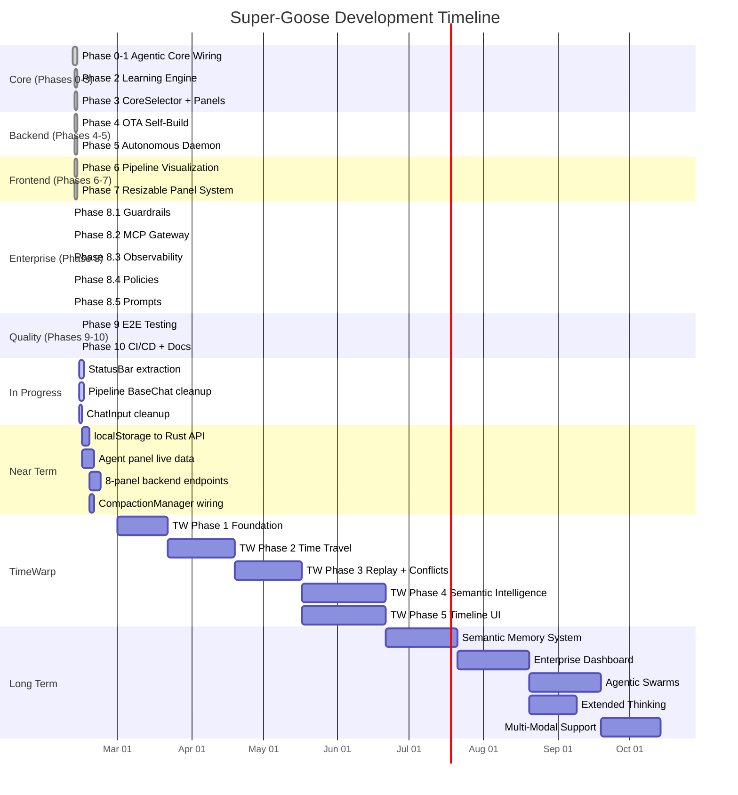
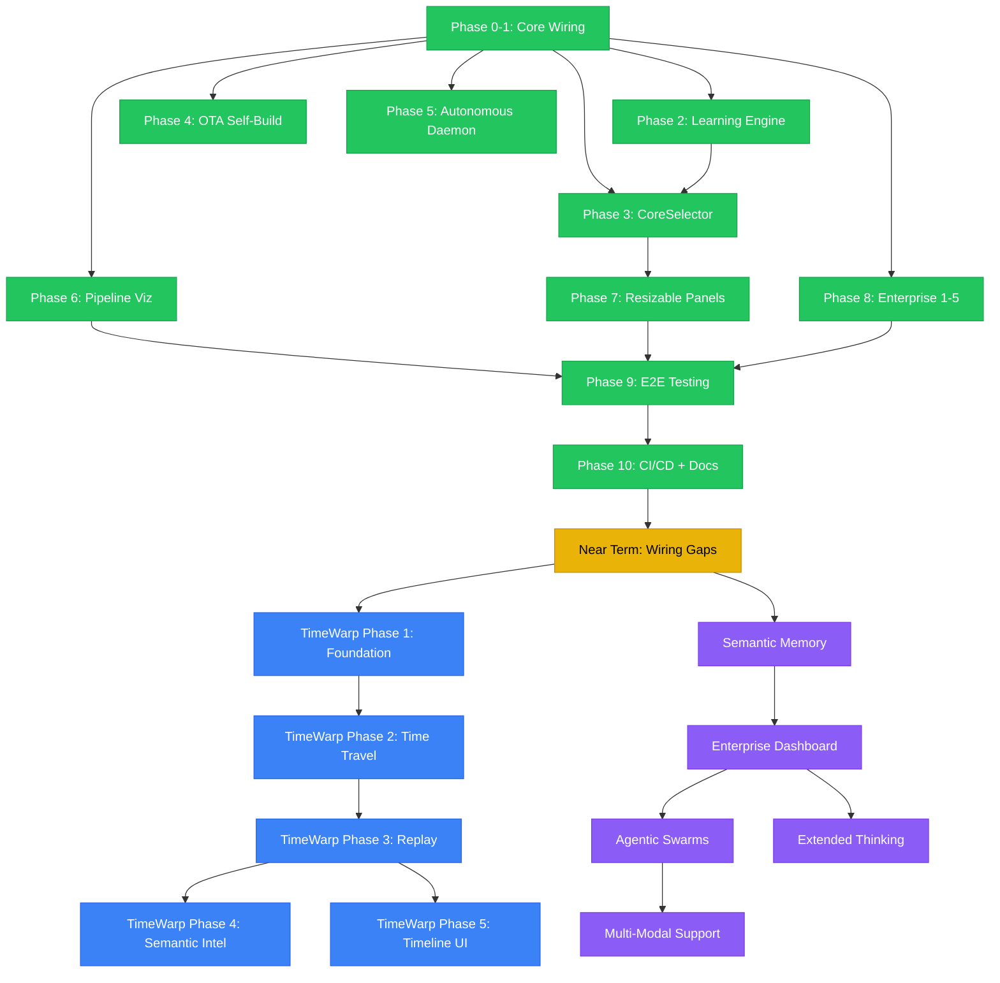

# Super-Goose Roadmap

This document tracks every completed, in-progress, and planned phase of the
Super-Goose project. It is the single source of truth for release planning
and engineering prioritization.

---

## Status Legend

| Symbol | Meaning |
|--------|---------|
| DONE | Implemented, tested, merged |
| IN PROGRESS | Active development |
| PLANNED | Designed, not yet started |

---

## Completed Phases

### Phase 0-1: Agentic Core Wiring (2026-02-12)

Six specialized AgentCore implementations behind the `AgentCore` trait, with
a shared registry that supports hot-swap at runtime via the `/core` and
`/cores` slash commands.

| Component | Detail |
|-----------|--------|
| FreeformCore | Default conversational core |
| StructuredCore | StateGraph-based execution (`use_done_gate: false` to avoid shell hangs in tests) |
| OrchestratorCore | Multi-specialist agent delegation |
| SwarmCore | Parallel agent pool |
| WorkflowCore | Template-driven task sequences |
| AdversarialCore | Coach/Player adversarial review cycle |
| AgentCoreRegistry | Hot-swap registry with `/core` and `/cores` commands |

**Files**: 11 files in `crates/goose/src/agents/core/` (10 original + `selector.rs`)
**Tests**: 87/87 passing (`cargo test --lib -p goose -- core::`)
**Commit**: `5c46d6f453`

---

### Phase 2: Learning Engine (2026-02-12)

Cross-session learning system combining ExpeL-style insight extraction with
Voyager-style reusable skill libraries, all backed by SQLite.

| Component | Description | Tests |
|-----------|-------------|-------|
| ExperienceStore | SQLite store mapping task to core to outcome to insights | 11 |
| InsightExtractor | ExpeL-style pattern analysis (core selection, failure, optimization) | 7 |
| SkillLibrary | Voyager-style reusable strategies with verified-only retrieval | 7 |
| SqliteReflectionStore | Persistent Reflexion data across sessions | 7 |
| LlmPlanner | Wired to SharedProvider, falls back to SimplePatternPlanner | 13 |
| CriticManager | Auto-invoked after plan creation in `Agent::create_plan()` | -- |

Agent struct carries `experience_store: Mutex<Option<Arc<ExperienceStore>>>`
and `skill_library: Mutex<Option<Arc<SkillLibrary>>>` with lazy initialization
in `reply()`. Commands: `/experience`, `/experience stats`, `/skills`,
`/insights`.

**Files**: 4 new files in `crates/goose/src/agents/` (`experience_store.rs`,
`insight_extractor.rs`, `skill_library.rs`, `reflexion.rs`)
**Tests**: 52/52 passing
**Commit**: `311b575660`

---

### Phase 3: CoreSelector + Panels + Theme (2026-02-12)

Automatic core selection per task using experience history, an 8-panel
sidebar for the Super-Goose UI, and a dedicated `sg-*` design token system.

#### CoreSelector

- Auto-selects the best AgentCore before dispatch using ExperienceStore
  history and a suitability scoring algorithm.
- `SelectionResult`: `core_type`, `confidence`, `rationale`,
  `source` (experience / suitability / default).
- Switches core when confidence exceeds 0.7.
- 11 unit tests.

#### 8-Panel Sidebar (SuperGoosePanel)

| Panel | Purpose |
|-------|---------|
| Dashboard | High-level session overview |
| Studios | Project workspace management |
| Agents | Running agent list and status |
| Marketplace | Extension and plugin marketplace |
| GPU | GPU resource monitoring |
| Connections | MCP server connections |
| Monitor | System health monitoring |
| Settings | Configuration and preferences |

All panels use `data-super="true"` and `sg-*` CSS tokens for dual color
scoping so stock Goose colors remain untouched.

#### sg-* Design Tokens

255 lines added to `ui/desktop/src/styles/main.css` (lines 158-1111).
Backgrounds, brand palette, text scale, and utility classes scoped to
`.super-goose-panel` / `[data-super="true"]`.

**Files**: 10 files in `ui/desktop/src/components/super/`
**Tests**: 11+11 passing (CoreSelector + SuperGoosePanel vitest)
**Commit**: `311b575660`

---

### Phase 4: OTA Self-Build (2026-02-12)

Over-the-air update pipeline enabling the agent to rebuild and hot-swap its
own binary without downtime.

| Module | Responsibility |
|--------|---------------|
| StateSaver | Serialize and restore agent state across binary swaps |
| SelfBuilder | Invoke `cargo build` from within the running process |
| BinarySwapper | Atomic binary replacement with file-lock safety |
| HealthChecker | Post-swap health verification with rollback trigger |
| RollbackManager | Restore previous binary and state on failure |
| UpdateScheduler | Cron-like scheduling with maintenance windows |
| OtaManager | Top-level orchestrator coordinating all modules |

**Files**: 7 modules in `crates/goose/src/ota/`
**Tests**: 90/90 passing
**Commit**: `3624eb2990`

---

### Phase 5: Autonomous Daemon (2026-02-12)

Background daemon that performs maintenance, documentation, CI monitoring,
and release management without human intervention.

| Module | Responsibility |
|--------|---------------|
| TaskScheduler | Priority-based task queue with cron expressions |
| BranchManager | Automated branch creation, cleanup, and merge |
| ReleaseManager | Semantic versioning, changelog generation, tag creation |
| DocsGenerator | Automated documentation from code analysis |
| CiWatcher | GitHub Actions status polling with failure triage |
| Failsafe | Circuit breaker, rate limiter, human-in-the-loop escalation |
| AuditLog | Immutable append-only log of all daemon actions |
| AutonomousDaemon | Top-level orchestrator with lifecycle management |

**Files**: 8 modules in `crates/goose/src/autonomous/`
**Tests**: 86/86 passing
**Commit**: `3624eb2990`

---

### Phase 6: Pipeline Visualization (2026-02-12)

Real-time visualization of the agent processing pipeline rendered as
animated quantum particles in the chat UI.

- Reads `ChatState` and is wired into `App.tsx` and `BaseChat.tsx`.
- Pipeline toggle in `AppSettingsSection` with `localStorage` persistence.
- Quantum particle animation with configurable density and speed.

**Files**: 4 files in `ui/desktop/src/components/pipeline/`
**Tests**: 69/69 vitest tests passing
**Commit**: `3624eb2990`

---

### Phase 7: Resizable Panel System (2026-02-12)

Integrated `react-resizable-panels` for flexible layout management across
the sidebar and main content area.

**Tests**: 67 vitest tests passing

---

### Phase 8: Enterprise Phases 1-5 (2026-02-09)

Five enterprise integration modules implemented in Rust under `crates/goose/src/`.

| Sub-Phase | Module | Description | Tests |
|-----------|--------|-------------|-------|
| 1 | Guardrails | 6 parallel detectors (prompt injection, PII, jailbreak, topic, keyword, secret) | 62 unit + 12 integration |
| 2 | MCP Gateway | Multi-server routing, function-level permissions, credential store, audit log, bundles | 47 unit |
| 3 | Observability | OpenTelemetry GenAI conventions, cost tracker (30+ model pricing), MCP metrics, Prometheus export | 58 unit + 21 integration |
| 4 | Policies | YAML rule engine with 26 condition types, 11 action types, hot-reload via `notify` crate | 59 unit + 22 integration |
| 5 | Prompts | 14 pre-built prompt patterns, template engine with variable substitution | 23 unit + 12 integration |

**Total enterprise tests**: 305+ passing

---

### Phase 9: E2E Testing (2026-02-12)

Playwright end-to-end test suite running against the Electron desktop app.

| Metric | Value |
|--------|-------|
| Test files fixed | 17 |
| Passed | 291 |
| Skipped | 68 (47 backend-dependent + 17 AxeBuilder CDP-incompatible + 4 providers) |
| Failed | 0 |

Key fixes: strict-mode selectors, navigation routing, Locator types,
force-click, MCP SDK import path corrections.

**Commit**: `5c1fa46ae1`

---

### Phase 10: CI/CD + Documentation (2026-02-12)

- `ci-comprehensive.yml`: 371-line GitHub Actions workflow with change
  detection, Rust tests, Vitest, `tsc --noEmit`, artifact upload, and test
  result summaries.
- `RELEASE_CHECKLIST.md`: pre-release verification steps.
- Docusaurus pages for agentic cores and Super-Goose panels published to
  GitHub Pages.

**Commit**: `3624eb2990`

---

## Test Summary (all green as of 2026-02-12)

| Suite | Passed | Skipped | Failed |
|-------|--------|---------|--------|
| Rust unit (`cargo test --lib`) | 1,754 | 0 | 9 pre-existing (JWT crypto + evolution) |
| Rust core | 87 | 0 | 0 |
| Rust learning | 52 | 0 | 0 |
| Rust OTA | 90 | 0 | 0 |
| Rust autonomous | 86 | 0 | 0 |
| Vitest (frontend) | 2,097 | 3 | 0 |
| Playwright E2E | 291 | 68 | 0 |
| `tsc --noEmit` | clean | -- | 0 |

---

## In Progress

### StatusBar Extraction from ChatInput

Extract the status-bar rendering logic out of `ChatInput` into a dedicated
`StatusBar` component. This reduces the responsibility of `ChatInput` and
makes status display independently testable.

### Pipeline Removal from BaseChat Inline

Move the inline pipeline rendering out of `BaseChat` into a dedicated
wrapper so that `BaseChat` focuses solely on message flow.

### ChatInput Cleanup

Remove accumulated dead code, unused imports, and redundant state from
`ChatInput` after the StatusBar extraction.

---

## Planned -- Near Term

These items close the remaining wiring gaps between frontend components and
the Rust backend.

| Item | Description | Priority |
|------|-------------|----------|
| localStorage to Rust API | Wire browser `localStorage` settings to Rust backend endpoints | High |
| Agent panel live data | Replace mock data in agent panels with real SSE / WebSocket feeds from the backend | High |
| 8-panel backend endpoints | Wire all 8 sidebar panels to real Rust API endpoints | High |
| CompactionManager wiring | Call `CompactionManager.compact()` from the session lifecycle | Medium |
| Enterprise panel endpoints | Backend API endpoints for `/enterprise/*` routes | Medium |
| Tool toggle persistence | Wire tool toggle state to `config.yaml` via the extension API | Medium |
| TimeWarp event store | Wire TimeWarp UI to SQLite event store backend | Medium |
| CLI download/terminal | Wire CLI download, embedded terminal, and auto-update features | Low |

---

## Planned -- Medium Term: TimeWarp

Fusion 360-style time-travel for AI coding sessions. Full design is
documented in 18 files under `docs/timewarp/`. UI components (8 files in
`ui/desktop/src/components/timewarp/`) are built; the backend is **not yet
implemented**.

### TimeWarp Phase 1: Foundation (Event Store + Snapshots)

Every agent action is recorded as an immutable, hash-chained event with
workspace snapshots stored as content-addressed blobs with delta
compression.

| Deliverable | Detail |
|-------------|--------|
| Event Store | SQLite-backed, append-only, hash chain verification |
| Snapshot Store | Content-addressed blobs (CAS) with zstd delta compression |
| MCP Instrumentation | Transparent middleware intercepting all tool calls |
| CLI | `tw status`, `tw log`, `tw show <event_id>` |

**Target**: 100-event session storage under 10 MB. Less than 50 ms overhead
per event.

### TimeWarp Phase 2: Time Travel (Jump + Branch)

Users can jump to any past state and fork new branches from arbitrary
points.

| Deliverable | Detail |
|-------------|--------|
| Jump | Reconstruct workspace from any snapshot via delta chain walk |
| Branch Manager | `tw branch --from E5 "feature-auth"`, instantaneous (metadata only) |
| Git Sync | Export TimeWarp branches as Git branches (bidirectional) |
| CLI | `tw jump`, `tw branch`, `tw branches`, `tw switch`, `tw diff` |

**Target**: 50-event branch with 20 files reconstructs in under 2 seconds.

### TimeWarp Phase 3: Replay and Conflicts

Deterministic replay in containers with structural merge and conflict
detection.

| Deliverable | Detail |
|-------------|--------|
| Replay Engine | Containerized re-execution with pinned environment and LLM response caching |
| Conflict Detection | Line-level diff, overlapping change detection, delete-vs-modify |
| Merge Operations | Fast-forward, three-way merge with conflict markers |
| CLI | `tw replay`, `tw merge`, `tw conflicts` |

### TimeWarp Phase 4: Semantic Intelligence

AST-aware conflict detection and forward projection.

| Deliverable | Detail |
|-------------|--------|
| tree-sitter Integration | AST parsing for all major languages |
| Semantic Conflicts | Detect rename, signature change, and dependency conflicts |
| Drift Detection | Warn when branches diverge beyond configurable thresholds |
| Forward Projection | What-if analysis predicting conflict likelihood |

### TimeWarp Phase 5: Timeline UI

Interactive timeline visualization integrated into the Electron desktop app.

| Deliverable | Detail |
|-------------|--------|
| Timeline Bar | Horizontal scrubber with event markers and zoom |
| Event Inspector | Side panel showing event details, diffs, and metadata |
| Branch Visualization | Railroad-track view of parallel branches |
| Desktop Integration | Native Electron window management and keyboard shortcuts |

---

## Planned -- Long Term

### Semantic Memory System

Four-tier memory architecture for persistent cross-session context.

| Tier | Description | Decay |
|------|-------------|-------|
| Working | Current interaction context, LRU eviction | Fast (0.70) |
| Episodic | Session and conversation history | Moderate (0.90) |
| Semantic | Long-term facts and knowledge | Very slow (0.99) |
| Procedural | Learned skills and procedures | Slow (0.98) |

Vector similarity search with pluggable backends, memory consolidation
pipeline promoting high-importance working memories to long-term stores,
and decay-based garbage collection.

### Enterprise Dashboard and Cloud-Native Deployment

- React-based real-time monitoring dashboard (Axum backend, WebSocket).
- Kubernetes manifests with Horizontal Pod Autoscaler.
- Helm charts with production-grade values.
- Terraform modules for EKS, GKE, and AKS.
- Multi-tenant workspace isolation.

### Agentic Swarms

- Dynamic swarm formation based on task complexity.
- Inter-agent communication via typed message channels.
- Consensus protocols for conflicting agent outputs.
- Swarm-level memory sharing and deduplication.

### Extended Thinking / Chain-of-Thought

- Chain-of-Thought and Tree-of-Thought reasoning engines.
- Self-reflection loop with confidence gating.
- Transparent reasoning traces visible in the UI timeline.

### Multi-Modal Support

- Image analysis and OCR via vision models.
- Document parsing (PDF, Word, Excel).
- Audio transcription integration.
- Streaming architecture for real-time SSE and WebSocket delivery.

---

## Timeline Diagram



---

## Phase Dependency Graph



---

## Architecture at a Glance

```
crates/goose/src/
  agents/
    core/           -- 6 AgentCores + selector + registry (Phase 0-3)
    experience_store.rs
    insight_extractor.rs
    skill_library.rs
    reflexion.rs    -- Learning Engine (Phase 2)
  ota/              -- 7 OTA modules (Phase 4)
  autonomous/       -- 8 daemon modules (Phase 5)
  guardrails/       -- 6 detectors (Phase 8.1)
  mcp_gateway/      -- router, permissions, credentials, audit, bundles (Phase 8.2)
  observability/    -- cost tracker, metrics, exporters (Phase 8.3)
  policies/         -- YAML rule engine, conditions, actions, loader (Phase 8.4)
  prompts/          -- patterns, templates (Phase 8.5)

ui/desktop/src/
  components/
    pipeline/       -- 4 pipeline viz components (Phase 6)
    super/          -- 10 sidebar panel components (Phase 3/7)
    timewarp/       -- 8 TimeWarp UI components (designed, backend pending)

docs/
  timewarp/         -- 18 TimeWarp design documents
```

---

*Last updated: 2026-02-12*
