# TimeWarp: Architecture Blueprint

**Version:** 0.1 (Design Phase)  
**Target Integration:** Super-Goose (Ghenghis/Super-Goose)  
**Architecture Pattern:** Event Sourcing + Content-Addressed Storage + DAG Branching

---

## 1. System Overview

TimeWarp is an event-sourced time-travel system for AI coding agents. It captures every agent action as an immutable event, stores workspace snapshots in a content-addressed store, and provides a Fusion 360-style timeline UI for navigation, branching, and replay.


---

## 2. Event Model — The Core Data Structure

Every agent action becomes an immutable event in a DAG (Directed Acyclic Graph).


---

## 3. Event Flow — How Actions Become Events


---

## 4. Branch DAG — Forking and Merging


---

## 5. Snapshot Store — Content-Addressed Architecture


**Key properties:**
- Identical files are stored once (deduplication via content addressing)
- Delta snapshots only record changed files (storage efficiency)
- Any snapshot can be fully reconstructed by walking the delta chain to its base
- Periodic full snapshots prevent long delta chains

---

## 6. Conflict Detection — Three Layers


---

## 7. Replay Engine — Deterministic Re-Execution

```mermaid
flowchart TB
    START[Replay Request<br/>from_event: E5<br/>to_event: E15<br/>mode: verify] --> PREP

    PREP[Prepare Sandbox] --> |1| RESTORE[Restore Snapshot<br/>at E5's snapshot_id]
    RESTORE --> |2| PIN[Pin Environment<br/>Container digest<br/>Tool versions<br/>Lockfile versions]
    PIN --> |3| CACHE[Load LLM Cache<br/>Cached responses for<br/>deterministic replay]

    CACHE --> LOOP{Next Event?}

    LOOP -->|E6: file_write| EXEC_FW[Execute File Write<br/>Compare output to original]
    LOOP -->|E7: cmd_exec| EXEC_CMD[Execute Command<br/>Compare output to original]
    LOOP -->|E8: llm_call| EXEC_LLM{LLM Cache Hit?}
    LOOP -->|E15: done| VERIFY

    EXEC_LLM -->|Cache hit| USE_CACHED[Use Cached Response<br/>Score: 1.0 deterministic]
    EXEC_LLM -->|Cache miss| CALL_LLM[Call LLM<br/>Compare to original<br/>Score: 0.0-1.0]

    EXEC_FW --> CHECK_FW{Output matches<br/>original?}
    EXEC_CMD --> CHECK_CMD{Output matches<br/>original?}
    USE_CACHED --> CHECK_LLM{Response matches<br/>original?}
    CALL_LLM --> CHECK_LLM

    CHECK_FW -->|Yes| LOOP
    CHECK_FW -->|No| DIVERGE[Record Divergence<br/>Continue or Abort]
    CHECK_CMD -->|Yes| LOOP
    CHECK_CMD -->|No| DIVERGE
    CHECK_LLM -->|Yes| LOOP
    CHECK_LLM -->|No| DIVERGE

    DIVERGE --> LOOP

    VERIFY[Verify Final State] --> COMPARE[Compare Final Snapshot<br/>to Original E15 Snapshot]
    COMPARE --> SCORE[Reproducibility Score<br/>0.0 - 1.0]

    SCORE -->|1.0| PERFECT[✅ Perfect Replay<br/>Deterministic]
    SCORE -->|0.8-0.99| CLOSE[⚠️ Close Replay<br/>Minor LLM divergence]
    SCORE -->|< 0.8| DIVERGED[❌ Significant Divergence<br/>Review required]

    style PERFECT fill:#2ecc71,color:#fff
    style CLOSE fill:#f39c12,color:#fff
    style DIVERGED fill:#e74c3c,color:#fff
```



---

## 8. Timeline UI — Fusion 360-Style Interface

```mermaid
graph LR
    subgraph "Timeline Bar (bottom of screen, always visible)"
        direction LR
        E1((📁)) --> E2((📝)) --> E3((📝)) --> E4((⚡)) --> E5((✅))
        E5 --> E6((📝)) --> E7((⚡)) --> E8((❌)) --> E9((📝)) --> E10((✅))

        E3 -.fork.-> F1((📝)) --> F2((⚡)) --> F3((✅))
    end

    subgraph "Legend"
        L1((📁)) --- L1T[File Created]
        L2((📝)) --- L2T[File Modified]
        L3((⚡)) --- L3T[Command Executed]
        L4((✅)) --- L4T[Tests Passed]
        L5((❌)) --- L5T[Tests Failed]
    end

    subgraph "Interactions"
        I1[Click: Jump to event]
        I2[Right-click: Fork from here]
        I3[Drag marker: Scrub through time]
        I4[Double-click: Inspect event details]
        I5[Hover: Preview workspace diff]
    end
```



### Timeline UI Wireframe (ASCII)

```
┌──────────────────────────────────────────────────────────────────────────┐
│  Super-Goose                                                    [≡] [×] │
├──────────────────────────────────────────────────────────────────────────┤
│                                                                          │
│  ┌─── Code Editor / Agent Chat ──────────────────────────────────────┐  │
│  │                                                                    │  │
│  │  [Agent output, file diffs, terminal output...]                   │  │
│  │                                                                    │  │
│  │                                                                    │  │
│  │                                                                    │  │
│  └────────────────────────────────────────────────────────────────────┘  │
│                                                                          │
│  ┌─── Event Inspector ───────────────────────────────────────────────┐  │
│  │  Event E7: shell("cargo test")                                     │  │
│  │  Branch: main  │  Time: 14:23:05  │  Duration: 3.2s               │  │
│  │  Files touched: src/auth.rs, tests/auth_test.rs                    │  │
│  │  Result: 12 tests passed, 0 failed                                 │  │
│  │  Snapshot: snap_a1b2c3  │  Reproducibility: 0.95                   │  │
│  └────────────────────────────────────────────────────────────────────┘  │
│                                                                          │
├──────────────────────────────────────────────────────────────────────────┤
│  ┌─── Timeline ──────────────────────────────────────────────────────┐  │
│  │                                                                    │  │
│  │  main:    ●──●──●──●──●──●──●──●──▼──●──●──●                     │  │
│  │                    ╲                                               │  │
│  │  oauth:             ●──●──●──●                                    │  │
│  │                          ╲                                        │  │
│  │  jwt:                     ●──●──●                                 │  │
│  │                                                                    │  │
│  │  ◀────────────────────────[▲]────────────────────────────────▶    │  │
│  │  E1    E3    E5    E7    E9    E11   E13   E15   E17   E19       │  │
│  │                                                                    │  │
│  │  [⏮] [◀] [▶] [⏭]  │  Branch: main  │  Event 9/19  │  [🔍]     │  │
│  └────────────────────────────────────────────────────────────────────┘  │
└──────────────────────────────────────────────────────────────────────────┘
```

---

## 9. Hash Chain — Tamper-Evident Integrity

```mermaid
graph LR
    E1[Event E1<br/>hash: a1b2c3<br/>prev: 000000] --> E2[Event E2<br/>hash: d4e5f6<br/>prev: a1b2c3]
    E2 --> E3[Event E3<br/>hash: g7h8i9<br/>prev: d4e5f6]
    E3 --> E4[Event E4<br/>hash: j0k1l2<br/>prev: g7h8i9]

    E4 --> VERIFY{Verify Chain}
    VERIFY -->|SHA256 of E3 == E4.prev_hash| OK[✅ Intact]
    VERIFY -->|SHA256 of E3 ≠ E4.prev_hash| TAMPERED[❌ Tampered!]

    style OK fill:#2ecc71,color:#fff
    style TAMPERED fill:#e74c3c,color:#fff
```



**Hash computation:**
```
event_hash = SHA256(
    event_id +
    parent_ids.join(",") +
    branch_id +
    event_type +
    JSON(inputs) +
    JSON(outputs) +
    snapshot_id +
    prev_hash +
    created_at.to_string()
)
```

---

## 10. Component Dependency Map


---

## 11. Data Flow for Key Operations

### 11.1 Jump (Restore to Past State)


### 11.2 Fork (Create Branch from Past Event)


---

## 12. SQLite Schema (Logical)

```sql
-- Events: append-only, hash-chained
CREATE TABLE events (
    event_id       TEXT PRIMARY KEY,    -- UUID v7
    parent_ids     TEXT NOT NULL,       -- JSON array of parent event IDs
    branch_id      TEXT NOT NULL,       -- FK to branches
    event_type     TEXT NOT NULL,       -- file_write|cmd_exec|llm_call|...
    inputs         TEXT,                -- JSON
    outputs        TEXT,                -- JSON
    file_touches   TEXT,                -- JSON array of paths
    snapshot_id    TEXT,                -- FK to snapshots (nullable)
    prev_hash      TEXT NOT NULL,       -- SHA-256 of previous event
    event_hash     TEXT NOT NULL,       -- SHA-256 of this event
    created_at     TEXT NOT NULL,       -- ISO 8601
    metadata       TEXT                 -- JSON (model version, tool version, etc.)
);

-- Snapshots: content-addressed workspace states
CREATE TABLE snapshots (
    snapshot_id    TEXT PRIMARY KEY,    -- SHA-256 of file tree
    base_snapshot  TEXT,                -- FK for delta (null = full snapshot)
    file_tree      TEXT NOT NULL,       -- JSON: {path: blob_hash}
    total_files    INTEGER NOT NULL,
    total_bytes    INTEGER NOT NULL,
    created_at     TEXT NOT NULL
);

-- Branches: DAG of development paths
CREATE TABLE branches (
    branch_id         TEXT PRIMARY KEY,
    name              TEXT NOT NULL UNIQUE,
    parent_branch_id  TEXT,             -- FK to branches
    fork_event_id     TEXT,             -- FK to events
    head_event_id     TEXT NOT NULL,    -- FK to events
    status            TEXT NOT NULL DEFAULT 'active', -- active|merged|archived
    created_at        TEXT NOT NULL
);

-- Indexes for timeline queries
CREATE INDEX idx_events_branch ON events(branch_id, created_at);
CREATE INDEX idx_events_type ON events(event_type);
CREATE INDEX idx_events_hash ON events(event_hash);
CREATE INDEX idx_snapshots_base ON snapshots(base_snapshot);
```

---

## 13. Integration Points with Super-Goose


---

*This architecture blueprint serves as the design reference for TimeWarp implementation. All diagrams render in GitHub-flavored Mermaid.*
