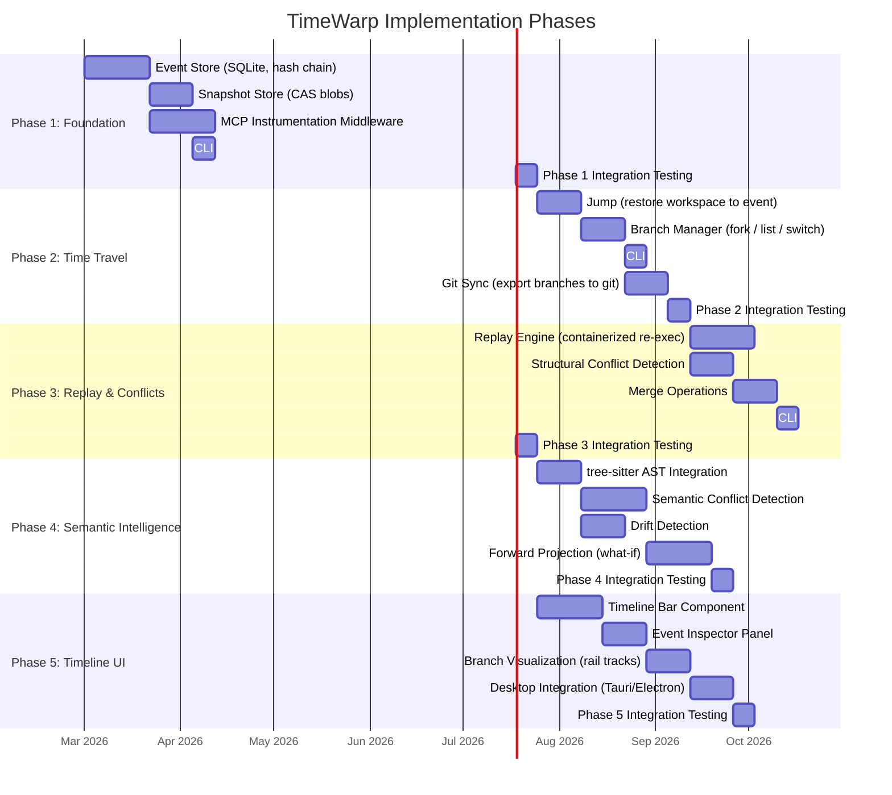

# TimeWarp: Implementation Roadmap

**Project:** Super-Goose TimeWarp Feature  
**Approach:** Phased, each phase delivers standalone value  
**Language:** Rust (core) + TypeScript/React (UI)

---

## Phase Overview

---

## Phase 1: Foundation (Event Store + Snapshots)

**Goal:** Every agent action is recorded as an immutable, hash-chained event with workspace snapshots.

**Deliverables:**
1. `timewarp-core` Rust crate with:
   - Event Store (SQLite-backed, append-only, hash chain verification)
   - Snapshot Store (content-addressed blobs with delta compression)
   - Event types: `file_read`, `file_write`, `file_delete`, `cmd_exec`, `llm_call`, `git_op`, `mcp_tool_call`
2. MCP Instrumentation Middleware:
   - Intercepts all MCP tool calls transparently
   - Creates events for every file operation, command, and LLM interaction
   - Captures workspace snapshots after state-changing operations
3. CLI commands:
   - `tw status` — Show current branch, event count, last event
   - `tw log` — Show event timeline (linear, most recent first)
   - `tw show <event_id>` — Show event details, diff, metadata

**Exit Criteria:**
- Agent sessions produce complete event logs in SQLite
- Hash chain passes integrity verification
- Workspace snapshots can be fully reconstructed from blobs
- 100-event session storage < 10MB with delta compression
- Zero performance impact on agent operations (< 50ms overhead per event)

**Dependencies:** rusqlite, sha2 (or blake3), serde_json, zstd (compression)

---

## Phase 2: Time Travel (Jump + Branch)

**Goal:** Users can jump to any past state and fork new branches.

**Deliverables:**
1. Jump Operation:
   - Reconstruct workspace from any snapshot (walk delta chain, collect blobs, write to disk)
   - Update HEAD pointer
   - Verify workspace integrity after reconstruction
2. Branch Manager:
   - Create branch from any event (`tw branch --from E5 "feature-auth"`)
   - List branches with head positions
   - Switch between branches (workspace reconstruction)
   - Branch metadata (creation time, fork point, status)
3. Git Sync:
   - Export TimeWarp branches as Git branches
   - Map events to Git commits (with event metadata in commit messages)
   - Import Git commits as TimeWarp events (bidirectional sync)
4. CLI commands:
   - `tw jump <event_id>` — Restore workspace to event state
   - `tw branch [--from <event_id>] <name>` — Create branch
   - `tw branches` — List all branches
   - `tw switch <branch>` — Switch to branch
   - `tw diff <event_a> <event_b>` — Show diff between events

**Exit Criteria:**
- Jump restores exact file states (verified by snapshot hash comparison)
- Branch creation is instantaneous (metadata only, no file copying)
- Branch switch restores correct workspace
- Git sync produces valid Git history
- 50-event branch with 20 files reconstructs in < 2 seconds

**Dependencies:** git2 (libgit2 Rust binding)

---

## Phase 3: Replay & Structural Conflicts

**Goal:** Deterministic replay in containers and basic merge with conflict detection.

**Deliverables:**
1. Replay Engine:
   - Containerized re-execution of event sequences
   - Pinned environment (container digest, tool versions, lockfiles)
   - LLM response caching for deterministic replay
   - Reproducibility scoring (0.0–1.0)
   - Divergence detection and reporting
2. Structural Conflict Detection:
   - Line-level diff comparison between branches
   - Overlapping change detection
   - File-level conflicts (delete vs. modify)
3. Merge Operations:
   - Fast-forward merge (no conflicts)
   - Three-way merge with conflict markers
   - Merge event creation with parent tracking
4. CLI commands:
   - `tw replay [--from <event>] [--to <event>] [--mode verify|execute]`
   - `tw merge <branch>` — Merge branch into current
   - `tw conflicts` — List unresolved conflicts

**Exit Criteria:**
- Replay of file-only operations achieves 1.0 reproducibility score
- Replay of LLM-involved operations achieves > 0.8 reproducibility score
- Structural conflicts correctly identified (100% of Git-detectable conflicts)
- Merge produces valid workspace state for conflict-free merges

**Dependencies:** bollard (Docker API), tempfile (sandboxing)

---

## Phase 4: Semantic Intelligence

**Goal:** AST-aware conflict detection, drift detection, and forward projection.

**Deliverables:**
1. tree-sitter Integration:
   - Multi-language AST parsing (TypeScript, Python, Rust initially)
   - Symbol extraction (functions, types, imports, variables)
   - Cross-file reference tracking
2. Semantic Conflict Detection:
   - Renamed symbol conflicts (same symbol renamed differently in two branches)
   - Type change conflicts (return type changed in one, new call in other)
   - Import conflicts (removed in one, new usage in other)
3. Drift Detection:
   - Dependency version comparison (lockfile diff between event time and now)
   - Tool version comparison
   - API contract change detection (schema comparison)
4. Forward Projection:
   - "What if I replay from here with this change?" simulation
   - Sandboxed execution with modified starting state
   - Impact report (what would break, what would change)

**Exit Criteria:**
- Semantic conflicts detected for TypeScript and Python with > 80% accuracy
- Drift detection identifies dependency version mismatches
- Forward projection produces actionable impact reports

**Dependencies:** tree-sitter, tree-sitter-typescript, tree-sitter-python, tree-sitter-rust

---

## Phase 5: Timeline UI

**Goal:** Fusion 360-style visual timeline integrated into the Super-Goose desktop app.

**Deliverables:**
1. Timeline Bar:
   - Horizontal bar at bottom of window (always visible)
   - Event icons with type indicators
   - Draggable playback marker
   - Branch rail tracks (parallel lines for branches)
   - Zoom control (session view → event group → single event)
2. Event Inspector:
   - Click event → show details panel
   - File diffs, command outputs, LLM prompts/responses
   - Snapshot metadata, reproducibility score
   - "Jump here" and "Branch from here" buttons
3. Branch Visualization:
   - Fork points with branch labels
   - Merge points with conflict indicators
   - Active branch highlighting
   - Branch comparison view (side-by-side events)
4. Desktop Integration:
   - Embedded in Super-Goose's Electron/Tauri window
   - Real-time event updates (WebSocket from event store)
   - Keyboard shortcuts (← → for event navigation, B for branch, J for jump)

**Exit Criteria:**
- Timeline renders 1000+ events at 60fps
- All interactions (click, drag, right-click) work correctly
- Real-time updates appear within 100ms of event creation
- Keyboard navigation is complete

**Dependencies:** React, React Flow (or custom canvas), Tauri (if replacing Electron)

---

## Phase 6+ (Future)

- **Collaborative timelines** — Multiple users sharing event stores
- **AI-assisted conflict resolution** — LLM suggests merge strategies
- **Timeline templates** — Reusable workflow patterns
- **GitHub/GitLab integration** — PR creation from TimeWarp branches
- **Performance profiling** — Track agent performance across timeline (token usage, latency, success rates)
- **Timeline search** — Full-text search across event metadata

---

## Minimum Viable TimeWarp (Phase 1 + Partial Phase 2)

For fastest time-to-value, the minimal viable feature set is:

1. ✅ Event recording (every agent action logged)
2. ✅ Workspace snapshots (content-addressed)
3. ✅ Hash chain integrity
4. ✅ `tw log` / `tw show` (inspect timeline)
5. ✅ `tw jump` (restore to any past state)
6. ✅ `tw branch` (fork from any point)

This alone would be **unique in the market** — no other AI coding tool provides reliable, content-addressed, hash-chained workspace history with branching.

---

*Estimated total effort: 6–9 months for Phases 1–5 with a small team (2–3 developers). Phase 1 alone is achievable in 6–8 weeks.*
