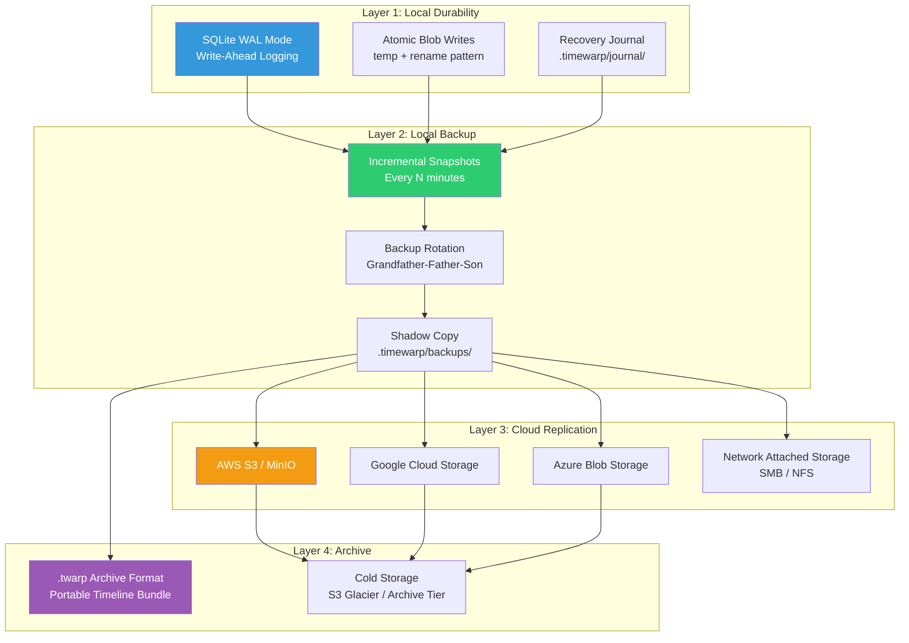
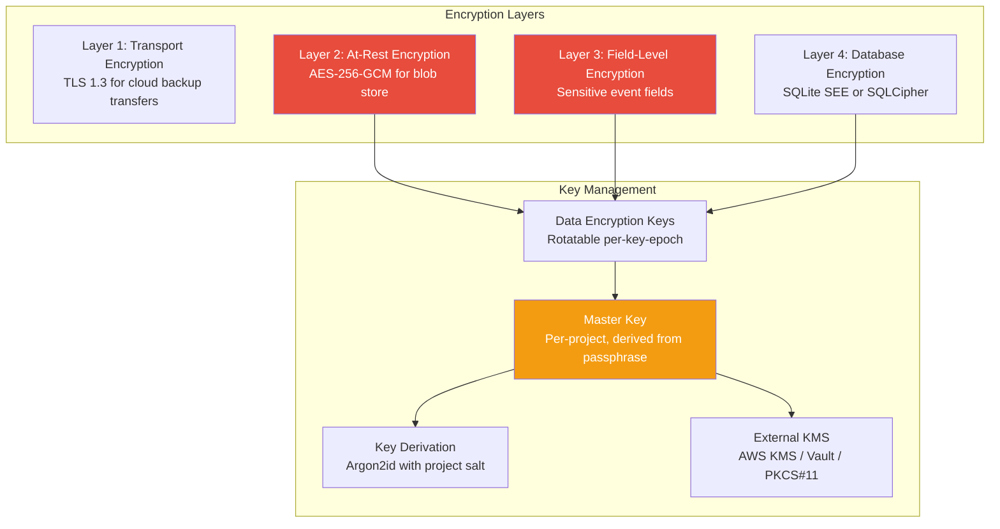
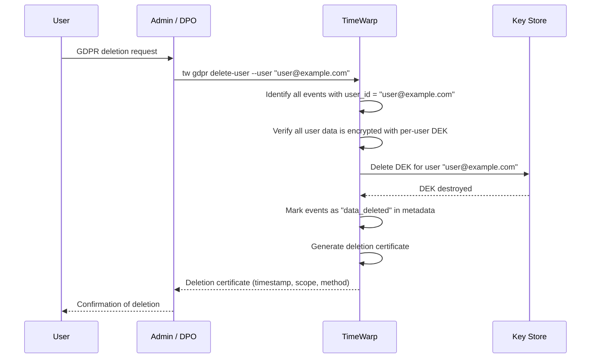
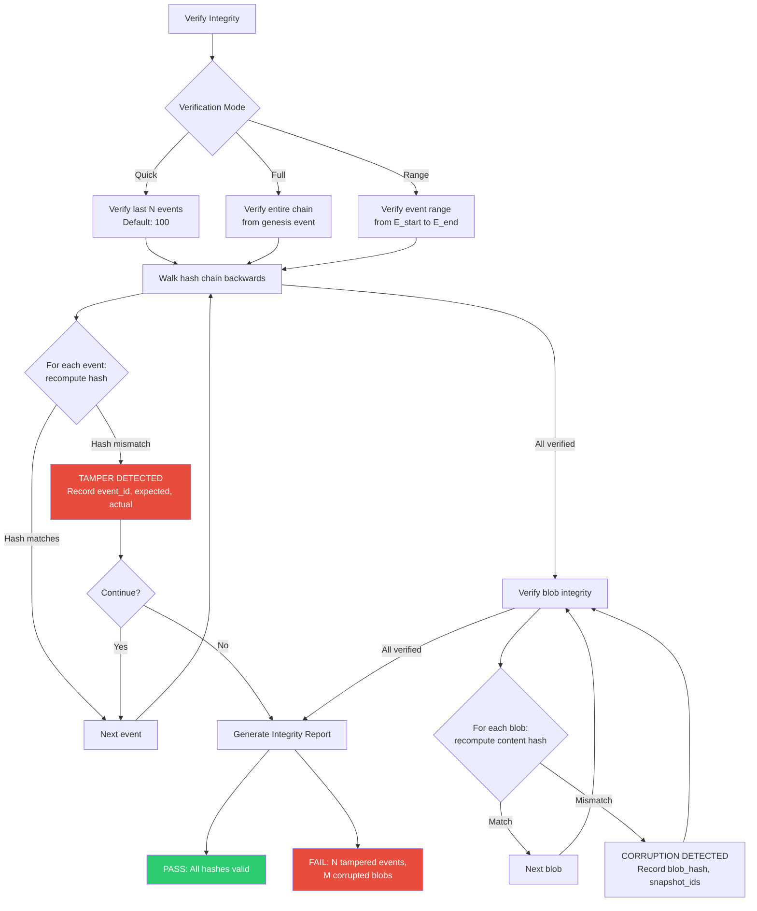

# TimeWarp: Enterprise Security & Production Readiness Research

**Version:** 1.0.0
**Date:** February 2026
**Status:** Research Document
**Scope:** All enterprise-grade and security features required for production deployment of the TimeWarp parametric timeline system
**Target:** Super-Goose (Ghenghis/Super-Goose) AI Coding Agent

---

## Table of Contents

1. [Auto-Backup System](#1-auto-backup-system)
2. [Data Encryption & Privacy](#2-data-encryption--privacy)
3. [Access Control & Multi-User](#3-access-control--multi-user)
4. [Integrity & Tamper Detection](#4-integrity--tamper-detection)
5. [Performance & Scalability](#5-performance--scalability)
6. [Monitoring & Observability](#6-monitoring--observability)
7. [Disaster Recovery Scenarios](#7-disaster-recovery-scenarios)
8. [Compliance & Regulated Industries](#8-compliance--regulated-industries)
9. [CI/CD Integration](#9-cicd-integration)
10. [Migration & Interoperability](#10-migration--interoperability)

---

## 1. Auto-Backup System

### 1.1 Architecture Overview

The backup system operates as a layered defense against data loss, from continuous local journaling through to geo-redundant cloud replication.



### 1.2 Continuous Incremental Backups

**Design:** The backup engine tracks a high-water mark (`last_backed_up_event_id`) in the event store. On each backup cycle, it exports only events and blobs created since the last successful backup.

**Backup Unit:** A single incremental backup consists of:

| Component | Contents | Format |
|-----------|----------|--------|
| `events.jsonl` | New events since last backup | JSON Lines (one event per line) |
| `snapshots.jsonl` | New snapshot metadata | JSON Lines |
| `blobs/` | New blob files (content-addressed) | Raw compressed (zstd) |
| `manifest.json` | Backup metadata, checksums, watermarks | JSON |

**Scheduling Options:**

```toml
[timewarp.backup]
enabled = true
strategy = "incremental"          # "incremental" | "full" | "differential"

# Time-based triggers
interval_minutes = 15             # Backup every 15 minutes during active sessions
idle_backup_after_minutes = 5     # Backup when idle for 5 minutes

# Event-based triggers
on_session_end = true             # Always backup when session ends
on_branch_merge = true            # Backup after branch merges
on_milestone = true               # Backup on milestone events (tests pass, build success)
after_n_events = 100              # Backup after every 100 events

# Full backup schedule
full_backup_interval_hours = 24   # One full backup daily
```

**Implementation: Incremental Backup Algorithm**

```rust
struct BackupEngine {
    /// Last successfully backed up event ID
    watermark: Option<String>,
    /// Backup target (local, S3, GCS, etc.)
    target: Box<dyn BackupTarget>,
    /// Checksum registry for integrity
    checksums: HashMap<String, String>,
}

impl BackupEngine {
    async fn run_incremental(&mut self, event_store: &EventStore, blob_store: &BlobStore) -> Result<BackupManifest> {
        // 1. Query events since watermark
        let new_events = event_store.events_since(&self.watermark).await?;
        if new_events.is_empty() {
            return Ok(BackupManifest::no_changes());
        }

        // 2. Collect referenced snapshots and blobs
        let snapshot_ids: HashSet<String> = new_events.iter()
            .filter_map(|e| e.snapshot_id.clone())
            .collect();
        let blob_hashes: HashSet<String> = self.collect_new_blobs(&snapshot_ids, blob_store).await?;

        // 3. Write to staging area (atomic preparation)
        let staging = self.prepare_staging(&new_events, &snapshot_ids, &blob_hashes).await?;

        // 4. Upload to target (resumable, checksummed)
        let manifest = self.target.upload(staging).await?;

        // 5. Verify upload integrity
        self.verify_remote(&manifest).await?;

        // 6. Update watermark
        self.watermark = new_events.last().map(|e| e.event_id.clone());

        Ok(manifest)
    }
}
```

### 1.3 Point-in-Time Recovery (PITR)

PITR allows restoring the TimeWarp database to any arbitrary point in time, not just backup boundaries.

**Mechanism:** Combine SQLite WAL journaling with the event store's append-only nature.

| Recovery Target | Method | Granularity |
|----------------|--------|-------------|
| Last clean state | SQLite WAL replay | Transaction-level |
| Specific event | Replay events up to target `event_id` | Event-level |
| Specific timestamp | Replay events up to target `created_at` | Second-level |
| Pre-backup state | Restore from backup manifest watermark | Backup-cycle-level |

**PITR Procedure:**

```
1. Identify target point (event_id or timestamp)
2. Find the most recent full backup BEFORE the target
3. Restore the full backup to a staging area
4. Apply incremental backups up to the target
5. Verify hash chain integrity of restored state
6. Swap staging area into .timewarp/ (atomic directory rename)
7. Verify final state integrity
```

### 1.4 The .twarp Archive Format

A `.twarp` file is a portable, self-contained timeline archive. It is a standard ZIP file with a defined internal structure.

**Structure:**

```
timeline-export-2026-02-10.twarp
|-- manifest.json              # Version, metadata, creation info
|-- schema_version             # Integer schema version (e.g., "1")
|-- events.db                  # SQLite database (events, snapshots, branches tables)
|-- blobs/
|   |-- aa/
|   |   |-- aa1b2c3d...       # Content-addressed blobs (first 2 chars as directory sharding)
|   |   |-- aa4e5f6g...
|   |-- bb/
|   |   |-- bb7h8i9j...
|-- checksums.blake3           # BLAKE3 checksums for every file in archive
|-- signature.sig              # Optional: Ed25519 signature of checksums file
```

**manifest.json:**

```json
{
  "format_version": "1.0.0",
  "created_at": "2026-02-10T15:30:00Z",
  "created_by": "user@example.com",
  "project_name": "my-api-server",
  "event_count": 1523,
  "branch_count": 7,
  "blob_count": 892,
  "total_size_bytes": 45_678_912,
  "hash_chain_root": "sha256:a1b2c3d4...",
  "hash_chain_tip": "sha256:e5f6g7h8...",
  "encryption": {
    "algorithm": "aes-256-gcm",
    "key_derivation": "argon2id",
    "encrypted_fields": ["events.inputs", "events.outputs"]
  }
}
```

**CLI Operations:**

```bash
# Export full timeline
tw archive export --output project.twarp

# Export specific branch
tw archive export --branch feature-auth --output auth-branch.twarp

# Export time range
tw archive export --from 2026-02-01 --to 2026-02-10 --output week.twarp

# Import archive
tw archive import project.twarp --merge    # Merge into existing
tw archive import project.twarp --replace  # Replace current timeline

# Inspect without importing
tw archive inspect project.twarp
```

### 1.5 Cloud Backup Targets

**Unified Storage Abstraction:**

Recommended crate: `opendal` (Apache OpenDAL) -- provides a unified API for 30+ storage backends.

| Target | Configuration | Authentication | Notes |
|--------|--------------|----------------|-------|
| **AWS S3** | Bucket, region, prefix | IAM role, access key, STS | Use multipart upload for large blobs |
| **Google Cloud Storage** | Bucket, prefix | Service account JSON, OIDC | Enable object versioning for extra safety |
| **Azure Blob Storage** | Container, prefix | SAS token, managed identity | Use cool tier for archives |
| **MinIO** | Endpoint, bucket, prefix | Access key/secret | S3-compatible, self-hosted |
| **Backblaze B2** | Bucket, prefix | Application key | Cost-effective archive storage |
| **Local/NAS** | Path | Filesystem permissions | SMB/NFS mount point |

**Configuration Example:**

```toml
[timewarp.backup.target]
type = "s3"
bucket = "company-timewarp-backups"
region = "us-west-2"
prefix = "projects/my-api/"
encryption = "sse-s3"                    # Server-side encryption
storage_class = "INTELLIGENT_TIERING"    # Auto-tier based on access patterns

[timewarp.backup.target.credentials]
source = "env"                           # "env" | "profile" | "instance_role" | "static"
# For "env": reads AWS_ACCESS_KEY_ID, AWS_SECRET_ACCESS_KEY
# For "profile": reads from ~/.aws/credentials
# For "instance_role": uses EC2/ECS instance role
```

### 1.6 Backup Verification

Every backup undergoes a three-phase verification:

**Phase 1: Pre-Upload Integrity**
- Compute BLAKE3 checksum of every file in the staging area
- Verify event hash chain continuity from watermark to tip
- Verify all referenced blobs exist and match their content-addressed hashes

**Phase 2: Post-Upload Verification**
- Read back checksums from the remote target
- Compare remote checksums against local checksums
- Verify object counts match (events, snapshots, blobs)

**Phase 3: Periodic Restore Test (Optional)**
- Automated "restore drill" on a configurable schedule (weekly by default)
- Restore the latest backup to a temporary directory
- Run full integrity verification on the restored state
- Report pass/fail to monitoring system
- Clean up temporary directory

```toml
[timewarp.backup.verification]
pre_upload = true           # Always verify before upload
post_upload = true          # Verify after upload
restore_drill = true        # Periodic restore test
restore_drill_cron = "0 2 * * 0"  # Every Sunday at 2 AM
restore_drill_notify = "admin@company.com"
```

### 1.7 Backup Scheduling: Grandfather-Father-Son Rotation

```
Retention Policy (default):
- Last 24 hours:  Keep every backup         (Hourly granularity)
- Last 7 days:    Keep 1 per day at midnight (Daily)
- Last 4 weeks:   Keep 1 per week on Sunday  (Weekly)
- Last 12 months: Keep 1 per month on 1st    (Monthly)
- Beyond 1 year:  Keep 1 per quarter         (Quarterly)
```

```toml
[timewarp.backup.retention]
hourly_keep_hours = 24
daily_keep_days = 7
weekly_keep_weeks = 4
monthly_keep_months = 12
quarterly_keep_quarters = 8    # 2 years of quarterly backups
max_total_size_gb = 50         # Hard cap on backup storage
```

### 1.8 Disaster Recovery: Corrupted or Deleted .timewarp/

**Scenario Matrix:**

| Scenario | Detection | Recovery Path |
|----------|-----------|---------------|
| SQLite DB corrupted | Startup integrity check fails | Restore from latest backup; replay WAL journal |
| Partial blob loss | Snapshot reconstruction fails | Restore missing blobs from backup; mark unrecoverable snapshots |
| Complete `.timewarp/` deleted | Directory missing on startup | Full restore from cloud backup |
| Disk failure | OS-level error | Full restore from cloud backup to new disk |
| Ransomware encryption | File content unreadable | Restore from off-site cloud backup (separate credentials) |
| Gradual bit rot | Periodic integrity check detects mismatch | Replace affected blobs from backup; re-verify chain |

**Emergency Recovery Command:**

```bash
# Full restore from cloud
tw recover --from s3://bucket/prefix --to .timewarp/

# Restore specific point in time
tw recover --from s3://bucket/prefix --pitr 2026-02-09T14:00:00Z

# Rebuild database from blobs (if DB is corrupt but blobs survive)
tw recover --rebuild-db

# Last resort: reconstruct from git history
tw recover --from-git --repo .
```

---

## 2. Data Encryption & Privacy

### 2.1 Encryption Architecture



### 2.2 At-Rest Encryption for Blobs and Database

**Blob Encryption:**

Each blob in `.timewarp/blobs/` is encrypted individually using AES-256-GCM with a per-blob nonce derived from the blob's content hash. This allows deduplication to still work (identical plaintext produces identical ciphertext when using deterministic nonces derived from content).

```rust
struct EncryptedBlobStore {
    /// Data encryption key (rotatable)
    dek: [u8; 32],
    /// Key epoch (incremented on rotation)
    key_epoch: u64,
}

impl EncryptedBlobStore {
    fn encrypt_blob(&self, content: &[u8], blob_hash: &str) -> Result<Vec<u8>> {
        // Deterministic nonce from blob hash (enables deduplication)
        let nonce = derive_nonce(blob_hash, self.key_epoch);
        let cipher = Aes256Gcm::new(&self.dek.into());
        let encrypted = cipher.encrypt(&nonce, content)?;

        // Prepend key epoch and nonce for decryption
        let mut output = Vec::with_capacity(8 + 12 + encrypted.len());
        output.extend_from_slice(&self.key_epoch.to_le_bytes());
        output.extend_from_slice(nonce.as_slice());
        output.extend_from_slice(&encrypted);
        Ok(output)
    }

    fn decrypt_blob(&self, encrypted: &[u8]) -> Result<Vec<u8>> {
        let key_epoch = u64::from_le_bytes(encrypted[..8].try_into()?);
        let nonce = &encrypted[8..20];
        let ciphertext = &encrypted[20..];

        let dek = self.get_dek_for_epoch(key_epoch)?;
        let cipher = Aes256Gcm::new(&dek.into());
        Ok(cipher.decrypt(nonce.into(), ciphertext)?)
    }
}
```

**Database Encryption:**

Two recommended approaches:

| Approach | Crate | License | Notes |
|----------|-------|---------|-------|
| **SQLCipher** | `rusqlite` with `bundled-sqlcipher` feature | BSD | Industry standard, transparent encryption, 256-bit AES |
| **Application-level** | `aes-gcm` + custom wrapper | MIT/Apache | Encrypt sensitive columns only, allows partial indexing |

**Recommended: SQLCipher** for full database encryption. It encrypts the entire database file transparently, including WAL and journal files.

```toml
[timewarp.encryption]
enabled = true
algorithm = "aes-256-gcm"

[timewarp.encryption.database]
method = "sqlcipher"            # "sqlcipher" | "application_level" | "none"

[timewarp.encryption.blobs]
method = "aes-256-gcm"         # "aes-256-gcm" | "chacha20-poly1305" | "none"
```

### 2.3 Encryption Key Management

**Key Hierarchy:**

```
Root Key (never stored -- derived from passphrase or KMS)
  |
  +-- Master Key (encrypted by Root Key, stored in .timewarp/keyring)
        |
        +-- DEK Epoch 1 (encrypted by Master Key)
        |     Used for blobs/events created in epoch 1
        |
        +-- DEK Epoch 2 (encrypted by Master Key)
        |     Current epoch after key rotation
        |
        +-- Backup Key (encrypted by Master Key)
              Used for encrypting cloud backups
```

**Key Sources (in priority order):**

| Source | Configuration | Use Case |
|--------|--------------|----------|
| **Hardware Security Module** | PKCS#11 URI | Regulated industries |
| **AWS KMS** | KMS key ARN | AWS-deployed teams |
| **HashiCorp Vault** | Vault path | Enterprise key management |
| **OS Keychain** | Automatic detection | macOS Keychain, Windows DPAPI, Linux Secret Service |
| **Environment Variable** | `TW_ENCRYPTION_KEY` | CI/CD pipelines |
| **Passphrase** | Interactive prompt | Developer workstations |
| **Config File** | `.timewarp/keyring` (encrypted) | Automated workflows |

```toml
[timewarp.encryption.keys]
source = "os_keychain"          # "kms" | "vault" | "os_keychain" | "env" | "passphrase" | "file"

# AWS KMS configuration
[timewarp.encryption.keys.kms]
key_arn = "arn:aws:kms:us-west-2:123456789:key/abc-def"
region = "us-west-2"

# Vault configuration
[timewarp.encryption.keys.vault]
address = "https://vault.company.com"
path = "secret/timewarp/master-key"
auth_method = "approle"         # "token" | "approle" | "kubernetes"
```

**Key Rotation:**

```bash
# Rotate the data encryption key
tw keys rotate

# Re-encrypt all blobs with the new key (background operation)
tw keys reencrypt --batch-size 1000

# Check rotation status
tw keys status
```

Key rotation creates a new DEK epoch. Old DEKs are retained (encrypted by the master key) so that blobs encrypted with previous epochs can still be decrypted. Re-encryption of existing blobs is optional and can be performed as a background operation.

### 2.4 Sensitive Data Detection and Redaction

TimeWarp must detect and redact sensitive data that agents may encounter or generate in event metadata (inputs, outputs, file contents).

**Detection Patterns:**

| Category | Patterns | Action |
|----------|----------|--------|
| **API Keys** | `sk-...`, `AKIA...`, `ghp_...`, `gho_...` | Redact in event metadata; store hash only |
| **Passwords** | `password=`, `passwd:`, `secret:` in configs | Redact value, keep key name |
| **Private Keys** | `-----BEGIN (RSA|EC|OPENSSH) PRIVATE KEY-----` | Block storage entirely |
| **Connection Strings** | `postgres://user:pass@`, `mongodb+srv://` | Redact credentials, keep host/db |
| **JWT Tokens** | `eyJ...` (Base64 with JWT structure) | Redact payload, keep header |
| **Credit Cards** | Luhn-valid 13-19 digit sequences | Redact; keep last 4 digits |
| **SSNs** | `\d{3}-\d{2}-\d{4}` | Redact entirely |
| **Email Addresses** | Standard email regex | Configurable: redact or keep |

**Implementation:**

```rust
struct SensitiveDataScanner {
    /// Compiled regex patterns for detection
    patterns: RegexSet,
    /// Redaction policy per category
    policies: HashMap<SensitiveCategory, RedactionPolicy>,
}

enum RedactionPolicy {
    /// Replace with [REDACTED]
    FullRedact,
    /// Keep partial (e.g., last 4 digits)
    PartialRedact { keep_chars: usize, position: Position },
    /// Replace with hash
    HashReplace,
    /// Block storage entirely (event rejected)
    BlockStorage,
    /// Log warning but store as-is
    WarnOnly,
}
```

**Configuration:**

```toml
[timewarp.privacy.scanning]
enabled = true
scan_event_inputs = true
scan_event_outputs = true
scan_blob_content = false        # Performance-intensive; enable for regulated industries

[timewarp.privacy.redaction]
api_keys = "hash_replace"        # "full_redact" | "partial_redact" | "hash_replace" | "block" | "warn"
passwords = "full_redact"
private_keys = "block"
connection_strings = "partial_redact"
jwt_tokens = "hash_replace"
credit_cards = "partial_redact"
ssns = "full_redact"
emails = "warn"
```

### 2.5 GDPR/CCPA Compliance: Right to Deletion

TimeWarp's append-only event store poses a challenge for "right to deletion" requirements under GDPR Article 17 and CCPA.

**Approach: Crypto-Shredding**

Rather than modifying the immutable event chain (which would break the hash chain), implement crypto-shredding:

1. Each user's data is encrypted with a per-user Data Encryption Key (DEK)
2. When a deletion request is received, the user's DEK is permanently destroyed
3. The encrypted data remains in the event store but is irrecoverable
4. The hash chain remains intact (hashes of encrypted data, not plaintext)



**Deletion Certificate:**

```json
{
  "certificate_id": "del-2026-02-10-abc123",
  "requested_by": "user@example.com",
  "processed_at": "2026-02-10T16:00:00Z",
  "method": "crypto_shredding",
  "scope": {
    "events_affected": 342,
    "blobs_affected": 128,
    "branches_affected": 3
  },
  "dek_destroyed": true,
  "hash_chain_intact": true,
  "verified_by": "admin@company.com"
}
```

### 2.6 Audit Log for TimeWarp Operations

A separate, append-only audit log records every operation performed on the TimeWarp system itself (distinct from the agent event store).

**Audit Events:**

| Operation | Logged Fields | Retention |
|-----------|---------------|-----------|
| Timeline access (read) | user, timestamp, event_range, source_ip | 90 days |
| Timeline export | user, timestamp, format, destination | 1 year |
| Branch create/delete | user, timestamp, branch_name, reason | Permanent |
| Backup initiated/completed | user, timestamp, target, size, status | 1 year |
| Key rotation | user, timestamp, old_epoch, new_epoch | Permanent |
| GDPR deletion | user, timestamp, scope, certificate_id | Permanent |
| Configuration change | user, timestamp, key, old_value, new_value | Permanent |
| Failed authentication | user, timestamp, source_ip, method | 1 year |
| Integrity check result | system, timestamp, pass/fail, details | Permanent |

**Storage:** Separate SQLite database (`.timewarp/audit.db`) with its own hash chain. The audit log is never deleted or compacted.

```sql
CREATE TABLE audit_log (
    audit_id     TEXT PRIMARY KEY,
    timestamp    TEXT NOT NULL,
    user_id      TEXT,
    operation    TEXT NOT NULL,
    resource     TEXT,
    details      TEXT,         -- JSON
    source_ip    TEXT,
    prev_hash    TEXT NOT NULL,
    audit_hash   TEXT NOT NULL
);

CREATE INDEX idx_audit_timestamp ON audit_log(timestamp);
CREATE INDEX idx_audit_user ON audit_log(user_id);
CREATE INDEX idx_audit_operation ON audit_log(operation);
```

---

## 3. Access Control & Multi-User

### 3.1 Role-Based Access Control (RBAC)

```mermaid
graph TB
    subgraph "Roles"
        VIEWER[Viewer<br/>Read-only access]
        EDITOR[Editor<br/>Create events/branches]
        REVIEWER[Reviewer<br/>Approve merges]
        ADMIN[Admin<br/>Full control]
        OWNER[Owner<br/>Manage access]
    end

    subgraph "Permissions"
        READ[Read Timeline]
        WRITE[Create Events]
        BRANCH[Create/Delete Branches]
        MERGE[Merge Branches]
        EXPORT[Export Archives]
        BACKUP[Manage Backups]
        ENCRYPT[Manage Keys]
        CONFIG[Change Config]
        DELETE[Delete Data]
        AUDIT[View Audit Log]
    end

    VIEWER --> READ
    EDITOR --> READ
    EDITOR --> WRITE
    EDITOR --> BRANCH
    REVIEWER --> READ
    REVIEWER --> WRITE
    REVIEWER --> BRANCH
    REVIEWER --> MERGE
    ADMIN --> READ
    ADMIN --> WRITE
    ADMIN --> BRANCH
    ADMIN --> MERGE
    ADMIN --> EXPORT
    ADMIN --> BACKUP
    ADMIN --> AUDIT
    OWNER --> READ
    OWNER --> WRITE
    OWNER --> BRANCH
    OWNER --> MERGE
    OWNER --> EXPORT
    OWNER --> BACKUP
    OWNER --> ENCRYPT
    OWNER --> CONFIG
    OWNER --> DELETE
    OWNER --> AUDIT

    style OWNER fill:#e74c3c,color:#fff
    style ADMIN fill:#f39c12,color:#fff
    style REVIEWER fill:#3498db,color:#fff
    style EDITOR fill:#2ecc71,color:#fff
    style VIEWER fill:#95a5a6,color:#fff
```



**Permission Matrix:**

| Permission | Viewer | Editor | Reviewer | Admin | Owner |
|------------|--------|--------|----------|-------|-------|
| Read timeline events | Yes | Yes | Yes | Yes | Yes |
| View snapshots/diffs | Yes | Yes | Yes | Yes | Yes |
| Create events | -- | Yes | Yes | Yes | Yes |
| Create branches | -- | Yes | Yes | Yes | Yes |
| Delete branches | -- | Own only | Own only | Yes | Yes |
| Merge branches | -- | -- | Yes | Yes | Yes |
| Export archives | -- | -- | -- | Yes | Yes |
| Manage backups | -- | -- | -- | Yes | Yes |
| View audit log | -- | -- | -- | Yes | Yes |
| Manage encryption keys | -- | -- | -- | -- | Yes |
| Change configuration | -- | -- | -- | -- | Yes |
| Delete timeline data | -- | -- | -- | -- | Yes |
| Manage user access | -- | -- | -- | -- | Yes |

### 3.2 Per-Branch Permissions

Beyond global roles, TimeWarp supports per-branch access controls:

```toml
[timewarp.branches.protection]

[timewarp.branches.protection.main]
level = "protected"              # "none" | "warn" | "protected" | "locked"
require_approval_for_merge = true
min_approvals = 1
allowed_mergers = ["admin", "lead-dev"]
allow_force_delete = false

[timewarp.branches.protection."release/*"]
level = "locked"                 # Immutable after creation
allow_force_delete = false

[timewarp.branches.protection."feature/*"]
level = "warn"
require_approval_for_merge = false
```

**Branch Lock States:**

| State | Can Add Events | Can Merge Into | Can Delete | Use Case |
|-------|---------------|----------------|------------|----------|
| `none` | Yes | Yes | Yes | Feature branches |
| `warn` | Yes (with warning) | Yes (with warning) | Yes (with confirmation) | Development branches |
| `protected` | Yes | Requires approval | Admin only | Main branch |
| `locked` | No | No | No | Released versions, audit-frozen branches |

### 3.3 SSO/SAML/OIDC Integration

For enterprise identity integration, TimeWarp supports external authentication providers.

**Supported Protocols:**

| Protocol | Use Case | Library |
|----------|----------|---------|
| **OIDC** (OpenID Connect) | Okta, Auth0, Google Workspace, Azure AD | `openidconnect` crate |
| **SAML 2.0** | Enterprise SSO (Ping, ADFS) | `samael` crate |
| **LDAP** | On-premises Active Directory | `ldap3` crate |
| **API Key** | CI/CD pipelines, service accounts | Custom (HMAC-SHA256) |
| **mTLS** | Machine-to-machine, high-security | `rustls` with client certs |

**OIDC Configuration:**

```toml
[timewarp.auth]
method = "oidc"                  # "local" | "oidc" | "saml" | "ldap" | "api_key"

[timewarp.auth.oidc]
issuer = "https://company.okta.com"
client_id = "0oa1b2c3d4..."
client_secret_env = "TW_OIDC_SECRET"
scopes = ["openid", "profile", "email", "groups"]
audience = "timewarp"

# Group-to-role mapping
[timewarp.auth.oidc.role_mapping]
"timewarp-admins" = "admin"
"timewarp-reviewers" = "reviewer"
"engineering" = "editor"
"*" = "viewer"                   # Default role
```

### 3.4 Team-Level Timeline Sharing

For collaborative use, timelines can be shared across teams with configurable access:

**Sharing Modes:**

| Mode | Description | Storage |
|------|-------------|---------|
| **Local-only** | Single-user, no sharing | Local `.timewarp/` |
| **Shared filesystem** | Team shares `.timewarp/` via NFS/SMB | Network mount |
| **Centralized server** | TimeWarp server with API access | PostgreSQL + S3 backend |
| **Peer-to-peer** | Direct sync between workstations | CRDTs over WebSocket |

**Server Mode Architecture (recommended for enterprise):**

```
                        +-----------------------+
                        |  TimeWarp Server      |
                        |  (Rust, Axum)         |
                        |                       |
                        |  +-- PostgreSQL ----+ |
                        |  |  Events, Metadata| |
                        |  +------------------+ |
                        |                       |
                        |  +-- S3/GCS --------+ |
                        |  |  Blobs, Backups  | |
                        |  +------------------+ |
                        |                       |
                        |  +-- Redis ---------+ |
                        |  |  Sessions, Cache | |
                        |  +------------------+ |
                        +-----------+-----------+
                                    |
                    +---------------+---------------+
                    |               |               |
              +-----+-----+  +-----+-----+  +-----+-----+
              | Developer 1|  | Developer 2|  |   CI/CD   |
              | Local TW   |  | Local TW   |  |   Agent   |
              +------------+  +------------+  +-----------+
```

### 3.5 Namespace Isolation for Multi-Tenant Deployments

In a shared TimeWarp server, each tenant (organization) must have complete data isolation.

**Isolation Guarantees:**

| Layer | Isolation Mechanism |
|-------|-------------------|
| **Database** | Separate PostgreSQL schemas per tenant, or separate databases |
| **Blob Storage** | Separate S3 prefixes (or buckets) per tenant |
| **Encryption** | Separate master keys per tenant |
| **Network** | Tenant-scoped API tokens; no cross-tenant API access |
| **Audit** | Separate audit logs per tenant |
| **Backup** | Separate backup schedules and targets per tenant |

```toml
[timewarp.multi_tenant]
enabled = true
isolation = "schema"             # "schema" | "database" | "bucket"
tenant_id_source = "oidc_claim"  # Extract tenant from OIDC token claim
tenant_id_claim = "org_id"
```

---

## 4. Integrity & Tamper Detection

### 4.1 Hash Chain Verification

The existing architecture defines a linear hash chain where each event includes the hash of its predecessor. This section extends it to a full DAG hash chain and specifies verification procedures.

**Current Hash Computation (from ARCHITECTURE_BLUEPRINT.md):**

```
event_hash = SHA256(
    event_id +
    parent_ids.join(",") +
    branch_id +
    event_type +
    JSON(inputs) +
    JSON(outputs) +
    snapshot_id +
    prev_hash +
    created_at.to_string()
)
```

**Extended Verification Procedure:**



**Verification Levels:**

| Level | What It Checks | Time (10K events) | When to Use |
|-------|---------------|-------------------|-------------|
| `quick` | Last 100 events hash chain | < 100ms | Every startup |
| `chain` | Complete event hash chain | < 2 seconds | Daily |
| `full` | Hash chain + all blob hashes | 10-60 seconds | Weekly |
| `deep` | Full + snapshot reconstruction test | 1-10 minutes | Monthly / Before archive |

### 4.2 Digital Signatures on Events

For regulated industries, individual events can be digitally signed to provide non-repudiation.

**Signature Scheme:** Ed25519 (fast, small signatures, deterministic)

```rust
struct SignedEvent {
    event: Event,
    /// Ed25519 signature of event_hash
    signature: [u8; 64],
    /// Public key of the signer
    signer_public_key: [u8; 32],
    /// Certificate chain (optional, for enterprise PKI)
    certificate_chain: Option<Vec<X509Certificate>>,
}
```

**Signing Flow:**

```
1. Agent creates event with all fields populated
2. event_hash is computed (SHA-256 of canonical event representation)
3. Agent's private key signs the event_hash
4. Signature + public key are stored alongside the event
5. Verifier checks: signature(event_hash, public_key) == valid
```

**Key Storage for Signing:**

| Approach | Security Level | Use Case |
|----------|---------------|----------|
| Software keystore | Medium | Developer workstations |
| YubiKey / Smart Card | High | Regulated environments |
| HSM (PKCS#11) | Very High | Government / Financial |
| Cloud KMS signing | High | Cloud-deployed agents |

```toml
[timewarp.integrity.signatures]
enabled = false                   # Opt-in for regulated industries
algorithm = "ed25519"
key_source = "os_keychain"        # "os_keychain" | "yubikey" | "hsm" | "cloud_kms"
require_signature_for_merge = true
```

### 4.3 Merkle Tree for Efficient Integrity Verification

For large timelines (100K+ events), linear hash chain verification is too slow. A Merkle tree provides O(log n) verification of any event's integrity.

**Structure:**

```
                    Root Hash
                   /          \
            Hash(L1+L2)      Hash(L3+L4)
            /       \        /       \
      Hash(E1+E2)  Hash(E3+E4)  Hash(E5+E6)  Hash(E7+E8)
        /   \       /   \       /   \       /   \
      E1    E2    E3    E4    E5    E6    E7    E8
```

**Benefits:**

| Operation | Hash Chain | Merkle Tree |
|-----------|-----------|-------------|
| Verify single event | O(n) | O(log n) |
| Verify event range | O(range) | O(log n) |
| Detect first tampered event | O(n) | O(log n) |
| Proof of inclusion | O(n) | O(log n) proof size |
| Incremental update | O(1) | O(log n) |

**Implementation:**

```rust
struct MerkleTree {
    /// Leaf hashes (event hashes)
    leaves: Vec<[u8; 32]>,
    /// Internal node hashes
    nodes: Vec<Vec<[u8; 32]>>,
    /// Root hash
    root: [u8; 32],
}

impl MerkleTree {
    /// Generate a proof that an event is included in the tree
    fn proof_of_inclusion(&self, event_index: usize) -> MerkleProof {
        // Returns sibling hashes along the path from leaf to root
        // Verifier can recompute root from event_hash + proof
    }

    /// Verify a proof against a known root hash
    fn verify_proof(root: &[u8; 32], event_hash: &[u8; 32], proof: &MerkleProof) -> bool {
        let computed_root = proof.compute_root(event_hash);
        computed_root == *root
    }
}
```

The Merkle root is stored periodically (every 1000 events, or at backup boundaries) and can be published to an external transparency log for tamper-evident auditing.

### 4.4 Chain-of-Custody Audit Trail

For compliance scenarios, TimeWarp provides a chain-of-custody record showing every access to and modification of the timeline.

**Custody Events:**

```json
{
  "custody_id": "cust-2026-02-10-001",
  "timestamp": "2026-02-10T14:30:00Z",
  "actor": "user@company.com",
  "action": "timeline_export",
  "scope": {
    "branches": ["main", "feature-auth"],
    "event_range": ["E1", "E500"],
    "export_format": "twarp"
  },
  "justification": "Code review for audit",
  "destination": "s3://audit-exports/review-2026-Q1.twarp",
  "checksum": "blake3:a1b2c3d4...",
  "prev_custody_hash": "sha256:e5f6g7h8..."
}
```

The custody chain is itself hash-chained and can be exported for external audit.

---

## 5. Performance & Scalability

### 5.1 Storage Budget and Auto-Archival

```toml
[timewarp.storage]
max_total_size_gb = 10            # Maximum .timewarp/ size
warning_threshold_percent = 70    # Warn at 70% usage
critical_threshold_percent = 90   # Auto-archive at 90% usage

[timewarp.storage.archival]
enabled = true
archive_events_older_than_days = 90
archive_target = "s3://company-archive/timewarp/"
keep_milestones = true            # Never archive milestone events
keep_branch_heads = true          # Keep the latest event on each branch
compaction_schedule = "weekly"    # "daily" | "weekly" | "monthly"
```

**Auto-Archival Flow:**

```
1. Storage exceeds 90% of quota
2. Identify events older than retention threshold
3. Exclude: milestone events, branch head events, events with active references
4. Export archivable events to .twarp archive
5. Upload archive to cloud storage
6. Verify archive integrity
7. Remove archived events from local store
8. Compact SQLite database (VACUUM)
9. Update Merkle tree
10. Log archival operation to audit trail
```

### 5.2 Event Retention Policies

| Policy | Description | Default |
|--------|-------------|---------|
| **Time-based** | Archive events older than N days | 90 days |
| **Count-based** | Keep last N events per branch | 10,000 |
| **Size-based** | Archive when storage exceeds N GB | 10 GB |
| **Milestone-based** | Never archive milestone events | Always keep |
| **Branch-based** | Keep full history for protected branches | main, release/* |

### 5.3 Blob Deduplication Across Branches

The content-addressed blob store inherently deduplicates: identical file contents produce identical blob hashes regardless of which branch or snapshot references them.

**Deduplication Statistics Tracking:**

```sql
-- Track deduplication efficiency
CREATE TABLE blob_references (
    blob_hash    TEXT NOT NULL,
    snapshot_id  TEXT NOT NULL,
    file_path    TEXT NOT NULL,
    PRIMARY KEY (blob_hash, snapshot_id, file_path)
);

-- Query: deduplication ratio
-- SELECT COUNT(DISTINCT blob_hash) as unique_blobs,
--        COUNT(*) as total_references,
--        1.0 - (COUNT(DISTINCT blob_hash) * 1.0 / COUNT(*)) as dedup_ratio
-- FROM blob_references;
```

**Expected Deduplication Ratios:**

| Scenario | Expected Ratio | Reason |
|----------|---------------|--------|
| Single branch, sequential edits | 60-80% | Most files unchanged between snapshots |
| Multiple branches from same fork | 80-95% | Branches share most files |
| Long-running project | 70-90% | Dependency files rarely change |

### 5.4 SQLite Performance Tuning

**Required PRAGMAs (set at database initialization):**

```sql
-- Write-Ahead Logging for concurrent reads during writes
PRAGMA journal_mode = WAL;

-- Normal sync is safe with WAL mode and significantly faster than FULL
PRAGMA synchronous = NORMAL;

-- 64MB cache (default is 2MB, far too small for timeline queries)
PRAGMA cache_size = -65536;

-- 4KB page size (matches most filesystem block sizes)
PRAGMA page_size = 4096;

-- Memory-mapped I/O for read performance (256MB)
PRAGMA mmap_size = 268435456;

-- Busy timeout of 5 seconds (for concurrent access)
PRAGMA busy_timeout = 5000;

-- Enable foreign keys
PRAGMA foreign_keys = ON;

-- Temp store in memory
PRAGMA temp_store = MEMORY;
```

**WAL Checkpoint Strategy:**

```toml
[timewarp.database]
wal_checkpoint_interval_events = 100    # Checkpoint after every 100 events
wal_checkpoint_interval_seconds = 30    # Or every 30 seconds
wal_checkpoint_mode = "PASSIVE"         # "PASSIVE" | "FULL" | "RESTART" | "TRUNCATE"
auto_vacuum = "incremental"             # "none" | "full" | "incremental"
```

### 5.5 Performance Targets

| Operation | Target | Measurement Method |
|-----------|--------|-------------------|
| Event recording | < 5ms p99 | From MCP intercept to DB commit |
| Snapshot creation (delta) | < 20ms p99 | For workspaces < 1000 files |
| Snapshot reconstruction | < 50ms p99 | Walking delta chain and collecting blobs |
| Timeline scrubbing (UI) | 60fps | Rendering 10K+ events with smooth scrolling |
| Jump to past state | < 2 seconds | Full workspace reconstruction for 500 files |
| Branch creation | < 1ms | Metadata-only operation |
| Hash chain verification (quick) | < 100ms | Last 100 events |
| Incremental backup | < 30 seconds | For 1000 new events + blobs |
| Full integrity check | < 60 seconds | 100K events + all blobs |
| Search across events | < 200ms | Full-text search over 100K events |

### 5.6 Memory-Mapped Blob Access

For large workspaces, use memory-mapped file access to avoid loading entire blobs into heap memory:

```rust
use memmap2::Mmap;

struct MmapBlobStore {
    blob_dir: PathBuf,
}

impl MmapBlobStore {
    fn read_blob(&self, hash: &str) -> Result<Mmap> {
        let path = self.blob_path(hash);
        let file = File::open(&path)?;
        let mmap = unsafe { Mmap::map(&file)? };
        Ok(mmap)
    }

    fn blob_path(&self, hash: &str) -> PathBuf {
        // Shard into subdirectories by first 2 characters
        // Prevents filesystem slowdown from too many files in one directory
        let (prefix, rest) = hash.split_at(2);
        self.blob_dir.join(prefix).join(rest)
    }
}
```

**Benefits:**
- OS handles caching automatically (page cache)
- Multiple processes can share the same mapped pages
- No heap allocation for large files
- Lazy loading: only pages that are actually read incur I/O

---

## 6. Monitoring & Observability

### 6.1 TimeWarp Health Metrics

```mermaid
graph TB
    subgraph "Metrics Collection"
        EC[Event Counter<br/>events_total{branch, type}]
        SC[Snapshot Counter<br/>snapshots_total{type}]
        BC[Blob Counter<br/>blobs_total, blobs_size_bytes]
        SS[Storage Size<br/>storage_bytes{component}]
        CD[Chain Depth<br/>chain_depth{branch}]
        BU[Backup Status<br/>backup_last_success_timestamp]
        IC[Integrity Check<br/>integrity_check_result]
    end

    subgraph "Export Targets"
        PROM[Prometheus<br/>:9090/metrics]
        OTEL[OpenTelemetry<br/>OTLP Exporter]
        LOG[Structured Logs<br/>JSON to stdout/file]
        FILE[Metrics File<br/>.timewarp/metrics.json]
    end

    EC --> PROM
    SC --> PROM
    BC --> PROM
    SS --> PROM
    CD --> PROM
    BU --> OTEL
    IC --> OTEL
    EC --> LOG
    SS --> FILE
```

### 6.2 OpenTelemetry Integration

TimeWarp operations are instrumented with OpenTelemetry spans and metrics:

**Span Hierarchy:**

```
timewarp.session
  |-- timewarp.event.record
  |     |-- timewarp.snapshot.create
  |     |     |-- timewarp.blob.write (x N files)
  |     |-- timewarp.hash_chain.extend
  |-- timewarp.event.record
  |-- ...
  |-- timewarp.backup.run
  |     |-- timewarp.backup.stage
  |     |-- timewarp.backup.upload
  |     |-- timewarp.backup.verify
  |-- timewarp.integrity.check
```

**Metrics:**

| Metric | Type | Labels | Unit |
|--------|------|--------|------|
| `timewarp_events_total` | Counter | branch, event_type | count |
| `timewarp_events_per_second` | Gauge | branch | events/s |
| `timewarp_snapshot_create_duration_ms` | Histogram | type (full/delta) | ms |
| `timewarp_blob_write_duration_ms` | Histogram | -- | ms |
| `timewarp_blob_size_bytes` | Histogram | -- | bytes |
| `timewarp_storage_bytes` | Gauge | component (db/blobs/wal) | bytes |
| `timewarp_storage_utilization` | Gauge | -- | ratio (0-1) |
| `timewarp_chain_depth` | Gauge | branch | count |
| `timewarp_delta_chain_length` | Histogram | -- | count |
| `timewarp_backup_duration_seconds` | Histogram | target, status | seconds |
| `timewarp_backup_last_success` | Gauge | target | unix_timestamp |
| `timewarp_backup_size_bytes` | Gauge | target | bytes |
| `timewarp_integrity_check_result` | Gauge | level | 0=fail, 1=pass |
| `timewarp_branch_count` | Gauge | status (active/merged/archived) | count |
| `timewarp_jump_duration_ms` | Histogram | -- | ms |
| `timewarp_merge_conflicts` | Counter | branch_source, branch_target | count |
| `timewarp_replay_score` | Histogram | -- | ratio (0-1) |

**Configuration:**

```toml
[timewarp.telemetry]
enabled = true
exporter = "otlp"                # "otlp" | "prometheus" | "stdout" | "file"

[timewarp.telemetry.otlp]
endpoint = "http://localhost:4317"
protocol = "grpc"                # "grpc" | "http"
headers = { "Authorization" = "Bearer ${TW_OTEL_TOKEN}" }

[timewarp.telemetry.prometheus]
port = 9464
path = "/metrics"
```

### 6.3 Alerting Rules

**Critical Alerts (immediate notification):**

| Alert | Condition | Action |
|-------|-----------|--------|
| Hash chain broken | `integrity_check_result == 0` | Page on-call, block writes |
| Storage critical | `storage_utilization > 0.95` | Page on-call, auto-archive |
| Backup failed | `backup_last_success < now - 2h` | Notify admin |
| Database locked | `busy_timeout exceeded` | Restart, check for deadlocks |
| Encryption key missing | Key derivation fails | Block all operations, notify owner |

**Warning Alerts:**

| Alert | Condition | Action |
|-------|-----------|--------|
| Storage high | `storage_utilization > 0.70` | Suggest compaction |
| Delta chain long | `delta_chain_length > 50` | Schedule full snapshot |
| Slow snapshot | `snapshot_create_duration_ms p99 > 100` | Check disk I/O |
| High event rate | `events_per_second > 100` for 5 minutes | Check for event storms |
| Backup slow | `backup_duration_seconds > 300` | Check network, reduce batch size |

### 6.4 Dashboard for Timeline Analytics

**Dashboard Panels (Grafana-compatible):**

| Panel | Visualization | Data Source |
|-------|--------------|-------------|
| Event timeline | Time series (events per minute) | `timewarp_events_total` |
| Storage breakdown | Stacked bar (DB, blobs, WAL, backups) | `timewarp_storage_bytes` |
| Branch topology | Graph/node diagram | Custom query |
| Backup health | Status matrix (last 7 days) | `timewarp_backup_last_success` |
| Integrity status | Traffic light (pass/fail/unknown) | `timewarp_integrity_check_result` |
| Performance | Histogram (event recording latency) | `timewarp_snapshot_create_duration_ms` |
| Replay scores | Histogram (reproducibility distribution) | `timewarp_replay_score` |
| Cost tracking | Bar chart (LLM cost per branch) | Custom (from event metadata) |

---

## 7. Disaster Recovery Scenarios

### 7.1 Corrupted SQLite Database Recovery

**Symptoms:** `SQLITE_CORRUPT`, `SQLITE_NOTADB`, or hash chain verification failure.

**Recovery Procedure:**

```mermaid
flowchart TB
    DETECT[SQLite corruption detected] --> BACKUP_DB[Copy corrupted DB to<br/>.timewarp/backups/corrupt-{timestamp}.db]

    BACKUP_DB --> TRY_REPAIR[Attempt sqlite3 .recover]
    TRY_REPAIR -->|Success| VERIFY_REPAIR[Verify hash chain of recovered DB]
    TRY_REPAIR -->|Fail| TRY_WAL[Check WAL file for recoverable data]

    VERIFY_REPAIR -->|Pass| USE_REPAIRED[Use repaired database]
    VERIFY_REPAIR -->|Fail at event N| TRUNCATE[Truncate to last valid event<br/>Log lost events to report]

    TRY_WAL -->|WAL valid| REPLAY_WAL[Rebuild DB from WAL journal]
    TRY_WAL -->|WAL invalid| TRY_BACKUP[Restore from latest backup]

    REPLAY_WAL --> VERIFY_REPLAY[Verify rebuilt DB]
    VERIFY_REPLAY -->|Pass| USE_REBUILT[Use rebuilt database]
    VERIFY_REPLAY -->|Fail| TRY_BACKUP

    TRY_BACKUP -->|Backup available| RESTORE[Restore backup + apply increments]
    TRY_BACKUP -->|No backup| REBUILD_FROM_BLOBS[Rebuild from blob store]

    RESTORE --> VERIFY_RESTORE[Verify restored DB]
    VERIFY_RESTORE -->|Pass| USE_RESTORED[Use restored database]
    VERIFY_RESTORE -->|Fail| REBUILD_FROM_BLOBS

    REBUILD_FROM_BLOBS --> SCAN_BLOBS[Scan .timewarp/blobs/<br/>Reconstruct snapshot index]
    SCAN_BLOBS --> PARTIAL[Partial recovery<br/>Events lost, snapshots available]

    USE_REPAIRED --> REPORT[Generate recovery report]
    TRUNCATE --> REPORT
    USE_REBUILT --> REPORT
    USE_RESTORED --> REPORT
    PARTIAL --> REPORT

    style DETECT fill:#e74c3c,color:#fff
    style USE_REPAIRED fill:#2ecc71,color:#fff
    style USE_REBUILT fill:#2ecc71,color:#fff
    style USE_RESTORED fill:#2ecc71,color:#fff
    style PARTIAL fill:#f39c12,color:#fff
```

**CLI Commands:**

```bash
# Attempt automatic recovery
tw recover --auto

# Recover from specific backup
tw recover --from-backup .timewarp/backups/backup-2026-02-09.db

# Recover from cloud
tw recover --from s3://bucket/prefix

# Rebuild database from blobs
tw recover --rebuild-from-blobs

# Verify recovery
tw verify --full
```

### 7.2 Missing Blob Recovery from Snapshot Chain

**Symptoms:** Snapshot reconstruction fails because referenced blobs are missing.

**Recovery Steps:**

1. **Identify missing blobs:** Walk snapshot tree, check each blob_hash exists in `.timewarp/blobs/`
2. **Check other snapshots:** The same content may exist under a different snapshot (deduplication means each blob is stored once, but it may be referenced from many snapshots)
3. **Check cloud backup:** Fetch missing blobs from the most recent cloud backup
4. **Check git history:** If the file was tracked by git, reconstruct content from git objects
5. **Mark as unrecoverable:** If no source can provide the blob, mark affected snapshots as `partial` and log the missing files

```bash
# Find missing blobs
tw verify --check-blobs

# Attempt to recover missing blobs from backup
tw recover --missing-blobs --from s3://bucket/prefix

# Generate report of unrecoverable files
tw verify --report-missing > missing-blobs.json
```

### 7.3 Orphaned Branch Cleanup

**Symptoms:** Branches with no reachable events, or events referencing deleted branches.

```bash
# Find orphaned branches
tw branches --orphaned

# Clean up orphans (soft delete -- moves to archived status)
tw branches cleanup --orphaned

# Force delete (permanent, after 30-day archive period)
tw branches cleanup --force --older-than 30d
```

### 7.4 Event Store Compaction Gone Wrong

**Symptoms:** Compaction process interrupted mid-operation, leaving database in inconsistent state.

**Prevention:** Compaction uses a copy-on-write strategy:

```
1. Create new database file (events_compacted.db)
2. Copy all retained events to new database
3. Verify hash chain of new database
4. Atomic rename: events_compacted.db -> events.db
5. If step 3 or 4 fails: delete events_compacted.db, keep original
```

**Recovery:** If the process crashed after step 3 but before step 4:
- Both files exist; the original is the authoritative source
- Delete the incomplete `events_compacted.db`
- Retry compaction

### 7.5 Network Failure During Cloud Backup

**Symptoms:** Backup upload interrupted partway through.

**Mitigation: Resumable Uploads**

```rust
struct ResumableUpload {
    session_id: String,
    target: Box<dyn BackupTarget>,
    parts_uploaded: Vec<UploadedPart>,
    parts_remaining: Vec<PendingPart>,
    retry_policy: RetryPolicy,
}

struct RetryPolicy {
    max_retries: u32,              // Default: 5
    initial_backoff_ms: u64,       // Default: 1000
    max_backoff_ms: u64,           // Default: 60000
    backoff_multiplier: f64,       // Default: 2.0
    jitter: bool,                  // Default: true
}
```

**Offline Queue:** When network is unavailable, backup operations are queued locally:

```
.timewarp/backup-queue/
  |-- 2026-02-10T14-30-00.pending   # Serialized backup operation
  |-- 2026-02-10T15-00-00.pending
```

When connectivity is restored (detected by periodic health check), queued operations are processed in order.

### 7.6 Simultaneous Write Conflicts from Multiple Agents

**Symptoms:** Two agents writing events to the same branch simultaneously, causing hash chain divergence.

**Prevention: Optimistic Concurrency Control**

```rust
impl EventStore {
    async fn append_event(&self, event: Event, expected_head: &str) -> Result<()> {
        // 1. Begin transaction
        let tx = self.db.begin().await?;

        // 2. Check current head matches expected
        let actual_head = tx.query_one("SELECT head_event_id FROM branches WHERE branch_id = ?",
            &[&event.branch_id]).await?;

        if actual_head != expected_head {
            return Err(Error::ConcurrentWrite {
                expected: expected_head.to_string(),
                actual: actual_head,
            });
        }

        // 3. Insert event and update head
        tx.execute("INSERT INTO events ...", &event_params).await?;
        tx.execute("UPDATE branches SET head_event_id = ? WHERE branch_id = ?",
            &[&event.event_id, &event.branch_id]).await?;

        // 4. Commit
        tx.commit().await?;
        Ok(())
    }
}
```

**When conflict occurs:** The second writer gets a `ConcurrentWrite` error and must:
1. Re-read the current head
2. Recompute the hash chain (prev_hash = new head's hash)
3. Retry the append

For high-concurrency scenarios, consider using per-branch write locks or a dedicated write queue.

---

## 8. Compliance & Regulated Industries

### 8.1 SOC 2 Type II Requirements

SOC 2 evaluates controls across five Trust Service Criteria. TimeWarp's relevance to each:

| Criterion | TimeWarp Controls | Evidence |
|-----------|------------------|----------|
| **Security** | Encryption at rest (AES-256-GCM), access control (RBAC), audit logging | Encryption config, RBAC policy, audit log exports |
| **Availability** | Backup system, disaster recovery, redundant storage | Backup schedules, DR runbooks, restore test results |
| **Processing Integrity** | Hash chain verification, Merkle tree, digital signatures | Integrity check reports, signed event certificates |
| **Confidentiality** | Per-user encryption, sensitive data redaction, key management | Encryption key policies, redaction rules, key rotation logs |
| **Privacy** | GDPR crypto-shredding, data retention policies, deletion certificates | Retention config, deletion certificates, privacy impact assessments |

**Required Artifacts for SOC 2 Audit:**

```
soc2-evidence/
  |-- encryption-policy.md           # Encryption standards and key management procedures
  |-- access-control-matrix.md       # RBAC roles and permissions
  |-- backup-procedure.md            # Backup schedules, targets, verification
  |-- dr-runbook.md                  # Disaster recovery procedures with RTOs
  |-- integrity-check-reports/       # Monthly integrity verification reports
  |-- audit-log-exports/             # Quarterly audit log exports
  |-- key-rotation-log.md            # Record of all key rotations
  |-- incident-response-plan.md      # Procedures for security incidents
  |-- vendor-management.md           # Cloud provider security assessments
```

### 8.2 HIPAA Considerations

If the AI agent handles medical data (e.g., healthcare software development), TimeWarp event metadata may contain Protected Health Information (PHI).

**HIPAA Technical Safeguards:**

| Safeguard | TimeWarp Implementation |
|-----------|----------------------|
| **Access Control** | RBAC with principle of least privilege; admin-only access to PHI-containing events |
| **Audit Controls** | Immutable audit log; all PHI access logged with user, time, and purpose |
| **Integrity Controls** | Hash chain + Merkle tree; digital signatures on PHI-containing events |
| **Transmission Security** | TLS 1.3 for all network transfers; encrypted backup uploads |
| **Encryption** | AES-256-GCM at rest; per-user DEKs for crypto-shredding |
| **Emergency Access** | Break-glass procedure for emergency PHI access (logged, requires justification) |

**PHI Detection in Events:**

```toml
[timewarp.compliance.hipaa]
enabled = true
phi_detection = true              # Scan events for potential PHI
phi_fields = ["inputs", "outputs", "metadata"]
phi_action = "encrypt_and_flag"   # "block" | "encrypt_and_flag" | "redact"
audit_phi_access = true           # Log every access to PHI-flagged events
minimum_necessary = true          # Enforce minimum necessary standard
```

### 8.3 Financial Services Audit Trails

For financial services (SEC, FINRA, PCI-DSS), TimeWarp must provide immutable audit trails with specific retention requirements.

**Requirements:**

| Regulation | Requirement | TimeWarp Control |
|------------|-------------|-----------------|
| **SEC Rule 17a-4** | Records retained in non-rewritable, non-erasable format for 6 years | Append-only event store + archived backups with write-once storage |
| **FINRA Rule 4511** | Books and records retained for 3-6 years | Configurable retention policies with minimum floor |
| **PCI-DSS** | Audit trails retained for 1 year (3 months immediately accessible) | Hot/warm/cold storage tiers with automatic archival |
| **SOX Section 802** | Work papers retained for 7 years | Long-term archive with integrity verification |

**Write-Once Storage Integration:**

```toml
[timewarp.compliance.financial]
enabled = true
worm_storage = true               # Write Once Read Many
retention_minimum_years = 7       # Cannot delete before this period
archive_target = "s3"
s3_object_lock = true             # S3 Object Lock in COMPLIANCE mode
s3_retention_days = 2555          # 7 years in days
```

### 8.4 Government / FedRAMP Considerations

| FedRAMP Control | TimeWarp Implementation |
|-----------------|----------------------|
| **AC-2: Account Management** | RBAC with automated provisioning via OIDC/SAML |
| **AU-2: Audit Events** | Comprehensive audit log with tamper-evident hash chain |
| **AU-9: Protection of Audit Information** | Separate encrypted audit database; admin-only access |
| **CP-9: Information System Backup** | Automated incremental backups with verification |
| **IA-2: Identification and Authentication** | Multi-factor authentication via OIDC integration |
| **MP-5: Media Transport** | Encrypted .twarp archives for any data movement |
| **SC-12: Cryptographic Key Management** | HSM/KMS integration; documented key lifecycle |
| **SC-28: Protection of Information at Rest** | AES-256-GCM encryption for all stored data |
| **SI-7: Software and Information Integrity** | Hash chain + Merkle tree + digital signatures |

**FIPS 140-2 Compliance:**

For government deployments, cryptographic modules must be FIPS 140-2 validated:

```toml
[timewarp.compliance.fips]
enabled = true
crypto_provider = "aws-lc-rs"    # AWS LibCrypto (FIPS-validated)
# Alternative: "openssl-fips"     # OpenSSL FIPS module
```

Recommended Rust crates for FIPS:
- `aws-lc-rs` -- AWS LibCrypto for Rust (FIPS 140-2 validated)
- `ring` with FIPS OpenSSL backend
- `rustls` with `aws-lc-rs` as crypto provider

### 8.5 Data Residency

```toml
[timewarp.compliance.data_residency]
region = "us-west-2"              # Primary data region
backup_regions = ["us-east-1"]    # Backup regions (same jurisdiction)
prohibited_regions = ["cn-*", "ru-*"]  # Never replicate to these regions
geo_fencing = true                # Enforce region constraints on all operations
```

**Residency Enforcement:**

- Cloud backup targets are validated against allowed regions before any upload
- Cross-region replication is blocked unless target region is in `backup_regions`
- Archive exports include a `data_residency` field in the manifest for audit purposes
- Periodic compliance check verifies no data exists outside allowed regions

---

## 9. CI/CD Integration

### 9.1 Timeline as CI Artifact

TimeWarp timelines can be attached to pull requests as CI artifacts, providing complete audit trails of what an AI agent did during code generation.

**GitHub Actions Integration:**

```yaml
name: Agent Code Review with TimeWarp
on:
  pull_request:
    types: [opened, synchronize]

jobs:
  agent-review:
    runs-on: ubuntu-latest
    steps:
      - uses: actions/checkout@v4

      - name: Install TimeWarp
        run: cargo install timewarp-cli

      - name: Run agent with TimeWarp recording
        run: |
          tw init
          goose session --task "Review and improve PR changes" \
            --timewarp-record
        env:
          ANTHROPIC_API_KEY: ${{ secrets.ANTHROPIC_API_KEY }}

      - name: Export timeline
        run: tw archive export --output timeline.twarp

      - name: Upload timeline artifact
        uses: actions/upload-artifact@v4
        with:
          name: timewarp-timeline
          path: timeline.twarp
          retention-days: 30

      - name: Post timeline summary to PR
        uses: actions/github-script@v7
        with:
          script: |
            const stats = require('./timewarp-stats.json');
            github.rest.issues.createComment({
              owner: context.repo.owner,
              repo: context.repo.repo,
              issue_number: context.issue.number,
              body: `## TimeWarp Timeline Summary
              - Events: ${stats.event_count}
              - Branches: ${stats.branch_count}
              - Files modified: ${stats.files_modified}
              - Reproducibility score: ${stats.replay_score}
              - [Download timeline](${stats.artifact_url})`
            });
```

### 9.2 Replay Verification in CI

Re-run an agent session in CI to verify that the timeline is reproducible:

```yaml
  verify-replay:
    runs-on: ubuntu-latest
    needs: agent-review
    steps:
      - uses: actions/checkout@v4

      - name: Download timeline
        uses: actions/download-artifact@v4
        with:
          name: timewarp-timeline

      - name: Import and replay
        run: |
          tw archive import timeline.twarp
          tw replay --mode verify --output replay-report.json

      - name: Check reproducibility
        run: |
          SCORE=$(jq '.overall_score' replay-report.json)
          if (( $(echo "$SCORE < 0.8" | bc -l) )); then
            echo "Reproducibility score too low: $SCORE"
            exit 1
          fi
```

### 9.3 Branch Protection: Require Replay Verification

```toml
[timewarp.ci.branch_protection]
require_replay_before_merge = true
minimum_replay_score = 0.8
require_timeline_artifact = true
max_timeline_age_hours = 24       # Timeline must be recent
```

**GitHub Branch Protection Rule Integration:**

TimeWarp can register as a GitHub status check. The merge button is blocked until:
1. Timeline artifact is uploaded
2. Replay verification passes with score >= threshold
3. Timeline is less than 24 hours old

### 9.4 Timeline Diff in PR Reviews

Show a step-by-step view of what the agent did, integrated into the PR review:

**PR Comment Format:**

```markdown
## TimeWarp Agent Activity

### Timeline: feature-auth (23 events, 12 files modified)

| # | Time | Type | Description | Files |
|---|------|------|-------------|-------|
| 1 | 14:00:01 | file_read | Read src/main.rs | src/main.rs |
| 2 | 14:00:03 | llm_call | Plan authentication module | -- |
| 3 | 14:00:15 | file_write | Create auth module | src/auth.rs |
| 4 | 14:00:18 | file_write | Update main imports | src/main.rs |
| 5 | 14:00:20 | cmd_exec | cargo build (SUCCESS) | -- |
| 6 | 14:00:25 | file_write | Add auth tests | tests/auth_test.rs |
| 7 | 14:00:28 | cmd_exec | cargo test (12 passed) | -- |
| ... | ... | ... | ... | ... |

**Reproducibility Score:** 0.95
**Total LLM Cost:** $2.34
**Timeline Archive:** [Download .twarp](artifact-url)
```

**Detailed Diff View (expandable):**

```markdown
<details>
<summary>Event 3: Create auth module (src/auth.rs)</summary>

```diff
+ // Authentication module
+ pub struct AuthConfig {
+     pub secret_key: String,
+     pub token_expiry: Duration,
+ }
+
+ impl AuthConfig {
+     pub fn validate_token(&self, token: &str) -> Result<Claims> {
+         // JWT validation logic
+     }
+ }
```

**LLM reasoning:** "Creating a new authentication module with JWT token validation..."
</details>
```

---

## 10. Migration & Interoperability

### 10.1 Import from Cursor Checkpoints

Cursor stores checkpoints as local snapshots before AI edits. TimeWarp can import these to provide branching and timeline navigation on top of Cursor's flat checkpoint model.

**Import Procedure:**

```bash
# Discover Cursor checkpoints
tw import cursor --discover

# Import all Cursor checkpoints into a new TimeWarp timeline
tw import cursor --all

# Import specific checkpoint
tw import cursor --checkpoint-id abc123
```

**Mapping:**

| Cursor Concept | TimeWarp Concept |
|----------------|-----------------|
| Checkpoint | Snapshot + Event (type: `imported_checkpoint`) |
| Chat session | Branch (one branch per Cursor session) |
| File diff | Event inputs/outputs (before/after content) |

**Technical Notes:**
- Cursor checkpoints are stored in the IDE's local storage (SQLite or filesystem, depending on version)
- Import reads checkpoint data and creates corresponding TimeWarp events with `metadata.source = "cursor"`
- Original Cursor checkpoint IDs are preserved in `metadata.original_id`

### 10.2 Import from Git History

Reconstruct a TimeWarp timeline from an existing Git repository's commit history.

```bash
# Import full git history
tw import git --repo . --branch main

# Import specific range
tw import git --repo . --from v1.0.0 --to HEAD

# Import with file-level events (creates events for each file changed per commit)
tw import git --repo . --granularity file

# Import with commit-level events only
tw import git --repo . --granularity commit
```

**Mapping:**

| Git Concept | TimeWarp Concept |
|-------------|-----------------|
| Commit | Event (type: `git_commit`) + Snapshot |
| Branch | Branch |
| Merge commit | Merge event with multiple parent_ids |
| Tag | Milestone event |
| File change in commit | Sub-event (type: `file_write`) when `--granularity file` |

**Implementation:**

```rust
struct GitImporter {
    repo: git2::Repository,
    event_store: EventStore,
    blob_store: BlobStore,
}

impl GitImporter {
    async fn import_commit(&mut self, commit: &git2::Commit) -> Result<String> {
        // 1. Extract commit metadata
        let author = commit.author();
        let message = commit.message().unwrap_or("");
        let timestamp = commit.time();

        // 2. Build file tree from commit's tree object
        let tree = commit.tree()?;
        let file_tree = self.walk_tree(&tree)?;

        // 3. Store blobs (content-addressed, so dedup is automatic)
        for (path, content) in &file_tree {
            self.blob_store.store(content).await?;
        }

        // 4. Create snapshot
        let snapshot_id = self.blob_store.create_snapshot(&file_tree).await?;

        // 5. Create event
        let event = Event {
            event_type: EventType::GitCommit,
            inputs: json!({ "message": message, "author": author.name() }),
            outputs: json!({ "commit_hash": commit.id().to_string() }),
            snapshot_id: Some(snapshot_id),
            metadata: json!({
                "source": "git_import",
                "original_hash": commit.id().to_string(),
                "original_author": author.email(),
                "original_timestamp": timestamp.seconds()
            }),
            ..Default::default()
        };

        self.event_store.append(event).await
    }
}
```

### 10.3 Export to Standard Formats

TimeWarp timelines can be exported to standard formats for interoperability with other tools.

**Supported Export Formats:**

| Format | Use Case | Command |
|--------|----------|---------|
| **JSON** | Programmatic access, APIs | `tw export --format json --output timeline.json` |
| **JSON Lines** | Streaming processing, large timelines | `tw export --format jsonl --output events.jsonl` |
| **Git Bundle** | Share via git, offline transfer | `tw export --format git-bundle --output timeline.bundle` |
| **.twarp** | Portable archive (native format) | `tw archive export --output timeline.twarp` |
| **CSV** | Spreadsheet analysis | `tw export --format csv --output events.csv` |
| **SQLite** | Direct database access | `tw export --format sqlite --output timeline.db` |

**JSON Export Schema:**

```json
{
  "format": "timewarp-export",
  "version": "1.0.0",
  "exported_at": "2026-02-10T15:30:00Z",
  "timeline": {
    "branches": [
      {
        "branch_id": "...",
        "name": "main",
        "status": "active",
        "events": [
          {
            "event_id": "...",
            "event_type": "file_write",
            "created_at": "2026-02-10T14:00:00Z",
            "inputs": { "path": "src/auth.rs", "content_hash": "..." },
            "outputs": { "bytes_written": 1024 },
            "snapshot_id": "...",
            "event_hash": "...",
            "prev_hash": "..."
          }
        ]
      }
    ],
    "snapshots": [ ... ],
    "blob_manifest": { "hash": "path_in_export", ... }
  }
}
```

### 10.4 API Compatibility with LangGraph Checkpoints

TimeWarp provides a LangGraph-compatible checkpoint API for teams migrating from LangGraph or using both systems.

**Compatibility Layer:**

| LangGraph API | TimeWarp Equivalent |
|---------------|-------------------|
| `checkpointer.put(config, checkpoint, metadata)` | `event_store.append(event)` |
| `checkpointer.get(config)` | `event_store.get_latest(branch_id)` |
| `checkpointer.get_tuple(config)` | `event_store.get_with_metadata(event_id)` |
| `checkpointer.list(config)` | `event_store.list_events(branch_id)` |
| `graph.get_state(config, subgraphs=True)` | `snapshot_store.reconstruct(snapshot_id)` |
| `graph.get_state_history(config)` | `event_store.list_events(branch_id, limit=N)` |
| `graph.update_state(config, values)` | `event_store.append(manual_event)` |

**LangGraph Adapter:**

```rust
/// LangGraph-compatible checkpoint adapter for TimeWarp
struct LangGraphAdapter {
    event_store: Arc<EventStore>,
    snapshot_store: Arc<SnapshotStore>,
}

impl LangGraphCheckpointer for LangGraphAdapter {
    async fn put(&self, config: &RunnableConfig, checkpoint: Checkpoint, metadata: CheckpointMetadata) -> Result<()> {
        let event = Event::from_langgraph_checkpoint(config, checkpoint, metadata);
        self.event_store.append(event).await?;
        Ok(())
    }

    async fn get_tuple(&self, config: &RunnableConfig) -> Result<Option<CheckpointTuple>> {
        let thread_id = config.get("thread_id")?;
        let branch = self.event_store.branch_for_thread(thread_id).await?;
        let event = self.event_store.get_head(&branch).await?;
        Ok(event.map(|e| e.to_langgraph_tuple()))
    }
}
```

### 10.5 MCP Protocol Extensions for Timeline Operations

TimeWarp exposes timeline operations as MCP tools, allowing agents to interact with their own history.

**MCP Tool Definitions:**

```json
{
  "tools": [
    {
      "name": "timewarp_status",
      "description": "Get current TimeWarp status (branch, event count, last event)",
      "inputSchema": { "type": "object", "properties": {} }
    },
    {
      "name": "timewarp_log",
      "description": "View recent timeline events",
      "inputSchema": {
        "type": "object",
        "properties": {
          "limit": { "type": "integer", "default": 20 },
          "branch": { "type": "string" },
          "event_type": { "type": "string" }
        }
      }
    },
    {
      "name": "timewarp_jump",
      "description": "Restore workspace to a specific event's state",
      "inputSchema": {
        "type": "object",
        "properties": {
          "event_id": { "type": "string" }
        },
        "required": ["event_id"]
      }
    },
    {
      "name": "timewarp_branch",
      "description": "Create a new branch from a specific event",
      "inputSchema": {
        "type": "object",
        "properties": {
          "name": { "type": "string" },
          "from_event": { "type": "string" }
        },
        "required": ["name"]
      }
    },
    {
      "name": "timewarp_diff",
      "description": "Show diff between two events or snapshots",
      "inputSchema": {
        "type": "object",
        "properties": {
          "from": { "type": "string" },
          "to": { "type": "string" }
        },
        "required": ["from", "to"]
      }
    },
    {
      "name": "timewarp_snapshot",
      "description": "Create a manual snapshot of current workspace",
      "inputSchema": {
        "type": "object",
        "properties": {
          "label": { "type": "string" },
          "include_build_artifacts": { "type": "boolean", "default": false }
        }
      }
    }
  ]
}
```

**Self-Aware Agent Pattern:**

With MCP timeline tools, agents can reason about their own history:

```
Agent: "I recall modifying auth.rs earlier. Let me check what I did."
  -> timewarp_log(event_type="file_write", limit=5)

Agent: "The tests were passing 10 events ago. Let me compare."
  -> timewarp_diff(from="E15", to="E25")

Agent: "I want to try a different approach without losing my current work."
  -> timewarp_branch(name="alternative-approach")
```

---

## Appendix A: Technology Recommendations

### Rust Crates

| Category | Crate | Version | Purpose |
|----------|-------|---------|---------|
| **Database** | `rusqlite` | 0.31+ | SQLite database access |
| **Database (encrypted)** | `rusqlite` + `bundled-sqlcipher` | 0.31+ | Encrypted SQLite |
| **Hashing** | `blake3` | 1.5+ | Fast content-addressable hashing |
| **Hashing (SHA)** | `sha2` | 0.10+ | SHA-256 for hash chains (compatibility) |
| **Encryption** | `aes-gcm` | 0.10+ | AES-256-GCM at-rest encryption |
| **Encryption (ChaCha)** | `chacha20poly1305` | 0.10+ | Alternative AEAD cipher |
| **Key Derivation** | `argon2` | 0.5+ | Password/passphrase key derivation |
| **Digital Signatures** | `ed25519-dalek` | 2.0+ | Ed25519 event signing |
| **Compression** | `zstd` | 0.13+ | Blob compression |
| **Storage** | `opendal` | 0.47+ | Unified cloud storage (S3, GCS, Azure, etc.) |
| **Serialization** | `serde` + `serde_json` | 1.0 | JSON serialization |
| **Regex** | `regex` | 1.10+ | Sensitive data detection patterns |
| **UUID** | `uuid` | 1.0+ | UUID v7 (time-ordered) for event IDs |
| **Time** | `chrono` | 0.4+ | Timestamp handling |
| **Memory Map** | `memmap2` | 0.9+ | Memory-mapped blob access |
| **Telemetry** | `opentelemetry` | 0.24+ | OpenTelemetry metrics and tracing |
| **HTTP** | `axum` | 0.7+ | TimeWarp server API |
| **Auth** | `openidconnect` | 3.0+ | OIDC authentication |
| **Git** | `git2` | 0.19+ | Git repository access |
| **File Watch** | `notify` | 6.0+ | File system change monitoring |
| **Async** | `tokio` | 1.0+ | Async runtime |
| **FIPS Crypto** | `aws-lc-rs` | 1.0+ | FIPS 140-2 validated crypto |

### External Systems

| System | Purpose | Alternatives |
|--------|---------|-------------|
| **PostgreSQL** | Server-mode event store | SQLite (local), CockroachDB (distributed) |
| **Redis** | Session cache, pub/sub | DragonflyDB, KeyDB |
| **S3** | Blob storage, backups | MinIO (self-hosted), GCS, Azure Blob |
| **Prometheus** | Metrics collection | VictoriaMetrics, InfluxDB |
| **Grafana** | Dashboards | Datadog, New Relic |
| **HashiCorp Vault** | Key management | AWS KMS, Azure Key Vault, GCP KMS |
| **Okta/Auth0** | Identity provider | Azure AD, Ping, Keycloak |

---

## Appendix B: Configuration Reference

**Complete configuration template:**

```toml
[timewarp]
enabled = true
data_dir = ".timewarp"

[timewarp.database]
journal_mode = "wal"
synchronous = "normal"
cache_size_mb = 64
mmap_size_mb = 256
busy_timeout_ms = 5000
wal_checkpoint_interval = 100
auto_vacuum = "incremental"

[timewarp.snapshots]
strategy = "on_change"          # "on_change" | "every_n_events" | "manual"
full_snapshot_interval = 100    # Create full snapshot every 100 delta snapshots
max_delta_chain_length = 50     # Force full snapshot if delta chain exceeds this
compression = "zstd"
compression_level = 3           # 1-22 (3 is a good balance of speed/ratio)

[timewarp.backup]
enabled = true
strategy = "incremental"
interval_minutes = 15
on_session_end = true
on_branch_merge = true

[timewarp.backup.target]
type = "s3"                     # "local" | "s3" | "gcs" | "azure" | "nas"
# ... target-specific config

[timewarp.backup.retention]
hourly_keep_hours = 24
daily_keep_days = 7
weekly_keep_weeks = 4
monthly_keep_months = 12
max_total_size_gb = 50

[timewarp.backup.verification]
pre_upload = true
post_upload = true
restore_drill = true
restore_drill_cron = "0 2 * * 0"

[timewarp.encryption]
enabled = false                 # Opt-in
algorithm = "aes-256-gcm"

[timewarp.encryption.database]
method = "sqlcipher"

[timewarp.encryption.blobs]
method = "aes-256-gcm"

[timewarp.encryption.keys]
source = "os_keychain"

[timewarp.auth]
method = "local"                # "local" | "oidc" | "saml" | "ldap" | "api_key"

[timewarp.privacy]
scanning_enabled = true
scan_event_inputs = true
scan_event_outputs = true

[timewarp.storage]
max_total_size_gb = 10
warning_threshold_percent = 70
critical_threshold_percent = 90

[timewarp.storage.archival]
enabled = true
archive_events_older_than_days = 90

[timewarp.integrity]
quick_check_on_startup = true
full_check_schedule = "daily"
merkle_tree_enabled = true

[timewarp.integrity.signatures]
enabled = false
algorithm = "ed25519"

[timewarp.telemetry]
enabled = true
exporter = "otlp"

[timewarp.branches.protection]
# Per-branch protection rules

[timewarp.compliance]
# Regulatory compliance settings
```

---

## Appendix C: Threat Model

| Threat | Impact | Likelihood | Mitigation |
|--------|--------|------------|------------|
| **Malicious insider tampers with event history** | High | Low | Hash chain + digital signatures + audit log |
| **Cloud backup credentials compromised** | High | Medium | Separate backup credentials, IAM least privilege, key rotation |
| **Ransomware encrypts .timewarp/** | Critical | Medium | Off-site backup with separate credentials, immutable storage |
| **Agent records API keys in event metadata** | High | High | Sensitive data scanner with auto-redaction |
| **Unauthorized access to timeline (multi-user)** | Medium | Medium | RBAC + namespace isolation + audit logging |
| **SQL injection via event metadata** | Medium | Low | Parameterized queries (rusqlite), input validation |
| **Denial of service via event flooding** | Medium | Low | Rate limiting, storage quotas, event size limits |
| **Key loss (encryption key destroyed)** | Critical | Low | Key backup procedures, key escrow, multi-party key recovery |
| **Supply chain attack on dependencies** | High | Low | Cargo audit, dependency pinning, SBOM generation |
| **Side-channel timing attacks on crypto** | Low | Low | Constant-time crypto implementations (ring, aws-lc-rs) |

---

*This research document covers all enterprise-grade and security features required for TimeWarp production deployment. Implementation priority should follow the phased approach defined in the Implementation Roadmap, with P0 items (WAL, crash recovery, undo protection) addressed in Phase 1 and enterprise features (encryption, RBAC, compliance) added in later phases as the customer base requires them.*
