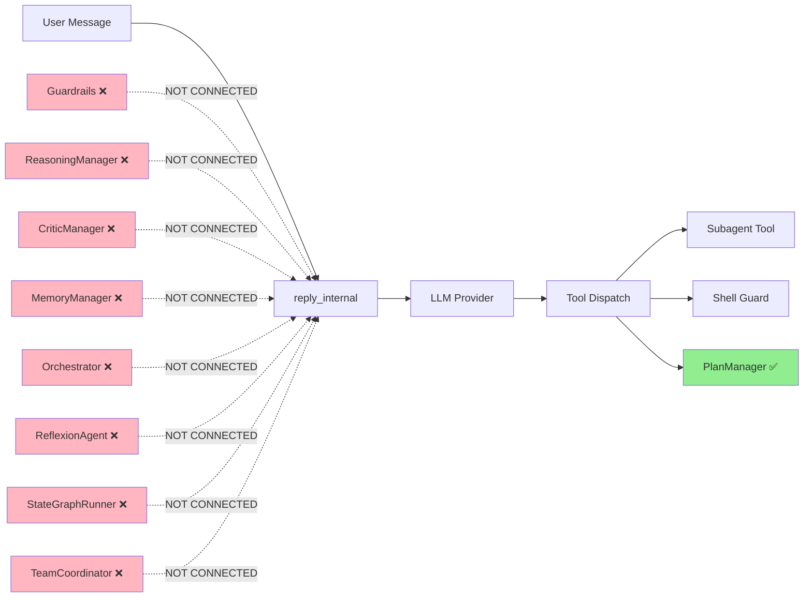
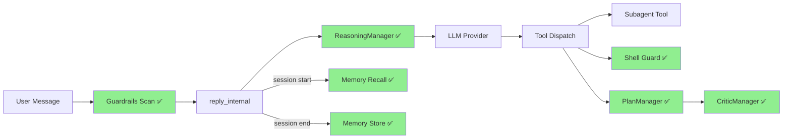
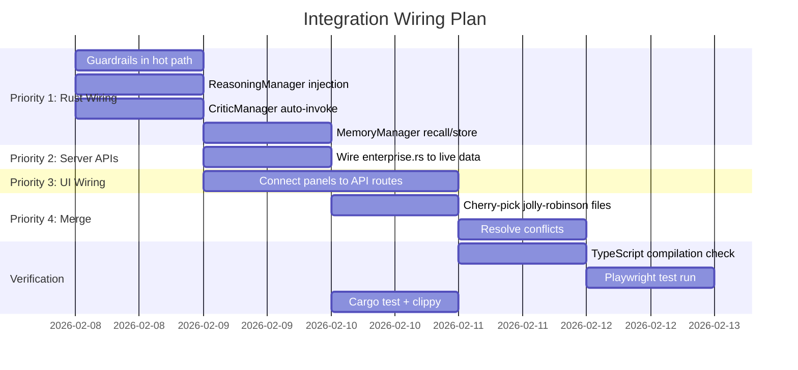

# Integration Wiring Plan: Enterprise Modules → Agent Hot Path

**Date**: 2026-02-08
**Goal**: Wire 4 high-priority enterprise modules into `reply_internal()` with ~200 lines of Rust
**Base branch**: nifty-lumiere (canonical — merge jolly-robinson INTO this)

---

## Architecture: Current vs Target

### Current State



### Target State (Priority 1 Wiring)



---

## Priority 1: Wire 4 Modules (~200 lines total)

### 1A. Guardrails — Input Scanning (~30 lines)

**Where**: `agent.rs`, at the start of `reply_internal()`, before the provider call

**What**: Run all enabled guardrail detectors on user input. If any detector flags the input, inject a warning into the conversation or block the request.

```rust
// In reply_internal(), before the main loop:
// 1. Get the last user message
// 2. Run guardrail detectors
// 3. If flagged, either:
//    a) Inject a system message warning the agent
//    b) Return early with a safety message
```

**Files to modify**:
- `crates/goose/src/agents/agent.rs` — Add guardrail check at top of reply_internal()
- `crates/goose/src/agents/mod.rs` — Ensure guardrails module is re-exported

**Dependency**: `crates/goose/src/guardrails/mod.rs` (already compiled, feature-gated default on)

---

### 1B. ReasoningManager — System Prompt Enhancement (~50 lines)

**Where**: `agent.rs`, in the system prompt construction before provider call

**What**: When ExecutionMode is Structured, inject ReAct/CoT/ToT prompts into the system message based on configured ReasoningMode.

```rust
// In reply_internal(), during system prompt assembly:
// 1. Check current ExecutionMode
// 2. If Structured, get ReasoningManager config
// 3. Inject appropriate reasoning prompt (ReAct, CoT, or ToT)
// 4. Append to system messages
```

**Files to modify**:
- `crates/goose/src/agents/agent.rs` — Add ReasoningManager field + prompt injection
- `crates/goose/src/agents/agent.rs` (constructor) — Initialize ReasoningManager

**Dependency**: `crates/goose/src/agents/reasoning.rs` (already compiled, tested)

---

### 1C. CriticManager — Auto-Invoke on Completion (~40 lines)

**Where**: `agent.rs`, at the end of reply_internal() when no more tools are called

**What**: When the agent finishes (no tool calls in response), automatically run self_critique() and log the result. If blocking issues found, optionally continue with a fix attempt.

```rust
// At the end of reply_internal(), when response has no tool calls:
// 1. Collect list of tools executed this session
// 2. Call self.self_critique() with task context
// 3. Log critique result
// 4. If blocking issues found and retry budget available:
//    a) Inject critique feedback as system message
//    b) Continue the loop for one more iteration
```

**Files to modify**:
- `crates/goose/src/agents/agent.rs` — Add auto-critique after tool loop completes

**Dependency**: `crates/goose/src/agents/critic.rs` (already on Agent struct, tested)

---

### 1D. MemoryManager — Session Recall/Store (~60 lines)

**Where**: 
- `agent.rs` `reply()` method — Recall on session start
- `agent.rs` `reply_internal()` end — Store on session end

**What**: On session start, recall relevant memories and inject as context. On session end, extract key learnings and store.

```rust
// In reply() at session start:
// 1. Create RecallContext from user's first message
// 2. Call memory_manager.recall()
// 3. If memories found, inject as system context

// In reply_internal() at session end:
// 1. Extract summary of what was accomplished
// 2. Call memory_manager.store() with episodic + procedural entries
```

**Files to modify**:
- `crates/goose/src/agents/agent.rs` — Add MemoryManager field + recall/store calls
- `crates/goose/src/agents/agent.rs` (constructor) — Initialize MemoryManager with config

**Dependency**: `crates/goose/src/memory/mod.rs` (feature-gated, default on)

---

## Priority 2: Server API Routes (~100 lines)

Already partially done on nifty-lumiere (`enterprise.rs` exists with 8 GET endpoints).

**Remaining**:
- Wire enterprise.rs endpoints to return LIVE data from actual module instances
- Currently enterprise.rs returns data from module configs, but modules aren't instantiated in the server context
- Need to pass module references (or Arc<Mutex<...>> handles) from the Agent to the route handlers

**Files to modify**:
- `crates/goose-server/src/routes/enterprise.rs` — Connect to live Agent state
- `crates/goose-server/src/state.rs` (or equivalent) — Add enterprise module refs to app state

---

## Priority 3: UI → API Connection (~200 lines TypeScript)

The enterprise settings panels on nifty-lumiere currently use hardcoded/mock data. Wire them to fetch from enterprise.rs routes.

**Pattern**:
```typescript
// Each panel: GuardrailsPanel, GatewayPanel, etc.
// Replace hardcoded state with:
const { data, error, isLoading } = useSWR('/api/enterprise/guardrails', fetcher);
```

**Files to modify** (all on nifty-lumiere):
- `settings/enterprise/GuardrailsPanel.tsx`
- `settings/enterprise/GatewayPanel.tsx`
- `settings/enterprise/ObservabilityPanel.tsx`
- `settings/enterprise/PoliciesPanel.tsx`
- `settings/enterprise/HooksPanel.tsx`
- `settings/enterprise/MemoryPanel.tsx`

---

## Priority 4: Merge Worktrees

### What needs to move FROM jolly-robinson TO nifty-lumiere:
1. `ui/desktop/src/components/chat_coding/` (21 files, 226KB)
2. `ui/desktop/src/hooks/useTaskStream.ts` (8KB)
3. `ui/desktop/tests/e2e/settings.spec.ts` (19KB)
4. `ui/desktop/tests/e2e/chat-features.spec.ts` (16KB)
5. `ui/desktop/tests/e2e/coding-workflow.spec.ts` (21KB)
6. `ui/desktop/tests/e2e/tic-tac-toe.spec.ts` (12KB)
7. Any MarkdownContent.tsx modifications for EnhancedCodeBlock integration

**Method**: Manual `git cherry-pick` or file copy + commit. Cannot be done from Cascade.

---

## Execution Timeline



---

## Risk Assessment

| Risk | Likelihood | Impact | Mitigation |
|---|---|---|---|
| Merge conflicts between worktrees | High | Medium | File-by-file cherry-pick, most files are NEW (no conflicts) |
| MemoryManager persistence not working | Medium | Low | Start with in-memory only, add SQLite later |
| Guardrails false positives blocking normal usage | Medium | High | Default to warn-only mode, not block mode |
| Enterprise.rs endpoints not matching UI expectations | Low | Medium | Generated API types ensure contract |
| ReasoningManager prompts degrading LLM quality | Low | Medium | Make reasoning mode configurable, default to Standard |
