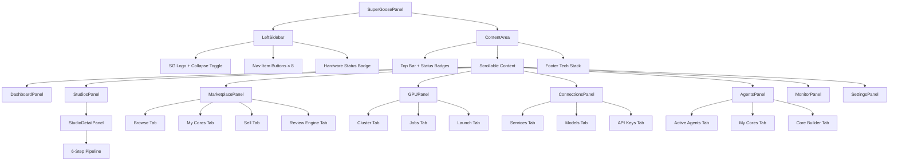
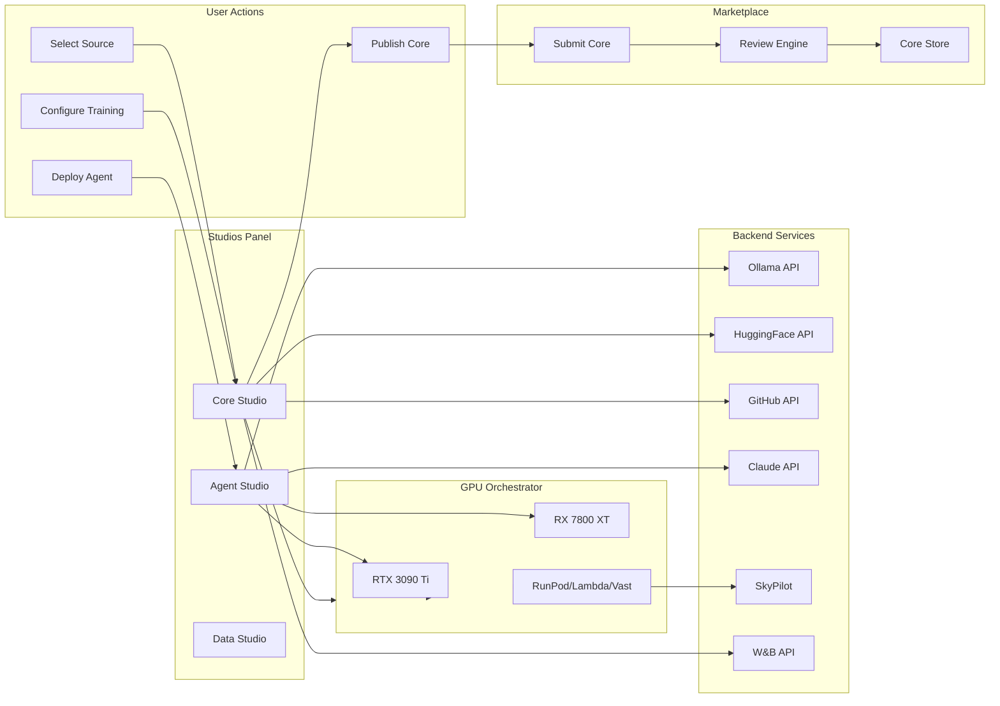

# Super-Goose Panel Architecture

> Component architecture, data flow, and integration points for the Super-Goose features side panel.

---

## Component Tree



---

## Shared Components

| Component | Props | Description |
|-----------|-------|-------------|
| `Badge` | `children, color, glow` | Colored pill badge for tags/status |
| `ProgressBar` | `value, max, color, h` | Animated horizontal progress bar |
| `Card` | `children, style` | Dark bordered card container |
| `SectionLabel` | `children` | Uppercase section heading |
| `StatusDot` | `status` | Colored circle indicator (connected/running/idle/offline) |
| `ActionBtn` | `children, color, onClick, full, small` | Solid color action button |
| `GradBtn` | `children, onClick, from, to, full` | Gradient call-to-action button |
| `TabBar` | `tabs, active, onChange` | Horizontal tab switcher |

---

## State Management

```
SuperGoosePanel
├── activeNav: string        → which sidebar panel is shown
├── collapsed: boolean       → sidebar collapsed to icons only
│
├── DashboardPanel
│   └── (stateless — displays real-time data)
│
├── StudiosPanel
│   ├── studioTab: string    → "all" | "recent" | "running"
│   └── activeStudio: object → null (grid) or studio detail
│
├── AgentsPanel
│   └── tab: string          → "active" | "cores" | "builder"
│
├── MarketplacePanel
│   ├── tab: string          → "browse" | "my" | "sell" | "review"
│   └── filter: string       → "all" | "free" | "paid" | "trending"
│
├── GPUPanel
│   └── tab: string          → "cluster" | "jobs" | "train"
│
├── ConnectionsPanel
│   └── tab: string          → "services" | "models" | "keys"
│
├── MonitorPanel
│   └── (stateless — live log stream)
│
└── SettingsPanel
    └── (form state via defaultValues)
```

---

## Data Flow: How Features Connect



---

## Integration Points

### Real-Time Model Selection Flow

```
User clicks "Search 🤗" in Studio
    → HuggingFace API: model_search(query, tags=["<=24GB"])
    → Filter results by VRAM compatibility
    → Display model cards with speed/size/license
    → User selects model
    → Ollama pull or HF download
    → Model loaded to GPU
    → Ready for training/inference
```

### Account Setup Automation Flow

```
User clicks "Add Service Connection"
    → Service selection (HuggingFace/GitHub/RunPod/etc.)
    → If needs signup: open signup URL in browser
    → User provides token/API key
    → Validate key against service API
    → Store encrypted in local config
    → Status updates to "connected" with green dot
    → Service available across all panels
```

### Core Publishing Flow

```
Core trained in Core Studio
    → User clicks "Publish" in pipeline step 6
    → Core auto-packaged as .gcpkg:
        ├── adapter_model.safetensors
        ├── adapter_config.json
        ├── core_manifest.yaml
        ├── README.md
        └── eval_results.json
    → Submitted to Review Engine (6-gate pipeline)
    → Gates 1-5: automated (schema, security, quality, portability, license)
    → Gate 6: human review (optional for free cores)
    → Approved → listed in Marketplace
    → Rejected → detailed feedback with specific gate failures
```

### GPU Job Orchestration Flow (via SkyPilot)

```
User clicks "Launch GPU Job"
    → Target selection (local vs cloud)
    → If local: direct execution on RTX 3090 Ti or RX 7800 XT
    → If cloud:
        1. Read user's API key from Connections panel
        2. SkyPilot generates YAML job spec
        3. sky launch → provisions cheapest spot instance
        4. SSH into node automatically
        5. Push training scripts (Unsloth/LLaMA-Factory)
        6. Start training
        7. Stream logs → Monitor panel
        8. W&B metrics → real-time dashboard
        9. Save checkpoints on completion
        10. sky down → terminate instance
    → Job card updates in real-time in Jobs tab
    → Cost tracked in Monitor → Cost Tracker
```

---

## Template Usage Guide

This JSX serves as the **universal template** for all Super-Goose paid feature panels. To add a new feature:

1. Add a new entry to `NAV` array with id, icon, label, color
2. Create a new `YourFeaturePanel()` function component
3. Add it to the `panels` object in `SuperGoosePanel`
4. Use shared components (`Card`, `Badge`, `ProgressBar`, `TabBar`, etc.)
5. Follow the design tokens in `T` for consistent styling
6. Add sub-tabs via `TabBar` if the feature has multiple views

### Color Assignment Convention
- **Gold/Amber**: Super-Goose branding, cost/pricing
- **Emerald**: Active, connected, success, free
- **Red**: GPU, training, errors
- **Violet**: Cores, studios, creative tools
- **Sky/Cyan**: Marketplace, info, secondary GPU
- **Indigo**: Primary actions, selections
- **Text grays**: T.text1 (brightest) → T.text5 (dimmest)

---

## Key Design Principles

1. **Dense control-panel style** — maximum information density, minimal empty space
2. **Left sidebar navigation** — VS Code / IDE pattern, collapsible to icons
3. **Sub-tabs within panels** — each panel has 2-4 views via TabBar
4. **Real-time status everywhere** — green dots, progress bars, live counters
5. **Cost transparency** — always show what things cost ($0 for local, $ for cloud)
6. **One-click automation** — users make selections, everything else is automated
7. **Dark theme only** — #080818 background, high-contrast text
8. **Consistent cards** — every data group lives in a Card component
