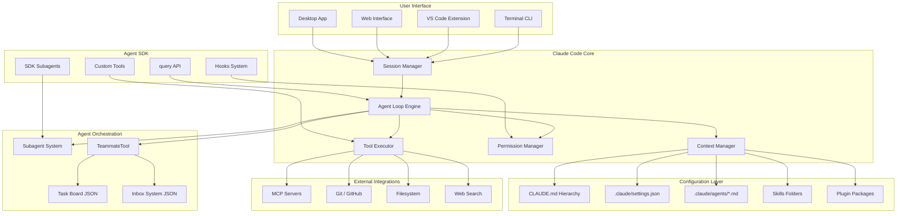
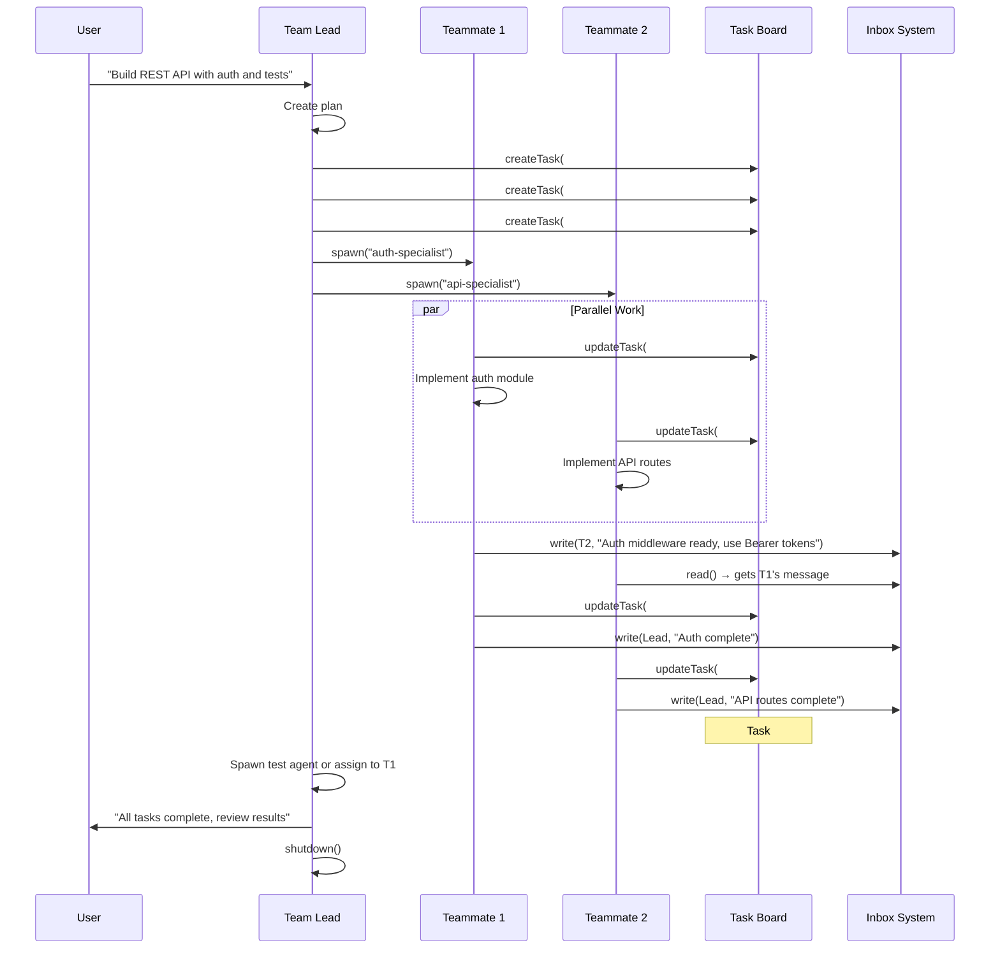

# Claude Code — Agent Architecture Blueprint

## Document Purpose

This document is a comprehensive technical blueprint of how Claude Code's agent system works, including subagents, agent teams (swarm mode), the Claude Agent SDK, Skills, Plugins, CLAUDE.md, and multi-context-window orchestration. All information is sourced from Anthropic's official documentation, engineering blog posts, and community-verified technical analyses.

---

## Table of Contents

1. [Core Philosophy](#1-core-philosophy)
2. [Single-Agent Architecture](#2-single-agent-architecture)
3. [The Agent Loop](#3-the-agent-loop)
4. [CLAUDE.md — The Shared Configuration Layer](#4-claudemd--the-shared-configuration-layer)
5. [Subagents — Within-Session Delegation](#5-subagents--within-session-delegation)
6. [Agent Teams (Swarm Mode) — Multi-Session Orchestration](#6-agent-teams-swarm-mode--multi-session-orchestration)
7. [Agent Skills — Dynamic Capability Injection](#7-agent-skills--dynamic-capability-injection)
8. [Plugins — Bundled Extensibility](#8-plugins--bundled-extensibility)
9. [Claude Agent SDK — Programmatic Agent Building](#9-claude-agent-sdk--programmatic-agent-building)
10. [Multi-Context-Window Workflows](#10-multi-context-window-workflows)
11. [Conflict Avoidance & Coordination Mechanisms](#11-conflict-avoidance--coordination-mechanisms)
12. [Architecture Diagrams](#12-architecture-diagrams)

---

## 1. Core Philosophy

Claude Code is built on a single design principle from Anthropic:

> **Give Claude a computer.** By providing Claude access to the same tools programmers use every day — file system, terminal, bash commands — it can work like humans do.

This means Claude Code is not a chatbot with code snippets. It is an **autonomous agent** with:

- Full filesystem read/write access
- Bash command execution
- Process spawning and management
- Git integration
- MCP (Model Context Protocol) server connectivity
- Subagent and agent team orchestration

### Key Design Tenets

| Tenet | Description |
|---|---|
| **Computer as Interface** | The terminal/filesystem is Claude's primary workspace, not a chat window |
| **Agentic Search** | Claude navigates codebases using `grep`, `find`, `ls`, `tail` — not just embeddings |
| **Context Engineering** | Folder structure IS context — directory layout influences agent understanding |
| **Composability** | Unix philosophy — small, focused tools that compose into complex workflows |
| **Incremental Progress** | Agents make small, verifiable progress per context window, not one-shot attempts |

---

## 2. Single-Agent Architecture

A single Claude Code session consists of:

```
┌─────────────────────────────────────────────┐
│              CLAUDE CODE SESSION             │
├─────────────────────────────────────────────┤
│                                             │
│  ┌─────────────┐    ┌──────────────────┐    │
│  │ System      │    │ CLAUDE.md        │    │
│  │ Prompt      │───▶│ (Project Config) │    │
│  └─────────────┘    └──────────────────┘    │
│         │                    │               │
│         ▼                    ▼               │
│  ┌──────────────────────────────────────┐   │
│  │         CONTEXT WINDOW               │   │
│  │  ┌──────────┐  ┌──────────────────┐  │   │
│  │  │ Messages │  │ Tool Results     │  │   │
│  │  └──────────┘  └──────────────────┘  │   │
│  └──────────────────────────────────────┘   │
│         │                                    │
│         ▼                                    │
│  ┌──────────────────────────────────────┐   │
│  │            TOOL ACCESS               │   │
│  │  ┌──────┐ ┌──────┐ ┌─────────────┐  │   │
│  │  │ Bash │ │ Read │ │ Write/Edit  │  │   │
│  │  └──────┘ └──────┘ └─────────────┘  │   │
│  │  ┌──────┐ ┌──────┐ ┌─────────────┐  │   │
│  │  │ Glob │ │ Grep │ │ MCP Tools   │  │   │
│  │  └──────┘ └──────┘ └─────────────┘  │   │
│  │  ┌──────────────┐ ┌──────────────┐   │   │
│  │  │ Task (spawn) │ │ MultiEdit    │   │   │
│  │  └──────────────┘ └──────────────┘   │   │
│  └──────────────────────────────────────┘   │
│                                             │
│  ┌──────────────────────────────────────┐   │
│  │         PERMISSION LAYER             │   │
│  │  User approval / hooks / sandboxing  │   │
│  └──────────────────────────────────────┘   │
│                                             │
└─────────────────────────────────────────────┘
```

### Built-in Tools

| Tool | Purpose | Access Level |
|---|---|---|
| `Bash` | Execute shell commands | Requires approval for dangerous commands |
| `Read` | Read file contents | Read-only |
| `Write` | Create new files | Requires approval |
| `Edit` / `MultiEdit` | Modify existing files | Requires approval |
| `Glob` | File pattern matching | Read-only |
| `Grep` | Search file contents | Read-only |
| `Task` | Spawn a subagent | Spawns new context window |
| `TeammateTool` | Spawn/manage agent teams | Experimental, requires opt-in |

---

## 3. The Agent Loop

Claude Code operates in a continuous feedback loop:

```
          ┌──────────────────────────────────┐
          │         AGENT LOOP               │
          │                                  │
          │   ┌──────────────────────┐       │
          │   │  1. GATHER CONTEXT   │       │
          │   │  - Read files        │       │
          │   │  - Search codebase   │       │
          │   │  - Query MCP servers │       │
          │   │  - Spawn subagents   │       │
          │   └────────┬─────────────┘       │
          │            │                     │
          │            ▼                     │
          │   ┌──────────────────────┐       │
          │   │  2. TAKE ACTION      │       │
          │   │  - Edit files        │       │
          │   │  - Run commands      │       │
          │   │  - Generate code     │       │
          │   │  - Call tools/MCPs   │       │
          │   └────────┬─────────────┘       │
          │            │                     │
          │            ▼                     │
          │   ┌──────────────────────┐       │
          │   │  3. VERIFY WORK      │       │
          │   │  - Run tests         │       │
          │   │  - Lint code         │       │
          │   │  - Visual feedback   │       │
          │   │  - LLM-as-judge      │       │
          │   └────────┬─────────────┘       │
          │            │                     │
          │            ▼                     │
          │     ┌──────────────┐             │
          │     │   DONE?      │──No──┐      │
          │     └──────────────┘      │      │
          │            │Yes           │      │
          │            ▼              │      │
          │     ┌──────────┐          │      │
          │     │  REPORT  │    ◄─────┘      │
          │     └──────────┘                 │
          └──────────────────────────────────┘
```

### Verification Methods

1. **Rules-based feedback**: Linting, type checking, compilation — deterministic checks
2. **Visual feedback**: Screenshots of rendered output fed back to the model
3. **LLM-as-judge**: A separate model instance evaluates output quality
4. **Test execution**: Running actual test suites against modified code

---

## 4. CLAUDE.md — The Shared Configuration Layer

`CLAUDE.md` is the **single source of truth** that ALL agents (single, subagents, and teammates) read at session start.

### Hierarchy & Loading Order

```
~/.claude/CLAUDE.md              ← User-level (all projects)
    │
    ▼
/project-root/CLAUDE.md          ← Project-level (this repo)
    │
    ▼
/project-root/src/CLAUDE.md      ← Directory-level (this folder)
    │
    ▼
.claude/settings.json            ← Machine/user settings
    │
    ▼
.claude/agents/*.md              ← Subagent definitions
```

### What Goes in CLAUDE.md

- Coding standards and conventions
- Architecture decisions and constraints
- Preferred libraries and frameworks
- Review checklists and quality gates
- Project-specific commands and workflows
- File organization conventions
- Testing requirements

### How Agents Inherit CLAUDE.md

| Agent Type | CLAUDE.md Access | Notes |
|---|---|---|
| Main session | Full hierarchy | Reads all levels |
| Subagent | Inherits from parent | Gets project CLAUDE.md + MCP servers + Skills |
| Agent team teammate | Independent load | Each teammate reads CLAUDE.md fresh from disk |
| Claude Agent SDK | Configurable | `setting_sources=["project"]` to enable |

### Critical Design Point: No Conflicts

CLAUDE.md is **read-only** for agents. Agents do not write to CLAUDE.md during execution. This prevents multi-agent conflicts because:

- All agents read the same file at startup
- No agent modifies the shared configuration
- Runtime state is tracked in separate files (`claude-progress.txt`, task JSON, inbox JSON)

---

## 5. Subagents — Within-Session Delegation

Subagents are **child agent instances** spawned within a single Claude Code session. They run in isolated context windows but report results back to the parent.

### Subagent Architecture

```
┌─────────────────────────────────────────────────────┐
│                 PARENT SESSION                       │
│  ┌───────────────────────────────────────────────┐  │
│  │              MAIN AGENT                       │  │
│  │  Context Window: [messages, tools, results]   │  │
│  └────────┬──────────────┬───────────────────────┘  │
│           │              │                           │
│     ┌─────▼─────┐  ┌────▼──────┐                    │
│     │ SUBAGENT  │  │ SUBAGENT  │  ← Parallel        │
│     │ "Explore" │  │ "Plan"    │    execution        │
│     │           │  │           │                     │
│     │ Own ctx   │  │ Own ctx   │  ← Isolated         │
│     │ window    │  │ window    │    context           │
│     │           │  │           │                     │
│     │ Returns   │  │ Returns   │  ← Only relevant    │
│     │ summary   │  │ summary   │    info sent back   │
│     └───────────┘  └───────────┘                    │
│                                                      │
│  Key: Subagents CANNOT talk to each other.           │
│       They only report back to the parent.           │
└─────────────────────────────────────────────────────┘
```

### Built-in Subagent Types

| Subagent | Purpose | Tools Available |
|---|---|---|
| **Explore** | Fast, read-only codebase search/analysis | Bash (read-only), Glob, Grep, Read |
| **Plan** | Research agent for plan mode | Read-only tools for codebase understanding |
| **Custom** | User-defined via `.claude/agents/*.md` | Configurable per definition |

### Defining Custom Subagents

Subagents are defined as markdown files in `.claude/agents/`:

```
.claude/
  agents/
    code-reviewer.md
    security-scanner.md
    test-writer.md
```

Each file uses YAML frontmatter:

```yaml
---
name: code-reviewer
description: Reviews code for quality and best practices
tools: Bash, Read, Glob, Grep
memory: user
---

You are a code reviewer. Review code for:
- Correctness and edge cases
- Performance concerns
- Security vulnerabilities
- Style consistency with project standards
```

### Subagent vs Agent Team Comparison

| Feature | Subagent | Agent Team Teammate |
|---|---|---|
| Context window | Own isolated window | Own isolated window |
| Communication | Report to parent only | Peer-to-peer + leader messaging |
| Lifecycle | Within parent session | Independent sessions |
| File access | Inherits parent permissions | Independent permissions |
| Can talk to peers | **No** | **Yes** |
| Coordination | Parent orchestrates | Shared task board + inboxes |
| Token usage | Lower overhead | Higher (full instances) |
| Best for | Focused subtasks, search | Parallel development, research |

---

## 6. Agent Teams (Swarm Mode) — Multi-Session Orchestration

Agent teams are Claude Code's **multi-agent orchestration system**, officially launched alongside Opus 4.6 in February 2026. Unlike subagents, teammates are full independent Claude Code instances that can communicate with each other.

### Enabling Agent Teams

```json
// settings.json
{
  "env": {
    "CLAUDE_CODE_EXPERIMENTAL_AGENT_TEAMS": "1"
  }
}
```

### Core Architecture

```
┌──────────────────────────────────────────────────────────────┐
│                    AGENT TEAM SYSTEM                         │
│                                                              │
│  ┌─────────────────────────────────────────────────────┐     │
│  │                  TEAM LEAD                           │     │
│  │  - Creates team & task list                          │     │
│  │  - Spawns teammates                                  │     │
│  │  - Assigns work                                      │     │
│  │  - Synthesizes results                               │     │
│  │  - Does NOT write code in delegate mode              │     │
│  └────────┬──────────┬──────────────┬───────────────────┘     │
│           │          │              │                          │
│     ┌─────▼───┐ ┌───▼─────┐ ┌─────▼───┐                     │
│     │TEAMMATE │ │TEAMMATE │ │TEAMMATE │                      │
│     │Frontend │ │Backend  │ │Testing  │                      │
│     │         │ │         │ │         │                      │
│     │ Own ctx │ │ Own ctx │ │ Own ctx │ ← Fresh context      │
│     │ window  │ │ window  │ │ window  │   per teammate       │
│     └────┬────┘ └────┬────┘ └────┬────┘                      │
│          │           │           │                            │
│          ▼           ▼           ▼                            │
│  ┌──────────────────────────────────────────────────┐        │
│  │              SHARED INFRASTRUCTURE               │        │
│  │                                                  │        │
│  │  ┌──────────────┐    ┌───────────────────┐       │        │
│  │  │  TASK LIST   │    │   INBOX SYSTEM    │       │        │
│  │  │  (JSON files)│    │  (JSON mailboxes) │       │        │
│  │  │              │    │                   │       │        │
│  │  │  #1 ✓ done   │    │  team-lead.json   │       │        │
│  │  │  #2 ► active │    │  frontend.json    │       │        │
│  │  │  #3 ⊘ blocked│    │  backend.json     │       │        │
│  │  │  #4 ○ pending│    │  testing.json     │       │        │
│  │  └──────────────┘    └───────────────────┘       │        │
│  └──────────────────────────────────────────────────┘        │
│                                                              │
└──────────────────────────────────────────────────────────────┘
```

### Filesystem Layout

```
~/.claude/
├── teams/
│   └── {team-name}/
│       ├── config.json           # Team metadata and member list
│       └── inboxes/
│           ├── team-lead.json    # Leader's message inbox
│           ├── worker-1.json     # Worker 1's inbox
│           └── worker-2.json     # Worker 2's inbox
└── tasks/
    └── {team-name}/
        ├── 1.json                # Task #1 with status, owner, deps
        ├── 2.json                # Task #2
        └── 3.json                # Task #3
```

### TeammateTool — 13 Operations

The TeammateTool provides the orchestration API:

**Team Lifecycle:**

| Operation | Description |
|---|---|
| `spawnTeam` | Create a new team with name and configuration |
| `discoverTeams` | List existing teams |
| `requestJoin` | Request to join an existing team |
| `approveJoin` | Approve a join request |
| `shutdown` | Gracefully shut down a team |

**Coordination:**

| Operation | Description |
|---|---|
| `spawn` | Create a new teammate with role and prompt |
| `write` | Send a message to a specific teammate's inbox |
| `read` | Read messages from own inbox |
| `broadcast` | Send a message to all teammates |
| `listTeammates` | List all active teammates and their status |

**Task Management:**

| Operation | Description |
|---|---|
| `createTask` | Create a task with description, dependencies, assignee |
| `updateTask` | Update task status (pending → in_progress → completed) |
| `listTasks` | List all tasks with their current status |

### Communication Flow

```
  TEAM LEAD                   TEAMMATE-1              TEAMMATE-2
      │                           │                       │
      │── spawn("frontend") ────▶│                       │
      │── spawn("backend")  ─────┼─────────────────────▶│
      │                           │                       │
      │── createTask(#1, ────────▶│ [auto-assigned]      │
      │      frontend)            │                       │
      │── createTask(#2, ────────┼──────────────────────▶│
      │      backend)             │                       │
      │                           │                       │
      │                           │── updateTask(#1,     │
      │                           │   in_progress)       │
      │                           │                       │── updateTask(#2,
      │                           │                       │   in_progress)
      │                           │                       │
      │                           │── write(backend, ────▶│
      │                           │   "API schema ready") │
      │                           │                       │
      │                           │◀── write(frontend, ──│
      │                           │   "need endpoint X")  │
      │                           │                       │
      │◀── write(team-lead, ─────│                       │
      │   "task #1 complete")     │                       │
      │                           │                       │
      │◀────────────────────────┼── write(team-lead, ──│
      │                           │   "task #2 complete") │
      │                           │                       │
      │── shutdown ──────────────▶│                       │
      │── shutdown ──────────────┼──────────────────────▶│
```

### Spawn Backends

Agent teams support three backends for running teammates:

| Backend | How it Works | Best For |
|---|---|---|
| **In-process** | Teammates run inside main terminal. `Shift+Up/Down` to select | Default, simplest |
| **tmux** | Each teammate in a tmux pane | Terminal power users |
| **iTerm2** | Each teammate in an iTerm2 split pane | macOS users |

### Environment Variables

| Variable | Purpose |
|---|---|
| `CLAUDE_CODE_TEAM_NAME` | Current team name |
| `CLAUDE_CODE_AGENT_ID` | This agent's unique ID |
| `CLAUDE_CODE_AGENT_NAME` | This agent's display name |
| `CLAUDE_CODE_AGENT_TYPE` | Agent type (general-purpose, etc.) |
| `CLAUDE_CODE_SPAWN_BACKEND` | Force specific backend (tmux, iterm2) |

### Conflict Avoidance in Agent Teams

The system prevents file conflicts through several mechanisms:

1. **File ownership**: Each teammate should own distinct files. The lead assigns tasks so teammates edit different file sets
2. **Git worktree isolation**: Community patterns (ccswarm) use git worktrees to give each agent its own branch, merging after tests pass
3. **Task dependencies**: Tasks can declare `blocked_by` dependencies, preventing premature work
4. **File-locked task claiming**: Tasks use file-level locking to prevent race conditions when agents self-claim work
5. **Last-write-wins**: Without worktrees, the system uses simple last-write. This is why file ownership boundaries are critical

### Best Practices (from Anthropic & Community)

- **2-5 teammates** is the sweet spot (not 20-30)
- **5-6 tasks per teammate** keeps everyone productive
- **Each teammate owns different files** — avoid same-file edits
- **Teammates inherit CLAUDE.md, MCP servers, and Skills** but NOT the lead's conversation history
- **Use delegate mode** to restrict the lead to coordination only
- Agent teams add coordination overhead — use single sessions for sequential work

---

## 7. Agent Skills — Dynamic Capability Injection

Skills are **organized folders of instructions, scripts, and resources** that agents can discover and load dynamically to perform better at specific tasks.

### How Skills Work

```
 ┌─────────────────────────────────────────────────┐
 │           SKILL LOADING LIFECYCLE                │
 │                                                  │
 │  1. STARTUP: Load skill metadata (YAML header)   │
 │     ┌─────────────────────────────────┐          │
 │     │ name: pdf-processing            │          │
 │     │ description: Extract text from  │ ← Light  │
 │     │   PDF files...                  │   weight  │
 │     └─────────────────────────────────┘          │
 │                                                  │
 │  2. TRIGGER: User request matches description    │
 │     User: "Extract tables from report.pdf"       │
 │                                                  │
 │  3. LOAD: Read SKILL.md body into context        │
 │     ┌─────────────────────────────────┐          │
 │     │ ## Quick Start                  │          │
 │     │ Use pdfplumber to extract...    │ ← Full   │
 │     │ ## Advanced Patterns            │   body   │
 │     │ For complex tables, use...      │   loaded │
 │     └─────────────────────────────────┘          │
 │                                                  │
 │  4. OPTIONAL: Read supplementary files           │
 │     skill-folder/                                │
 │       ├── SKILL.md                               │
 │       ├── scripts/helper.py    ← Claude reads    │
 │       └── resources/template   ← or executes     │
 │                                                  │
 │  5. EXECUTE: Claude proceeds with enriched ctx   │
 │                                                  │
 └─────────────────────────────────────────────────┘
```

### Key Insight: Skills ≠ Tools

| Aspect | Tool | Skill |
|---|---|---|
| What it does | Executes and returns results | Prepares Claude to solve a problem |
| Context impact | Result added to context | Instructions injected into context |
| Execution | Function call → result | Markdown loading → behavior change |
| Persistence | One-shot per call | Enriches entire session |

### Skill Types

1. **Pre-built (Anthropic)**: `pptx`, `xlsx`, `docx`, `pdf` — available on claude.ai and API
2. **Custom (User)**: Created in `.claude/skills/` or uploaded via Skills API
3. **Plugin-bundled**: Skills packaged within plugins

### Progressive Disclosure

Skills use progressive disclosure to minimize context consumption:

```
Stage 1: Only YAML frontmatter loaded (name + description)
         ↓ (user request triggers skill)
Stage 2: SKILL.md body loaded into context
         ↓ (Claude decides it needs more)
Stage 3: Supplementary files read on-demand
```

This means you can install many skills without context penalty — Claude only knows each skill exists until it needs one.

---

## 8. Plugins — Bundled Extensibility

Plugins are **self-contained packages** that bundle agents, commands, skills, hooks, and MCP server configs into a single installable unit.

### Plugin Structure

```
my-plugin/
├── .claude-plugin/
│   └── plugin.json          # Metadata: name, version, description
├── commands/                # Slash commands (e.g., /deploy, /review)
│   ├── deploy.md
│   └── test.md
├── agents/                  # Subagent definitions
│   ├── reviewer.md
│   └── tester.md
├── skills/                  # Agent Skills
│   └── code-reviewer/
│       └── SKILL.md
├── hooks/                   # Event handlers
│   └── hooks.json
├── .mcp.json                # MCP server configurations
└── scripts/                 # Hook scripts
    └── validate.sh
```

### Plugin Lifecycle

```
Install → Enable → Trigger → Load → Execute → Disable/Uninstall
   │         │        │        │        │
   │    Metadata    User     Agent    Tools,
   │    registered  action   loads    commands,
   │    in session  or auto  plugin   skills
   │                match    content  execute
```

### Plugins vs Skills

| Feature | Plugin | Skill |
|---|---|---|
| Scope | Full development workflow | Single capability |
| Contains | Agents + Commands + Skills + Hooks + MCP | Instructions + Scripts + Resources |
| Activation | `/plugin install` | Auto-detected or manual |
| Isolation | Complete per-plugin | Shared context |
| Sharing | Git repos, marketplace | Filesystem or API |

---

## 9. Claude Agent SDK — Programmatic Agent Building

The Claude Agent SDK (formerly Claude Code SDK) exposes Claude Code's agent capabilities as a programmable API for building custom agents.

### SDK Architecture

```
┌──────────────────────────────────────────────────────┐
│                  YOUR APPLICATION                    │
│                                                      │
│  ┌────────────────────────────────────────────────┐  │
│  │            CLAUDE AGENT SDK                    │  │
│  │                                                │  │
│  │  ┌──────────┐  ┌──────────┐  ┌─────────────┐  │  │
│  │  │ query()  │  │ Tools    │  │ Subagents   │  │  │
│  │  │ API      │  │ Config   │  │ Config      │  │  │
│  │  └────┬─────┘  └────┬─────┘  └──────┬──────┘  │  │
│  │       │              │               │         │  │
│  │       ▼              ▼               ▼         │  │
│  │  ┌──────────────────────────────────────────┐  │  │
│  │  │          AGENT LOOP ENGINE               │  │  │
│  │  │                                          │  │  │
│  │  │  Context Window Management               │  │  │
│  │  │  ├── Automatic compaction                │  │  │
│  │  │  ├── Message summarization               │  │  │
│  │  │  └── Token limit handling                │  │  │
│  │  │                                          │  │  │
│  │  │  Tool Execution                          │  │  │
│  │  │  ├── Bash, Read, Write, Edit, Glob, Grep │  │  │
│  │  │  ├── Custom tools (MCP or native)        │  │  │
│  │  │  └── Hook interception                   │  │  │
│  │  │                                          │  │  │
│  │  │  Permission Management                   │  │  │
│  │  │  ├── User approval flows                 │  │  │
│  │  │  ├── PreToolUse / PostToolUse hooks       │  │  │
│  │  │  └── Allowlists and blocklists           │  │  │
│  │  └──────────────────────────────────────────┘  │  │
│  └────────────────────────────────────────────────┘  │
│                                                      │
│  ┌────────────────────────────────────────────────┐  │
│  │         FILESYSTEM & ENVIRONMENT               │  │
│  │  CLAUDE.md | .claude/ | MCP Servers | Skills   │  │
│  └────────────────────────────────────────────────┘  │
└──────────────────────────────────────────────────────┘
```

### SDK Usage (TypeScript)

```typescript
import { query } from '@anthropic-ai/claude-agent-sdk';

for await (const message of query({
  prompt: "Find and fix bugs in the auth module",
  options: {
    allowedTools: ["Bash", "Read", "Write", "Edit", "Glob", "Grep"],
    permissionMode: "acceptEdits",
    settingSources: ["project"],
    subagentDefinitions: {
      researcher: {
        tools: ["Read", "Grep", "Glob"],
        model: "claude-haiku-4",
        description: "Fast research agent for codebase exploration"
      }
    }
  }
})) {
  if (message.result) console.log(message.result);
}
```

### SDK Usage (Python)

```python
import asyncio
from claude_agent_sdk import query, ClaudeAgentOptions

async def main():
    async for message in query(
        prompt="What files are in this directory?",
        options=ClaudeAgentOptions(
            allowed_tools=["Bash", "Glob"],
            subagent_definitions={
                "researcher": {
                    "tools": ["Read", "Grep", "Glob"],
                    "model": "claude-haiku-4",
                    "description": "Fast research agent"
                }
            }
        )
    ):
        if hasattr(message, "result"):
            print(message.result)

asyncio.run(main())
```

---

## 10. Multi-Context-Window Workflows

For tasks that span multiple context windows (long-running agents), Anthropic developed a two-agent solution:

### The Initializer + Coding Agent Pattern

```
┌─────────────────────────────────────────────────────────┐
│         MULTI-CONTEXT-WINDOW WORKFLOW                    │
│                                                          │
│  WINDOW 1 (First Run):                                   │
│  ┌─────────────────────────────────────────────────┐     │
│  │  INITIALIZER AGENT                               │     │
│  │  - Creates init.sh script                         │     │
│  │  - Creates claude-progress.txt                    │     │
│  │  - Makes initial git commit                       │     │
│  │  - Sets up project scaffolding                    │     │
│  └─────────────────────────────────────────────────┘     │
│                                                          │
│  WINDOW 2...N (Subsequent Runs):                          │
│  ┌─────────────────────────────────────────────────┐     │
│  │  CODING AGENT                                     │     │
│  │  1. Read claude-progress.txt                      │     │
│  │  2. Check git log for recent changes              │     │
│  │  3. Understand current state                      │     │
│  │  4. Make incremental progress                     │     │
│  │  5. Update claude-progress.txt                    │     │
│  │  6. Git commit with clear message                 │     │
│  │  7. Leave artifacts for next session              │     │
│  └─────────────────────────────────────────────────┘     │
│                                                          │
│  BRIDGING MECHANISMS:                                     │
│  ┌──────────────────┐  ┌──────────────────────────┐      │
│  │ claude-progress   │  │ Git History              │      │
│  │ .txt              │  │ (commits + diffs)        │      │
│  │                   │  │                          │      │
│  │ - What's done     │  │ - What files changed     │      │
│  │ - What's pending  │  │ - What was added/removed │      │
│  │ - Known issues    │  │ - Commit messages        │      │
│  │ - Next steps      │  │                          │      │
│  └──────────────────┘  └──────────────────────────┘      │
│                                                          │
│  COMPACTION (Within a Window):                            │
│  ┌─────────────────────────────────────────────────┐     │
│  │  When context limit approaches:                   │     │
│  │  - Automatically summarize earlier messages       │     │
│  │  - Preserve key decisions and state               │     │
│  │  - Continue with compressed history               │     │
│  └─────────────────────────────────────────────────┘     │
│                                                          │
└─────────────────────────────────────────────────────────┘
```

### Key Insight

> The key insight was finding a way for agents to quickly understand the state of work when starting with a fresh context window, which is accomplished with the `claude-progress.txt` file alongside the git history.
> — Anthropic Engineering Blog

---

## 11. Conflict Avoidance & Coordination Mechanisms

### How Multiple Agents Avoid Conflicts on Shared Files

```
┌──────────────────────────────────────────────────────────┐
│           CONFLICT AVOIDANCE STRATEGIES                   │
│                                                           │
│  LAYER 1: TASK-LEVEL ISOLATION                            │
│  ┌──────────────────────────────────────────────────┐    │
│  │  Task Board with Dependencies                     │    │
│  │  Task #1 (Frontend) → owns: src/components/*      │    │
│  │  Task #2 (Backend)  → owns: src/api/*             │    │
│  │  Task #3 (Tests)    → owns: tests/*               │    │
│  │  Task #3 blocked_by: [#1, #2]                     │    │
│  └──────────────────────────────────────────────────┘    │
│                                                           │
│  LAYER 2: FILE OWNERSHIP BOUNDARIES                       │
│  ┌──────────────────────────────────────────────────┐    │
│  │  Teammate A: src/frontend/**                      │    │
│  │  Teammate B: src/backend/**                       │    │
│  │  Teammate C: tests/** + docs/**                   │    │
│  │                                                   │    │
│  │  NO OVERLAP = NO CONFLICTS                        │    │
│  └──────────────────────────────────────────────────┘    │
│                                                           │
│  LAYER 3: MESSAGING (NOT SHARED MEMORY)                   │
│  ┌──────────────────────────────────────────────────┐    │
│  │  Agents communicate via JSON inbox files          │    │
│  │  Each agent has its OWN inbox                     │    │
│  │  Messages are append-only                         │    │
│  │  No shared mutable state                          │    │
│  └──────────────────────────────────────────────────┘    │
│                                                           │
│  LAYER 4: GIT WORKTREE ISOLATION (Community Pattern)      │
│  ┌──────────────────────────────────────────────────┐    │
│  │  main branch ──────────────────────               │    │
│  │       │                                           │    │
│  │  worktree/frontend ── Agent A works here          │    │
│  │  worktree/backend  ── Agent B works here          │    │
│  │  worktree/testing  ── Agent C works here          │    │
│  │       │                                           │    │
│  │  Merge after tests pass                           │    │
│  └──────────────────────────────────────────────────┘    │
│                                                           │
│  LAYER 5: READ-ONLY SHARED CONFIG                         │
│  ┌──────────────────────────────────────────────────┐    │
│  │  CLAUDE.md ──────── Read by all, written by none  │    │
│  │  Skills ──────────── Read-only instruction sets   │    │
│  │  MCP Servers ─────── External services, stateless │    │
│  └──────────────────────────────────────────────────┘    │
│                                                           │
└──────────────────────────────────────────────────────────┘
```

---

## 12. Architecture Diagrams

### Complete System Overview (Mermaid)



### Agent Team Lifecycle (Mermaid)



---

## Source References

| Source | URL |
|---|---|
| Claude Code Overview | https://code.claude.com/docs/en/overview |
| Agent Teams Docs | https://code.claude.com/docs/en/agent-teams |
| Subagents Docs | https://docs.anthropic.com/en/docs/claude-code/sub-agents |
| Agent SDK Overview | https://platform.claude.com/docs/en/agent-sdk/overview |
| SDK Subagents | https://platform.claude.com/docs/en/agent-sdk/subagents |
| Agent Skills Overview | https://platform.claude.com/docs/en/agents-and-tools/agent-skills/overview |
| Building Agents with SDK (Blog) | https://www.anthropic.com/engineering/building-agents-with-the-claude-agent-sdk |
| Effective Harnesses (Blog) | https://www.anthropic.com/engineering/effective-harnesses-for-long-running-agents |
| Building Effective Agents (Research) | https://www.anthropic.com/research/building-effective-agents |
| Agent Skills (Blog) | https://www.anthropic.com/engineering/equipping-agents-for-the-real-world-with-agent-skills |
| TeammateTool Deep Dive | https://paddo.dev/blog/agent-teams-the-switch-got-flipped/ |
| Swarm Orchestration Skill | https://gist.github.com/kieranklaassen/4f2aba89594a4aea4ad64d753984b2ea |
