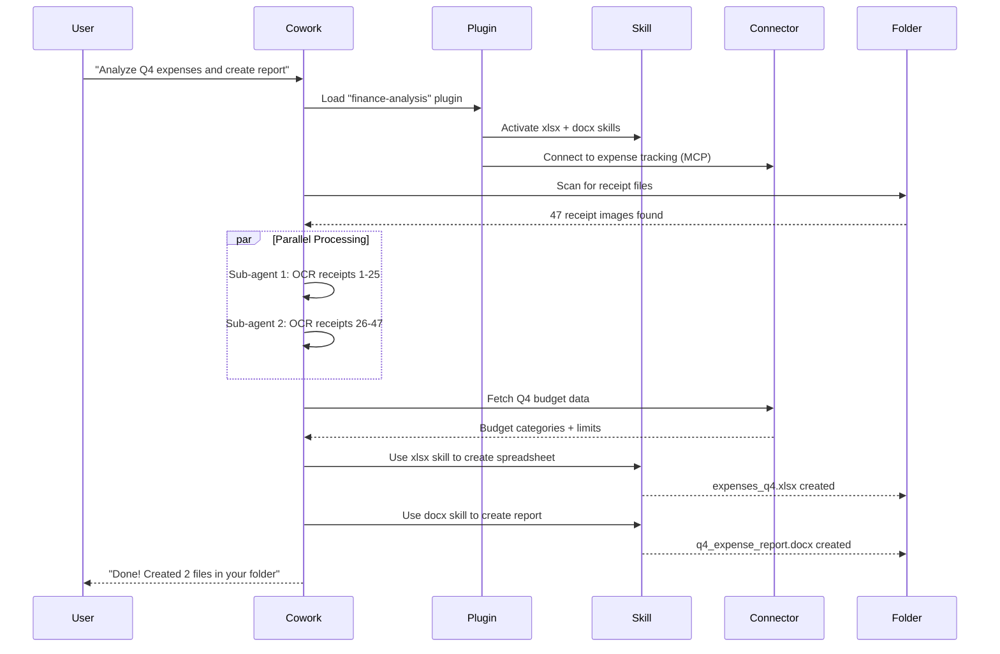

# Cowork — Agent Architecture Blueprint

## Document Purpose

This document is a comprehensive technical blueprint of how Anthropic's Cowork operates as a desktop agent, including its relationship to Claude Code, its agent execution model, plugin system, folder sandboxing, Skills integration, and multi-agent coordination. All information is sourced from Anthropic's official documentation, engineering blog posts, verified reporting, and community analysis.

---

## Table of Contents

1. [What Cowork Is](#1-what-cowork-is)
2. [Relationship to Claude Code](#2-relationship-to-claude-code)
3. [Core Architecture](#3-core-architecture)
4. [Execution Model](#4-execution-model)
5. [Folder Sandboxing & Security](#5-folder-sandboxing--security)
6. [Skills Integration](#6-skills-integration)
7. [Plugins — Task Automation Packages](#7-plugins--task-automation-packages)
8. [Connectors — External Service Integration](#8-connectors--external-service-integration)
9. [Browser Integration (Claude in Chrome)](#9-browser-integration-claude-in-chrome)
10. [Multi-Agent Execution in Cowork](#10-multi-agent-execution-in-cowork)
11. [Architecture Diagrams](#11-architecture-diagrams)
12. [Cowork vs Claude Code: Feature Matrix](#12-cowork-vs-claude-code-feature-matrix)

---

## 1. What Cowork Is

Cowork is Anthropic's **agentic desktop tool** that brings Claude Code's autonomous capabilities to non-technical users. Released January 12, 2026 as a research preview.

### Core Concept

> **"Claude Code for the rest of your work."**

Instead of a chat interface where you paste text, Cowork lets you:

1. Point Claude at a **specific folder** on your machine
2. Describe the **outcome** you want in natural language
3. Claude **plans and executes** multi-step work autonomously
4. Claude **reports progress** and delivers results as files

### Key Characteristics

| Characteristic | Description |
|---|---|
| **Target users** | Non-technical knowledge workers, analysts, marketers, PMs |
| **Interface** | Tab in Claude Desktop app (macOS), next to Chat and Code |
| **Access model** | Folder-scoped — Claude sees only the folder you grant |
| **Execution** | Agentic — plans, executes, iterates without constant input |
| **Powered by** | Claude Opus 4.5/4.6 with extended thinking (64K reasoning tokens) |
| **Platform** | macOS only (as of Feb 2026), Windows planned |
| **Availability** | Claude Max ($100-$200/mo), expanded to Pro ($20/mo) on Jan 16 |

### Development Story

Cowork was built by a team of 4 engineers in approximately 10 days, using **Claude Code itself** to generate most of the code. Engineers orchestrated multiple Claude Code instances — humans handled architecture and design decisions while Claude wrote the implementation code. This is a real-world demonstration of the multi-agent development pattern.

---

## 2. Relationship to Claude Code

Cowork is **not a separate system**. It is Claude Code's agent architecture repackaged for non-developer use.

```
┌─────────────────────────────────────────────────────┐
│              SHARED FOUNDATION                       │
│                                                      │
│  ┌────────────────────────────────────────────────┐  │
│  │           CLAUDE AGENT SDK                     │  │
│  │                                                │  │
│  │  Agent Loop Engine                             │  │
│  │  Tool Execution (Bash, Read, Write, etc.)      │  │
│  │  Context Management + Compaction               │  │
│  │  Permission System                             │  │
│  │  Subagent Spawning                             │  │
│  │  Skills Loading                                │  │
│  │  MCP Server Integration                        │  │
│  └────────────────────────────────────────────────┘  │
│                                                      │
│         ┌──────────────┐    ┌──────────────┐         │
│         │ CLAUDE CODE  │    │   COWORK     │         │
│         │              │    │              │         │
│         │ Terminal CLI  │    │ Desktop GUI  │         │
│         │ VS Code ext   │    │ macOS app    │         │
│         │ Web interface │    │ tab          │         │
│         │              │    │              │         │
│         │ Developers   │    │ Everyone     │         │
│         │ Code-focused │    │ File/task    │         │
│         │              │    │ focused      │         │
│         │ Full system  │    │ Folder       │         │
│         │ access       │    │ sandboxed    │         │
│         └──────────────┘    └──────────────┘         │
│                                                      │
└─────────────────────────────────────────────────────┘
```

### Shared Components

Both Claude Code and Cowork share:

- The same **Claude Agent SDK** underneath
- The same **agent loop** (gather context → act → verify → repeat)
- The same **Skills** system (pptx, xlsx, docx, pdf, and custom)
- The same **Plugin** architecture (expanded to Cowork Jan 30, 2026)
- The same **Connector** ecosystem (MCP-based)
- The same **model** (Claude Opus 4.5/4.6)

### Key Differences

| Aspect | Claude Code | Cowork |
|---|---|---|
| Interface | Terminal / VS Code / Web | Desktop app tab (GUI) |
| Access scope | Full system (or configurable) | Single folder sandbox |
| Target user | Developers | Everyone (non-technical) |
| Primary task | Code writing & debugging | File organization, reports, data extraction |
| Agent teams | Full swarm mode | Parallel sub-agents (simpler) |
| Permissions | `--dangerously-skip-permissions` option | Always sandboxed, action confirmations |
| Plugins | CLI-based `/plugin install` | UI-based, user-friendly |

---

## 3. Core Architecture

### System Architecture

```
┌─────────────────────────────────────────────────────────────┐
│                    COWORK SYSTEM                            │
│                                                             │
│  ┌───────────────────────────────────────────────────────┐  │
│  │              CLAUDE DESKTOP APP (macOS)                │  │
│  │                                                       │  │
│  │  ┌─────────┐  ┌─────────┐  ┌──────────────────────┐  │  │
│  │  │  Chat   │  │  Code   │  │      Cowork          │  │  │
│  │  │  Tab    │  │  Tab    │  │      Tab             │  │  │
│  │  └─────────┘  └─────────┘  └──────────┬───────────┘  │  │
│  │                                        │              │  │
│  └────────────────────────────────────────┼──────────────┘  │
│                                           │                  │
│  ┌────────────────────────────────────────▼──────────────┐  │
│  │              COWORK ENGINE                            │  │
│  │                                                       │  │
│  │  ┌─────────────────┐  ┌──────────────────────────┐   │  │
│  │  │ Folder Access   │  │ Task Planner             │   │  │
│  │  │ Manager         │  │ (Goal → Steps → Execute) │   │  │
│  │  └────────┬────────┘  └──────────┬───────────────┘   │  │
│  │           │                       │                   │  │
│  │           ▼                       ▼                   │  │
│  │  ┌─────────────────┐  ┌──────────────────────────┐   │  │
│  │  │ Containerized   │  │ Agent Execution          │   │  │
│  │  │ Sandbox         │  │ Environment              │   │  │
│  │  │                 │  │                          │   │  │
│  │  │ /sessions/      │  │ Skills + Plugins         │   │  │
│  │  │   {session}/    │  │ + Connectors             │   │  │
│  │  │     /mnt/       │  │ + Sub-agents             │   │  │
│  │  │       {folder}  │  │                          │   │  │
│  │  └─────────────────┘  └──────────────────────────┘   │  │
│  │                                                       │  │
│  │  ┌─────────────────────────────────────────────────┐  │  │
│  │  │         SAFETY LAYER                            │  │  │
│  │  │  - Scoped folder permissioning                  │  │  │
│  │  │  - Sandboxed execution (isolated process)       │  │  │
│  │  │  - Action confirmations (delete, publish, etc.) │  │  │
│  │  │  - No system-level access outside sandbox       │  │  │
│  │  └─────────────────────────────────────────────────┘  │  │
│  │                                                       │  │
│  └───────────────────────────────────────────────────────┘  │
│                                                             │
│  ┌───────────────────────────────────────────────────────┐  │
│  │              EXTERNAL INTEGRATIONS                    │  │
│  │                                                       │  │
│  │  ┌──────────┐ ┌───────────┐ ┌──────────────────────┐ │  │
│  │  │Connectors│ │ Chrome    │ │ Skills               │ │  │
│  │  │(MCP)     │ │ Extension │ │ (pptx,xlsx,docx,pdf) │ │  │
│  │  │          │ │           │ │                      │ │  │
│  │  │ Asana    │ │ Web       │ │ Custom user skills   │ │  │
│  │  │ Notion   │ │ browsing  │ │                      │ │  │
│  │  │ Slack    │ │ + actions │ │                      │ │  │
│  │  │ n8n      │ │           │ │                      │ │  │
│  │  │ etc.     │ │           │ │                      │ │  │
│  │  └──────────┘ └───────────┘ └──────────────────────┘ │  │
│  │                                                       │  │
│  └───────────────────────────────────────────────────────┘  │
│                                                             │
└─────────────────────────────────────────────────────────────┘
```

---

## 4. Execution Model

Cowork's execution model differs from a standard chat in critical ways:

### Standard Chat vs Cowork

```
STANDARD CHAT:                        COWORK:
┌──────────────────┐                  ┌──────────────────────────┐
│ User: "Do X"     │                  │ User: "Organize my       │
│ Claude: "Here's  │                  │   downloads folder and   │
│   how to do X"   │                  │   create expense report" │
│ User: "OK now Y" │                  │                          │
│ Claude: "Here's  │                  │ Claude:                  │
│   how to do Y"   │                  │   1. Scans folder        │
│                   │                  │   2. Makes a plan        │
│ REACTIVE:         │                  │   3. Sorts 200 files     │
│ Back-and-forth    │                  │   4. Reads receipts      │
│ User provides     │                  │   5. Creates spreadsheet │
│ all context       │                  │   6. Reports completion  │
│                   │                  │                          │
│                   │                  │ PROACTIVE:               │
│                   │                  │ Claude drives execution  │
│                   │                  │ Folder IS the context    │
└──────────────────┘                  └──────────────────────────┘
```

### Execution Flow

```
┌─────────────────────────────────────────────────────────┐
│               COWORK EXECUTION FLOW                      │
│                                                          │
│  1. USER GRANTS FOLDER ACCESS                            │
│     ┌────────────────────────────────────┐               │
│     │ User selects: ~/Documents/Receipts │               │
│     │ Mounted at: /sessions/{id}/mnt/... │               │
│     └──────────────┬─────────────────────┘               │
│                    │                                     │
│  2. USER DESCRIBES GOAL                                  │
│     ┌────────────────────────────────────┐               │
│     │ "Create an expense spreadsheet     │               │
│     │  from these receipt images"        │               │
│     └──────────────┬─────────────────────┘               │
│                    │                                     │
│  3. CLAUDE MAKES A PLAN                                  │
│     ┌────────────────────────────────────┐               │
│     │ Step 1: Scan folder for images     │               │
│     │ Step 2: OCR each receipt           │               │
│     │ Step 3: Extract date, vendor, amt  │               │
│     │ Step 4: Create Excel spreadsheet   │               │
│     │ Step 5: Add totals and categories  │               │
│     └──────────────┬─────────────────────┘               │
│                    │                                     │
│  4. CLAUDE EXECUTES AUTONOMOUSLY                         │
│     ┌────────────────────────────────────┐               │
│     │ For each step:                     │               │
│     │  - Execute using tools             │               │
│     │  - Report progress to user         │               │
│     │  - Handle errors / iterate         │               │
│     │  - Spawn sub-agents if parallel    │               │
│     │    work is beneficial              │               │
│     └──────────────┬─────────────────────┘               │
│                    │                                     │
│  5. CLAUDE DELIVERS RESULTS                              │
│     ┌────────────────────────────────────┐               │
│     │ Files created in the folder:       │               │
│     │  - expenses_2026.xlsx              │               │
│     │  - expense_report.docx             │               │
│     │ Summary provided in chat           │               │
│     └────────────────────────────────────┘               │
│                                                          │
└─────────────────────────────────────────────────────────┘
```

### Task Queuing

Unlike Claude Code's interactive style, Cowork supports **task queuing** — you can line up multiple tasks and Claude works through them sequentially:

```
Queue:
  Task 1: "Sort and rename all files by date"        [✓ Complete]
  Task 2: "Create expense spreadsheet from receipts"  [► Running]
  Task 3: "Draft summary report in Word"               [○ Queued]
```

---

## 5. Folder Sandboxing & Security

### Containerized Execution

Cowork runs in a **containerized environment**. When you grant folder access:

```
Your actual filesystem:
~/Documents/Receipts/
  ├── receipt_001.jpg
  ├── receipt_002.png
  └── notes.txt

What Claude sees (mounted into container):
/sessions/zealous-bold-ramanujan/mnt/receipts/
  ├── receipt_001.jpg
  ├── receipt_002.png
  └── notes.txt
```

### Security Controls

| Control | Description |
|---|---|
| **Scoped folder** | Claude can ONLY access the folder you selected |
| **Sandbox isolation** | Tasks run in an isolated process context |
| **Action confirmations** | High-risk operations (delete, publish, external) require approval |
| **No system access** | Cannot access system files, other folders, or running processes |
| **Blocked categories** | Certain action types are blocked entirely |

### Known Risks (Anthropic-Acknowledged)

1. **Prompt injection**: Malicious content hidden in documents (e.g., white-on-white text) can influence Claude's behavior
2. **Destructive actions**: Vague instructions can lead to unintended file deletion or modification
3. **No memory persistence**: Cowork sessions don't persist memory across logins
4. **Files API vulnerability**: Discovered Oct 2025, affects document processing

---

## 6. Skills Integration

Cowork uses the **same Skills system** as Claude Code and claude.ai:

### Pre-built Skills Available in Cowork

| Skill | Capability |
|---|---|
| `pptx` | Create/edit PowerPoint presentations |
| `xlsx` | Create/edit Excel spreadsheets |
| `docx` | Create/edit Word documents with formatting |
| `pdf` | Read, extract, merge, fill PDF forms |

### How Skills Work in Cowork

```
User: "Create a Word report from these notes"

Cowork internally:
1. Detects task matches "docx" skill description
2. Loads docx/SKILL.md into context
3. SKILL.md contains:
   - How to use python-docx library
   - Formatting best practices
   - Template patterns
4. Claude generates Python code to create the .docx
5. Executes code in sandbox
6. Places result in user's folder
```

### Custom Skills

Users can add custom skills to extend Cowork's capabilities:
- Upload via Claude settings
- Filesystem-based in `.claude/skills/`
- Organization-wide via Skills API

---

## 7. Plugins — Task Automation Packages

Plugins were expanded to Cowork on January 30, 2026, bringing Claude Code's plugin architecture to non-technical users.

### What Plugins Do in Cowork

Plugins **tell Claude how you like work done**, including:
- Which tools and data to pull from
- How to handle critical workflows
- What slash commands to expose
- Department-specific automation

### Plugin Architecture in Cowork

```
┌──────────────────────────────────────────────────────┐
│              COWORK PLUGIN SYSTEM                    │
│                                                      │
│  ┌────────────────────────────────────────────────┐  │
│  │          PLUGIN PACKAGE                        │  │
│  │                                                │  │
│  │  plugin.json (metadata)                        │  │
│  │      │                                         │  │
│  │      ├── commands/   (slash commands)           │  │
│  │      │   └── /analyze-expenses                 │  │
│  │      │   └── /generate-report                  │  │
│  │      │                                         │  │
│  │      ├── agents/     (subagent definitions)    │  │
│  │      │   └── expense-analyzer.md               │  │
│  │      │   └── report-writer.md                  │  │
│  │      │                                         │  │
│  │      ├── skills/     (domain expertise)        │  │
│  │      │   └── financial-analysis/SKILL.md       │  │
│  │      │                                         │  │
│  │      └── hooks/      (event handlers)          │  │
│  │          └── hooks.json                        │  │
│  │                                                │  │
│  └────────────────────────────────────────────────┘  │
│                                                      │
│  EXAMPLE USE CASES:                                  │
│  ┌──────────────────┐  ┌──────────────────────┐     │
│  │ Marketing        │  │ Legal                │     │
│  │ - Draft content  │  │ - Review contracts   │     │
│  │ - Brand voice    │  │ - Risk assessment    │     │
│  │ - Campaign plans │  │ - Compliance check   │     │
│  └──────────────────┘  └──────────────────────┘     │
│  ┌──────────────────┐  ┌──────────────────────┐     │
│  │ Sales            │  │ Customer Support     │     │
│  │ - Pipeline       │  │ - Ticket drafts      │     │
│  │   analysis       │  │ - Response templates │     │
│  │ - Proposal gen   │  │ - Escalation rules   │     │
│  └──────────────────┘  └──────────────────────┘     │
│                                                      │
└──────────────────────────────────────────────────────┘
```

### Anthropic's Open-Sourced Starter Plugins (11 total)

Released Jan 30, 2026, covering sales, finance, legal, biology, data analysis, and more.

### Plugin Sharing

Currently plugins are saved **locally** to each user's machine. Organization-wide sharing is planned but not yet available.

---

## 8. Connectors — External Service Integration

Connectors are Cowork's mechanism for integrating with external services via MCP:

### Available Connectors

| Category | Examples |
|---|---|
| Project Management | Asana, Notion, Linear |
| Workflow Automation | n8n |
| Cloud & Ops | AWS Marketplace, Honeycomb |
| Meeting & Comms | Fellow.ai |
| Marketplace | Hundreds of Anthropic-reviewed options |
| Planned | Gmail, Google Calendar, Google Drive |

### How Connectors Work

```
User: "Check my Asana tasks and create a
       status report in this folder"

Cowork:
1. Uses Asana connector (MCP) to fetch tasks
2. Reads task details, statuses, assignees
3. Cross-references with local files in folder
4. Generates status_report.docx using docx skill
5. Places report in folder
```

---

## 9. Browser Integration (Claude in Chrome)

The Claude in Chrome extension bridges Cowork to web-based workflows:

```
┌──────────────────────────────────────────┐
│         CLAUDE IN CHROME                 │
│                                          │
│  ┌────────────────────────────────────┐  │
│  │ Chrome Browser                    │  │
│  │                                    │  │
│  │  Cowork can:                       │  │
│  │  - Navigate to URLs               │  │
│  │  - Read page content              │  │
│  │  - Fill forms                     │  │
│  │  - Click buttons                  │  │
│  │  - Extract data from web pages    │  │
│  │  - Take screenshots               │  │
│  │                                    │  │
│  │  Used for:                         │  │
│  │  - Research tasks                 │  │
│  │  - Data collection from web       │  │
│  │  - Google Workspace (workaround)  │  │
│  │  - Form filling & submission      │  │
│  └────────────────────────────────────┘  │
│                                          │
└──────────────────────────────────────────┘
```

---

## 10. Multi-Agent Execution in Cowork

Cowork uses **parallel sub-agents** for complex tasks, though it's simpler than Claude Code's full agent teams:

### Cowork's Parallel Execution Model

```
┌──────────────────────────────────────────────────────┐
│           COWORK MULTI-AGENT PATTERN                 │
│                                                      │
│  ┌────────────────────────────────────────────────┐  │
│  │              MAIN COWORK AGENT                 │  │
│  │  (Plans, coordinates, delivers results)        │  │
│  └──────────┬──────────────┬───────────────────────┘  │
│             │              │                          │
│       ┌─────▼─────┐  ┌────▼──────┐                   │
│       │ SUB-AGENT │  │ SUB-AGENT │                    │
│       │ Process   │  │ Process   │                    │
│       │ receipts  │  │ Search    │                    │
│       │ 1-50      │  │ web for   │                    │
│       │           │  │ categories│                    │
│       └─────┬─────┘  └─────┬────┘                    │
│             │              │                          │
│             ▼              ▼                          │
│       Results merge back into main agent              │
│                                                      │
│  NOTE: Cowork sub-agents are closer to               │
│  Claude Code's "subagents" (report to parent)        │
│  than full "agent teams" (peer communication)        │
│                                                      │
└──────────────────────────────────────────────────────┘
```

### How Cowork Avoids Conflicts

Since Cowork operates within a single folder sandbox:

1. **Single main agent**: One primary agent controls the workflow
2. **Sub-agents for parallel work**: Spawned for data processing, not concurrent file editing
3. **Sequential task queue**: Tasks execute one at a time, preventing file conflicts
4. **Containerized isolation**: Each session runs in its own container
5. **No persistent state**: Sessions don't carry state between logins

---

## 11. Architecture Diagrams

### Complete Cowork System (Mermaid)

```mermaid
graph TB
    subgraph "Claude Desktop App"
        ChatTab[Chat Tab]
        CodeTab[Code Tab]
        CoworkTab[Cowork Tab]
    end

    subgraph "Cowork Engine"
        FolderMgr[Folder Access Manager]
        Planner[Task Planner]
        Executor[Agent Executor]
        Safety[Safety Layer]
    end

    subgraph "Container Sandbox"
        MountedFolder[/mnt/user-folder]
        Runtime[Python/Bash Runtime]
        FileOps[File Operations]
    end

    subgraph "Capabilities"
        Skills[Skills: pptx, xlsx, docx, pdf]
        Plugins[Plugins: Custom Workflows]
        Connectors[Connectors: MCP Services]
        Chrome[Claude in Chrome]
    end

    subgraph "Model Layer"
        Opus[Claude Opus 4.5/4.6]
        Thinking[Extended Thinking 64K]
        Compaction[Context Compaction]
    end

    CoworkTab --> FolderMgr
    CoworkTab --> Planner
    FolderMgr --> MountedFolder
    Planner --> Executor
    Executor --> Safety
    Safety --> Runtime
    Runtime --> FileOps
    FileOps --> MountedFolder

    Executor --> Skills
    Executor --> Plugins
    Executor --> Connectors
    Executor --> Chrome

    Executor --> Opus
    Opus --> Thinking
    Opus --> Compaction
```

### Cowork Plugin Lifecycle (Mermaid)



---

## 12. Cowork vs Claude Code: Feature Matrix

| Feature | Claude Code | Cowork |
|---|---|---|
| **Interface** | Terminal CLI / VS Code / Web | macOS Desktop App Tab |
| **Target User** | Developers | Everyone |
| **System Access** | Full (configurable) | Folder sandbox only |
| **Agent Loop** | ✅ Full (gather → act → verify) | ✅ Full (same engine) |
| **CLAUDE.md** | ✅ Full hierarchy | ✅ Project-level in folder |
| **Subagents** | ✅ Built-in + Custom | ✅ Parallel sub-agents |
| **Agent Teams (Swarm)** | ✅ Full TeammateTool | ❌ Not exposed (simpler model) |
| **Skills** | ✅ All (built-in + custom) | ✅ All (built-in + custom) |
| **Plugins** | ✅ CLI-based | ✅ GUI-based (Jan 30, 2026) |
| **Connectors (MCP)** | ✅ Full MCP support | ✅ Curated marketplace |
| **Browser** | Via MCP (Playwright) | ✅ Claude in Chrome |
| **Git Integration** | ✅ Full git workflow | ❌ Not primary use case |
| **Task Queue** | Manual / Agent teams | ✅ Built-in queue |
| **Extended Thinking** | ✅ | ✅ (Opus 4.5/4.6) |
| **Compaction** | ✅ | ✅ |
| **Permission Model** | Configurable (accept all → full approval) | Always sandboxed + confirmations |
| **Hooks** | ✅ PreToolUse / PostToolUse | Limited |
| **Slash Commands** | ✅ Built-in + custom | ✅ Via plugins |
| **Session Memory** | Via git + progress files | ❌ No cross-session memory |
| **Platform** | Windows, macOS, Linux | macOS only (for now) |
| **Pricing Tier** | Pro+ or API | Max ($100-200/mo), expanding to Pro |

---

## Source References

| Source | URL |
|---|---|
| Cowork Announcement (Anthropic) | https://www.anthropic.com/news (Jan 12, 2026) |
| Cowork Plugins (TechCrunch) | https://techcrunch.com/2026/01/30/anthropic-brings-agentic-plugins-to-cowork/ |
| Cowork Deep Dive (DataCamp) | https://www.datacamp.com/tutorial/claude-cowork-tutorial |
| Cowork Technical Analysis | https://www.letsdatascience.com/blog/anthropic-launches-claude-cowork-the-agent-that-lives-on-your-desktop |
| Cowork Overview (VentureBeat) | https://venturebeat.com/technology/anthropic-launches-cowork-a-claude-desktop-agent |
| Simon Willison First Impressions | https://simonw.substack.com/p/first-impressions-of-claude-cowork |
| Cowork Enterprise Analysis | https://www.aicerts.ai/news/anthropic-cowork-the-next-enterprise-ai-product-revolution/ |
| Agent SDK Documentation | https://platform.claude.com/docs/en/agent-sdk/overview |
| Agent Skills Documentation | https://platform.claude.com/docs/en/agents-and-tools/agent-skills/overview |
