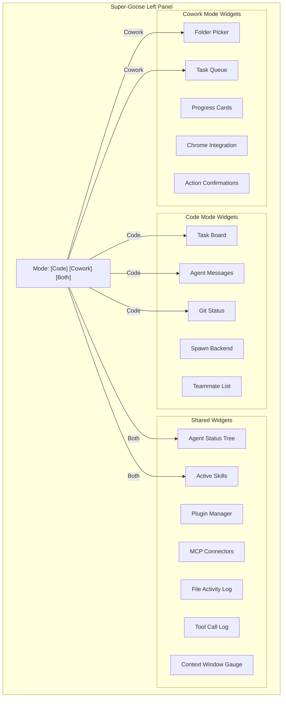
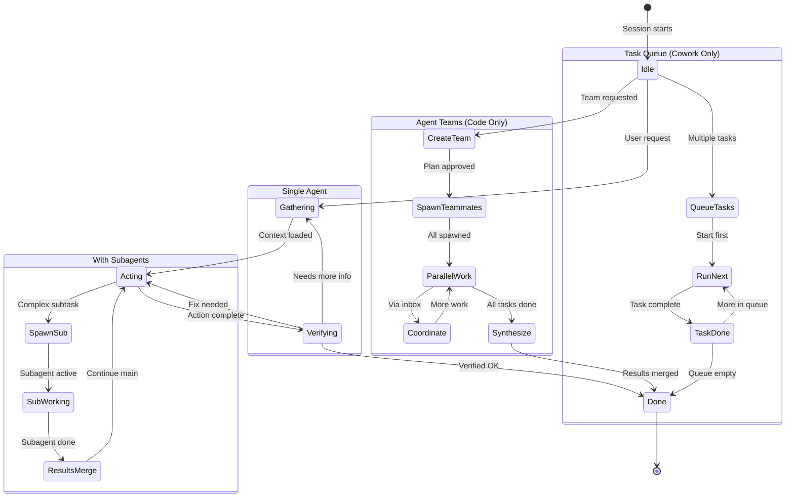
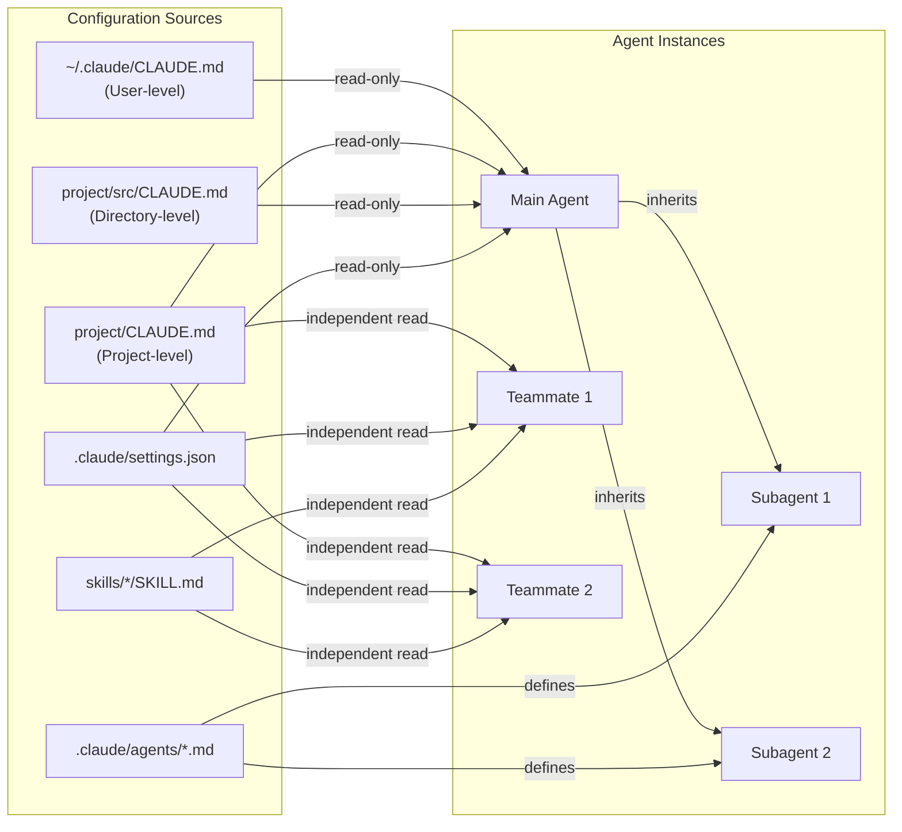

# Super-Goose Left Panel Blueprint
## Claude Code + Cowork — Unified Agent Architecture Reference

### Document Purpose

This document maps the 1:1 feature parity between Claude Code and Cowork agent systems, providing the exact blueprint for implementing both layouts and functions in the Super-Goose project's left side panel. Each section identifies the shared components, the platform-specific differences, and the implementation patterns for replicating both experiences.

---

## Table of Contents

1. [Unified Architecture Map](#1-unified-architecture-map)
2. [Agent System — Component-by-Component Mapping](#2-agent-system--component-by-component-mapping)
3. [Panel Design: What to Render](#3-panel-design-what-to-render)
4. [Agent Orchestration Patterns](#4-agent-orchestration-patterns)
5. [How Agents Work Together Without Conflicts](#5-how-agents-work-together-without-conflicts)
6. [Implementation Schematics](#6-implementation-schematics)
7. [Mermaid System Diagrams](#7-mermaid-system-diagrams)

---

## 1. Unified Architecture Map

Both Claude Code and Cowork are **skins over the same engine**:

```
┌─────────────────────────────────────────────────────────────────┐
│                     CLAUDE AGENT SDK (Core)                     │
│  ┌───────────────────────────────────────────────────────────┐  │
│  │                                                           │  │
│  │  AGENT LOOP ─── TOOL EXECUTOR ─── CONTEXT MANAGER         │  │
│  │       │              │                  │                  │  │
│  │  PERMISSION     MCP SERVERS        COMPACTION              │  │
│  │  MANAGER                                                   │  │
│  │       │              │                  │                  │  │
│  │  SUBAGENT       SKILLS LOADER      SESSION MGR             │  │
│  │  SYSTEM                                                    │  │
│  │       │              │                  │                  │  │
│  │  TEAMMATE       PLUGIN SYSTEM      HOOKS ENGINE            │  │
│  │  TOOL                                                      │  │
│  │                                                           │  │
│  └───────────────────────────────────────────────────────────┘  │
│                                                                  │
│       ┌──────────────────┐        ┌──────────────────┐          │
│       │   CLAUDE CODE    │        │     COWORK       │          │
│       │   INTERFACE      │        │     INTERFACE    │          │
│       │                  │        │                  │          │
│       │  ┌────────────┐  │        │  ┌────────────┐  │          │
│       │  │ Terminal    │  │        │  │ Desktop    │  │          │
│       │  │ VS Code    │  │        │  │ GUI Tab    │  │          │
│       │  │ Web UI     │  │        │  │            │  │          │
│       │  └────────────┘  │        │  └────────────┘  │          │
│       │                  │        │                  │          │
│       │  Full system     │        │  Folder sandbox  │          │
│       │  access          │        │  only             │          │
│       │                  │        │                  │          │
│       │  Developer       │        │  Everyone        │          │
│       │  focus           │        │  focus            │          │
│       └──────────────────┘        └──────────────────┘          │
│                                                                  │
│  ┌────────────────────────┐                                     │
│  │    SUPER-GOOSE         │  ← YOUR PROJECT: Render BOTH        │
│  │    LEFT PANEL          │    interfaces in a unified panel    │
│  └────────────────────────┘                                     │
│                                                                  │
└─────────────────────────────────────────────────────────────────┘
```

---

## 2. Agent System — Component-by-Component Mapping

### Shared Core (Implement Once, Use for Both Views)

| Component | What It Does | Claude Code Surface | Cowork Surface | Panel Widget |
|---|---|---|---|---|
| **Agent Loop** | gather → act → verify → repeat | Terminal output stream | Progress cards | Activity feed |
| **Tool Executor** | Bash, Read, Write, Edit, Glob, Grep | CLI tool calls visible | Hidden from user | Tool call log (collapsible) |
| **Context Manager** | Token tracking, compaction | `/compact` command | Automatic | Context gauge |
| **Permission Manager** | Approve/deny actions | Y/N prompt in terminal | Confirmation dialog | Permission dialog |
| **Subagent System** | Spawn isolated child agents | Task tool + custom agents | Parallel sub-agents | Agent tree view |
| **Agent Teams** | Multi-session orchestration | TeammateTool, inboxes, tasks | Not exposed directly | Team panel (Code mode only) |
| **Skills Loader** | Dynamic capability injection | Auto-loads from SKILL.md | Auto-loads from SKILL.md | Skills indicator |
| **Plugin System** | Bundled workflow packages | `/plugin install` | GUI install | Plugin manager |
| **MCP Connectors** | External service integration | MCP server config | Connector marketplace | Connector list |
| **Hooks Engine** | Pre/Post tool interception | hooks.json + scripts | Limited | Hook status |
| **CLAUDE.md** | Project configuration | Full hierarchy read | Folder-level read | Config viewer |
| **Session Manager** | State persistence | Git + progress files | No cross-session | Session info |

### Platform-Specific Components

| Component | Claude Code Only | Cowork Only |
|---|---|---|
| **Agent Teams UI** | Teammate list, task board, inbox viewer | — |
| **Git Integration** | Branch, commit, diff, PR | — |
| **Folder Picker** | — | Folder grant dialog |
| **Task Queue** | — | Queued task list |
| **Browser Actions** | — | Claude in Chrome integration |
| **Action Confirmations** | Permission prompt (terminal) | Rich confirmation dialog |
| **Spawn Backend Selector** | tmux / iTerm2 / in-process | — |

---

## 3. Panel Design: What to Render

### Left Panel Layout — Unified View

```
┌────────────────────────────────────┐
│  SUPER-GOOSE LEFT PANEL            │
│                                    │
│  ┌──────────────────────────────┐  │
│  │  MODE SELECTOR               │  │
│  │  [Code] [Cowork] [Both]      │  │
│  └──────────────────────────────┘  │
│                                    │
│  ┌──────────────────────────────┐  │
│  │  AGENT STATUS                │  │
│  │                              │  │
│  │  ● Main Agent: Active       │  │
│  │  ├── Sub-1: Exploring       │  │
│  │  ├── Sub-2: Writing         │  │
│  │  └── Sub-3: Testing         │  │
│  │                              │  │
│  │  Context: ████████░░ 78%    │  │
│  │  Model: Opus 4.6            │  │
│  └──────────────────────────────┘  │
│                                    │
│  ┌──────────────────────────────┐  │
│  │  TASK BOARD (Agent Teams)    │  │
│  │                              │  │
│  │  #1 ✓ Auth module           │  │
│  │  #2 ► API routes            │  │
│  │  #3 ⊘ Tests (blocked #1,2) │  │
│  │  #4 ○ Documentation         │  │
│  └──────────────────────────────┘  │
│                                    │
│  ┌──────────────────────────────┐  │
│  │  SKILLS & PLUGINS            │  │
│  │                              │  │
│  │  Active Skills:              │  │
│  │  [xlsx] [docx] [pdf]        │  │
│  │                              │  │
│  │  Loaded Plugins:             │  │
│  │  [finance-analysis]          │  │
│  │  [code-review]               │  │
│  └──────────────────────────────┘  │
│                                    │
│  ┌──────────────────────────────┐  │
│  │  CONNECTORS (MCP)            │  │
│  │                              │  │
│  │  ● Asana: Connected         │  │
│  │  ● GitHub: Connected        │  │
│  │  ○ Slack: Available         │  │
│  └──────────────────────────────┘  │
│                                    │
│  ┌──────────────────────────────┐  │
│  │  FILE ACTIVITY               │  │
│  │                              │  │
│  │  ✎ src/auth.ts (modified)   │  │
│  │  + src/routes.ts (created)  │  │
│  │  ✎ tests/auth.test.ts      │  │
│  │  👁 CLAUDE.md (read)        │  │
│  └──────────────────────────────┘  │
│                                    │
│  ┌──────────────────────────────┐  │
│  │  TOOL CALLS (Collapsible)    │  │
│  │                              │  │
│  │  ▸ Bash: npm test           │  │
│  │  ▸ Read: src/config.ts      │  │
│  │  ▸ Grep: "authenticate"     │  │
│  │  ▸ Write: src/auth.ts       │  │
│  └──────────────────────────────┘  │
│                                    │
│  ┌──────────────────────────────┐  │
│  │  MESSAGES (Agent Teams)      │  │
│  │                              │  │
│  │  Frontend→Backend:           │  │
│  │  "Need endpoint /api/auth"   │  │
│  │                              │  │
│  │  Backend→Lead:               │  │
│  │  "API routes complete"       │  │
│  └──────────────────────────────┘  │
│                                    │
└────────────────────────────────────┘
```

### Mode-Specific Rendering

```
CODE MODE shows:                    COWORK MODE shows:
─────────────────────               ─────────────────────
✓ Agent Teams panel                 ✗ Agent Teams (hidden)
✓ Git status                        ✗ Git status (hidden)
✓ Spawn backend selector            ✗ Spawn backend (hidden)
✓ Full tool call log                ✓ Simplified progress
✓ Terminal-style output             ✓ Card-style progress
✓ Permission prompts                ✓ Rich confirmation dialogs
✗ Task queue                        ✓ Task queue
✗ Folder picker                     ✓ Folder picker
✗ Browser actions                   ✓ Chrome integration status
```

---

## 4. Agent Orchestration Patterns

### Pattern 1: Single Agent (Both Modes)

```
User Request
    │
    ▼
┌──────────────┐
│  Main Agent  │
│  (1 context  │
│   window)    │
│              │
│  Loop:       │
│  gather →    │
│  act →       │
│  verify →    │
│  repeat      │
└──────────────┘
```

**Panel shows**: Single agent status, context gauge, tool call log

### Pattern 2: Subagent Delegation (Both Modes)

```
User Request
    │
    ▼
┌──────────────┐
│  Main Agent  │──┐
└──────────────┘  │
                   │ Spawns
        ┌──────────┼──────────┐
        ▼          ▼          ▼
  ┌──────────┐ ┌────────┐ ┌────────┐
  │ Explore  │ │ Plan   │ │ Custom │
  │ (search) │ │(research│ │(user-  │
  │          │ │ only)  │ │ defined│
  └────┬─────┘ └────┬───┘ └────┬───┘
       │             │          │
       └─────────────┼──────────┘
                     │
                     ▼
              Results merge
              into Main Agent
```

**Panel shows**: Agent tree view with parent → children, per-agent status

### Pattern 3: Agent Teams / Swarm (Code Mode Only)

```
User Request
    │
    ▼
┌──────────────┐
│  Team Lead   │
│  (coordinator│
│   only)      │
└──────┬───────┘
       │
       ├── spawn("frontend") ──▶ Teammate 1
       │                         Own context window
       │                         Owns: src/components/*
       │
       ├── spawn("backend")  ──▶ Teammate 2
       │                         Own context window
       │                         Owns: src/api/*
       │
       └── spawn("testing")  ──▶ Teammate 3
                                 Own context window
                                 Owns: tests/*

  COORDINATION:
  ┌──────────────────────────────────────────┐
  │  Task Board (shared JSON files)          │
  │  Inbox System (per-agent JSON mailboxes) │
  │  Dependency tracking (blocked_by)        │
  │  File ownership boundaries               │
  └──────────────────────────────────────────┘
```

**Panel shows**: Full task board, teammate list, message feed, per-teammate status

### Pattern 4: Task Queue (Cowork Mode Only)

```
User: Queue 3 tasks
    │
    ▼
┌──────────────────────────────────┐
│  TASK QUEUE                      │
│                                  │
│  ┌──────────────────────────┐    │
│  │ Task 1: Sort files       │ ✓  │
│  └──────────────────────────┘    │
│  ┌──────────────────────────┐    │
│  │ Task 2: Create report    │ ►  │
│  │  └── Sub-agent: OCR      │    │
│  │  └── Sub-agent: Format   │    │
│  └──────────────────────────┘    │
│  ┌──────────────────────────┐    │
│  │ Task 3: Email summary    │ ○  │
│  └──────────────────────────┘    │
│                                  │
└──────────────────────────────────┘
```

**Panel shows**: Queue list with status indicators, current task progress

---

## 5. How Agents Work Together Without Conflicts

### The Golden Rule

> **Agents share CONFIGURATION (read-only) but NEVER share MUTABLE STATE.**

### Conflict Prevention Architecture

```
┌─────────────────────────────────────────────────────────────┐
│            HOW AGENTS AVOID STEPPING ON EACH OTHER          │
│                                                              │
│  SHARED (READ-ONLY):              ISOLATED (PER-AGENT):     │
│  ┌────────────────────┐           ┌────────────────────┐    │
│  │ CLAUDE.md           │           │ Context Window     │    │
│  │ Skills (SKILL.md)   │           │ (each agent has    │    │
│  │ Plugin configs      │           │  its own)          │    │
│  │ MCP server list     │           │                    │    │
│  │ .claude/settings    │           │ Inbox (own JSON)   │    │
│  │                     │           │                    │    │
│  │ ALL READ-ONLY       │           │ Assigned files     │    │
│  │ No agent writes     │           │ (own file set)     │    │
│  │ to these            │           │                    │    │
│  └────────────────────┘           │ Working memory     │    │
│                                    │ (not shared)       │    │
│                                    └────────────────────┘    │
│                                                              │
│  COORDINATION STATE (Append-Only):                           │
│  ┌────────────────────────────────────────────────────────┐  │
│  │ Task Board JSON:                                       │  │
│  │   - File-locked claiming (prevents race conditions)    │  │
│  │   - Dependency tracking (blocked_by arrays)            │  │
│  │   - Status: pending → in_progress → completed          │  │
│  │                                                        │  │
│  │ Inbox JSON:                                            │  │
│  │   - Per-agent mailbox (only owner reads)               │  │
│  │   - Append-only writes (senders add to recipient box)  │  │
│  │   - No shared mutable buffer                           │  │
│  │                                                        │  │
│  │ Git History (Code mode):                               │  │
│  │   - claude-progress.txt (append-only log)              │  │
│  │   - Git commits (immutable history)                    │  │
│  └────────────────────────────────────────────────────────┘  │
│                                                              │
│  ISOLATION STRATEGIES:                                       │
│  ┌────────────────────────────────────────────────────────┐  │
│  │                                                        │  │
│  │  Strategy 1: FILE OWNERSHIP                            │  │
│  │  Agent A → src/frontend/**                             │  │
│  │  Agent B → src/backend/**                              │  │
│  │  Agent C → tests/**                                    │  │
│  │  RULE: No two agents touch the same file               │  │
│  │                                                        │  │
│  │  Strategy 2: GIT WORKTREE (Community Pattern)          │  │
│  │  Each agent gets its own git worktree (branch)         │  │
│  │  Merge only after tests pass                           │  │
│  │                                                        │  │
│  │  Strategy 3: SEQUENTIAL TASKS (Cowork)                 │  │
│  │  Tasks execute one at a time in the queue              │  │
│  │  No concurrent file access by design                   │  │
│  │                                                        │  │
│  │  Strategy 4: CONTAINERIZATION (Cowork)                 │  │
│  │  Each session in its own container                     │  │
│  │  Mounted folder is the only shared surface              │  │
│  │                                                        │  │
│  └────────────────────────────────────────────────────────┘  │
│                                                              │
└─────────────────────────────────────────────────────────────┘
```

---

## 6. Implementation Schematics

### Data Structures for Panel State

```typescript
// Agent Status (shared between modes)
interface AgentStatus {
  id: string;
  name: string;
  type: 'main' | 'subagent' | 'teammate';
  status: 'idle' | 'gathering' | 'acting' | 'verifying' | 'complete' | 'error';
  contextUsage: number; // 0-100 percentage
  model: string;
  currentAction?: string;
  children?: AgentStatus[]; // subagents
}

// Task Board (Code mode - Agent Teams)
interface TaskItem {
  id: number;
  title: string;
  status: 'pending' | 'in_progress' | 'completed' | 'blocked';
  owner?: string; // teammate name
  blockedBy?: number[]; // task IDs
  completedAt?: string;
}

// Inbox Message (Code mode - Agent Teams)
interface InboxMessage {
  from: string;
  to: string;
  content: string;
  timestamp: string;
}

// Task Queue (Cowork mode)
interface QueuedTask {
  id: number;
  description: string;
  status: 'queued' | 'running' | 'complete' | 'error';
  subAgents?: AgentStatus[];
  progress?: number; // 0-100
}

// Skill Status
interface SkillStatus {
  name: string;
  loaded: boolean;
  triggered: boolean;
}

// Plugin Status
interface PluginStatus {
  name: string;
  enabled: boolean;
  commands: string[];
  agents: string[];
  skills: string[];
}

// Connector Status
interface ConnectorStatus {
  name: string;
  type: 'mcp';
  status: 'connected' | 'available' | 'error';
  url?: string;
}

// File Activity
interface FileActivity {
  path: string;
  action: 'read' | 'write' | 'create' | 'delete' | 'modify';
  agent: string;
  timestamp: string;
}

// Tool Call
interface ToolCall {
  tool: string;
  input: string;
  result?: string;
  status: 'running' | 'success' | 'error';
  timestamp: string;
}

// Complete Panel State
interface SuperGoosePanelState {
  mode: 'code' | 'cowork' | 'both';

  // Shared state
  agents: AgentStatus[];
  skills: SkillStatus[];
  plugins: PluginStatus[];
  connectors: ConnectorStatus[];
  fileActivity: FileActivity[];
  toolCalls: ToolCall[];

  // Code mode only
  taskBoard?: TaskItem[];
  messages?: InboxMessage[];
  gitStatus?: { branch: string; changes: number; };
  spawnBackend?: 'in-process' | 'tmux' | 'iterm2';

  // Cowork mode only
  taskQueue?: QueuedTask[];
  selectedFolder?: string;
  chromeConnected?: boolean;
}
```

### File System Layout (What to Track)

```
CLAUDE CODE MODE:
~/.claude/
├── teams/{team-name}/
│   ├── config.json              → Panel: Team info
│   └── inboxes/
│       ├── team-lead.json       → Panel: Messages feed
│       └── worker-*.json        → Panel: Messages feed
├── tasks/{team-name}/
│   └── *.json                   → Panel: Task board
├── agents/
│   └── *.md                     → Panel: Available agents
├── skills/
│   └── */SKILL.md               → Panel: Skills list
└── settings.json                → Panel: Configuration

COWORK MODE:
/sessions/{session-id}/
├── mnt/{folder-name}/           → Panel: Folder contents
│   └── (user's files)
└── (runtime environment)

BOTH MODES:
{project}/.claude/
├── agents/*.md                  → Panel: Subagent definitions
├── skills/*/SKILL.md            → Panel: Project skills
├── plugins/*/                   → Panel: Plugin packages
└── CLAUDE.md                    → Panel: Config viewer
```

---

## 7. Mermaid System Diagrams

### Super-Goose Unified Agent Architecture



### Agent Lifecycle — Both Modes



### How CLAUDE.md Flows to All Agents



---

## Quick Reference Card

### For Super-Goose Panel Implementation

| What to Build | Source System | Data Source | Update Frequency |
|---|---|---|---|
| Agent tree | Both | Agent loop events | Real-time (streaming) |
| Context gauge | Both | Token counter | Per tool call |
| Tool call log | Both | Tool execution events | Per tool call |
| File activity | Both | File system events | Per file operation |
| Skills indicator | Both | Skill trigger events | On skill load |
| Plugin manager | Both | Plugin registry | On install/enable |
| Connector list | Both | MCP config | On connect/disconnect |
| Task board | Code only | `~/.claude/tasks/` JSON | On task update |
| Message feed | Code only | `~/.claude/teams/inboxes/` JSON | On message write |
| Teammate list | Code only | Team config.json | On spawn/shutdown |
| Git status | Code only | Git commands | On commit/change |
| Folder picker | Cowork only | OS file dialog | On folder grant |
| Task queue | Cowork only | Session state | On queue change |
| Progress cards | Cowork only | Agent progress events | Real-time |
| Chrome status | Cowork only | Extension connection | On connect |

---

## Key Takeaways for Implementation

1. **Build the Agent SDK core once** — both modes share 80% of the same components
2. **Mode switching is UI-only** — the underlying engine is identical
3. **CLAUDE.md is always read-only** — no conflict risk from shared config
4. **Task board + inboxes are the only shared mutable state** — and they use file-level locking + append-only patterns
5. **Subagents report up, teammates communicate laterally** — the panel needs to render both patterns
6. **Skills load on demand** — track trigger events, not static lists
7. **Plugins bundle agents + commands + skills + hooks** — one install brings multiple panel updates
8. **Cowork's sandbox is a container mount** — the folder path in the panel maps to a container path internally
