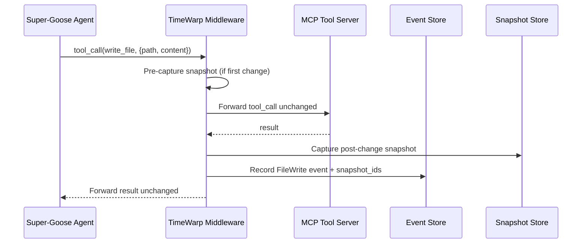

# TimeWarp: Super-Goose Integration Design

**Purpose:** How TimeWarp integrates with Super-Goose's existing four systems (ALMAS, EvoAgentX, Coach/Player, Conscious) and the upstream block/goose architecture.

---

## Integration Philosophy

TimeWarp integrates as an **observability and control layer** — it observes everything the agent does via MCP middleware and provides time-travel controls without modifying the core agent logic.

```
┌──────────────────────────────────────────────────────────┐
│                     Super-Goose                           │
│                                                           │
│  ┌─────────┐ ┌──────────┐ ┌────────────┐ ┌───────────┐  │
│  │  ALMAS  │ │EvoAgentX │ │Coach/Player│ │ Conscious  │  │
│  │  Team   │ │Self-Evol │ │  QA Review │ │  Voice     │  │
│  └────┬────┘ └────┬─────┘ └─────┬──────┘ └─────┬─────┘  │
│       │           │             │               │         │
│       └───────────┴─────┬───────┴───────────────┘         │
│                         │                                  │
│                    ┌────▼────┐                             │
│                    │   MCP   │  ← Existing MCP layer       │
│                    └────┬────┘                             │
│                         │                                  │
│  ┌──────────────────────▼──────────────────────────────┐  │
│  │          TimeWarp Instrumentation Layer               │  │
│  │  (transparent proxy — no changes to agent logic)      │  │
│  └──────────────────────┬──────────────────────────────┘  │
│                         │                                  │
│                    ┌────▼────┐                             │
│                    │ MCP Bus │  ← Pass-through to tools    │
│                    └─────────┘                             │
└──────────────────────────────────────────────────────────┘
```

**Key principle:** TimeWarp **never blocks or modifies** agent actions. It records them and provides controls (jump, branch, replay) as separate operations initiated by the user.

---

## Per-System Integration Details

### 1. ALMAS (Team Coordinator) → TimeWarp

ALMAS orchestrates 5 specialist roles (Architect, Developer, QA, Security, Deployer) in a sequential pipeline with handoff validation.

**Natural integration points:**

| ALMAS Event | TimeWarp Mapping | Why It Matters |
|---|---|---|
| Role handoff (Architect → Developer) | **Branch point** — each role's work is a natural timeline segment | User can jump back to "after architecture, before development" |
| RBAC capability check | **Event metadata** — which role has which permissions at this point | Audit trail for capability enforcement |
| Handoff validation pass/fail | **Branch event** — if validation fails, retry creates a fork | Compare first attempt vs. retry |
| Pipeline completion | **Milestone event** — snapshot with all roles' contributions | Full workspace state after complete pipeline |

**Example timeline for an ALMAS session:**
```
E1: [Architect] Design API schema
E2: [Architect] Define module structure
E3: [Architect→Developer] Handoff ✅
E4: [Developer] Implement auth module
E5: [Developer] Implement routes
E6: [Developer→QA] Handoff ✅
E7: [QA] Run test suite
E8: [QA] Tests failed ❌
E9: [QA→Developer] Handoff (retry)  ← FORK POINT
E10: [Developer] Fix auth bug
E11: [Developer→QA] Handoff ✅
E12: [QA] Tests passed ✅
E13: [QA→Security] Handoff ✅
...
```

The user can jump to E3 to see the architecture before any code was written, or compare the workspace at E5 (before QA) vs E12 (after QA fixes).

### 2. EvoAgentX (Self-Evolution) → TimeWarp

EvoAgentX uses memory-driven prompt optimization with A/B testing and progressive disclosure (90% token efficiency via 3-layer context).

**Natural integration points:**

| EvoAgentX Event | TimeWarp Mapping | Why It Matters |
|---|---|---|
| Prompt optimization cycle | **Event with before/after prompts** | Track how prompts evolve over time |
| A/B test start | **Branch fork** — variant A and variant B as parallel branches | Compare outcomes of different prompt strategies |
| A/B test result | **Branch annotation** — winning variant marked | Know which prompt version won and why |
| Memory update | **Event metadata** — what the agent "learned" | Audit trail of agent self-modification |
| Token efficiency metric | **Event annotation** — tokens used vs. baseline | Track optimization progress over timeline |

**A/B test as branches:**
```
         E5: Start A/B test
        /                    \
  Branch A:                  Branch B:
  E6a: Prompt variant A      E6b: Prompt variant B
  E7a: Execute task           E7b: Execute task
  E8a: Result: 85% quality    E8b: Result: 92% quality
                                    \
                                     └── Winner: Branch B
                                          merged to main
```

### 3. Coach/Player (QA System) → TimeWarp

Coach/Player uses dual-model adversarial review: Player executes, Coach validates, up to 3 review cycles.

**Natural integration points:**

| Coach/Player Event | TimeWarp Mapping | Why It Matters |
|---|---|---|
| Player execution start | **Event** — initial code generation | Baseline for quality comparison |
| Coach review | **Event with review feedback** | What the Coach criticized |
| Coach rejection | **Fork point** — revision creates new timeline | Compare version before and after review |
| Review cycle iteration | **Linear events within branch** | Track how many cycles were needed |
| Final approval | **Milestone event** — Coach accepts quality | Snapshot of approved workspace state |
| Quality score | **Event annotation** — score per cycle | Quality trend visualization on timeline |

**Review cycles on timeline:**
```
E1: [Player] Initial code → quality: 0.6
E2: [Coach] Review → REJECT: missing error handling
E3: [Player] Revision 1 → quality: 0.75    ← Compare E1 vs E3 diff
E4: [Coach] Review → REJECT: insufficient tests
E5: [Player] Revision 2 → quality: 0.92    ← Compare E3 vs E5 diff
E6: [Coach] Review → APPROVE ✅
```

### 4. Conscious (Voice Interface) → TimeWarp

Conscious provides voice-driven commands with intent detection.

**Natural integration points:**

| Conscious Event | TimeWarp Mapping | Why It Matters |
|---|---|---|
| Voice command recognized | **Event** — raw audio + transcription + intent | Audit what was said and how it was interpreted |
| Intent execution | **Linked event** — voice command → agent action | Trace voice command to resulting code changes |
| Voice-triggered navigation | **TimeWarp CLI via voice** — "go back to before the auth module" | Natural language time-travel |

**Voice-driven time-travel commands:**
```
User says: "Go back to before the authentication changes"
Conscious → intent: TIMEWARP_JUMP
Conscious → context: "authentication changes" 
TimeWarp → search events for "auth" → find E4
TimeWarp → tw jump E3 (event before auth)
```

---

## MCP Middleware Architecture

The instrumentation layer sits between the agent's MCP client and the MCP tool servers.



**MCP event types captured:**

| MCP Tool Call | TimeWarp Event Type | Snapshot? |
|---|---|---|
| `read_file` | `file_read` | No (read-only) |
| `write_file` | `file_write` | Yes (post-write) |
| `delete_file` | `file_delete` | Yes (post-delete) |
| `shell` / `bash` | `cmd_exec` | Yes (if files changed) |
| `git_*` | `git_op` | Yes |
| LLM completion | `llm_call` | No |
| Any other MCP tool | `mcp_tool_call` | Depends on side effects |

---

## File System Layout in Super-Goose

```
G:\goose/
├── crates/
│   ├── goose/              # Core logic
│   ├── goose-cli/          # CLI
│   ├── goose-server/       # Server
│   ├── goose-mcp/          # MCP extensions
│   ├── mcp-client/         # MCP client
│   ├── mcp-core/           # MCP shared types
│   ├── mcp-server/         # MCP server
│   └── timewarp/           # ★ NEW: TimeWarp core crate
│       ├── src/
│       │   ├── lib.rs
│       │   ├── event_store.rs
│       │   ├── snapshot_store.rs
│       │   ├── branch_manager.rs
│       │   ├── replay_engine.rs
│       │   ├── conflict_engine.rs
│       │   ├── mcp_middleware.rs
│       │   └── models.rs
│       ├── tests/
│       └── Cargo.toml
├── ui/
│   └── desktop/
│       └── src/
│           └── components/
│               └── timeline/    # ★ NEW: Timeline UI components
├── docs/
│   └── timewarp/               # ★ NEW: These research docs
│       ├── research/
│       ├── architecture/
│       ├── diagrams/
│       └── references/
├── .timewarp/                   # ★ NEW: Runtime data (gitignored)
│   ├── timewarp.db              # SQLite event/snapshot/branch store
│   └── blobs/                   # Content-addressed file blobs
└── Cargo.toml                   # Add timewarp crate to workspace
```

---

## Configuration

TimeWarp would be configurable via Super-Goose's existing config patterns:

```toml
# .goose/timewarp.toml (or section in main config)

[timewarp]
enabled = true
storage_path = ".timewarp"          # Where to store event DB and blobs
snapshot_frequency = "on_change"    # on_change | every_n_events | manual
full_snapshot_interval = 50         # Full snapshot every N deltas
max_blob_size_mb = 100              # Skip blobs larger than this
compression = "zstd"                # zstd | none
hash_algorithm = "blake3"           # blake3 | sha256

[timewarp.replay]
container_runtime = "docker"        # docker | podman | none
cache_llm_responses = true
max_replay_duration_sec = 300

[timewarp.ui]
timeline_position = "bottom"        # bottom | right | hidden
default_zoom = "session"            # session | hour | event
```

---

## Upstream Goose Compatibility

TimeWarp is designed to work with upstream block/goose without modifying core agent code:

| Concern | Approach |
|---|---|
| MCP tool calls | Middleware intercepts, does not modify |
| Agent core logic | No changes needed |
| CLI | `tw` subcommand added (separate from `goose` commands) |
| Desktop UI | Timeline component added to Electron/Tauri layout |
| Config | Separate `timewarp.toml` or section in existing config |
| Upstream sync | TimeWarp lives in its own crate — rebasing on upstream only requires Cargo.toml workspace changes |

---

*This integration design ensures TimeWarp adds capabilities without disrupting Super-Goose's existing systems or creating merge conflicts with upstream block/goose.*
