# TimeWarp: Diagrams Collection

All diagrams are in GitHub-compatible Mermaid format and render natively on GitHub.

---

## Diagram 1: System Architecture (High-Level)

```mermaid
graph TB
    subgraph "🖥️ User Interface"
        CLI["🔧 CLI<br/>tw jump / branch / replay"]
        GUI["📊 Timeline UI<br/>Fusion 360-style bar"]
    end

    subgraph "⚙️ TimeWarp Engine"
        IM["🔌 MCP Middleware<br/>Instruments agent actions"]
        ES["📋 Event Store<br/>Append-only • Hash chain"]
        SS["📦 Snapshot Store<br/>Content-addressed blobs"]
        BM["🌿 Branch Manager<br/>Fork • Merge • DAG"]
        RE["🔄 Replay Engine<br/>Containerized re-exec"]
        CE["🔍 Conflict Engine<br/>Structural + Semantic + Drift"]
    end

    subgraph "💾 Storage"
        DB[("SQLite<br/>Events • Branches • Index")]
        BLOBS[("Blob FS<br/>.timewarp/blobs/")]
    end

    subgraph "🤖 Agent Runtime"
        GOOSE["Super-Goose<br/>ALMAS • EvoAgentX<br/>Coach/Player • Conscious"]
        MCP["MCP Tools"]
        LLM["LLM Provider"]
    end

    CLI --> ES & BM & RE
    GUI --> ES & BM & SS
    GOOSE --> MCP --> IM
    IM --> ES & SS
    ES & SS --> DB
    SS --> BLOBS
    RE --> SS & ES
    CE --> SS
    BM --> ES
```

---

## Diagram 2: Event Lifecycle

---

## Diagram 3: Competitive Landscape Positioning

---

## Diagram 4: Content-Addressed Snapshot Chain

```mermaid
graph TD
    S0["🟦 Snapshot S0 (FULL BASE)<br/>3 files • 515 bytes<br/>━━━━━━━━━━━━━━━━━<br/>src/main.rs → blob:aa11<br/>Cargo.toml → blob:bb22<br/>README.md → blob:cc33"]

    S1["🟩 Snapshot S1 (DELTA from S0)<br/>+1 file added<br/>━━━━━━━━━━━━━━━━━<br/>+ src/auth.rs → blob:dd44"]

    S2["🟨 Snapshot S2 (DELTA from S1)<br/>1 file modified<br/>━━━━━━━━━━━━━━━━━<br/>~ src/main.rs → blob:ee55"]

    S3["🟧 Snapshot S3 (DELTA from S2)<br/>2 files modified<br/>━━━━━━━━━━━━━━━━━<br/>~ src/auth.rs → blob:ff66<br/>~ Cargo.toml → blob:gg77"]

    S4["🟦 Snapshot S4 (FULL BASE)<br/>Periodic compaction<br/>━━━━━━━━━━━━━━━━━<br/>5 files • 1.2 KB<br/>(all current state)"]

    S0 --> S1 --> S2 --> S3 --> S4

    style S0 fill:#3498db,color:#fff
    style S1 fill:#2ecc71,color:#fff
    style S2 fill:#f1c40f,color:#000
    style S3 fill:#e67e22,color:#fff
    style S4 fill:#3498db,color:#fff
```

---

## Diagram 5: Branch DAG with Merge

---

## Diagram 6: Replay Engine Flow

---

## Diagram 7: Conflict Detection Pipeline

```mermaid
flowchart TB
    MERGE["Merge Request<br/>Branch A → Branch B"] --> L1

    subgraph L1["Layer 1: Structural"]
        direction LR
        DIFF[Line-level diff] --> OVERLAP{Overlapping<br/>changes?}
        OVERLAP -->|No| L1_PASS[✅ Pass]
        OVERLAP -->|Yes| L1_FAIL[❌ Structural Conflict]
    end

    L1_PASS --> L2

    subgraph L2["Layer 2: Semantic (AST)"]
        direction LR
        PARSE[Parse ASTs<br/>tree-sitter] --> SYMBOLS{Symbol<br/>conflicts?}
        SYMBOLS -->|No| L2_PASS[✅ Pass]
        SYMBOLS -->|Yes| L2_WARN[⚠️ Semantic Conflict]
    end

    L2_PASS --> L3
    L2_WARN --> L3

    subgraph L3["Layer 3: Drift"]
        direction LR
        DEPS[Check dependency<br/>versions] --> CHANGED{Environment<br/>changed?}
        CHANGED -->|No| L3_PASS[✅ Pass]
        CHANGED -->|Yes| L3_WARN[⚠️ Drift Detected]
    end

    L3_PASS --> RESULT_OK["✅ Safe to merge"]
    L3_WARN --> RESULT_WARN["⚠️ Merge with caution"]
    L1_FAIL --> RESULT_BLOCK["❌ Fix conflicts first"]

    style L1 fill:#3498db22,stroke:#3498db
    style L2 fill:#e67e2222,stroke:#e67e22
    style L3 fill:#e74c3c22,stroke:#e74c3c
```

---

## Diagram 8: Super-Goose + TimeWarp Integration Map

---

## Diagram 9: CLI Command Map

---

## Diagram 10: Timeline UI Layout

```mermaid
graph TB
    subgraph Window["Super-Goose Desktop Window"]
        subgraph Top["Main Area (Editor / Chat / Agent Output)"]
            EDITOR["Code Editor + Agent Chat Panel"]
        end

        subgraph Middle["Event Inspector (collapsible)"]
            INSPECT["Event E7: shell cargo test<br/>Branch: main │ 14:23:05 │ 3.2s<br/>Files: src/auth.rs, tests/auth_test.rs<br/>Result: 12 passed │ Reproducibility: 0.95"]
        end

        subgraph Bottom["Timeline Bar (always visible)"]
            direction LR
            TRACK["main:  ●─●─●─●─●─●─●─▼─●─●─●<br/>oauth:      ╲─●─●─●<br/>jwt:            ╲─●─●"]
            CONTROLS["⏮ ◀ ▶ ⏭ │ Branch: main │ Event 9/19 │ 🔍"]
        end
    end

    Top --> Middle --> Bottom

    style Top fill:#1a1a2e,color:#fff
    style Middle fill:#16213e,color:#fff
    style Bottom fill:#0f3460,color:#fff
```

---

*All diagrams use GitHub-compatible Mermaid syntax. View rendered diagrams by viewing this file on GitHub or any Mermaid-compatible renderer.*
