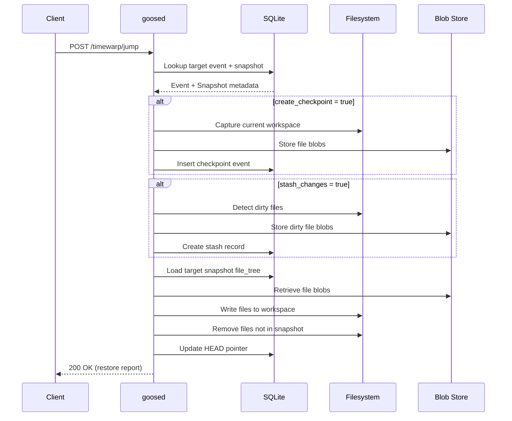
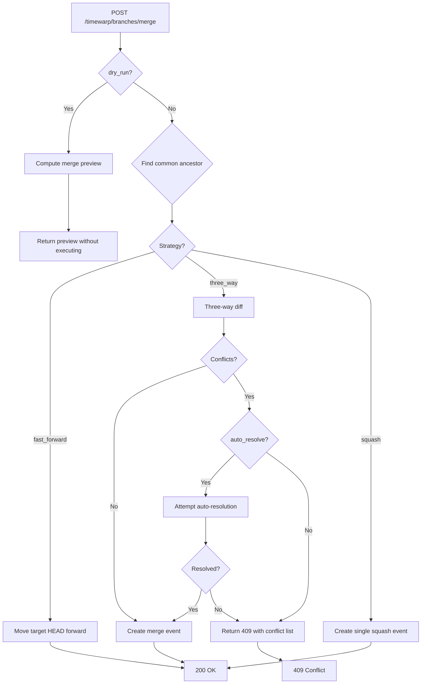

# TimeWarp REST API Specification

**Version:** 1.0.0
**Status:** Implementation-Ready Draft
**Server:** goosed (Axum-based Rust HTTP server)
**Base URL:** `http://localhost:3284`
**Last Updated:** 2026-02-10

---

## Table of Contents

1. [Overview](#1-overview)
2. [Authentication & Security](#2-authentication--security)
3. [Common Patterns](#3-common-patterns)
4. [Timeline Events API](#4-timeline-events-api)
5. [Timeline Navigation API](#5-timeline-navigation-api)
6. [Branch Management API](#6-branch-management-api)
7. [Snapshot API](#7-snapshot-api)
8. [Replay API](#8-replay-api)
9. [Conflict Detection API](#9-conflict-detection-api)
10. [Backup API](#10-backup-api)
11. [Status & Config API](#11-status--config-api)
12. [Real-Time Streaming](#12-real-time-streaming)
13. [Bulk Operations](#13-bulk-operations)
14. [Error Reference](#14-error-reference)
15. [Axum Implementation Guide](#15-axum-implementation-guide)

---

## 1. Overview

TimeWarp is an event-sourced time-travel system for AI coding agents, providing a Fusion 360-style parametric timeline. This specification defines the complete REST API surface served by the goosed Axum server.

### Architecture Context

```
Client (Desktop/CLI)           goosed (Axum)             Storage
     |                            |                         |
     |-- X-Secret-Key header ---->|                         |
     |   GET /timewarp/events     |--- SQLite queries ----->|
     |<--- JSON response ---------|<--- rows ---------------|
     |                            |                         |
     |   GET /timewarp/events/    |                         |
     |       stream (SSE)         |--- Event watcher ------>|
     |<--- text/event-stream -----|<--- notify -------------|
```

### API Versioning Strategy

TimeWarp follows the same unversioned path strategy as the existing goosed API. All endpoints are under the `/timewarp` prefix. If breaking changes are required in the future, a `/v2/timewarp` prefix will be introduced with the old endpoints deprecated over two release cycles.

### Route Module Registration

The TimeWarp routes integrate into the existing goosed architecture via `routes/mod.rs`:

```rust
// In crates/goose-server/src/routes/mod.rs
pub mod timewarp;

pub fn configure(state: Arc<crate::state::AppState>, secret_key: String) -> Router {
    Router::new()
        // ... existing routes ...
        .merge(timewarp::routes(state.clone()))
}
```

---

## 2. Authentication & Security

### Authentication

All TimeWarp endpoints (except streaming health probes) require the `X-Secret-Key` header, consistent with the existing goosed auth middleware in `crates/goose-server/src/auth.rs`.

```
X-Secret-Key: <server-secret>
```

The `check_token` middleware validates this header on all routes except explicitly exempted paths. TimeWarp streaming endpoints (`/timewarp/events/stream`) are authenticated but use a query parameter fallback for SSE clients that cannot set custom headers:

```
GET /timewarp/events/stream?secret_key=<server-secret>
```

### Rate Limiting Considerations

TimeWarp endpoints that perform expensive operations include rate limiting guidance:

| Endpoint Category | Recommended Limit | Reason |
|---|---|---|
| Event queries | 60 req/min | Database-bound |
| Jump/restore | 10 req/min | Filesystem I/O |
| Replay start | 5 req/min | CPU + I/O intensive |
| Snapshot restore | 5 req/min | Filesystem I/O |
| Backup/export | 2 req/min | Large I/O operations |
| GC/compact | 1 req/5min | Maintenance operations |
| Event stream (SSE) | 5 concurrent | Memory per connection |

Rate limiting is implemented at the application level using a token bucket per client IP, returning `429 Too Many Requests` when exceeded.

---

## 3. Common Patterns

### Error Response Format

All error responses follow the existing goosed `ErrorResponse` pattern from `routes/errors.rs`:

```json
{
  "message": "Human-readable error description"
}
```

Extended TimeWarp errors include an optional `code` field for programmatic handling:

```json
{
  "message": "Event not found: evt_01HQXYZ",
  "code": "TIMEWARP_EVENT_NOT_FOUND",
  "details": {
    "event_id": "evt_01HQXYZ"
  }
}
```

**Error Code Prefixes:**
- `TIMEWARP_EVENT_*` -- Event-related errors
- `TIMEWARP_BRANCH_*` -- Branch-related errors
- `TIMEWARP_SNAPSHOT_*` -- Snapshot-related errors
- `TIMEWARP_REPLAY_*` -- Replay-related errors
- `TIMEWARP_CONFLICT_*` -- Conflict-related errors
- `TIMEWARP_CONFIG_*` -- Configuration errors

### Pagination (Cursor-Based)

Event list endpoints use cursor-based pagination for stable iteration over the event DAG:

**Request Query Parameters:**
```
?cursor=<opaque_cursor>&limit=50&direction=backward
```

| Parameter | Type | Default | Description |
|---|---|---|---|
| `cursor` | string | (none) | Opaque cursor from previous response. Omit for first page. |
| `limit` | integer | 50 | Maximum items to return (1-200). |
| `direction` | string | `"backward"` | `"forward"` or `"backward"` from cursor. |

**Response Pagination Envelope:**
```json
{
  "items": [...],
  "pagination": {
    "cursor_next": "eyJldmVudF9pZCI6ImV2dF8wMUhRWFlaIn0=",
    "cursor_prev": "eyJldmVudF9pZCI6ImV2dF8wMUhRWFhYIn0=",
    "has_more": true,
    "total_count": 1542
  }
}
```

### Timestamp Format

All timestamps use ISO 8601 / RFC 3339 format: `"2026-02-10T14:30:00.000Z"`

### ID Format

- **Event IDs:** UUID v7 (time-ordered), prefixed `evt_` -- e.g., `evt_01952a3b-4c5d-7e6f-8a9b-0c1d2e3f4a5b`
- **Branch IDs:** UUID v4, prefixed `br_` -- e.g., `br_a1b2c3d4-e5f6-7890-abcd-ef1234567890`
- **Snapshot IDs:** SHA-256 hash of file tree, prefixed `snap_` -- e.g., `snap_a1b2c3d4e5f6...`
- **Replay IDs:** UUID v4, prefixed `rpl_` -- e.g., `rpl_f0e1d2c3-b4a5-6789-0abc-def123456789`
- **Conflict IDs:** UUID v4, prefixed `conf_` -- e.g., `conf_12345678-abcd-ef01-2345-6789abcdef01`

### Common HTTP Status Codes

| Code | Meaning |
|---|---|
| `200` | Success |
| `201` | Created |
| `204` | No Content (success, no body) |
| `400` | Bad Request (invalid input) |
| `401` | Unauthorized (missing/invalid X-Secret-Key) |
| `404` | Not Found |
| `409` | Conflict (merge conflict, concurrent modification) |
| `422` | Unprocessable Entity (valid JSON but semantic error) |
| `429` | Too Many Requests |
| `500` | Internal Server Error |
| `503` | Service Unavailable (TimeWarp not initialized) |

---

## 4. Timeline Events API

### 4.1 List Events

Retrieve a paginated list of timeline events with optional filtering.

```
GET /timewarp/events
```

**Query Parameters:**

| Parameter | Type | Required | Default | Description |
|---|---|---|---|---|
| `branch` | string | No | current | Branch ID or name to filter by |
| `event_type` | string | No | (all) | Comma-separated event types: `file_write`, `cmd_exec`, `llm_call`, `git_op`, `checkpoint`, `branch_op`, `merge` |
| `after` | string | No | -- | ISO 8601 timestamp, return events after this time |
| `before` | string | No | -- | ISO 8601 timestamp, return events before this time |
| `file_path` | string | No | -- | Filter by touched file path (glob patterns supported) |
| `cursor` | string | No | -- | Pagination cursor |
| `limit` | integer | No | 50 | Max results (1-200) |
| `sort` | string | No | `"desc"` | `"asc"` or `"desc"` by created_at |
| `include_metadata` | boolean | No | false | Include full metadata in response |

**Response:** `200 OK`

```json
{
  "items": [
    {
      "event_id": "evt_01952a3b-4c5d-7e6f-8a9b-0c1d2e3f4a5b",
      "parent_ids": ["evt_01952a3a-1234-5678-9abc-def012345678"],
      "branch_id": "br_main",
      "event_type": "file_write",
      "summary": "Modified src/main.rs: added error handling",
      "file_touches": ["src/main.rs"],
      "snapshot_id": "snap_a1b2c3d4e5f6...",
      "event_hash": "sha256:abcdef1234567890...",
      "created_at": "2026-02-10T14:30:00.000Z"
    }
  ],
  "pagination": {
    "cursor_next": "eyJldmVudF9pZCI6ImV2dF8wMUhRWFlaIn0=",
    "cursor_prev": null,
    "has_more": true,
    "total_count": 342
  }
}
```

**Error Responses:**
- `400` -- Invalid query parameters (bad date format, unknown event type)
- `404` -- Branch not found
- `503` -- TimeWarp not initialized

**Axum Handler Signature:**
```rust
#[utoipa::path(
    get,
    path = "/timewarp/events",
    params(
        ("branch" = Option<String>, Query, description = "Branch ID or name"),
        ("event_type" = Option<String>, Query, description = "Comma-separated event types"),
        ("after" = Option<String>, Query, description = "ISO 8601 after timestamp"),
        ("before" = Option<String>, Query, description = "ISO 8601 before timestamp"),
        ("file_path" = Option<String>, Query, description = "File path glob filter"),
        ("cursor" = Option<String>, Query, description = "Pagination cursor"),
        ("limit" = Option<u32>, Query, description = "Max results (1-200)"),
        ("sort" = Option<String>, Query, description = "Sort order: asc or desc"),
        ("include_metadata" = Option<bool>, Query, description = "Include full metadata")
    ),
    responses(
        (status = 200, description = "Event list", body = EventListResponse),
        (status = 400, description = "Invalid query parameters", body = ErrorResponse),
        (status = 404, description = "Branch not found", body = ErrorResponse),
        (status = 503, description = "TimeWarp not initialized", body = ErrorResponse)
    ),
    security(("api_key" = [])),
    tag = "TimeWarp Events"
)]
async fn list_events(
    State(state): State<Arc<AppState>>,
    Query(params): Query<ListEventsQuery>,
) -> Result<Json<EventListResponse>, ErrorResponse>
```

---

### 4.2 Get Single Event

Retrieve a single event with full metadata.

```
GET /timewarp/events/{event_id}
```

**Path Parameters:**

| Parameter | Type | Description |
|---|---|---|
| `event_id` | string | Event ID (e.g., `evt_01952a3b-...`) |

**Response:** `200 OK`

```json
{
  "event_id": "evt_01952a3b-4c5d-7e6f-8a9b-0c1d2e3f4a5b",
  "parent_ids": ["evt_01952a3a-1234-5678-9abc-def012345678"],
  "branch_id": "br_main",
  "event_type": "file_write",
  "summary": "Modified src/main.rs: added error handling",
  "inputs": {
    "tool_name": "developer__file_write",
    "arguments": {
      "path": "src/main.rs",
      "content": "..."
    }
  },
  "outputs": {
    "status": "success",
    "bytes_written": 1542
  },
  "file_touches": ["src/main.rs"],
  "snapshot_id": "snap_a1b2c3d4e5f6...",
  "prev_hash": "sha256:1234567890abcdef...",
  "event_hash": "sha256:abcdef1234567890...",
  "created_at": "2026-02-10T14:30:00.000Z",
  "metadata": {
    "model": "claude-opus-4-6",
    "model_version": "2026-02-01",
    "tool_version": "1.24.02",
    "session_id": "sess_abc123",
    "token_usage": {
      "input_tokens": 1200,
      "output_tokens": 450
    },
    "duration_ms": 342
  }
}
```

**Error Responses:**
- `404` -- Event not found

**Axum Handler Signature:**
```rust
#[utoipa::path(
    get,
    path = "/timewarp/events/{event_id}",
    params(
        ("event_id" = String, Path, description = "Event ID")
    ),
    responses(
        (status = 200, description = "Event details", body = TimeWarpEvent),
        (status = 404, description = "Event not found", body = ErrorResponse)
    ),
    security(("api_key" = [])),
    tag = "TimeWarp Events"
)]
async fn get_event(
    State(state): State<Arc<AppState>>,
    Path(event_id): Path<String>,
) -> Result<Json<TimeWarpEvent>, ErrorResponse>
```

---

### 4.3 Get Event Diff

Get the workspace diff between this event and its parent.

```
GET /timewarp/events/{event_id}/diff
```

**Path Parameters:**

| Parameter | Type | Description |
|---|---|---|
| `event_id` | string | Event ID |

**Query Parameters:**

| Parameter | Type | Default | Description |
|---|---|---|---|
| `base_event_id` | string | (parent) | Compare against specific event instead of parent |
| `context_lines` | integer | 3 | Number of context lines in unified diff |
| `format` | string | `"unified"` | `"unified"`, `"stat"`, or `"raw"` |

**Response:** `200 OK`

```json
{
  "event_id": "evt_01952a3b-4c5d-7e6f-8a9b-0c1d2e3f4a5b",
  "base_event_id": "evt_01952a3a-1234-5678-9abc-def012345678",
  "files_changed": 2,
  "insertions": 15,
  "deletions": 3,
  "diffs": [
    {
      "path": "src/main.rs",
      "status": "modified",
      "insertions": 12,
      "deletions": 3,
      "diff": "--- a/src/main.rs\n+++ b/src/main.rs\n@@ -10,3 +10,12 @@\n fn main() {\n-    println!(\"hello\");\n+    match run() {\n+        Ok(_) => {},\n+        Err(e) => eprintln!(\"Error: {}\", e),\n+    }\n }"
    },
    {
      "path": "src/error.rs",
      "status": "added",
      "insertions": 3,
      "deletions": 0,
      "diff": "--- /dev/null\n+++ b/src/error.rs\n@@ -0,0 +1,3 @@\n+pub type Result<T> = std::result::Result<T, Box<dyn std::error::Error>>;\n"
    }
  ]
}
```

**Error Responses:**
- `404` -- Event not found or base event not found

---

### 4.4 Search Events

Full-text search across event metadata, summaries, and file paths.

```
GET /timewarp/events/search
```

**Query Parameters:**

| Parameter | Type | Required | Default | Description |
|---|---|---|---|---|
| `q` | string | Yes | -- | Search query |
| `branch` | string | No | (all) | Restrict to branch |
| `event_type` | string | No | (all) | Filter by event type |
| `after` | string | No | -- | After timestamp |
| `before` | string | No | -- | Before timestamp |
| `limit` | integer | No | 20 | Max results (1-100) |

**Response:** `200 OK`

```json
{
  "query": "error handling",
  "results": [
    {
      "event_id": "evt_01952a3b-4c5d-7e6f-8a9b-0c1d2e3f4a5b",
      "branch_id": "br_main",
      "event_type": "file_write",
      "summary": "Modified src/main.rs: added error handling",
      "created_at": "2026-02-10T14:30:00.000Z",
      "relevance_score": 0.92,
      "highlights": [
        {
          "field": "summary",
          "snippet": "Modified src/main.rs: added <mark>error handling</mark>"
        }
      ]
    }
  ],
  "total_matches": 5
}
```

**Error Responses:**
- `400` -- Missing or empty query string

---

### 4.5 Create Checkpoint

Create a manual checkpoint event at the current point in the timeline.

```
POST /timewarp/events/checkpoint
```

**Request Body:**

```json
{
  "name": "Before refactoring auth module",
  "description": "Stable state before major auth refactor",
  "tags": ["stable", "pre-refactor"],
  "session_id": "sess_abc123"
}
```

| Field | Type | Required | Description |
|---|---|---|---|
| `name` | string | Yes | Human-readable checkpoint name (max 200 chars) |
| `description` | string | No | Extended description |
| `tags` | string[] | No | Tags for categorization |
| `session_id` | string | No | Associate with session |

**Response:** `201 Created`

```json
{
  "event_id": "evt_01952a3c-abcd-ef01-2345-6789abcdef01",
  "event_type": "checkpoint",
  "name": "Before refactoring auth module",
  "snapshot_id": "snap_f0e1d2c3b4a5...",
  "branch_id": "br_main",
  "created_at": "2026-02-10T14:35:00.000Z"
}
```

**Error Responses:**
- `400` -- Invalid name (empty or too long)
- `503` -- TimeWarp not initialized

---

## 5. Timeline Navigation API

### 5.1 Jump to Event

Restore the workspace to the state captured at a specific event.

```
POST /timewarp/jump
```

**Request Body:**

```json
{
  "event_id": "evt_01952a3b-4c5d-7e6f-8a9b-0c1d2e3f4a5b",
  "mode": "hard",
  "create_checkpoint": true,
  "stash_changes": true
}
```

| Field | Type | Required | Default | Description |
|---|---|---|---|---|
| `event_id` | string | Yes | -- | Target event ID |
| `mode` | string | No | `"hard"` | `"hard"` (replace files) or `"soft"` (update HEAD only) |
| `create_checkpoint` | boolean | No | true | Auto-checkpoint current state before jumping |
| `stash_changes` | boolean | No | true | Stash uncommitted workspace changes |

**Response:** `200 OK`

```json
{
  "previous_head": "evt_01952a3d-0000-0000-0000-000000000000",
  "new_head": "evt_01952a3b-4c5d-7e6f-8a9b-0c1d2e3f4a5b",
  "checkpoint_id": "evt_01952a3e-1111-1111-1111-111111111111",
  "files_restored": 12,
  "files_removed": 2,
  "files_unchanged": 45,
  "stash_id": "stash_abc123",
  "warnings": []
}
```

**Error Responses:**
- `400` -- Invalid mode
- `404` -- Event not found
- `409` -- Workspace has uncommitted changes and `stash_changes` is false
- `500` -- Failed to restore workspace



---

### 5.2 Preview Jump

Preview what the workspace would look like at a specific event, without actually restoring.

```
POST /timewarp/jump/preview
```

**Request Body:**

```json
{
  "event_id": "evt_01952a3b-4c5d-7e6f-8a9b-0c1d2e3f4a5b"
}
```

**Response:** `200 OK`

```json
{
  "event_id": "evt_01952a3b-4c5d-7e6f-8a9b-0c1d2e3f4a5b",
  "snapshot_id": "snap_a1b2c3d4e5f6...",
  "preview": {
    "files_to_restore": ["src/main.rs", "src/error.rs"],
    "files_to_remove": ["src/old_handler.rs"],
    "files_unchanged": ["Cargo.toml", "README.md"],
    "total_files": 14,
    "total_bytes": 28450,
    "diff_from_current": {
      "files_changed": 3,
      "insertions": 25,
      "deletions": 40
    }
  }
}
```

**Error Responses:**
- `404` -- Event not found

---

### 5.3 Get HEAD

Get the current HEAD event and active branch.

```
GET /timewarp/head
```

**Response:** `200 OK`

```json
{
  "event_id": "evt_01952a3d-0000-0000-0000-000000000000",
  "branch_id": "br_main",
  "branch_name": "main",
  "snapshot_id": "snap_f0e1d2c3b4a5...",
  "created_at": "2026-02-10T14:40:00.000Z",
  "event_type": "file_write",
  "is_detached": false,
  "behind_tip": 0
}
```

| Field | Type | Description |
|---|---|---|
| `is_detached` | boolean | True if HEAD is not at branch tip |
| `behind_tip` | integer | Number of events between HEAD and branch tip |

---

### 5.4 Undo

Undo the last event by jumping to HEAD's parent. Convenience wrapper around `POST /timewarp/jump`.

```
POST /timewarp/undo
```

**Request Body:**

```json
{
  "steps": 1,
  "create_checkpoint": true
}
```

| Field | Type | Required | Default | Description |
|---|---|---|---|---|
| `steps` | integer | No | 1 | Number of events to undo (1-50) |
| `create_checkpoint` | boolean | No | true | Auto-checkpoint before undoing |

**Response:** `200 OK`

```json
{
  "previous_head": "evt_01952a3d-0000-0000-0000-000000000000",
  "new_head": "evt_01952a3c-abcd-ef01-2345-6789abcdef01",
  "steps_undone": 1,
  "redo_available": true
}
```

**Error Responses:**
- `400` -- Steps out of range
- `409` -- No events to undo (HEAD is at branch root)

---

### 5.5 Redo

Redo a previously undone event. Only available after an undo operation.

```
POST /timewarp/redo
```

**Request Body:**

```json
{
  "steps": 1
}
```

**Response:** `200 OK`

```json
{
  "previous_head": "evt_01952a3c-abcd-ef01-2345-6789abcdef01",
  "new_head": "evt_01952a3d-0000-0000-0000-000000000000",
  "steps_redone": 1,
  "redo_remaining": 0
}
```

**Error Responses:**
- `400` -- Steps out of range
- `409` -- No redo history available (either never undone, or new events added since undo)

---

## 6. Branch Management API

### 6.1 List Branches

```
GET /timewarp/branches
```

**Query Parameters:**

| Parameter | Type | Default | Description |
|---|---|---|---|
| `status` | string | `"active"` | `"active"`, `"archived"`, or `"all"` |
| `sort` | string | `"updated"` | `"updated"`, `"created"`, `"name"`, `"events"` |

**Response:** `200 OK`

```json
{
  "branches": [
    {
      "branch_id": "br_main",
      "name": "main",
      "is_default": true,
      "is_active": true,
      "head_event_id": "evt_01952a3d-0000-0000-0000-000000000000",
      "fork_event_id": null,
      "event_count": 342,
      "created_at": "2026-02-01T10:00:00.000Z",
      "updated_at": "2026-02-10T14:40:00.000Z",
      "status": "active"
    },
    {
      "branch_id": "br_a1b2c3d4-e5f6-7890-abcd-ef1234567890",
      "name": "refactor/auth",
      "is_default": false,
      "is_active": false,
      "head_event_id": "evt_01952a3e-2222-2222-2222-222222222222",
      "fork_event_id": "evt_01952a3b-4c5d-7e6f-8a9b-0c1d2e3f4a5b",
      "event_count": 28,
      "created_at": "2026-02-08T09:00:00.000Z",
      "updated_at": "2026-02-10T11:20:00.000Z",
      "status": "active"
    }
  ],
  "total_count": 2
}
```

---

### 6.2 Create Branch

```
POST /timewarp/branches
```

**Request Body:**

```json
{
  "name": "experiment/new-parser",
  "from_event_id": "evt_01952a3b-4c5d-7e6f-8a9b-0c1d2e3f4a5b",
  "switch_to": true
}
```

| Field | Type | Required | Default | Description |
|---|---|---|---|---|
| `name` | string | Yes | -- | Branch name (alphanumeric, hyphens, slashes, max 100 chars) |
| `from_event_id` | string | No | HEAD | Fork from this event |
| `switch_to` | boolean | No | false | Switch to new branch after creation |

**Response:** `201 Created`

```json
{
  "branch_id": "br_12345678-abcd-ef01-2345-6789abcdef01",
  "name": "experiment/new-parser",
  "head_event_id": "evt_01952a3b-4c5d-7e6f-8a9b-0c1d2e3f4a5b",
  "fork_event_id": "evt_01952a3b-4c5d-7e6f-8a9b-0c1d2e3f4a5b",
  "created_at": "2026-02-10T14:45:00.000Z",
  "switched": true
}
```

**Error Responses:**
- `400` -- Invalid branch name
- `404` -- from_event_id not found
- `409` -- Branch name already exists

---

### 6.3 Get Branch Details

```
GET /timewarp/branches/{branch_id}
```

**Response:** `200 OK`

```json
{
  "branch_id": "br_a1b2c3d4-e5f6-7890-abcd-ef1234567890",
  "name": "refactor/auth",
  "is_default": false,
  "is_active": false,
  "head_event_id": "evt_01952a3e-2222-2222-2222-222222222222",
  "fork_event_id": "evt_01952a3b-4c5d-7e6f-8a9b-0c1d2e3f4a5b",
  "fork_branch_id": "br_main",
  "event_count": 28,
  "events_ahead_of_fork": 28,
  "events_behind_fork_branch": 15,
  "created_at": "2026-02-08T09:00:00.000Z",
  "updated_at": "2026-02-10T11:20:00.000Z",
  "status": "active",
  "first_event_id": "evt_01952a3b-5555-5555-5555-555555555555",
  "last_event_summary": "Completed auth token rotation",
  "unique_files_touched": ["src/auth/mod.rs", "src/auth/token.rs", "tests/auth_test.rs"],
  "total_file_touches": 87
}
```

**Error Responses:**
- `404` -- Branch not found

---

### 6.4 Update Branch

Rename or archive a branch.

```
PUT /timewarp/branches/{branch_id}
```

**Request Body:**

```json
{
  "name": "refactor/auth-v2",
  "status": "archived"
}
```

| Field | Type | Required | Description |
|---|---|---|---|
| `name` | string | No | New branch name |
| `status` | string | No | `"active"` or `"archived"` |

**Response:** `200 OK`

```json
{
  "branch_id": "br_a1b2c3d4-e5f6-7890-abcd-ef1234567890",
  "name": "refactor/auth-v2",
  "status": "archived",
  "updated_at": "2026-02-10T14:50:00.000Z"
}
```

**Error Responses:**
- `400` -- Cannot rename default branch; invalid name
- `404` -- Branch not found
- `409` -- New name conflicts with existing branch

---

### 6.5 Delete Branch

Delete or archive a branch. The default branch cannot be deleted.

```
DELETE /timewarp/branches/{branch_id}
```

**Query Parameters:**

| Parameter | Type | Default | Description |
|---|---|---|---|
| `force` | boolean | false | Force delete even if unmerged |
| `archive` | boolean | true | Archive instead of hard-delete |

**Response:** `200 OK`

```json
{
  "branch_id": "br_a1b2c3d4-e5f6-7890-abcd-ef1234567890",
  "action": "archived",
  "events_preserved": 28
}
```

**Error Responses:**
- `400` -- Cannot delete default branch
- `404` -- Branch not found
- `409` -- Branch has unmerged changes and `force` is false

---

### 6.6 Switch Branch

Switch the active branch (updates HEAD and optionally restores workspace).

```
POST /timewarp/branches/{branch_id}/switch
```

**Request Body:**

```json
{
  "restore_workspace": true,
  "stash_changes": true
}
```

| Field | Type | Default | Description |
|---|---|---|---|
| `restore_workspace` | boolean | true | Restore workspace to branch head |
| `stash_changes` | boolean | true | Stash current uncommitted changes |

**Response:** `200 OK`

```json
{
  "previous_branch": "br_main",
  "new_branch": "br_a1b2c3d4-e5f6-7890-abcd-ef1234567890",
  "head_event_id": "evt_01952a3e-2222-2222-2222-222222222222",
  "files_restored": 8,
  "stash_id": "stash_def456"
}
```

**Error Responses:**
- `404` -- Branch not found
- `409` -- Uncommitted changes and `stash_changes` is false

---

### 6.7 Merge Branch

Merge a source branch into a target branch.

```
POST /timewarp/branches/merge
```

**Request Body:**

```json
{
  "source_branch_id": "br_a1b2c3d4-e5f6-7890-abcd-ef1234567890",
  "target_branch_id": "br_main",
  "strategy": "three_way",
  "auto_resolve": true,
  "message": "Merge refactor/auth into main"
}
```

| Field | Type | Required | Default | Description |
|---|---|---|---|---|
| `source_branch_id` | string | Yes | -- | Branch to merge from |
| `target_branch_id` | string | No | current branch | Branch to merge into |
| `strategy` | string | No | `"three_way"` | `"three_way"`, `"fast_forward"`, `"squash"` |
| `auto_resolve` | boolean | No | true | Attempt automatic conflict resolution |
| `message` | string | No | auto-generated | Merge commit message |
| `dry_run` | boolean | No | false | Preview merge without executing |

**Response:** `200 OK` (successful merge)

```json
{
  "merge_event_id": "evt_01952a3f-9999-9999-9999-999999999999",
  "strategy_used": "three_way",
  "events_merged": 28,
  "files_merged": 12,
  "conflicts_auto_resolved": 1,
  "conflicts_remaining": 0,
  "merge_complete": true,
  "message": "Merge refactor/auth into main"
}
```

**Response:** `409 Conflict` (conflicts detected)

```json
{
  "merge_event_id": null,
  "strategy_used": "three_way",
  "events_merged": 0,
  "conflicts_auto_resolved": 2,
  "conflicts_remaining": 1,
  "merge_complete": false,
  "conflicts": [
    {
      "conflict_id": "conf_12345678-abcd-ef01-2345-6789abcdef01",
      "file_path": "src/config.rs",
      "conflict_type": "content",
      "description": "Both branches modified lines 15-20"
    }
  ]
}
```



---

### 6.8 Compare Branches

Compare two branches to see their diff and potential conflicts.

```
GET /timewarp/branches/compare
```

**Query Parameters:**

| Parameter | Type | Required | Description |
|---|---|---|---|
| `source` | string | Yes | Source branch ID |
| `target` | string | Yes | Target branch ID |

**Response:** `200 OK`

```json
{
  "source_branch": {
    "branch_id": "br_a1b2c3d4-e5f6-7890-abcd-ef1234567890",
    "name": "refactor/auth",
    "head_event_id": "evt_01952a3e-2222-2222-2222-222222222222"
  },
  "target_branch": {
    "branch_id": "br_main",
    "name": "main",
    "head_event_id": "evt_01952a3d-0000-0000-0000-000000000000"
  },
  "common_ancestor_event_id": "evt_01952a3b-4c5d-7e6f-8a9b-0c1d2e3f4a5b",
  "source_ahead": 28,
  "target_ahead": 15,
  "can_fast_forward": false,
  "files_changed": 8,
  "potential_conflicts": [
    {
      "file_path": "src/config.rs",
      "source_modified": true,
      "target_modified": true,
      "conflict_likelihood": "high"
    }
  ],
  "safe_to_merge": true
}
```

---

## 7. Snapshot API

### 7.1 Get Snapshot Metadata

```
GET /timewarp/snapshots/{snapshot_id}
```

**Response:** `200 OK`

```json
{
  "snapshot_id": "snap_a1b2c3d4e5f6...",
  "base_snapshot_id": "snap_9876543210...",
  "total_files": 47,
  "total_bytes": 128450,
  "compression": "zstd",
  "compressed_bytes": 42150,
  "is_delta": true,
  "delta_files_changed": 3,
  "created_at": "2026-02-10T14:30:00.000Z",
  "associated_events": [
    "evt_01952a3b-4c5d-7e6f-8a9b-0c1d2e3f4a5b"
  ]
}
```

**Error Responses:**
- `404` -- Snapshot not found

---

### 7.2 List Snapshot Files

```
GET /timewarp/snapshots/{snapshot_id}/files
```

**Query Parameters:**

| Parameter | Type | Default | Description |
|---|---|---|---|
| `path_prefix` | string | `""` | Filter by path prefix (e.g., `"src/"`) |
| `include_size` | boolean | true | Include file sizes |
| `include_hash` | boolean | false | Include blob hashes |

**Response:** `200 OK`

```json
{
  "snapshot_id": "snap_a1b2c3d4e5f6...",
  "files": [
    {
      "path": "Cargo.toml",
      "size": 1234,
      "blob_hash": "sha256:aabbccdd..."
    },
    {
      "path": "src/main.rs",
      "size": 5678,
      "blob_hash": "sha256:eeff0011..."
    }
  ],
  "total_files": 47,
  "total_bytes": 128450
}
```

---

### 7.3 Get File from Snapshot

Retrieve a specific file's content from a snapshot.

```
GET /timewarp/snapshots/{snapshot_id}/files/{path}
```

**Path Parameters:**

| Parameter | Type | Description |
|---|---|---|
| `snapshot_id` | string | Snapshot ID |
| `path` | string | URL-encoded file path (e.g., `src%2Fmain.rs`) |

**Response:** `200 OK`

The response content type depends on the file:
- Text files: `application/json` with content in a JSON envelope
- Binary files: `application/octet-stream` with raw bytes

**Text file response:**
```json
{
  "path": "src/main.rs",
  "content": "fn main() {\n    println!(\"hello\");\n}\n",
  "size": 42,
  "encoding": "utf-8",
  "blob_hash": "sha256:eeff0011..."
}
```

**Error Responses:**
- `404` -- Snapshot or file not found

---

### 7.4 Restore Snapshot

Restore a snapshot to the working directory.

```
POST /timewarp/snapshots/{snapshot_id}/restore
```

**Request Body:**

```json
{
  "target_dir": null,
  "create_checkpoint": true,
  "files": null
}
```

| Field | Type | Default | Description |
|---|---|---|---|
| `target_dir` | string | workspace root | Alternative directory to restore into |
| `create_checkpoint` | boolean | true | Checkpoint current state first |
| `files` | string[] | null | Restore only these files (null = all) |

**Response:** `200 OK`

```json
{
  "snapshot_id": "snap_a1b2c3d4e5f6...",
  "files_restored": 47,
  "bytes_written": 128450,
  "checkpoint_id": "evt_01952a3e-3333-3333-3333-333333333333",
  "duration_ms": 125
}
```

---

### 7.5 Diff Two Snapshots

Compare two snapshots to see what changed.

```
GET /timewarp/snapshots/{snapshot_id}/diff/{other_snapshot_id}
```

**Query Parameters:**

| Parameter | Type | Default | Description |
|---|---|---|---|
| `context_lines` | integer | 3 | Context lines for unified diff |
| `stat_only` | boolean | false | Return only file-level stats, no content diffs |

**Response:** `200 OK`

```json
{
  "snapshot_a": "snap_a1b2c3d4e5f6...",
  "snapshot_b": "snap_9876543210...",
  "files_added": 2,
  "files_removed": 1,
  "files_modified": 5,
  "files_unchanged": 39,
  "total_insertions": 120,
  "total_deletions": 45,
  "diffs": [
    {
      "path": "src/main.rs",
      "status": "modified",
      "insertions": 15,
      "deletions": 3,
      "diff": "--- a/src/main.rs\n+++ b/src/main.rs\n..."
    }
  ]
}
```

---

## 8. Replay API

### 8.1 Start Replay

Start replaying a sequence of events, either to verify determinism or to re-execute.

```
POST /timewarp/replay
```

**Request Body:**

```json
{
  "from_event_id": "evt_01952a3a-1234-5678-9abc-def012345678",
  "to_event_id": "evt_01952a3d-0000-0000-0000-000000000000",
  "mode": "verify",
  "speed": 1.0,
  "skip_llm_calls": false,
  "sandbox": true,
  "branch_id": null
}
```

| Field | Type | Required | Default | Description |
|---|---|---|---|---|
| `from_event_id` | string | Yes | -- | Starting event (exclusive) |
| `to_event_id` | string | No | branch HEAD | Ending event (inclusive) |
| `mode` | string | No | `"verify"` | `"verify"` (compare only), `"execute"` (re-run), `"dry_run"` (plan only) |
| `speed` | float | No | 1.0 | Replay speed multiplier (0.1 - 10.0) |
| `skip_llm_calls` | boolean | No | false | Skip LLM interactions (use cached responses) |
| `sandbox` | boolean | No | true | Run in isolated sandbox (container) |
| `branch_id` | string | No | current | Replay on specific branch |

**Response:** `201 Created`

```json
{
  "replay_id": "rpl_f0e1d2c3-b4a5-6789-0abc-def123456789",
  "status": "running",
  "mode": "verify",
  "from_event_id": "evt_01952a3a-1234-5678-9abc-def012345678",
  "to_event_id": "evt_01952a3d-0000-0000-0000-000000000000",
  "total_events": 15,
  "events_completed": 0,
  "started_at": "2026-02-10T14:55:00.000Z",
  "estimated_duration_ms": 45000
}
```

**Error Responses:**
- `400` -- Invalid event range, speed out of range
- `404` -- Event not found
- `409` -- Another replay is already running
- `503` -- Sandbox runtime not available

---

### 8.2 Get Replay Status

```
GET /timewarp/replay/{replay_id}
```

**Response:** `200 OK`

```json
{
  "replay_id": "rpl_f0e1d2c3-b4a5-6789-0abc-def123456789",
  "status": "running",
  "mode": "verify",
  "total_events": 15,
  "events_completed": 7,
  "events_succeeded": 6,
  "events_failed": 1,
  "events_skipped": 0,
  "progress_percent": 46.7,
  "current_event_id": "evt_01952a3b-7777-7777-7777-777777777777",
  "started_at": "2026-02-10T14:55:00.000Z",
  "elapsed_ms": 12500,
  "estimated_remaining_ms": 14200,
  "divergences": [
    {
      "event_id": "evt_01952a3b-6666-6666-6666-666666666666",
      "expected_hash": "sha256:aabb...",
      "actual_hash": "sha256:ccdd...",
      "description": "File content differs: src/config.rs",
      "severity": "warning"
    }
  ]
}
```

| Status Values | Description |
|---|---|
| `"pending"` | Queued, not started |
| `"running"` | Currently executing |
| `"paused"` | Temporarily paused |
| `"completed"` | Finished successfully |
| `"failed"` | Stopped due to error |
| `"aborted"` | Manually aborted |

---

### 8.3 Abort Replay

```
POST /timewarp/replay/{replay_id}/abort
```

**Request Body:**

```json
{
  "reason": "No longer needed"
}
```

**Response:** `200 OK`

```json
{
  "replay_id": "rpl_f0e1d2c3-b4a5-6789-0abc-def123456789",
  "status": "aborted",
  "events_completed": 7,
  "aborted_at": "2026-02-10T15:00:00.000Z",
  "reason": "No longer needed"
}
```

**Error Responses:**
- `404` -- Replay not found
- `409` -- Replay already completed or aborted

---

### 8.4 List Replay History

```
GET /timewarp/replay/history
```

**Query Parameters:**

| Parameter | Type | Default | Description |
|---|---|---|---|
| `status` | string | (all) | Filter by status |
| `limit` | integer | 20 | Max results |
| `cursor` | string | -- | Pagination cursor |

**Response:** `200 OK`

```json
{
  "items": [
    {
      "replay_id": "rpl_f0e1d2c3-b4a5-6789-0abc-def123456789",
      "status": "completed",
      "mode": "verify",
      "total_events": 15,
      "events_succeeded": 14,
      "events_failed": 1,
      "started_at": "2026-02-10T14:55:00.000Z",
      "completed_at": "2026-02-10T15:01:30.000Z",
      "duration_ms": 390000,
      "divergence_count": 1
    }
  ],
  "pagination": {
    "cursor_next": null,
    "has_more": false,
    "total_count": 1
  }
}
```

---

## 9. Conflict Detection API

### 9.1 List Conflicts

List detected conflicts (from merge attempts or concurrent edits).

```
GET /timewarp/conflicts
```

**Query Parameters:**

| Parameter | Type | Default | Description |
|---|---|---|---|
| `status` | string | `"unresolved"` | `"unresolved"`, `"resolved"`, `"all"` |
| `branch_id` | string | (all) | Filter by branch |

**Response:** `200 OK`

```json
{
  "conflicts": [
    {
      "conflict_id": "conf_12345678-abcd-ef01-2345-6789abcdef01",
      "file_path": "src/config.rs",
      "conflict_type": "content",
      "status": "unresolved",
      "source_branch_id": "br_a1b2c3d4-e5f6-7890-abcd-ef1234567890",
      "target_branch_id": "br_main",
      "detected_at": "2026-02-10T14:50:00.000Z",
      "description": "Both branches modified lines 15-20 of src/config.rs"
    }
  ],
  "total_count": 1
}
```

---

### 9.2 Get Conflict Details

```
GET /timewarp/conflicts/{conflict_id}
```

**Response:** `200 OK`

```json
{
  "conflict_id": "conf_12345678-abcd-ef01-2345-6789abcdef01",
  "file_path": "src/config.rs",
  "conflict_type": "content",
  "status": "unresolved",
  "source_branch_id": "br_a1b2c3d4-e5f6-7890-abcd-ef1234567890",
  "target_branch_id": "br_main",
  "detected_at": "2026-02-10T14:50:00.000Z",
  "ours": {
    "content": "let timeout = Duration::from_secs(30);\nlet retries = 3;\n",
    "event_id": "evt_01952a3e-2222-2222-2222-222222222222",
    "author": "agent"
  },
  "theirs": {
    "content": "let timeout = Duration::from_secs(60);\nlet retries = 5;\nlet backoff = true;\n",
    "event_id": "evt_01952a3d-0000-0000-0000-000000000000",
    "author": "agent"
  },
  "base": {
    "content": "let timeout = Duration::from_secs(30);\n",
    "event_id": "evt_01952a3b-4c5d-7e6f-8a9b-0c1d2e3f4a5b"
  },
  "resolution_options": [
    {
      "strategy": "accept_ours",
      "description": "Keep source branch version",
      "preview": "let timeout = Duration::from_secs(30);\nlet retries = 3;\n"
    },
    {
      "strategy": "accept_theirs",
      "description": "Keep target branch version",
      "preview": "let timeout = Duration::from_secs(60);\nlet retries = 5;\nlet backoff = true;\n"
    },
    {
      "strategy": "auto_merge",
      "description": "Attempt automatic three-way merge",
      "preview": "let timeout = Duration::from_secs(30);\nlet retries = 3;\nlet backoff = true;\n"
    }
  ]
}
```

---

### 9.3 Resolve Conflict

```
POST /timewarp/conflicts/{conflict_id}/resolve
```

**Request Body:**

```json
{
  "strategy": "manual",
  "content": "let timeout = Duration::from_secs(45);\nlet retries = 5;\nlet backoff = true;\n"
}
```

| Field | Type | Required | Description |
|---|---|---|---|
| `strategy` | string | Yes | `"accept_ours"`, `"accept_theirs"`, `"auto_merge"`, `"manual"` |
| `content` | string | Only for `"manual"` | Manual resolution content |

**Response:** `200 OK`

```json
{
  "conflict_id": "conf_12345678-abcd-ef01-2345-6789abcdef01",
  "status": "resolved",
  "strategy_used": "manual",
  "resolved_at": "2026-02-10T15:05:00.000Z",
  "event_id": "evt_01952a40-aaaa-aaaa-aaaa-aaaaaaaaaaaa"
}
```

**Error Responses:**
- `400` -- Missing content for manual strategy
- `404` -- Conflict not found
- `409` -- Conflict already resolved

---

### 9.4 Trigger Conflict Scan

Proactively scan for conflicts between branches.

```
POST /timewarp/conflicts/scan
```

**Request Body:**

```json
{
  "source_branch_id": "br_a1b2c3d4-e5f6-7890-abcd-ef1234567890",
  "target_branch_id": "br_main"
}
```

**Response:** `200 OK`

```json
{
  "scanned_files": 47,
  "conflicts_found": 1,
  "conflicts": [
    {
      "conflict_id": "conf_12345678-abcd-ef01-2345-6789abcdef01",
      "file_path": "src/config.rs",
      "conflict_type": "content",
      "severity": "high"
    }
  ],
  "scan_duration_ms": 42
}
```

---

## 10. Backup API

### 10.1 Trigger Manual Backup

```
POST /timewarp/backup
```

**Request Body:**

```json
{
  "include_blobs": true,
  "compression": "zstd",
  "destination": null
}
```

| Field | Type | Default | Description |
|---|---|---|---|
| `include_blobs` | boolean | true | Include blob store in backup |
| `compression` | string | `"zstd"` | `"zstd"`, `"gzip"`, `"none"` |
| `destination` | string | null | Custom path for backup file (null = default location) |

**Response:** `202 Accepted`

```json
{
  "backup_id": "bak_01952a41-1234-5678-9abc-def012345678",
  "status": "in_progress",
  "started_at": "2026-02-10T15:10:00.000Z",
  "estimated_size_bytes": 5242880
}
```

---

### 10.2 Get Backup Status

```
GET /timewarp/backup/status
```

**Response:** `200 OK`

```json
{
  "current_backup": {
    "backup_id": "bak_01952a41-1234-5678-9abc-def012345678",
    "status": "completed",
    "started_at": "2026-02-10T15:10:00.000Z",
    "completed_at": "2026-02-10T15:10:45.000Z",
    "size_bytes": 5242880,
    "file_path": ".timewarp/backups/backup_2026-02-10T15-10-00.tar.zst"
  },
  "history": [
    {
      "backup_id": "bak_01952a41-1234-5678-9abc-def012345678",
      "status": "completed",
      "size_bytes": 5242880,
      "created_at": "2026-02-10T15:10:00.000Z"
    }
  ],
  "auto_backup_enabled": true,
  "next_auto_backup_at": "2026-02-11T00:00:00.000Z"
}
```

---

### 10.3 Restore from Backup

```
POST /timewarp/backup/restore
```

**Request Body:**

```json
{
  "backup_id": "bak_01952a41-1234-5678-9abc-def012345678",
  "backup_path": null,
  "verify_integrity": true
}
```

| Field | Type | Required | Description |
|---|---|---|---|
| `backup_id` | string | Either this or `backup_path` | Backup ID from history |
| `backup_path` | string | Either this or `backup_id` | Direct path to backup file |
| `verify_integrity` | boolean | No (default true) | Verify hash chain after restore |

**Response:** `200 OK`

```json
{
  "status": "restored",
  "events_restored": 342,
  "snapshots_restored": 120,
  "blobs_restored": 890,
  "integrity_check": "passed",
  "duration_ms": 3200
}
```

**Error Responses:**
- `400` -- Neither backup_id nor backup_path provided
- `404` -- Backup not found
- `422` -- Integrity check failed

---

### 10.4 Export Timeline

Export the entire timeline as a portable archive.

```
POST /timewarp/export
```

**Request Body:**

```json
{
  "branches": null,
  "from_date": null,
  "to_date": null,
  "include_blobs": true,
  "format": "tar_zst"
}
```

| Field | Type | Default | Description |
|---|---|---|---|
| `branches` | string[] | null (all) | Export only specific branches |
| `from_date` | string | null | ISO 8601, export events after this date |
| `to_date` | string | null | ISO 8601, export events before this date |
| `include_blobs` | boolean | true | Include file content blobs |
| `format` | string | `"tar_zst"` | `"tar_zst"`, `"tar_gz"`, `"zip"` |

**Response:** `200 OK` (`application/octet-stream`)

Returns the archive file as a binary stream with appropriate content headers:

```
Content-Type: application/octet-stream
Content-Disposition: attachment; filename="timewarp-export-2026-02-10.tar.zst"
Content-Length: 5242880
```

---

### 10.5 Import Timeline

Import a timeline from a previously exported archive.

```
POST /timewarp/import
```

**Request Body:** `multipart/form-data`

| Field | Type | Required | Description |
|---|---|---|---|
| `file` | file | Yes | Archive file to import |
| `merge_strategy` | string | No (`"replace"`) | `"replace"` (overwrite) or `"merge"` (add to existing) |
| `verify_integrity` | boolean | No (true) | Verify hash chain of imported data |

**Response:** `200 OK`

```json
{
  "status": "imported",
  "events_imported": 342,
  "branches_imported": 3,
  "snapshots_imported": 120,
  "blobs_imported": 890,
  "conflicts": 0,
  "integrity_check": "passed"
}
```

**Error Responses:**
- `400` -- Invalid archive format
- `409` -- Merge conflicts with existing data
- `422` -- Archive integrity check failed

---

## 11. Status & Config API

### 11.1 TimeWarp Status

Overall TimeWarp system status.

```
GET /timewarp/status
```

**Response:** `200 OK`

```json
{
  "enabled": true,
  "initialized": true,
  "version": "1.0.0",
  "storage": {
    "db_path": ".timewarp/timewarp.db",
    "blob_path": ".timewarp/blobs/",
    "db_size_bytes": 2097152,
    "blob_size_bytes": 52428800,
    "total_size_bytes": 54525952
  },
  "event_count": 342,
  "branch_count": 3,
  "snapshot_count": 120,
  "blob_count": 890,
  "active_branch": {
    "branch_id": "br_main",
    "name": "main"
  },
  "head_event_id": "evt_01952a3d-0000-0000-0000-000000000000",
  "oldest_event": "2026-02-01T10:00:00.000Z",
  "newest_event": "2026-02-10T14:40:00.000Z",
  "hash_chain_valid": true,
  "last_backup_at": "2026-02-10T00:00:00.000Z"
}
```

---

### 11.2 Analytics & Stats

```
GET /timewarp/stats
```

**Query Parameters:**

| Parameter | Type | Default | Description |
|---|---|---|---|
| `period` | string | `"24h"` | `"1h"`, `"24h"`, `"7d"`, `"30d"`, `"all"` |

**Response:** `200 OK`

```json
{
  "period": "24h",
  "events": {
    "total": 45,
    "by_type": {
      "file_write": 28,
      "cmd_exec": 10,
      "llm_call": 5,
      "checkpoint": 2
    },
    "per_hour": [
      { "hour": "2026-02-10T00:00:00Z", "count": 0 },
      { "hour": "2026-02-10T01:00:00Z", "count": 0 },
      { "hour": "2026-02-10T14:00:00Z", "count": 12 }
    ]
  },
  "storage": {
    "growth_bytes": 1048576,
    "blob_dedup_ratio": 0.35,
    "avg_snapshot_size": 85000
  },
  "branches": {
    "created": 1,
    "merged": 0,
    "deleted": 0,
    "active": 3
  },
  "performance": {
    "avg_event_capture_ms": 2.4,
    "avg_snapshot_create_ms": 45.2,
    "avg_jump_restore_ms": 125.8
  }
}
```

---

### 11.3 Update Configuration

```
PUT /timewarp/config
```

**Request Body:**

```json
{
  "enabled": true,
  "auto_snapshot": true,
  "snapshot_interval_events": 10,
  "max_event_history": 10000,
  "blob_compression": "zstd",
  "auto_backup": true,
  "backup_interval_hours": 24,
  "max_backups": 7,
  "ignored_paths": [
    "target/",
    "node_modules/",
    ".git/",
    "*.log"
  ],
  "max_file_size_bytes": 10485760,
  "hash_algorithm": "sha256"
}
```

| Field | Type | Default | Description |
|---|---|---|---|
| `enabled` | boolean | true | Enable/disable TimeWarp |
| `auto_snapshot` | boolean | true | Auto-snapshot on events |
| `snapshot_interval_events` | integer | 10 | Create full snapshot every N events |
| `max_event_history` | integer | 10000 | Max events before pruning oldest |
| `blob_compression` | string | `"zstd"` | `"zstd"`, `"gzip"`, `"none"` |
| `auto_backup` | boolean | true | Enable automatic backups |
| `backup_interval_hours` | integer | 24 | Hours between auto-backups |
| `max_backups` | integer | 7 | Maximum backup files to retain |
| `ignored_paths` | string[] | see above | Glob patterns for files to ignore |
| `max_file_size_bytes` | integer | 10485760 | Skip files larger than this |
| `hash_algorithm` | string | `"sha256"` | Hash algorithm for integrity |

**Response:** `200 OK`

```json
{
  "message": "Configuration updated",
  "config": { ... }
}
```

**Error Responses:**
- `400` -- Invalid configuration values
- `422` -- Unsupported hash algorithm or compression

---

### 11.4 Health Check

Verify TimeWarp subsystem health.

```
GET /timewarp/health
```

**Response:** `200 OK`

```json
{
  "healthy": true,
  "checks": {
    "database": {
      "status": "ok",
      "latency_ms": 1.2,
      "details": "SQLite accessible, WAL mode active"
    },
    "blob_store": {
      "status": "ok",
      "latency_ms": 0.8,
      "details": "Blob directory accessible, 890 blobs"
    },
    "hash_chain": {
      "status": "ok",
      "details": "Chain valid for 342 events"
    },
    "disk_space": {
      "status": "ok",
      "available_bytes": 107374182400,
      "used_bytes": 54525952,
      "details": "100GB available"
    }
  },
  "last_check_at": "2026-02-10T15:15:00.000Z"
}
```

**Response:** `503 Service Unavailable` (unhealthy)

```json
{
  "healthy": false,
  "checks": {
    "database": {
      "status": "error",
      "details": "Database locked by another process"
    },
    "blob_store": { "status": "ok" },
    "hash_chain": { "status": "warning", "details": "2 events missing hash" },
    "disk_space": { "status": "ok" }
  }
}
```

---

## 12. Real-Time Streaming

### 12.1 Event Stream (SSE)

Server-Sent Events endpoint for real-time event updates.

```
GET /timewarp/events/stream
```

**Query Parameters:**

| Parameter | Type | Default | Description |
|---|---|---|---|
| `branch` | string | current | Branch to watch |
| `event_types` | string | (all) | Comma-separated event types to filter |
| `secret_key` | string | -- | Auth fallback for SSE clients |

**Response:** `200 OK` (`text/event-stream`)

```
HTTP/1.1 200 OK
Content-Type: text/event-stream
Cache-Control: no-cache
Connection: keep-alive

data: {"type":"Event","event":{"event_id":"evt_01952a3b-...","event_type":"file_write","summary":"Modified src/main.rs"}}

data: {"type":"Event","event":{"event_id":"evt_01952a3c-...","event_type":"checkpoint","summary":"Manual checkpoint"}}

data: {"type":"BranchUpdate","branch_id":"br_main","head_event_id":"evt_01952a3c-..."}

data: {"type":"Ping"}
```

**SSE Event Types:**

```json
// New event captured
{ "type": "Event", "event": { ... } }

// Branch HEAD updated
{ "type": "BranchUpdate", "branch_id": "br_main", "head_event_id": "evt_..." }

// Conflict detected
{ "type": "ConflictDetected", "conflict_id": "conf_...", "file_path": "src/config.rs" }

// Replay progress
{ "type": "ReplayProgress", "replay_id": "rpl_...", "progress_percent": 45.0 }

// Keepalive
{ "type": "Ping" }
```

**Axum Implementation Pattern:**

```rust
// Follows the same SSE pattern as routes/reply.rs
async fn event_stream(
    State(state): State<Arc<AppState>>,
    Query(params): Query<EventStreamQuery>,
) -> impl IntoResponse {
    let (tx, rx) = mpsc::channel::<String>(256);
    let stream = ReceiverStream::new(rx);

    // Spawn background task to watch for events
    tokio::spawn(async move {
        // Subscribe to TimeWarp event bus
        // On each event, format as SSE and send through tx
        // Periodically send Ping to keep connection alive
    });

    let body = axum::body::Body::from_stream(
        stream.map(|s| Ok::<_, Infallible>(Bytes::from(s)))
    );

    http::Response::builder()
        .header("Content-Type", "text/event-stream")
        .header("Cache-Control", "no-cache")
        .header("Connection", "keep-alive")
        .body(body)
        .unwrap()
}
```

---

### 12.2 Replay Stream (SSE)

Real-time replay progress stream.

```
GET /timewarp/replay/{replay_id}/stream
```

**Response:** `200 OK` (`text/event-stream`)

```
data: {"type":"ReplayStarted","replay_id":"rpl_...","total_events":15}

data: {"type":"EventReplayed","event_index":1,"event_id":"evt_...","status":"success","duration_ms":234}

data: {"type":"EventReplayed","event_index":2,"event_id":"evt_...","status":"diverged","divergence":"File hash mismatch"}

data: {"type":"ReplayCompleted","replay_id":"rpl_...","events_succeeded":14,"events_failed":1}
```

---

### 12.3 WebSocket Consideration

For bidirectional timeline interaction (e.g., interactive replay with pause/resume), a WebSocket endpoint is planned for a future version:

```
WS /timewarp/ws
```

This is not included in v1.0 as the current SSE + REST combination covers all required use cases. WebSocket support will be added when interactive timeline scrubbing requires sub-100ms latency for cursor position updates.

---

## 13. Bulk Operations

### 13.1 Bulk Query Events

Query multiple events by ID in a single request.

```
POST /timewarp/events/bulk-query
```

**Request Body:**

```json
{
  "event_ids": [
    "evt_01952a3a-1234-5678-9abc-def012345678",
    "evt_01952a3b-4c5d-7e6f-8a9b-0c1d2e3f4a5b",
    "evt_01952a3c-abcd-ef01-2345-6789abcdef01"
  ],
  "include_metadata": true
}
```

| Field | Type | Required | Description |
|---|---|---|---|
| `event_ids` | string[] | Yes | Event IDs to query (max 100) |
| `include_metadata` | boolean | No (false) | Include full metadata |

**Response:** `200 OK`

```json
{
  "events": {
    "evt_01952a3a-1234-5678-9abc-def012345678": { ... },
    "evt_01952a3b-4c5d-7e6f-8a9b-0c1d2e3f4a5b": { ... },
    "evt_01952a3c-abcd-ef01-2345-6789abcdef01": { ... }
  },
  "not_found": []
}
```

**Error Responses:**
- `400` -- Empty array or more than 100 IDs

---

### 13.2 Garbage Collection

Trigger garbage collection to reclaim space from orphaned blobs and unreferenced snapshots.

```
POST /timewarp/gc
```

**Request Body:**

```json
{
  "dry_run": true,
  "include_orphaned_blobs": true,
  "include_orphaned_snapshots": true,
  "include_expired_stashes": true,
  "older_than_days": 30
}
```

| Field | Type | Default | Description |
|---|---|---|---|
| `dry_run` | boolean | true | Preview what would be collected |
| `include_orphaned_blobs` | boolean | true | Collect unreferenced blobs |
| `include_orphaned_snapshots` | boolean | true | Collect unreferenced snapshots |
| `include_expired_stashes` | boolean | true | Collect old stash entries |
| `older_than_days` | integer | 30 | Only collect items older than N days |

**Response:** `200 OK`

```json
{
  "dry_run": true,
  "orphaned_blobs": 45,
  "orphaned_snapshots": 12,
  "expired_stashes": 3,
  "bytes_reclaimable": 8388608,
  "duration_ms": 125
}
```

---

### 13.3 Compact Event Store

Compact the event store by creating full snapshots and removing intermediate deltas.

```
POST /timewarp/compact
```

**Request Body:**

```json
{
  "dry_run": true,
  "merge_deltas": true,
  "create_full_snapshots_every": 50,
  "branches": null
}
```

| Field | Type | Default | Description |
|---|---|---|---|
| `dry_run` | boolean | true | Preview compaction |
| `merge_deltas` | boolean | true | Merge delta snapshots into full snapshots |
| `create_full_snapshots_every` | integer | 50 | Full snapshot interval |
| `branches` | string[] | null (all) | Only compact specific branches |

**Response:** `200 OK`

```json
{
  "dry_run": true,
  "deltas_merged": 25,
  "full_snapshots_created": 3,
  "bytes_before": 52428800,
  "bytes_after": 41943040,
  "bytes_saved": 10485760,
  "duration_ms": 450
}
```

---

## 14. Error Reference

### TimeWarp Error Codes

| Code | HTTP Status | Description |
|---|---|---|
| `TIMEWARP_NOT_INITIALIZED` | 503 | TimeWarp has not been initialized for this workspace |
| `TIMEWARP_DISABLED` | 503 | TimeWarp is disabled in configuration |
| `TIMEWARP_EVENT_NOT_FOUND` | 404 | Event ID does not exist |
| `TIMEWARP_BRANCH_NOT_FOUND` | 404 | Branch ID does not exist |
| `TIMEWARP_BRANCH_EXISTS` | 409 | Branch name already taken |
| `TIMEWARP_BRANCH_DEFAULT` | 400 | Cannot delete/rename default branch |
| `TIMEWARP_BRANCH_UNMERGED` | 409 | Branch has unmerged changes |
| `TIMEWARP_SNAPSHOT_NOT_FOUND` | 404 | Snapshot ID does not exist |
| `TIMEWARP_SNAPSHOT_FILE_NOT_FOUND` | 404 | File not in snapshot |
| `TIMEWARP_CONFLICT_NOT_FOUND` | 404 | Conflict ID does not exist |
| `TIMEWARP_CONFLICT_RESOLVED` | 409 | Conflict already resolved |
| `TIMEWARP_CONFLICT_CONTENT_REQUIRED` | 400 | Manual resolution requires content |
| `TIMEWARP_REPLAY_NOT_FOUND` | 404 | Replay ID does not exist |
| `TIMEWARP_REPLAY_ALREADY_RUNNING` | 409 | Another replay is in progress |
| `TIMEWARP_REPLAY_ALREADY_COMPLETED` | 409 | Replay already finished |
| `TIMEWARP_BACKUP_NOT_FOUND` | 404 | Backup ID or path not found |
| `TIMEWARP_BACKUP_INTEGRITY_FAILED` | 422 | Hash chain verification failed |
| `TIMEWARP_WORKSPACE_DIRTY` | 409 | Workspace has uncommitted changes |
| `TIMEWARP_NO_UNDO_HISTORY` | 409 | No events to undo |
| `TIMEWARP_NO_REDO_HISTORY` | 409 | No redo history available |
| `TIMEWARP_INVALID_EVENT_RANGE` | 400 | Invalid from/to event range |
| `TIMEWARP_HASH_CHAIN_BROKEN` | 500 | Internal hash chain integrity failure |
| `TIMEWARP_STORAGE_ERROR` | 500 | Database or filesystem error |
| `TIMEWARP_INVALID_CONFIG` | 400 | Invalid configuration value |

### Error Response Rust Type

```rust
use axum::http::StatusCode;
use serde::Serialize;
use utoipa::ToSchema;

#[derive(Debug, Serialize, ToSchema)]
pub struct TimeWarpError {
    pub message: String,
    #[serde(skip_serializing_if = "Option::is_none")]
    pub code: Option<String>,
    #[serde(skip_serializing_if = "Option::is_none")]
    pub details: Option<serde_json::Value>,
    #[serde(skip)]
    pub status: StatusCode,
}

impl TimeWarpError {
    pub fn event_not_found(id: &str) -> Self {
        Self {
            message: format!("Event not found: {}", id),
            code: Some("TIMEWARP_EVENT_NOT_FOUND".to_string()),
            details: Some(serde_json::json!({ "event_id": id })),
            status: StatusCode::NOT_FOUND,
        }
    }

    pub fn branch_not_found(id: &str) -> Self {
        Self {
            message: format!("Branch not found: {}", id),
            code: Some("TIMEWARP_BRANCH_NOT_FOUND".to_string()),
            details: Some(serde_json::json!({ "branch_id": id })),
            status: StatusCode::NOT_FOUND,
        }
    }

    pub fn not_initialized() -> Self {
        Self {
            message: "TimeWarp is not initialized for this workspace".to_string(),
            code: Some("TIMEWARP_NOT_INITIALIZED".to_string()),
            details: None,
            status: StatusCode::SERVICE_UNAVAILABLE,
        }
    }

    pub fn workspace_dirty() -> Self {
        Self {
            message: "Workspace has uncommitted changes".to_string(),
            code: Some("TIMEWARP_WORKSPACE_DIRTY".to_string()),
            details: None,
            status: StatusCode::CONFLICT,
        }
    }
}

impl IntoResponse for TimeWarpError {
    fn into_response(self) -> axum::response::Response {
        let body = Json(serde_json::json!({
            "message": self.message,
            "code": self.code,
            "details": self.details,
        }));
        (self.status, body).into_response()
    }
}
```

---

## 15. Axum Implementation Guide

### Route Module Structure

```
crates/goose-server/src/routes/timewarp/
    mod.rs              -- Route registration + shared types
    events.rs           -- Events CRUD + search
    navigation.rs       -- Jump, undo, redo, head
    branches.rs         -- Branch CRUD + merge + compare
    snapshots.rs        -- Snapshot access + restore + diff
    replay.rs           -- Replay start/status/abort/history
    conflicts.rs        -- Conflict detection + resolution
    backup.rs           -- Backup/restore/export/import
    status.rs           -- Status, stats, config, health
    stream.rs           -- SSE streaming endpoints
    bulk.rs             -- Bulk operations, GC, compact
```

### Route Registration (mod.rs)

```rust
use std::sync::Arc;
use axum::Router;
use axum::routing::{get, post, put, delete};

mod events;
mod navigation;
mod branches;
mod snapshots;
mod replay;
mod conflicts;
mod backup;
mod status;
mod stream;
mod bulk;

pub fn routes(state: Arc<crate::state::AppState>) -> Router {
    Router::new()
        // Events
        .route("/timewarp/events", get(events::list_events))
        .route("/timewarp/events/search", get(events::search_events))
        .route("/timewarp/events/checkpoint", post(events::create_checkpoint))
        .route("/timewarp/events/bulk-query", post(bulk::bulk_query_events))
        .route("/timewarp/events/stream", get(stream::event_stream))
        .route("/timewarp/events/{event_id}", get(events::get_event))
        .route("/timewarp/events/{event_id}/diff", get(events::get_event_diff))
        // Navigation
        .route("/timewarp/head", get(navigation::get_head))
        .route("/timewarp/jump", post(navigation::jump))
        .route("/timewarp/jump/preview", post(navigation::jump_preview))
        .route("/timewarp/undo", post(navigation::undo))
        .route("/timewarp/redo", post(navigation::redo))
        // Branches
        .route("/timewarp/branches", get(branches::list_branches))
        .route("/timewarp/branches", post(branches::create_branch))
        .route("/timewarp/branches/merge", post(branches::merge_branches))
        .route("/timewarp/branches/compare", get(branches::compare_branches))
        .route("/timewarp/branches/{branch_id}", get(branches::get_branch))
        .route("/timewarp/branches/{branch_id}", put(branches::update_branch))
        .route("/timewarp/branches/{branch_id}", delete(branches::delete_branch))
        .route("/timewarp/branches/{branch_id}/switch", post(branches::switch_branch))
        // Snapshots
        .route("/timewarp/snapshots/{snapshot_id}", get(snapshots::get_snapshot))
        .route("/timewarp/snapshots/{snapshot_id}/files", get(snapshots::list_files))
        .route("/timewarp/snapshots/{snapshot_id}/files/*path", get(snapshots::get_file))
        .route("/timewarp/snapshots/{snapshot_id}/restore", post(snapshots::restore_snapshot))
        .route("/timewarp/snapshots/{snapshot_id}/diff/{other_snapshot_id}", get(snapshots::diff_snapshots))
        // Replay
        .route("/timewarp/replay", post(replay::start_replay))
        .route("/timewarp/replay/history", get(replay::replay_history))
        .route("/timewarp/replay/{replay_id}", get(replay::get_replay))
        .route("/timewarp/replay/{replay_id}/abort", post(replay::abort_replay))
        .route("/timewarp/replay/{replay_id}/stream", get(stream::replay_stream))
        // Conflicts
        .route("/timewarp/conflicts", get(conflicts::list_conflicts))
        .route("/timewarp/conflicts/scan", post(conflicts::scan_conflicts))
        .route("/timewarp/conflicts/{conflict_id}", get(conflicts::get_conflict))
        .route("/timewarp/conflicts/{conflict_id}/resolve", post(conflicts::resolve_conflict))
        // Backup
        .route("/timewarp/backup", post(backup::create_backup))
        .route("/timewarp/backup/status", get(backup::backup_status))
        .route("/timewarp/backup/restore", post(backup::restore_backup))
        .route("/timewarp/export", post(backup::export_timeline))
        .route("/timewarp/import", post(backup::import_timeline))
        // Status & Config
        .route("/timewarp/status", get(status::timewarp_status))
        .route("/timewarp/stats", get(status::timewarp_stats))
        .route("/timewarp/config", put(status::update_config))
        .route("/timewarp/health", get(status::health_check))
        // Bulk Operations
        .route("/timewarp/gc", post(bulk::garbage_collect))
        .route("/timewarp/compact", post(bulk::compact))
        .with_state(state)
}
```

### Shared Data Types (Serde + utoipa)

All request/response types should follow the existing pattern of deriving `Serialize`, `Deserialize`, and `utoipa::ToSchema`, using `#[serde(rename_all = "camelCase")]` for JSON field naming consistent with the goosed frontend expectations.

```rust
use serde::{Deserialize, Serialize};
use utoipa::ToSchema;

// --- Event Types ---

#[derive(Debug, Clone, Serialize, Deserialize, ToSchema)]
#[serde(rename_all = "snake_case")]
pub enum EventType {
    FileWrite,
    CmdExec,
    LlmCall,
    GitOp,
    Checkpoint,
    BranchOp,
    Merge,
}

#[derive(Debug, Clone, Serialize, Deserialize, ToSchema)]
#[serde(rename_all = "camelCase")]
pub struct TimeWarpEvent {
    pub event_id: String,
    pub parent_ids: Vec<String>,
    pub branch_id: String,
    pub event_type: EventType,
    pub summary: String,
    pub inputs: Option<serde_json::Value>,
    pub outputs: Option<serde_json::Value>,
    pub file_touches: Vec<String>,
    pub snapshot_id: String,
    pub prev_hash: String,
    pub event_hash: String,
    pub created_at: chrono::DateTime<chrono::Utc>,
    pub metadata: Option<serde_json::Value>,
}

// --- Pagination ---

#[derive(Debug, Serialize, Deserialize, ToSchema)]
#[serde(rename_all = "camelCase")]
pub struct PaginationInfo {
    pub cursor_next: Option<String>,
    pub cursor_prev: Option<String>,
    pub has_more: bool,
    pub total_count: u64,
}

#[derive(Debug, Serialize, ToSchema)]
#[serde(rename_all = "camelCase")]
pub struct EventListResponse {
    pub items: Vec<TimeWarpEvent>,
    pub pagination: PaginationInfo,
}

// --- Query Params ---

#[derive(Debug, Deserialize, ToSchema)]
#[serde(rename_all = "camelCase")]
pub struct ListEventsQuery {
    pub branch: Option<String>,
    pub event_type: Option<String>,
    pub after: Option<String>,
    pub before: Option<String>,
    pub file_path: Option<String>,
    pub cursor: Option<String>,
    #[serde(default = "default_limit")]
    pub limit: u32,
    #[serde(default = "default_sort")]
    pub sort: String,
    #[serde(default)]
    pub include_metadata: bool,
}

fn default_limit() -> u32 { 50 }
fn default_sort() -> String { "desc".to_string() }

// --- Branch Types ---

#[derive(Debug, Serialize, Deserialize, ToSchema)]
#[serde(rename_all = "camelCase")]
pub struct Branch {
    pub branch_id: String,
    pub name: String,
    pub is_default: bool,
    pub is_active: bool,
    pub head_event_id: String,
    pub fork_event_id: Option<String>,
    pub event_count: u64,
    pub created_at: chrono::DateTime<chrono::Utc>,
    pub updated_at: chrono::DateTime<chrono::Utc>,
    pub status: String,
}

#[derive(Debug, Deserialize, ToSchema)]
#[serde(rename_all = "camelCase")]
pub struct CreateBranchRequest {
    pub name: String,
    pub from_event_id: Option<String>,
    #[serde(default)]
    pub switch_to: bool,
}

#[derive(Debug, Deserialize, ToSchema)]
#[serde(rename_all = "camelCase")]
pub struct MergeBranchRequest {
    pub source_branch_id: String,
    pub target_branch_id: Option<String>,
    #[serde(default = "default_merge_strategy")]
    pub strategy: String,
    #[serde(default = "default_true")]
    pub auto_resolve: bool,
    pub message: Option<String>,
    #[serde(default)]
    pub dry_run: bool,
}

fn default_merge_strategy() -> String { "three_way".to_string() }
fn default_true() -> bool { true }

// --- Jump Types ---

#[derive(Debug, Deserialize, ToSchema)]
#[serde(rename_all = "camelCase")]
pub struct JumpRequest {
    pub event_id: String,
    #[serde(default = "default_hard")]
    pub mode: String,
    #[serde(default = "default_true")]
    pub create_checkpoint: bool,
    #[serde(default = "default_true")]
    pub stash_changes: bool,
}

fn default_hard() -> String { "hard".to_string() }

#[derive(Debug, Serialize, ToSchema)]
#[serde(rename_all = "camelCase")]
pub struct JumpResponse {
    pub previous_head: String,
    pub new_head: String,
    pub checkpoint_id: Option<String>,
    pub files_restored: u32,
    pub files_removed: u32,
    pub files_unchanged: u32,
    pub stash_id: Option<String>,
    pub warnings: Vec<String>,
}

// --- Replay Types ---

#[derive(Debug, Deserialize, ToSchema)]
#[serde(rename_all = "camelCase")]
pub struct StartReplayRequest {
    pub from_event_id: String,
    pub to_event_id: Option<String>,
    #[serde(default = "default_verify")]
    pub mode: String,
    #[serde(default = "default_speed")]
    pub speed: f64,
    #[serde(default)]
    pub skip_llm_calls: bool,
    #[serde(default = "default_true")]
    pub sandbox: bool,
    pub branch_id: Option<String>,
}

fn default_verify() -> String { "verify".to_string() }
fn default_speed() -> f64 { 1.0 }

// --- Checkpoint ---

#[derive(Debug, Deserialize, ToSchema)]
#[serde(rename_all = "camelCase")]
pub struct CreateCheckpointRequest {
    pub name: String,
    pub description: Option<String>,
    #[serde(default)]
    pub tags: Vec<String>,
    pub session_id: Option<String>,
}
```

### AppState Extension

The TimeWarp module needs its own state. Extend the existing `AppState` in `state.rs`:

```rust
// In crates/goose-server/src/state.rs
use goose::timewarp::TimeWarpEngine;  // Future crate module

#[derive(Clone)]
pub struct AppState {
    // ... existing fields ...
    pub timewarp: Option<Arc<TimeWarpEngine>>,
}
```

### OpenAPI Registration

Register all TimeWarp endpoints in `openapi.rs` following the existing pattern:

```rust
// In crates/goose-server/src/openapi.rs
#[derive(OpenApi)]
#[openapi(
    paths(
        // ... existing paths ...
        super::routes::timewarp::events::list_events,
        super::routes::timewarp::events::get_event,
        super::routes::timewarp::events::get_event_diff,
        super::routes::timewarp::events::search_events,
        super::routes::timewarp::events::create_checkpoint,
        super::routes::timewarp::navigation::get_head,
        super::routes::timewarp::navigation::jump,
        super::routes::timewarp::navigation::jump_preview,
        super::routes::timewarp::navigation::undo,
        super::routes::timewarp::navigation::redo,
        // ... all other timewarp endpoints ...
    ),
    components(schemas(
        // ... existing schemas ...
        super::routes::timewarp::TimeWarpEvent,
        super::routes::timewarp::EventType,
        super::routes::timewarp::Branch,
        super::routes::timewarp::PaginationInfo,
        super::routes::timewarp::EventListResponse,
        super::routes::timewarp::ListEventsQuery,
        super::routes::timewarp::CreateBranchRequest,
        super::routes::timewarp::MergeBranchRequest,
        super::routes::timewarp::JumpRequest,
        super::routes::timewarp::JumpResponse,
        super::routes::timewarp::StartReplayRequest,
        super::routes::timewarp::CreateCheckpointRequest,
        super::routes::timewarp::TimeWarpError,
        // ... all other timewarp types ...
    ))
)]
pub struct ApiDoc;
```

---

## Appendix A: Complete Endpoint Index

| # | Method | Path | Section |
|---|---|---|---|
| 1 | GET | `/timewarp/events` | 4.1 |
| 2 | GET | `/timewarp/events/{event_id}` | 4.2 |
| 3 | GET | `/timewarp/events/{event_id}/diff` | 4.3 |
| 4 | GET | `/timewarp/events/search` | 4.4 |
| 5 | POST | `/timewarp/events/checkpoint` | 4.5 |
| 6 | POST | `/timewarp/jump` | 5.1 |
| 7 | POST | `/timewarp/jump/preview` | 5.2 |
| 8 | GET | `/timewarp/head` | 5.3 |
| 9 | POST | `/timewarp/undo` | 5.4 |
| 10 | POST | `/timewarp/redo` | 5.5 |
| 11 | GET | `/timewarp/branches` | 6.1 |
| 12 | POST | `/timewarp/branches` | 6.2 |
| 13 | GET | `/timewarp/branches/{branch_id}` | 6.3 |
| 14 | PUT | `/timewarp/branches/{branch_id}` | 6.4 |
| 15 | DELETE | `/timewarp/branches/{branch_id}` | 6.5 |
| 16 | POST | `/timewarp/branches/{branch_id}/switch` | 6.6 |
| 17 | POST | `/timewarp/branches/merge` | 6.7 |
| 18 | GET | `/timewarp/branches/compare` | 6.8 |
| 19 | GET | `/timewarp/snapshots/{snapshot_id}` | 7.1 |
| 20 | GET | `/timewarp/snapshots/{snapshot_id}/files` | 7.2 |
| 21 | GET | `/timewarp/snapshots/{snapshot_id}/files/{path}` | 7.3 |
| 22 | POST | `/timewarp/snapshots/{snapshot_id}/restore` | 7.4 |
| 23 | GET | `/timewarp/snapshots/{snapshot_id}/diff/{other_snapshot_id}` | 7.5 |
| 24 | POST | `/timewarp/replay` | 8.1 |
| 25 | GET | `/timewarp/replay/{replay_id}` | 8.2 |
| 26 | POST | `/timewarp/replay/{replay_id}/abort` | 8.3 |
| 27 | GET | `/timewarp/replay/history` | 8.4 |
| 28 | GET | `/timewarp/conflicts` | 9.1 |
| 29 | GET | `/timewarp/conflicts/{conflict_id}` | 9.2 |
| 30 | POST | `/timewarp/conflicts/{conflict_id}/resolve` | 9.3 |
| 31 | POST | `/timewarp/conflicts/scan` | 9.4 |
| 32 | POST | `/timewarp/backup` | 10.1 |
| 33 | GET | `/timewarp/backup/status` | 10.2 |
| 34 | POST | `/timewarp/backup/restore` | 10.3 |
| 35 | POST | `/timewarp/export` | 10.4 |
| 36 | POST | `/timewarp/import` | 10.5 |
| 37 | GET | `/timewarp/status` | 11.1 |
| 38 | GET | `/timewarp/stats` | 11.2 |
| 39 | PUT | `/timewarp/config` | 11.3 |
| 40 | GET | `/timewarp/health` | 11.4 |
| 41 | GET | `/timewarp/events/stream` | 12.1 |
| 42 | GET | `/timewarp/replay/{replay_id}/stream` | 12.2 |
| 43 | POST | `/timewarp/events/bulk-query` | 13.1 |
| 44 | POST | `/timewarp/gc` | 13.2 |
| 45 | POST | `/timewarp/compact` | 13.3 |

**Total: 45 endpoints across 10 API groups.**

---

## Appendix B: Data Model Summary

```
Event (SQLite: events table)
  event_id        TEXT PRIMARY KEY   -- UUID v7
  parent_ids      TEXT               -- JSON array of parent event IDs
  branch_id       TEXT               -- FK to branches
  event_type      TEXT               -- enum value
  summary         TEXT               -- human-readable summary
  inputs          TEXT               -- JSON blob
  outputs         TEXT               -- JSON blob
  file_touches    TEXT               -- JSON array of paths
  snapshot_id     TEXT               -- FK to snapshots
  prev_hash       TEXT               -- SHA-256 of previous event
  event_hash      TEXT               -- SHA-256 of this event
  created_at      TEXT               -- ISO 8601
  metadata        TEXT               -- JSON blob

Snapshot (SQLite: snapshots table)
  snapshot_id     TEXT PRIMARY KEY   -- SHA-256 of file tree
  base_snapshot_id TEXT              -- FK (delta base, null for full)
  file_tree       TEXT               -- JSON: path -> blob_hash
  total_files     INTEGER
  total_bytes     INTEGER
  compression     TEXT               -- zstd | none
  created_at      TEXT

Branch (SQLite: branches table)
  branch_id       TEXT PRIMARY KEY   -- UUID v4
  name            TEXT UNIQUE
  is_default      INTEGER            -- boolean
  head_event_id   TEXT               -- FK to events
  fork_event_id   TEXT               -- FK to events (null for root)
  status          TEXT               -- active | archived
  created_at      TEXT
  updated_at      TEXT

Blob (Filesystem: .timewarp/blobs/<prefix>/<hash>)
  blob_hash       -- SHA-256 of content (filename)
  content         -- compressed file content
  original_size   -- stored in a sidecar or header
```

---

## Appendix C: Revision History

| Version | Date | Description |
|---|---|---|
| 1.0.0 | 2026-02-10 | Initial specification, 45 endpoints |
