# TimeWarp: Multi-Agent Coordination Research

**Project:** Super-Goose TimeWarp Feature
**Date:** February 2026
**Status:** SOTA Research (Pre-Implementation)
**Scope:** Multi-agent coordination patterns for event-sourced agentic time-travel
**Classification:** Novel research -- no existing system addresses the full intersection of multi-agent coordination, event sourcing, and parametric timeline navigation for AI coding agents.

---

## Table of Contents

1. [Executive Summary](#1-executive-summary)
2. [Concurrent Agent Timelines](#2-concurrent-agent-timelines)
3. [Multi-User Collaboration](#3-multi-user-collaboration)
4. [Agent Handoff Patterns](#4-agent-handoff-patterns)
5. [Parallel Exploration](#5-parallel-exploration)
6. [Conflict Resolution in Multi-Agent Context](#6-conflict-resolution-in-multi-agent-context)
7. [Shared Memory / Knowledge Graph](#7-shared-memory--knowledge-graph)
8. [Technology Recommendations](#8-technology-recommendations)
9. [References](#9-references)

---

## 1. Executive Summary

TimeWarp's single-agent event-sourced timeline (documented in `ARCHITECTURE_BLUEPRINT.md`) captures every agent action as an immutable event in a DAG with content-addressed workspace snapshots. Multi-agent coordination extends this foundation to scenarios where **two or more agents operate on the same codebase simultaneously** -- whether they are specialist sub-agents within one session, independent agents controlled by different users, or parallel exploratory branches testing competing approaches.

The fundamental challenge: **the event DAG must remain coherent when multiple writers append events concurrently, while preserving per-agent attribution, causal ordering, and the ability to independently rewind any single agent's work without disrupting others.**

This document synthesizes research from distributed systems (CRDTs, vector clocks, causal graphs), multi-agent systems (ALMAS-style role pipelines, swarm orchestration), collaborative editing (OT/CRDT-based real-time systems), and version control theory (three-way merge, semantic diff) to propose a comprehensive multi-agent coordination architecture for TimeWarp.

### Scope of Multi-Agent Scenarios

| Scenario | Agents | Users | Locality | Example |
|----------|--------|-------|----------|---------|
| **Swarm Execution** | N specialist sub-agents | 1 user | Local | ALMAS pipeline: Architect, Developer, QA, Security, Deployer |
| **Parallel Exploration** | 2-4 competing agents | 1 user | Local | "Try React vs. Vue for the frontend" -- two agents, same task, different approaches |
| **Multi-User Collaboration** | 1 agent per user | 2+ users | Distributed | Two developers, each with their own Goose agent, working on the same repo |
| **Hybrid** | N agents across M users | 2+ users | Distributed | Team of developers with swarm agents and parallel exploration |

---

## 2. Concurrent Agent Timelines

### 2.1 Problem Statement

When Agent A and Agent B both edit files in the same session (e.g., an ALMAS Architect and Developer working in overlapping phases, or two sub-agents in a swarm), the event store must:

1. Maintain **distinct event streams** per agent so that rewinding Agent A does not discard Agent B's work.
2. Record **causal ordering** -- if Agent B reads a file that Agent A wrote, that dependency must be captured.
3. Provide a **unified workspace view** that reflects the combined state of all agents.
4. Detect **structural and semantic conflicts** in real time, before they become merge problems.

### 2.2 Event Attribution Model

Every event in the TimeWarp DAG already carries metadata (see `ARCHITECTURE_BLUEPRINT.md`, Section 2). For multi-agent support, the `EVENT` schema is extended with agent attribution:

```
EVENT {
    event_id:       UUID v7 (time-ordered)
    parent_ids:     [UUID]          -- DAG edges (1+ parents)
    branch_id:      UUID            -- Which branch
    agent_id:       AgentId         -- NEW: Which agent produced this event
    agent_role:     String          -- NEW: Role at time of event (e.g., "architect", "coder")
    session_id:     SessionId       -- NEW: Which coordination session
    event_type:     EventType
    inputs:         JSON
    outputs:        JSON
    file_touches:   [Path]
    snapshot_id:    SnapshotId
    causal_deps:    [EventId]       -- NEW: Events this depends on (read-after-write)
    vector_clock:   {AgentId: u64}  -- NEW: Lamport vector clock for causal ordering
    prev_hash:      SHA-256
    event_hash:     SHA-256
    created_at:     DateTime
    metadata:       JSON
}
```

Key additions:

- **`agent_id`**: Uniquely identifies the agent that produced the event. Maps to `SwarmAgent.id` in Super-Goose's swarm module (`crates/goose/src/agents/swarm.rs`).
- **`agent_role`**: The role at event time. Maps to `AlmasRole` (`crates/goose/src/agents/team/roles.rs`) or `SwarmRole`.
- **`causal_deps`**: Explicit causal dependencies. If Agent B reads `src/auth.rs` after Agent A wrote it, Agent B's event lists Agent A's write event as a causal dependency.
- **`vector_clock`**: A Lamport vector clock `{agent_a: 5, agent_b: 3}` enabling partial ordering of concurrent events without a global clock.

### 2.3 Interleaving vs. Isolated Timelines

Two fundamental approaches exist for organizing concurrent agent events:

```mermaid
graph TB
    subgraph "Approach A: Interleaved Timeline (Single DAG)"
        A1[E1: Agent-A writes main.rs] --> A2[E2: Agent-B writes auth.rs]
        A2 --> A3[E3: Agent-A writes routes.rs]
        A3 --> A4[E4: Agent-B writes tests.rs]
        A4 --> A5[E5: Agent-A writes config.rs]
    end

    subgraph "Approach B: Isolated Timelines (Per-Agent Branches)"
        B1[E1: Agent-A writes main.rs] --> B2[E3: Agent-A writes routes.rs]
        B2 --> B3[E5: Agent-A writes config.rs]
        B4[E2: Agent-B writes auth.rs] --> B5[E4: Agent-B writes tests.rs]
        B3 --> B6[E6: Merge A + B]
        B5 --> B6
    end

    subgraph "Approach C: Hybrid (Shared DAG with Agent Lanes)"
        C1["E1: A:main.rs"] --> C2["E3: A:routes.rs"]
        C2 --> C3["E5: A:config.rs"]
        C4["E2: B:auth.rs"] --> C5["E4: B:tests.rs"]
        C1 -.causal.-> C4
        C3 --> C6[E6: Checkpoint]
        C5 --> C6
    end
```

**Comparison:**

| Criterion | Interleaved | Isolated | Hybrid (Recommended) |
|-----------|-------------|----------|---------------------|
| Event ordering | Total (linear) | Per-agent only | Causal (vector clocks) |
| Independent rewind | Difficult (must extract agent's events) | Natural (rewind the branch) | Natural (filter by agent lane) |
| Conflict detection | Implicit (every event sees all prior) | Explicit (at merge) | Real-time (causal deps tracked) |
| Workspace state | Single unified state | Per-agent snapshots, merge required | Shared state with agent-attributed diffs |
| Complexity | Low | Medium | Medium-High |
| Scalability | Poor (serialization bottleneck) | Good (independent) | Good (independent lanes, shared state) |

**Recommendation: Hybrid approach (Approach C)**. Each agent operates in its own "lane" within a shared DAG. Events within the same lane are linearly ordered. Events across lanes are causally ordered via vector clocks and explicit `causal_deps`. Shared workspace state is maintained as a **materialized view** of all lanes merged.

### 2.4 Shared Workspace State with Per-Agent Attribution

The shared workspace state is a **materialized snapshot** that reflects all agents' changes. Each file in the snapshot carries attribution metadata:

```rust
/// A file in the shared workspace with multi-agent attribution
struct WorkspaceFile {
    path: PathBuf,
    blob_hash: BlobHash,
    /// Which agent last modified this file
    last_modified_by: AgentId,
    /// Event that produced the current version
    last_modified_event: EventId,
    /// All agents that have touched this file
    contributors: Vec<AgentId>,
    /// Lock state (advisory, not mandatory)
    lock: Option<FileLock>,
}

struct FileLock {
    holder: AgentId,
    acquired_at: DateTime<Utc>,
    lock_type: LockType,  // Read | Write | Exclusive
    expires_at: Option<DateTime<Utc>>,
}
```

This mirrors how Super-Goose's existing `TeamCapabilities` (`crates/goose/src/agents/team/mod.rs`) manages per-role access (builder has write access, validator has read-only). TimeWarp extends this to per-file granularity.

### 2.5 Real-Time Conflict Detection Between Concurrent Agents

Conflicts between concurrent agents are detected at **event recording time**, not deferred to merge. The instrumentation middleware intercepts every tool call and checks for conflicts before recording:

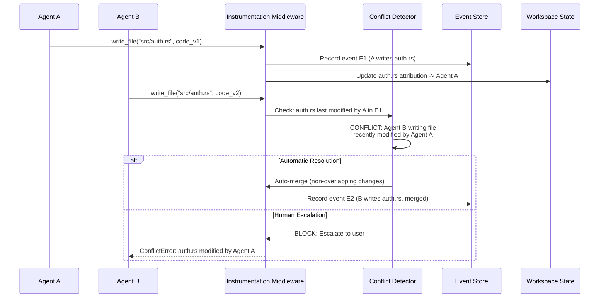

**Conflict detection layers** (detailed in Section 6):

1. **File-level**: Two agents writing the same file within a configurable window (e.g., 30 seconds).
2. **Function-level**: AST analysis detects both agents modifying the same function, even if in different lines.
3. **Semantic-level**: Dependency analysis detects one agent changing a function signature while another adds calls to it.

### 2.6 Implementation: Per-Agent Event Streams

```rust
/// Multi-agent event stream manager
pub struct MultiAgentEventStore {
    /// Shared event DAG (all agents)
    dag: Arc<RwLock<EventDAG>>,
    /// Per-agent event indices for fast lane queries
    agent_lanes: Arc<RwLock<HashMap<AgentId, Vec<EventId>>>>,
    /// Vector clocks per agent
    vector_clocks: Arc<RwLock<HashMap<AgentId, VectorClock>>>,
    /// Shared workspace state
    workspace: Arc<RwLock<SharedWorkspace>>,
    /// Conflict detector
    conflict_detector: Arc<ConflictDetector>,
}

impl MultiAgentEventStore {
    /// Record an event from a specific agent
    pub async fn record_event(
        &self,
        agent_id: &AgentId,
        event: Event,
    ) -> Result<EventId, ConflictError> {
        // 1. Update vector clock for this agent
        let vc = self.increment_clock(agent_id).await;

        // 2. Detect causal dependencies
        let causal_deps = self.detect_causal_deps(&event).await;

        // 3. Check for conflicts
        self.conflict_detector
            .check(&event, &self.workspace)
            .await?;

        // 4. Record to DAG with attribution
        let event_with_meta = event
            .with_agent(agent_id.clone())
            .with_vector_clock(vc)
            .with_causal_deps(causal_deps);

        let event_id = self.dag.write().await.append(event_with_meta)?;

        // 5. Update per-agent lane index
        self.agent_lanes
            .write()
            .await
            .entry(agent_id.clone())
            .or_default()
            .push(event_id.clone());

        // 6. Update shared workspace state
        self.workspace.write().await.apply_event(&event_with_meta)?;

        Ok(event_id)
    }

    /// Get events for a specific agent only
    pub async fn get_agent_timeline(
        &self,
        agent_id: &AgentId,
    ) -> Vec<Event> {
        let lanes = self.agent_lanes.read().await;
        let dag = self.dag.read().await;

        lanes
            .get(agent_id)
            .map(|ids| ids.iter().filter_map(|id| dag.get(id)).collect())
            .unwrap_or_default()
    }

    /// Rewind a specific agent's events without affecting others
    pub async fn rewind_agent(
        &self,
        agent_id: &AgentId,
        to_event: &EventId,
    ) -> Result<SharedWorkspace, RewindError> {
        // Create a new branch that excludes agent's events after to_event
        // but preserves all other agents' events
        let branch = self.create_agent_rewind_branch(agent_id, to_event).await?;
        Ok(branch.workspace)
    }
}
```

### 2.7 Vector Clock Implementation

Vector clocks provide causal ordering without requiring synchronized global clocks -- critical for distributed multi-agent scenarios.

```rust
/// Lamport vector clock for causal ordering
#[derive(Debug, Clone, Serialize, Deserialize)]
pub struct VectorClock {
    clocks: HashMap<AgentId, u64>,
}

impl VectorClock {
    pub fn new() -> Self {
        Self { clocks: HashMap::new() }
    }

    /// Increment the clock for a specific agent
    pub fn increment(&mut self, agent_id: &AgentId) -> u64 {
        let counter = self.clocks.entry(agent_id.clone()).or_insert(0);
        *counter += 1;
        *counter
    }

    /// Merge two vector clocks (take component-wise max)
    pub fn merge(&mut self, other: &VectorClock) {
        for (agent_id, &count) in &other.clocks {
            let entry = self.clocks.entry(agent_id.clone()).or_insert(0);
            *entry = (*entry).max(count);
        }
    }

    /// Check if self causally precedes other
    pub fn happens_before(&self, other: &VectorClock) -> bool {
        let mut at_least_one_less = false;
        for (agent_id, &count) in &self.clocks {
            let other_count = other.clocks.get(agent_id).copied().unwrap_or(0);
            if count > other_count {
                return false;
            }
            if count < other_count {
                at_least_one_less = true;
            }
        }
        // Also check agents in other but not in self
        for (agent_id, &count) in &other.clocks {
            if !self.clocks.contains_key(agent_id) && count > 0 {
                at_least_one_less = true;
            }
        }
        at_least_one_less
    }

    /// Check if two events are concurrent (neither happens-before the other)
    pub fn concurrent_with(&self, other: &VectorClock) -> bool {
        !self.happens_before(other) && !other.happens_before(self)
    }
}
```

**Academic foundation:** Lamport, L. (1978). "Time, Clocks, and the Ordering of Events in a Distributed System." *Communications of the ACM*, 21(7), 558-565. Extended by Mattern's vector clocks (1988) for detecting concurrency between distributed processes.

---

## 3. Multi-User Collaboration

### 3.1 Problem Statement

When two developers (Alice and Bob) each use their own Goose agent on the same repository, their timelines exist on separate machines. Multi-user collaboration requires:

1. **Remote synchronization** of timeline events (analogous to `git push`/`git pull`).
2. **Merge of independent timelines** with conflict resolution.
3. **Distributed event store** that handles network partitions and eventual consistency.
4. **Per-user/per-agent privacy** -- Alice may not want to share all her exploratory branches.

### 3.2 Git-Integrated Branch-Per-Agent Workflows

TimeWarp timelines integrate with Git at the repository level. Each agent gets a dedicated Git branch namespace:

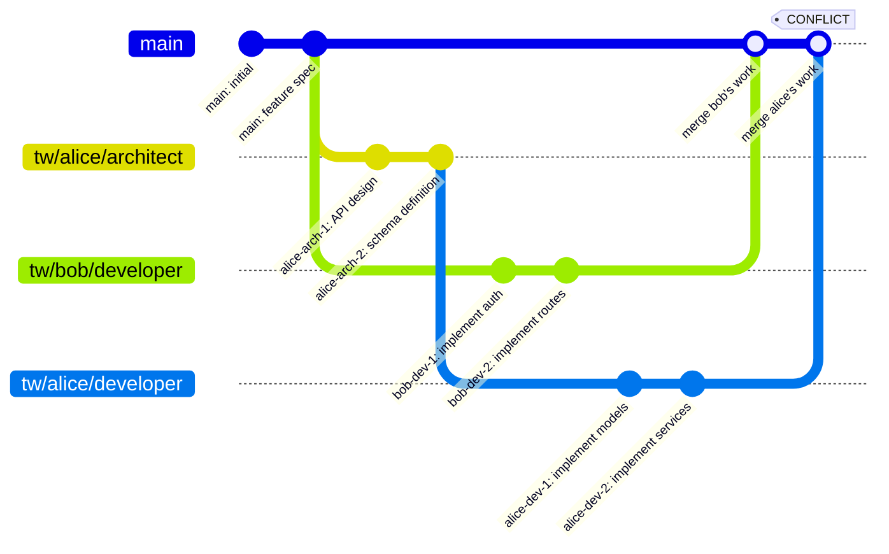

**Branch naming convention:**

```
tw/<user>/<agent-role>[-<session-id>]
```

Examples:
- `tw/alice/architect` -- Alice's Architect agent
- `tw/bob/developer-abc123` -- Bob's Developer agent in session abc123
- `tw/ci/qa-nightly` -- CI-triggered QA agent

**Git integration strategy:**

| TimeWarp Operation | Git Operation |
|-------------------|---------------|
| Agent starts session | `git checkout -b tw/<user>/<role>` |
| Agent writes file | `git add <file> && git commit` (micro-commits) |
| Agent completes task | TimeWarp event recorded + Git commit with event metadata in trailer |
| User pushes timeline | `git push origin tw/<user>/<role>` + push timeline DB |
| User pulls remote timeline | `git pull` + merge remote timeline events |
| Branch merge | Three-way merge with TimeWarp conflict detection |

**Git commit trailer format for TimeWarp metadata:**

```
feat: implement authentication module

TimeWarp-Event-Id: 550e8400-e29b-41d4-a716-446655440000
TimeWarp-Agent-Id: architect-alice-01
TimeWarp-Branch-Id: tw-branch-789
TimeWarp-Snapshot-Id: sha256:abc123def456...
TimeWarp-Vector-Clock: alice:5,bob:3
```

This allows standard Git tools (log, blame, bisect) to query TimeWarp metadata, and allows TimeWarp to reconstruct timelines from Git history if the local event DB is lost.

### 3.3 Remote Timeline Synchronization

Timeline synchronization extends Git's push/pull model with a separate channel for event metadata:

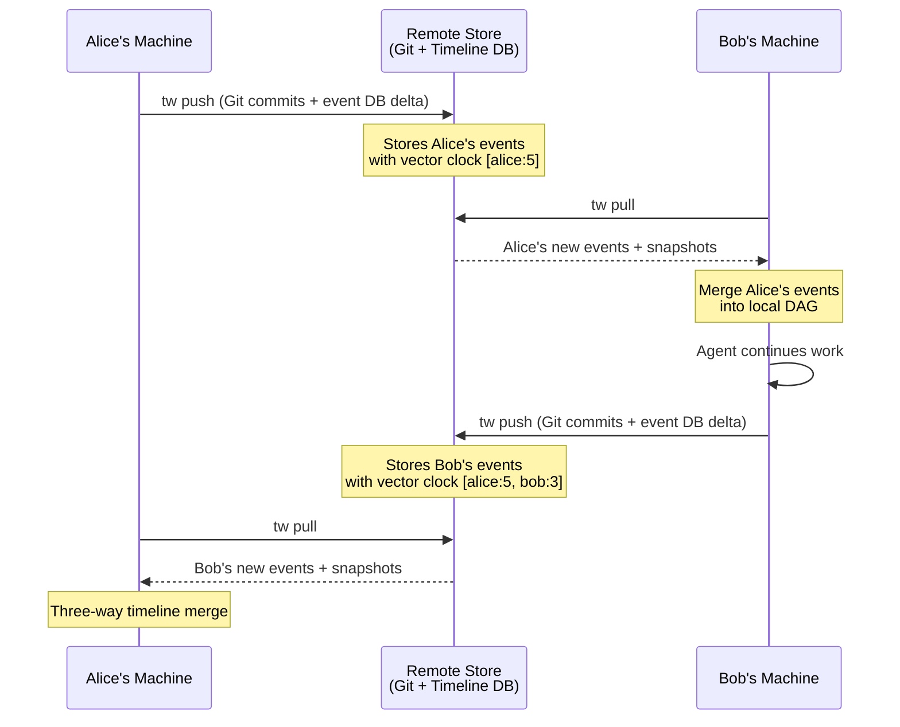

**Synchronization protocol:**

```rust
/// Timeline synchronization protocol
pub struct TimelineSyncProtocol {
    /// Local event store
    local: EventStore,
    /// Remote endpoint (Git remote + timeline DB URL)
    remote: RemoteEndpoint,
}

impl TimelineSyncProtocol {
    /// Push local events to remote
    pub async fn push(&self) -> Result<SyncResult> {
        // 1. Compute delta: local events not yet on remote
        let local_head = self.local.head_vector_clock().await;
        let remote_head = self.remote.head_vector_clock().await?;
        let delta = self.local.events_since(&remote_head).await;

        // 2. Push Git commits
        self.remote.git_push().await?;

        // 3. Push event DB delta (only new events)
        self.remote.push_events(&delta).await?;

        // 4. Push new blob objects (content-addressed, deduplication built-in)
        let new_blobs = self.local.blobs_referenced_by(&delta).await;
        self.remote.push_blobs(&new_blobs).await?;

        Ok(SyncResult {
            events_pushed: delta.len(),
            blobs_pushed: new_blobs.len(),
        })
    }

    /// Pull remote events and merge into local
    pub async fn pull(&self) -> Result<MergeResult> {
        // 1. Fetch remote vector clock
        let remote_head = self.remote.head_vector_clock().await?;
        let local_head = self.local.head_vector_clock().await;

        // 2. Fetch events we don't have
        let remote_delta = self.remote.events_since(&local_head).await?;

        // 3. Pull Git changes
        self.remote.git_pull().await?;

        // 4. Merge remote events into local DAG
        let merge_result = self.local.merge_remote_events(
            &remote_delta,
            MergeStrategy::CausalOrder,
        ).await?;

        // 5. Pull missing blobs
        let needed_blobs = self.local.missing_blobs(&remote_delta).await;
        self.remote.pull_blobs(&needed_blobs).await?;

        Ok(merge_result)
    }
}
```

### 3.4 Distributed Event Store: CRDTs for Timeline Convergence

For truly distributed multi-user scenarios (where network partitions may occur), TimeWarp's event DAG should be modeled as a **Conflict-Free Replicated Data Type (CRDT)** to guarantee eventual consistency without coordination.

**Why CRDTs?** Traditional distributed databases require consensus protocols (Raft, Paxos) for strong consistency. CRDTs achieve **strong eventual consistency** -- all replicas converge to the same state without coordination, at the cost of allowing temporary divergence.

TimeWarp's event DAG is naturally a **Grow-Only Set (G-Set) CRDT**: events are append-only (immutable), and merging two replicas means taking the union of their event sets. The DAG structure (parent pointers) ensures causal ordering is preserved.

```rust
/// CRDT-based distributed event DAG
pub struct CrdtEventDAG {
    /// Events indexed by ID (append-only set)
    events: HashMap<EventId, Event>,
    /// Per-agent vector clocks (G-Counter CRDT)
    clocks: HashMap<AgentId, u64>,
    /// Replica identifier
    replica_id: ReplicaId,
}

impl CrdtEventDAG {
    /// Merge another replica's state into this one
    /// Guaranteed to converge: union of events + max of clocks
    pub fn merge(&mut self, other: &CrdtEventDAG) {
        // G-Set merge: union of events (idempotent, commutative, associative)
        for (id, event) in &other.events {
            self.events.entry(id.clone()).or_insert_with(|| event.clone());
        }

        // G-Counter merge: component-wise max
        for (agent_id, &count) in &other.clocks {
            let local = self.clocks.entry(agent_id.clone()).or_insert(0);
            *local = (*local).max(count);
        }
    }

    /// Check if this DAG is a subset of another (for sync detection)
    pub fn is_subset_of(&self, other: &CrdtEventDAG) -> bool {
        self.events.keys().all(|id| other.events.contains_key(id))
    }
}
```

**CRDT properties satisfied:**

| Property | How Satisfied |
|----------|---------------|
| **Commutativity**: merge(A,B) = merge(B,A) | Event union is commutative; max of clocks is commutative |
| **Associativity**: merge(merge(A,B),C) = merge(A,merge(B,C)) | Set union is associative; max is associative |
| **Idempotency**: merge(A,A) = A | Union with self is identity; max with self is identity |

**Academic foundation:**
- Shapiro, M., Preguica, N., Baquero, C., & Zawirski, M. (2011). "Conflict-Free Replicated Data Types." *SSS 2011*. Springer.
- The Automerge project (https://automerge.org/) implements CRDT-based collaborative documents and is the closest open-source analog to TimeWarp's distributed event store.
- Kleppmann, M. & Beresford, A.R. (2017). "A Conflict-Free Replicated JSON Datatype." *IEEE TPDS*, 28(10).

### 3.5 Merging Timelines from Different Users

When Alice pulls Bob's timeline (or vice versa), events from both users must be woven into a coherent DAG:

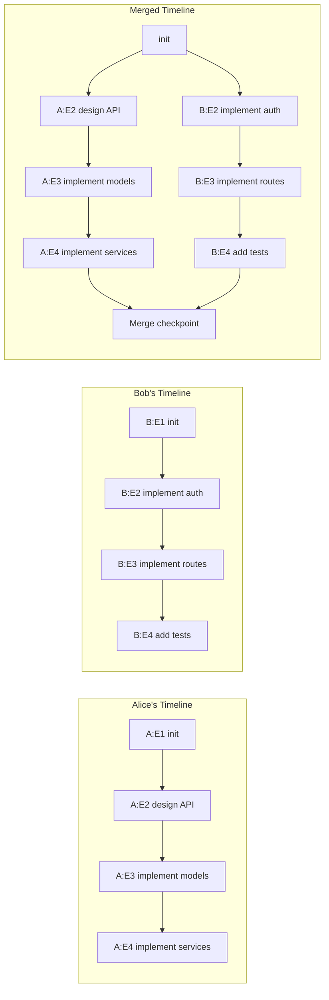

**Merge algorithm:**

1. **Compute common ancestor**: Find the most recent event that both Alice and Bob share (their last sync point).
2. **Collect divergent events**: Alice's events since ancestor, Bob's events since ancestor.
3. **Build merged DAG**: Insert both event sets into the DAG, preserving causal ordering via vector clocks.
4. **Detect workspace conflicts**: Compare file changes from both sides using three-way diff against the ancestor snapshot.
5. **Resolve conflicts**: Use the conflict resolution strategies from Section 6.
6. **Create merge event**: A special merge event with two parent IDs (Alice's head, Bob's head) and a merged snapshot.

---

## 4. Agent Handoff Patterns

### 4.1 Problem Statement

In ALMAS-style pipelines (Architect --> Developer --> QA --> Security --> Deployer), work passes sequentially from one specialist agent to the next. Each handoff is a critical control point where:

1. The outgoing agent's work must be validated before the incoming agent starts.
2. The full workspace state must be preserved and transferred.
3. Failed validation should create a branch (retry) rather than blocking the pipeline.
4. The timeline should clearly mark handoff boundaries for navigation.

### 4.2 ALMAS-Style Role Transitions in TimeWarp

Super-Goose already implements ALMAS handoffs via `HandoffManager` in `crates/goose/src/agents/team/handoffs.rs`. TimeWarp wraps each handoff as a first-class timeline event:

```mermaid
graph LR
    subgraph "ALMAS Pipeline on TimeWarp Timeline"
        E1["E1: [Architect]<br/>Design API schema"] --> E2["E2: [Architect]<br/>Define module structure"]
        E2 --> H1{"H1: Handoff<br/>Architect -> Developer<br/>Validation: PASS"}
        H1 --> E3["E3: [Developer]<br/>Implement auth module"]
        E3 --> E4["E4: [Developer]<br/>Implement routes"]
        E4 --> H2{"H2: Handoff<br/>Developer -> QA<br/>Validation: PASS"}
        H2 --> E5["E5: [QA]<br/>Run test suite"]
        E5 --> E6["E6: [QA]<br/>Tests FAILED"]
        E6 --> H3{"H3: Handoff<br/>QA -> Developer<br/>Validation: FAIL (retry)"}

        H3 -->|"Branch: retry-1"| E7["E7: [Developer]<br/>Fix auth bug"]
        E7 --> H4{"H4: Handoff<br/>Developer -> QA<br/>Validation: PASS"}
        H4 --> E8["E8: [QA]<br/>Tests PASSED"]
        E8 --> H5{"H5: Handoff<br/>QA -> Security<br/>Validation: PASS"}
        H5 --> E9["E9: [Security]<br/>Security scan"]
        E9 --> H6{"H6: Handoff<br/>Security -> Deployer<br/>Validation: PASS"}
        H6 --> E10["E10: [Deployer]<br/>Build and deploy"]
    end

    style H1 fill:#2ecc71,color:#fff
    style H2 fill:#2ecc71,color:#fff
    style H3 fill:#e74c3c,color:#fff
    style H4 fill:#2ecc71,color:#fff
    style H5 fill:#2ecc71,color:#fff
    style H6 fill:#2ecc71,color:#fff
```

### 4.3 Handoff Event Schema

```rust
/// A handoff event in the TimeWarp timeline
#[derive(Debug, Clone, Serialize, Deserialize)]
pub struct HandoffEvent {
    /// Source agent/role
    pub from_agent: AgentId,
    pub from_role: AlmasRole,
    /// Destination agent/role
    pub to_agent: AgentId,
    pub to_role: AlmasRole,
    /// Validation result
    pub validation: HandoffValidation,
    /// Artifacts transferred
    pub artifacts: Vec<HandoffArtifact>,
    /// Workspace snapshot at handoff point
    pub snapshot_id: SnapshotId,
    /// Metrics at handoff
    pub metrics: HandoffMetrics,
}

#[derive(Debug, Clone, Serialize, Deserialize)]
pub struct HandoffValidation {
    pub passed: bool,
    pub rules_checked: Vec<ValidationRuleResult>,
    /// If failed: reason and suggested action
    pub failure_info: Option<HandoffFailureInfo>,
}

#[derive(Debug, Clone, Serialize, Deserialize)]
pub struct HandoffFailureInfo {
    pub reason: String,
    pub failed_rules: Vec<String>,
    /// Suggested action: retry, escalate, skip
    pub suggested_action: HandoffFailureAction,
    /// If retry: which role should retry
    pub retry_role: Option<AlmasRole>,
}

#[derive(Debug, Clone, Serialize, Deserialize)]
pub enum HandoffFailureAction {
    /// Retry with the same or previous role
    Retry { max_retries: u32, current_attempt: u32 },
    /// Escalate to human
    Escalate { reason: String },
    /// Skip this validation (with justification)
    Skip { justification: String },
    /// Create a new branch for alternative approach
    Branch { branch_name: String },
}

#[derive(Debug, Clone, Serialize, Deserialize)]
pub struct HandoffMetrics {
    /// Time spent in the outgoing role
    pub role_duration_ms: u64,
    /// Number of events produced by outgoing role
    pub events_produced: usize,
    /// Files modified by outgoing role
    pub files_modified: usize,
    /// Test pass rate at handoff
    pub test_pass_rate: Option<f64>,
    /// Code coverage at handoff
    pub code_coverage: Option<f64>,
    /// Lines of code added/removed
    pub loc_delta: (usize, usize),
}
```

### 4.4 Clean Workspace Handoff with Full State Preservation

A handoff must guarantee that the incoming agent starts with the **exact workspace state** that the outgoing agent left. This is achieved via TimeWarp's content-addressed snapshot system:

```
Handoff Protocol:
1. Outgoing agent completes final action
2. Create full workspace snapshot (S_handoff)
3. Run validation rules against S_handoff:
   - AllTestsPass
   - NoCompilationErrors
   - SecurityScanClean
   - CodeCoverageMinimum
   - DocumentationComplete
   - LintChecksPassed
   - ArtifactsPresent
4. Record HandoffEvent with validation results
5. If validation passes:
   a. Incoming agent receives snapshot_id
   b. Incoming agent's workspace is set to S_handoff
   c. Incoming agent's context includes handoff artifacts
6. If validation fails:
   a. Record failure with suggested action
   b. Branch from current point for retry
   c. Retry agent starts from same snapshot
```

The validation rules map directly to Super-Goose's existing `ValidationRuleType` enum in `crates/goose/src/agents/team/handoffs.rs`.

### 4.5 Branch-on-Handoff-Failure Pattern

When a handoff validation fails, TimeWarp creates a **retry branch** rather than blocking the pipeline:

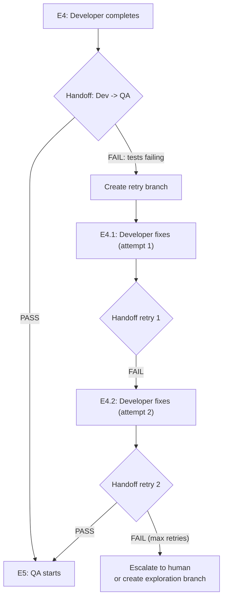

**Key design principle:** Every retry exists on the timeline as a distinct branch. The user can compare attempt 1 vs. attempt 2 vs. attempt 3 using TimeWarp's diff and branch comparison tools. This is particularly valuable for debugging -- "what did the Developer agent do differently on the third attempt that finally made the tests pass?"

### 4.6 Handoff Validation Checkpoints

Each handoff creates a **checkpoint** -- a named, searchable point in the timeline that serves as a stable reference:

```rust
/// A checkpoint is a named reference to a specific event + snapshot
#[derive(Debug, Clone, Serialize, Deserialize)]
pub struct TimelineCheckpoint {
    pub name: String,
    pub event_id: EventId,
    pub snapshot_id: SnapshotId,
    pub checkpoint_type: CheckpointType,
    pub metadata: HashMap<String, serde_json::Value>,
}

#[derive(Debug, Clone, Serialize, Deserialize)]
pub enum CheckpointType {
    /// ALMAS role handoff
    Handoff {
        from_role: AlmasRole,
        to_role: AlmasRole,
        validation_passed: bool,
    },
    /// User-created checkpoint
    UserDefined { label: String },
    /// Automatic milestone (e.g., all tests pass for the first time)
    Milestone { milestone_type: String },
    /// Exploration branch point
    ExplorationStart { variants: Vec<String> },
}
```

Users can navigate the timeline using checkpoint names:
```
tw jump "handoff:architect->developer"
tw jump "handoff:qa->security"
tw diff "handoff:developer->qa" "handoff:qa->security"
```

---

## 5. Parallel Exploration

### 5.1 Problem Statement

Parallel exploration runs **multiple agents on the same task with different approaches** to compare outcomes. This is the AI equivalent of A/B testing for code:

- "Agent A: implement the cache using Redis. Agent B: implement the cache using Memcached."
- "Agent A: use approach X for the auth module. Agent B: use approach Y."
- "Run 3 agents with different prompting strategies on the same refactoring task."

### 5.2 A/B Testing Architecture

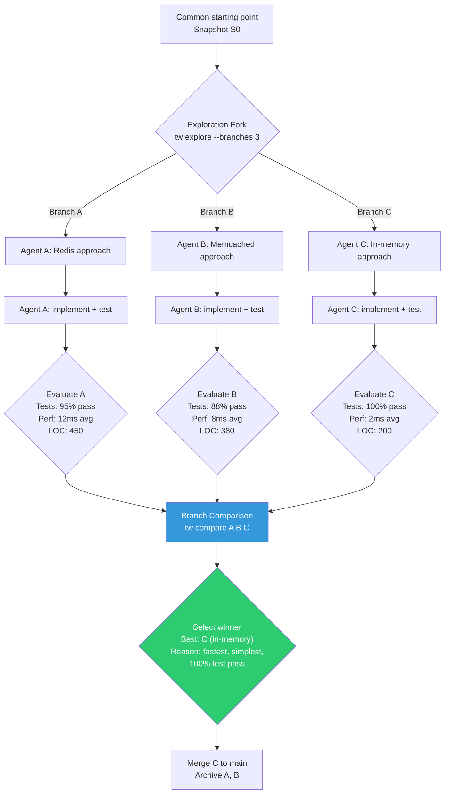

### 5.3 Exploration Configuration

```rust
/// Configuration for parallel exploration
#[derive(Debug, Clone, Serialize, Deserialize)]
pub struct ExplorationConfig {
    /// Task description (same for all branches)
    pub task: String,
    /// Variants to explore
    pub variants: Vec<ExplorationVariant>,
    /// Resource budget per variant
    pub budget: ResourceBudget,
    /// Comparison criteria
    pub comparison: ComparisonConfig,
    /// Automatic winner selection policy
    pub auto_select: Option<AutoSelectPolicy>,
}

#[derive(Debug, Clone, Serialize, Deserialize)]
pub struct ExplorationVariant {
    /// Variant name (e.g., "redis", "memcached")
    pub name: String,
    /// Additional instructions for the agent
    pub instructions: String,
    /// Agent configuration overrides
    pub agent_config: Option<AgentConfigOverride>,
    /// Branch name (auto-generated if not specified)
    pub branch_name: Option<String>,
}

#[derive(Debug, Clone, Serialize, Deserialize)]
pub struct ResourceBudget {
    /// Maximum wall-clock time per variant
    pub max_duration_seconds: u64,
    /// Maximum LLM tokens per variant
    pub max_tokens: u64,
    /// Maximum tool calls per variant
    pub max_tool_calls: u64,
    /// Maximum estimated cost (USD) per variant
    pub max_cost_usd: f64,
}

#[derive(Debug, Clone, Serialize, Deserialize)]
pub struct ComparisonConfig {
    /// Metrics to compare
    pub metrics: Vec<ComparisonMetric>,
    /// Weights for each metric (must sum to 1.0)
    pub weights: Vec<f64>,
}

#[derive(Debug, Clone, Serialize, Deserialize)]
pub enum ComparisonMetric {
    /// Test pass rate (higher is better)
    TestPassRate,
    /// Code coverage percentage (higher is better)
    CodeCoverage,
    /// Performance benchmark result (lower is better for latency)
    Performance { benchmark_command: String, lower_is_better: bool },
    /// Lines of code (lower is better -- simpler solution)
    LinesOfCode,
    /// Number of dependencies added (lower is better)
    DependencyCount,
    /// Estimated cost of agent run (lower is better)
    AgentCost,
    /// Duration of agent run (lower is better)
    AgentDuration,
    /// Custom metric extracted from command output
    Custom { name: String, command: String, extract_pattern: String, lower_is_better: bool },
}
```

### 5.4 Automatic Comparison of Branch Outcomes

After all exploration variants complete (or hit their budget), TimeWarp automatically evaluates each branch:

```rust
/// Result of comparing exploration branches
#[derive(Debug, Clone, Serialize, Deserialize)]
pub struct ExplorationResult {
    pub exploration_id: String,
    pub variants: Vec<VariantResult>,
    pub winner: Option<String>,
    pub comparison_matrix: Vec<Vec<f64>>,
    pub recommendation: String,
}

#[derive(Debug, Clone, Serialize, Deserialize)]
pub struct VariantResult {
    pub name: String,
    pub branch_id: BranchId,
    pub status: VariantStatus,
    pub metrics: HashMap<String, f64>,
    pub weighted_score: f64,
    pub resource_usage: ResourceUsage,
    pub events_count: usize,
    pub files_modified: usize,
}

#[derive(Debug, Clone, Serialize, Deserialize)]
pub enum VariantStatus {
    /// Completed within budget
    Completed,
    /// Hit budget limit
    BudgetExceeded { which: String },
    /// Failed (agent error, tests don't compile, etc.)
    Failed { reason: String },
    /// Still running
    InProgress,
}
```

### 5.5 Best-Branch Selection and Merge

```rust
#[derive(Debug, Clone, Serialize, Deserialize)]
pub enum AutoSelectPolicy {
    /// Select the variant with the highest weighted score
    HighestScore,
    /// Select the variant that passes all tests with lowest cost
    CheapestPassing,
    /// Select the variant with the best test pass rate
    BestTestRate,
    /// Require human review (present comparison, wait for selection)
    HumanReview,
    /// Use an AI agent to evaluate and select
    AgentReview { reviewer_config: String },
}
```

The selection process:

1. **Score each variant** using the weighted comparison metrics.
2. **Apply auto-select policy** (or present to human/AI reviewer).
3. **Merge winning branch** into the parent branch using TimeWarp's merge engine.
4. **Archive losing branches** (preserve for reference, mark as archived).
5. **Record exploration result** as a special timeline event.

### 5.6 Resource Budgeting Per Parallel Branch

Resource budgeting prevents runaway exploration:

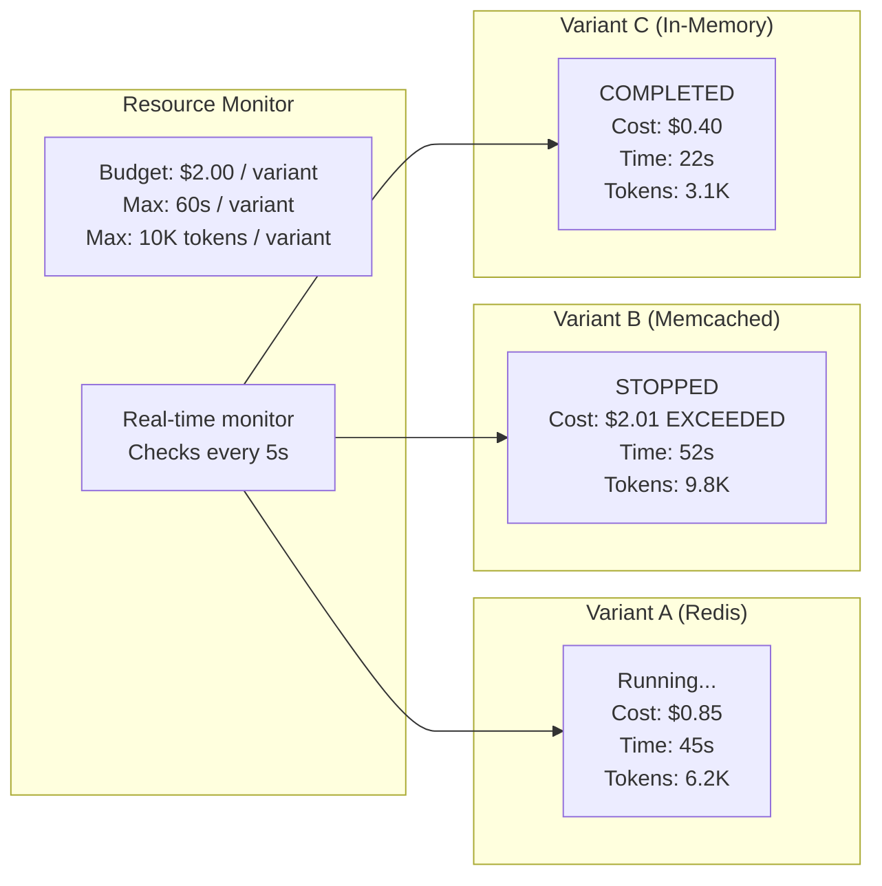

Budget enforcement integrates with Super-Goose's existing cost tracking in the observability module (`crates/goose/src/observability/cost_tracker.rs`).

---

## 6. Conflict Resolution in Multi-Agent Context

### 6.1 Conflict Detection Taxonomy

Multi-agent conflicts exist at four levels, each requiring different detection strategies:

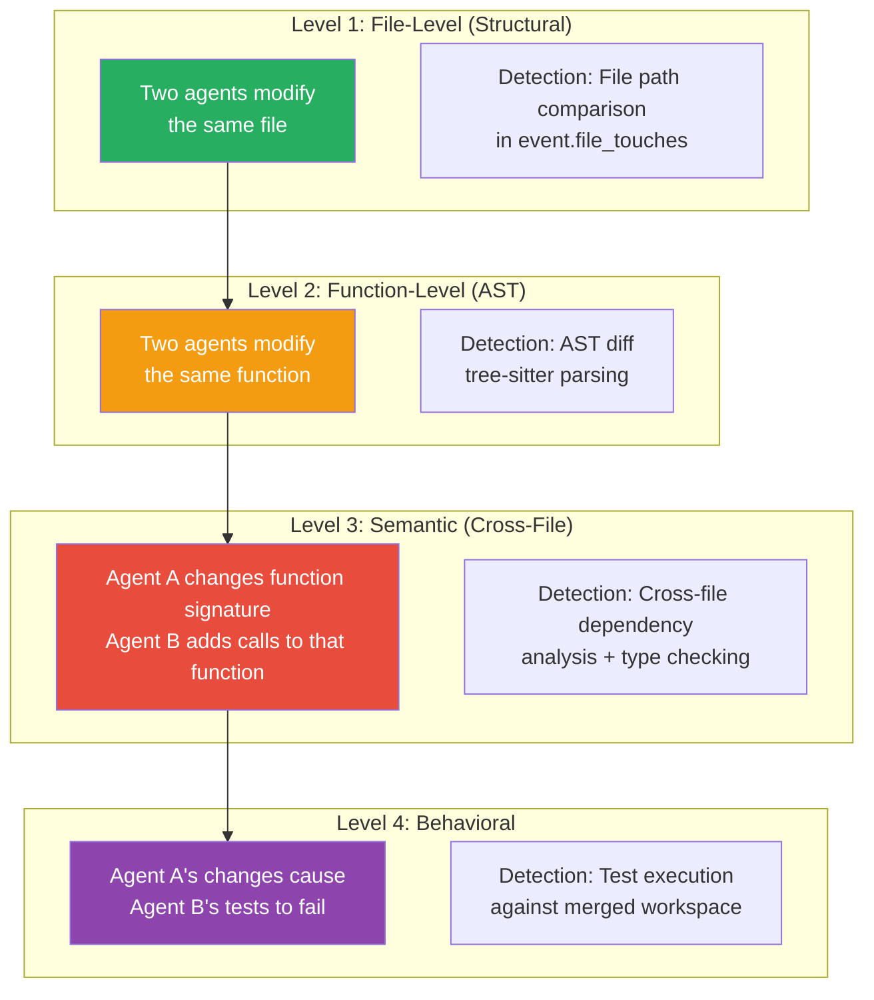

### 6.2 Real-Time Structural Conflict Detection (File-Level)

The simplest and fastest conflict detection: check if two agents modify the same file within a time window.

```rust
/// File-level conflict detector
pub struct StructuralConflictDetector {
    /// Time window for considering events as concurrent
    conflict_window: Duration,
    /// Recent file modifications by agent
    recent_modifications: HashMap<PathBuf, Vec<FileModification>>,
}

#[derive(Debug, Clone)]
pub struct FileModification {
    pub agent_id: AgentId,
    pub event_id: EventId,
    pub timestamp: DateTime<Utc>,
    pub modification_type: ModificationType,
}

#[derive(Debug, Clone)]
pub enum ModificationType {
    Created,
    Modified,
    Deleted,
    Renamed { from: PathBuf },
}

impl StructuralConflictDetector {
    /// Check if a proposed file modification conflicts with recent modifications
    pub fn check(
        &self,
        path: &Path,
        agent_id: &AgentId,
        timestamp: DateTime<Utc>,
    ) -> Option<StructuralConflict> {
        if let Some(mods) = self.recent_modifications.get(path) {
            for m in mods {
                // Skip self-conflicts
                if &m.agent_id == agent_id {
                    continue;
                }
                // Check time window
                if (timestamp - m.timestamp).abs() < self.conflict_window {
                    return Some(StructuralConflict {
                        path: path.to_path_buf(),
                        agent_a: m.agent_id.clone(),
                        event_a: m.event_id.clone(),
                        agent_b: agent_id.clone(),
                        conflict_type: ConflictType::ConcurrentModification,
                    });
                }
            }
        }
        None
    }
}
```

### 6.3 Semantic Conflict Detection Using AST Analysis (Function-Level)

Function-level conflict detection uses Abstract Syntax Tree (AST) parsing to identify when two agents modify the same semantic unit (function, class, struct, etc.):

```rust
/// AST-based semantic conflict detector
pub struct SemanticConflictDetector {
    /// tree-sitter parsers for supported languages
    parsers: HashMap<String, TreeSitterParser>,
}

#[derive(Debug, Clone)]
pub struct SemanticUnit {
    pub kind: SemanticUnitKind,
    pub name: String,
    pub file: PathBuf,
    pub start_line: usize,
    pub end_line: usize,
    pub signature_hash: String,
}

#[derive(Debug, Clone)]
pub enum SemanticUnitKind {
    Function,
    Method,
    Class,
    Struct,
    Enum,
    Interface,
    Module,
    Import,
}

impl SemanticConflictDetector {
    /// Compare two versions of a file at the AST level
    pub fn detect_conflicts(
        &self,
        base: &str,        // Common ancestor version
        version_a: &str,   // Agent A's version
        version_b: &str,   // Agent B's version
        language: &str,
    ) -> Vec<SemanticConflict> {
        let base_ast = self.parse(base, language);
        let ast_a = self.parse(version_a, language);
        let ast_b = self.parse(version_b, language);

        let diff_a = self.ast_diff(&base_ast, &ast_a);
        let diff_b = self.ast_diff(&base_ast, &ast_b);

        // Find semantic units modified by both A and B
        let mut conflicts = Vec::new();

        for change_a in &diff_a {
            for change_b in &diff_b {
                if self.units_overlap(change_a, change_b) {
                    conflicts.push(SemanticConflict {
                        unit: change_a.unit.clone(),
                        change_a: change_a.clone(),
                        change_b: change_b.clone(),
                        severity: self.assess_severity(change_a, change_b),
                    });
                }
            }
        }

        // Cross-file semantic conflicts
        // e.g., A changes function signature, B adds calls to it
        conflicts.extend(
            self.detect_cross_file_conflicts(&diff_a, &diff_b)
        );

        conflicts
    }

    fn assess_severity(
        &self,
        a: &ASTChange,
        b: &ASTChange,
    ) -> ConflictSeverity {
        match (&a.change_type, &b.change_type) {
            // Both modify same function body -- high severity
            (ChangeType::ModifyBody, ChangeType::ModifyBody) => {
                ConflictSeverity::High
            }
            // One modifies signature, other modifies body -- critical
            (ChangeType::ModifySignature, _) | (_, ChangeType::ModifySignature) => {
                ConflictSeverity::Critical
            }
            // One deletes, other modifies -- critical
            (ChangeType::Delete, _) | (_, ChangeType::Delete) => {
                ConflictSeverity::Critical
            }
            // Both add to same scope -- medium
            (ChangeType::Add, ChangeType::Add) => {
                ConflictSeverity::Medium
            }
            _ => ConflictSeverity::Low,
        }
    }
}
```

**Technology recommendation:** Use [tree-sitter](https://tree-sitter.github.io/tree-sitter/) for AST parsing. Tree-sitter provides:
- Incremental parsing (efficient for diffs)
- 200+ language grammars
- Rust bindings (`tree-sitter` crate)
- Used by GitHub, Neovim, Zed, and Helix for semantic code analysis

**Related work:**
- GumTree (Falleri et al., 2014): "Fine-grained and Accurate Source Code Differencing." *ASE 2014*. Algorithm for computing AST diffs with move detection.
- Semantic Merge (SemanticMerge.com): Commercial tool that performs language-aware three-way merging. Discontinued but architecturally relevant.

### 6.4 Agent-Mediated Conflict Resolution

When conflicts are detected, an AI agent can attempt automatic resolution:

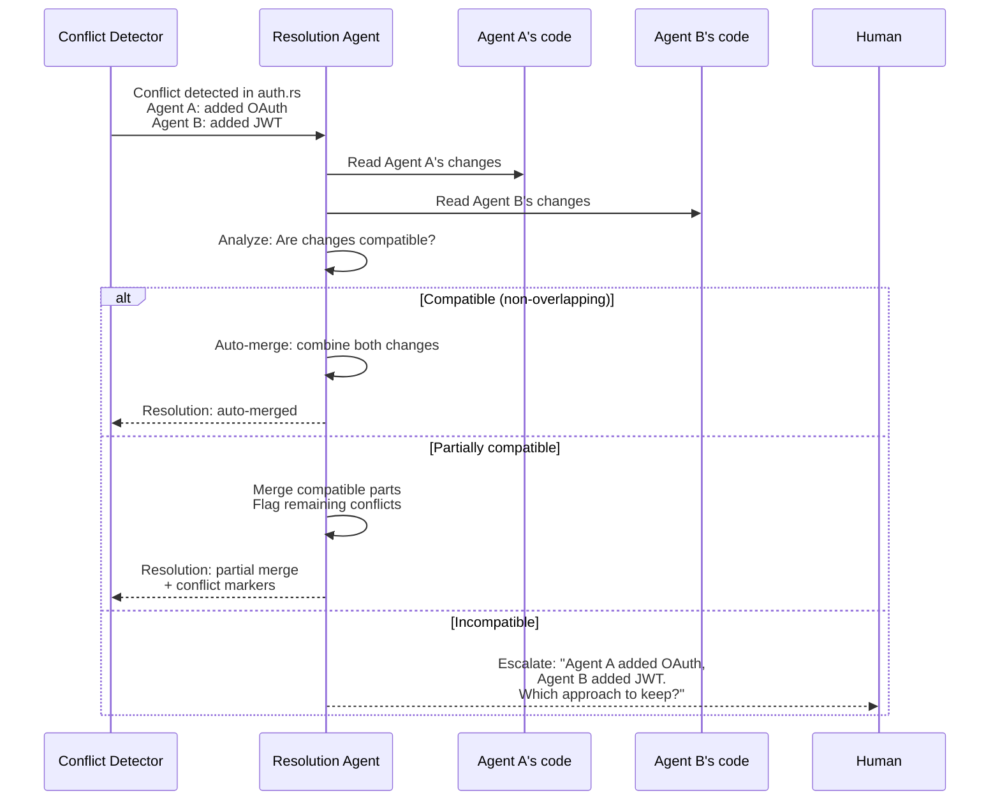

```rust
/// AI-mediated conflict resolution
pub struct AgentConflictResolver {
    /// LLM provider for resolution reasoning
    llm: Arc<dyn LlmProvider>,
    /// Resolution strategy
    strategy: ResolutionStrategy,
}

#[derive(Debug, Clone)]
pub enum ResolutionStrategy {
    /// Always try auto-merge first, escalate on failure
    AutoMergeFirst,
    /// Always escalate to human
    AlwaysEscalate,
    /// Use AI agent to resolve, then validate
    AgentResolve {
        /// Maximum resolution attempts
        max_attempts: u32,
        /// Require test pass after resolution
        require_tests: bool,
    },
    /// Prefer the agent with higher confidence/performance
    PreferHigherConfidence,
}

#[derive(Debug, Clone, Serialize, Deserialize)]
pub struct ConflictResolution {
    pub conflict_id: String,
    pub strategy_used: String,
    pub resolution_type: ResolutionType,
    pub merged_content: Option<String>,
    pub agent_reasoning: Option<String>,
    pub confidence: f64,
    pub validated: bool,
}

#[derive(Debug, Clone, Serialize, Deserialize)]
pub enum ResolutionType {
    /// Changes were non-overlapping and auto-merged
    AutoMerged,
    /// AI agent resolved the conflict
    AgentResolved { resolver_agent: AgentId },
    /// Human resolved the conflict
    HumanResolved { user_id: String },
    /// One side was chosen over the other
    SideChosen { chosen: AgentId, reason: String },
    /// Both changes were rejected, manual intervention needed
    Rejected { reason: String },
}
```

### 6.5 Human-in-the-Loop Escalation

When automated resolution fails or confidence is low, TimeWarp escalates to the human user with full context:

```
CONFLICT DETECTED in src/auth.rs
━━━━━━━━━━━━━━━━━━━━━━━━━━━━━━━━━━━━━

Agent A (Architect) modified lines 15-45:
  + Added OAuth2 provider configuration
  + Added OAuth2 token refresh logic

Agent B (Developer) modified lines 20-60:
  + Added JWT validation middleware
  + Added JWT token generation

Overlap: Lines 20-45 (both agents modified)

Conflict severity: HIGH (function body overlap)

Resolution options:
  [1] Keep Agent A's changes (OAuth2)
  [2] Keep Agent B's changes (JWT)
  [3] Let AI agent attempt merge
  [4] Open diff editor for manual merge
  [5] Create separate branches for both approaches

TimeWarp context:
  - Agent A's changes: tw diff E12..E15
  - Agent B's changes: tw diff E12..E18
  - Common ancestor: tw jump E12
```

### 6.6 Three-Way Merge with Agent Attribution

TimeWarp's three-way merge extends Git's merge algorithm with agent attribution tracking:

```rust
/// Three-way merge with agent attribution
pub struct AttributedMerge {
    /// Base (common ancestor) snapshot
    pub base: Snapshot,
    /// Agent A's snapshot
    pub ours: Snapshot,
    pub ours_agent: AgentId,
    /// Agent B's snapshot
    pub theirs: Snapshot,
    pub theirs_agent: AgentId,
}

impl AttributedMerge {
    pub fn execute(&self) -> MergeResult {
        let mut result = MergeResult::new();

        // Collect all file paths across all three snapshots
        let all_paths = self.collect_all_paths();

        for path in all_paths {
            let base_content = self.base.get_content(&path);
            let ours_content = self.ours.get_content(&path);
            let theirs_content = self.theirs.get_content(&path);

            match (base_content, ours_content, theirs_content) {
                // Only one side modified -- take the modification
                (Some(base), Some(ours), Some(theirs))
                    if base == ours && base != theirs =>
                {
                    result.add_file(path, theirs, Attribution::Agent(self.theirs_agent.clone()));
                }
                (Some(base), Some(ours), Some(theirs))
                    if base != ours && base == theirs =>
                {
                    result.add_file(path, ours, Attribution::Agent(self.ours_agent.clone()));
                }
                // Both modified -- attempt merge
                (Some(base), Some(ours), Some(theirs))
                    if base != ours && base != theirs =>
                {
                    match self.three_way_text_merge(base, ours, theirs) {
                        Ok(merged) => {
                            result.add_file(
                                path,
                                &merged,
                                Attribution::Merged {
                                    agents: vec![
                                        self.ours_agent.clone(),
                                        self.theirs_agent.clone(),
                                    ],
                                },
                            );
                        }
                        Err(conflict) => {
                            result.add_conflict(path, conflict);
                        }
                    }
                }
                // File added by one side
                (None, Some(ours), None) => {
                    result.add_file(path, ours, Attribution::Agent(self.ours_agent.clone()));
                }
                (None, None, Some(theirs)) => {
                    result.add_file(path, theirs, Attribution::Agent(self.theirs_agent.clone()));
                }
                // Both added same file -- conflict
                (None, Some(ours), Some(theirs)) => {
                    result.add_conflict(path, MergeConflict::BothAdded {
                        ours: ours.to_string(),
                        theirs: theirs.to_string(),
                        ours_agent: self.ours_agent.clone(),
                        theirs_agent: self.theirs_agent.clone(),
                    });
                }
                // Other cases (deleted, etc.)
                _ => { /* handle delete/modify, delete/delete, etc. */ }
            }
        }

        result
    }
}

/// Attribution tracking for merged content
#[derive(Debug, Clone, Serialize, Deserialize)]
pub enum Attribution {
    /// Content from a single agent
    Agent(AgentId),
    /// Content merged from multiple agents
    Merged { agents: Vec<AgentId> },
    /// Content from human resolution
    Human { user_id: String },
    /// Content from AI-mediated resolution
    AiResolved { resolver: AgentId, confidence: f64 },
}
```

---

## 7. Shared Memory / Knowledge Graph

### 7.1 Problem Statement

In multi-agent scenarios, agents need to share knowledge without re-discovering it. If Agent A (Architect) determines that "the database should use PostgreSQL with connection pooling," Agent B (Developer) needs access to that decision without re-analyzing the requirements.

TimeWarp's event store already captures everything agents do. The shared memory layer provides **structured, queryable access** to cross-agent knowledge derived from timeline events.

### 7.2 Cross-Agent Knowledge Sharing via Timeline Events

Every event in the timeline is a piece of knowledge. The shared memory layer indexes events by semantic content to enable cross-agent queries:

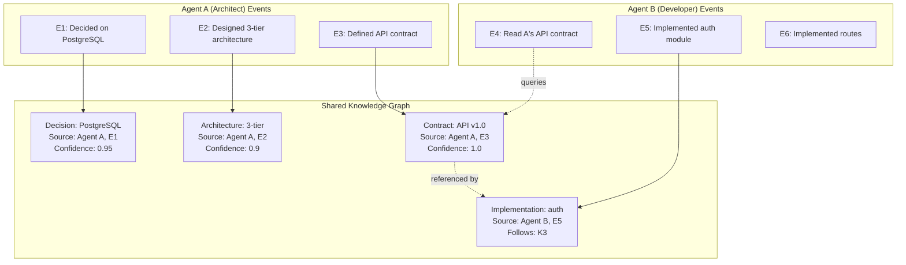

### 7.3 Event-Sourced Shared Memory Architecture

```rust
/// Shared memory derived from timeline events
pub struct SharedMemory {
    /// Knowledge entries extracted from events
    knowledge: Arc<RwLock<HashMap<KnowledgeId, KnowledgeEntry>>>,
    /// Index by topic for semantic search
    topic_index: Arc<RwLock<HashMap<String, Vec<KnowledgeId>>>>,
    /// Index by agent for ownership tracking
    agent_index: Arc<RwLock<HashMap<AgentId, Vec<KnowledgeId>>>>,
    /// Index by file for file-related knowledge
    file_index: Arc<RwLock<HashMap<PathBuf, Vec<KnowledgeId>>>>,
    /// Event store reference for provenance
    event_store: Arc<EventStore>,
}

/// A piece of knowledge extracted from timeline events
#[derive(Debug, Clone, Serialize, Deserialize)]
pub struct KnowledgeEntry {
    pub id: KnowledgeId,
    /// Type of knowledge
    pub knowledge_type: KnowledgeType,
    /// Content (natural language or structured)
    pub content: String,
    /// Agent that produced this knowledge
    pub source_agent: AgentId,
    /// Event that produced this knowledge
    pub source_event: EventId,
    /// Topics/tags for searchability
    pub topics: Vec<String>,
    /// Files related to this knowledge
    pub related_files: Vec<PathBuf>,
    /// Confidence score (0.0 - 1.0)
    pub confidence: f64,
    /// References to other knowledge entries
    pub references: Vec<KnowledgeRelation>,
    /// When this knowledge was created
    pub created_at: DateTime<Utc>,
    /// When this knowledge was last validated
    pub validated_at: Option<DateTime<Utc>>,
    /// Whether this knowledge is still considered valid
    pub is_valid: bool,
}

#[derive(Debug, Clone, Serialize, Deserialize)]
pub enum KnowledgeType {
    /// Architectural decision
    Decision { rationale: String, alternatives: Vec<String> },
    /// Fact about the codebase
    Fact,
    /// Constraint or requirement
    Constraint,
    /// Pattern or convention discovered
    Pattern,
    /// Problem identified
    Problem { severity: String },
    /// Solution applied
    Solution { for_problem: Option<KnowledgeId> },
    /// API contract or interface definition
    Contract,
    /// Configuration or setting
    Configuration,
}

#[derive(Debug, Clone, Serialize, Deserialize)]
pub struct KnowledgeRelation {
    pub target: KnowledgeId,
    pub relation: KnowledgeRelationType,
}

#[derive(Debug, Clone, Serialize, Deserialize)]
pub enum KnowledgeRelationType {
    /// This knowledge supports the target
    Supports,
    /// This knowledge contradicts the target
    Contradicts,
    /// This knowledge supersedes the target
    Supersedes,
    /// This knowledge is derived from the target
    DerivedFrom,
    /// This knowledge implements the target (e.g., code implements a decision)
    Implements,
    /// This knowledge depends on the target
    DependsOn,
}
```

### 7.4 Cross-Agent Queries

Agents can query shared memory to access other agents' knowledge:

```rust
impl SharedMemory {
    /// Query: "What did Agent A decide about the database?"
    pub async fn query_agent_decisions(
        &self,
        agent_id: &AgentId,
        topic: Option<&str>,
    ) -> Vec<KnowledgeEntry> {
        let agent_index = self.agent_index.read().await;
        let knowledge = self.knowledge.read().await;

        agent_index
            .get(agent_id)
            .map(|ids| {
                ids.iter()
                    .filter_map(|id| knowledge.get(id))
                    .filter(|k| matches!(k.knowledge_type, KnowledgeType::Decision { .. }))
                    .filter(|k| {
                        topic.map_or(true, |t| {
                            k.topics.iter().any(|kt| kt.contains(t))
                        })
                    })
                    .cloned()
                    .collect()
            })
            .unwrap_or_default()
    }

    /// Query: "What modifications were made to file X?"
    pub async fn query_file_history(
        &self,
        path: &Path,
    ) -> Vec<KnowledgeEntry> {
        let file_index = self.file_index.read().await;
        let knowledge = self.knowledge.read().await;

        file_index
            .get(path)
            .map(|ids| {
                ids.iter()
                    .filter_map(|id| knowledge.get(id))
                    .cloned()
                    .collect()
            })
            .unwrap_or_default()
    }

    /// Query: "What does Agent B know about authentication?"
    pub async fn query_by_topic(
        &self,
        topic: &str,
        agent_filter: Option<&AgentId>,
    ) -> Vec<KnowledgeEntry> {
        let topic_index = self.topic_index.read().await;
        let knowledge = self.knowledge.read().await;

        topic_index
            .get(topic)
            .map(|ids| {
                ids.iter()
                    .filter_map(|id| knowledge.get(id))
                    .filter(|k| {
                        agent_filter.map_or(true, |a| &k.source_agent == a)
                    })
                    .cloned()
                    .collect()
            })
            .unwrap_or_default()
    }

    /// Ingest knowledge from a new event
    pub async fn ingest_event(&self, event: &Event) -> Vec<KnowledgeId> {
        let mut extracted = Vec::new();

        // Extract knowledge based on event type
        match &event.event_type {
            EventType::FileWrite { path, .. } => {
                // Extract facts about file modifications
                let entry = KnowledgeEntry {
                    id: KnowledgeId::new(),
                    knowledge_type: KnowledgeType::Fact,
                    content: format!("Modified file: {}", path.display()),
                    source_agent: event.agent_id.clone(),
                    source_event: event.event_id.clone(),
                    topics: vec!["file_modification".into()],
                    related_files: vec![path.clone()],
                    confidence: 1.0,
                    references: Vec::new(),
                    created_at: Utc::now(),
                    validated_at: None,
                    is_valid: true,
                };
                let id = entry.id.clone();
                self.store_knowledge(entry).await;
                extracted.push(id);
            }
            EventType::LlmCall { response, .. } => {
                // Use NLP/LLM to extract decisions and facts from agent reasoning
                let decisions = self.extract_decisions_from_text(response).await;
                for decision in decisions {
                    let id = decision.id.clone();
                    self.store_knowledge(decision).await;
                    extracted.push(id);
                }
            }
            _ => {}
        }

        extracted
    }
}
```

### 7.5 Knowledge Graph Visualization

The shared knowledge graph provides a visual map of cross-agent knowledge:

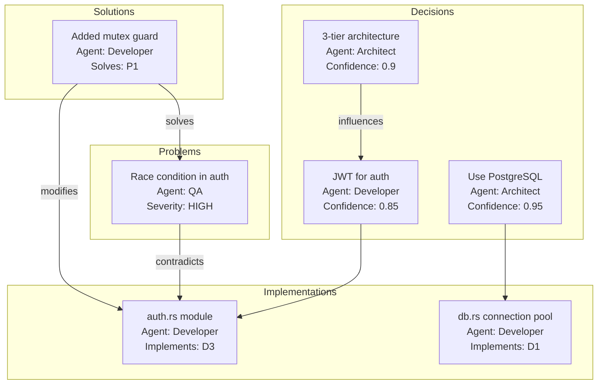

### 7.6 Ownership Tracking and Access Control

Knowledge entries have ownership and visibility rules:

```rust
#[derive(Debug, Clone, Serialize, Deserialize)]
pub struct KnowledgeAccess {
    /// Owner agent
    pub owner: AgentId,
    /// Visibility level
    pub visibility: KnowledgeVisibility,
    /// Agents that have read this knowledge
    pub read_by: Vec<(AgentId, DateTime<Utc>)>,
    /// Agents that have referenced this knowledge
    pub referenced_by: Vec<(AgentId, EventId)>,
}

#[derive(Debug, Clone, Serialize, Deserialize)]
pub enum KnowledgeVisibility {
    /// Visible to all agents in the session
    Public,
    /// Visible only to agents with the same role
    RoleRestricted { roles: Vec<String> },
    /// Visible only to the owner agent
    Private,
    /// Visible to specific agents
    SharedWith { agents: Vec<AgentId> },
}
```

---

## 8. Technology Recommendations

### 8.1 Core Infrastructure

| Component | Recommended Technology | Rationale |
|-----------|----------------------|-----------|
| **Event Store** | SQLite + WAL mode | Already in TimeWarp spec; WAL supports concurrent readers with single writer |
| **Blob Store** | Content-addressed filesystem (`.timewarp/blobs/`) | Deduplication built-in; compatible with Git object model |
| **Vector Clocks** | Custom Rust implementation | Lightweight; no external dependency needed |
| **AST Parsing** | tree-sitter (Rust bindings) | 200+ languages; incremental parsing; widely adopted |
| **CRDT Library** | Custom G-Set + G-Counter | Simple enough for custom impl; Automerge if more complex CRDTs needed |
| **Knowledge Graph** | In-memory with SQLite persistence | Start simple; migrate to graph DB (SurrealDB) if needed |
| **Distributed Sync** | Git transport + custom event delta protocol | Leverage existing Git infrastructure |

### 8.2 Open-Source Projects to Evaluate

| Project | Relevance | URL |
|---------|-----------|-----|
| **Automerge** | CRDT library for collaborative editing | https://automerge.org/ |
| **tree-sitter** | Incremental AST parsing for semantic diff | https://tree-sitter.github.io/ |
| **GumTree** | AST differencing algorithm | https://github.com/GumTreeDiff/gumtree |
| **Temporal.io** | Durable execution / event replay patterns | https://temporal.io/ |
| **EventStoreDB** | Event sourcing reference implementation | https://www.eventstore.com/ |
| **LangGraph** | Agent checkpoint/branch/resume patterns | https://github.com/langchain-ai/langgraph |
| **Agent-Git** | Git-like version control for agent state | https://github.com/KataDavidXD/Agent-Git |
| **SurrealDB** | Multi-model DB with graph capabilities | https://surrealdb.com/ |
| **Diamond Types** | High-performance CRDT for text | https://github.com/josephg/diamond-types |

### 8.3 Performance Targets

| Operation | Target Latency | Rationale |
|-----------|---------------|-----------|
| Record event (single agent) | < 5ms | Must not slow agent execution |
| Record event (conflict check) | < 20ms | Real-time conflict detection |
| Agent lane query | < 10ms | Fast timeline filtering |
| Vector clock update | < 1ms | Pure in-memory operation |
| Three-way merge (file) | < 100ms per file | Acceptable for merge operations |
| AST semantic diff | < 500ms per file | Background analysis |
| Knowledge graph query | < 50ms | Fast enough for agent context retrieval |
| Timeline sync (push/pull) | < 5s for 1000 events | Comparable to Git push/pull |

### 8.4 Scalability Considerations

| Dimension | Design Limit | Strategy |
|-----------|-------------|----------|
| Concurrent agents | 20 per session | Bounded by swarm config |
| Events per session | 100,000 | SQLite can handle; partition by session |
| Total events (all sessions) | 10M+ | SQLite WAL mode + periodic archival |
| Blob store size | 100 GB | Content-addressed dedup; zstd compression |
| Knowledge graph entries | 1M | In-memory with persistence; LRU eviction |
| Distributed replicas | 10 | G-Set CRDT scales linearly |

---

## 9. References

### Academic Papers

1. Lamport, L. (1978). "Time, Clocks, and the Ordering of Events in a Distributed System." *Communications of the ACM*, 21(7), 558-565.

2. Mattern, F. (1988). "Virtual Time and Global States of Distributed Systems." *Workshop on Parallel and Distributed Algorithms*, 215-226.

3. Shapiro, M., Preguica, N., Baquero, C., & Zawirski, M. (2011). "Conflict-Free Replicated Data Types." *Stabilization, Safety, and Security of Distributed Systems (SSS 2011)*, Springer LNCS 6976.

4. Kleppmann, M. & Beresford, A.R. (2017). "A Conflict-Free Replicated JSON Datatype." *IEEE Transactions on Parallel and Distributed Systems*, 28(10), 2733-2746.

5. Falleri, J.-R., Morandat, F., Blanc, X., Martinez, M., & Monperrus, M. (2014). "Fine-grained and Accurate Source Code Differencing." *29th ACM/IEEE International Conference on Automated Software Engineering (ASE 2014)*.

6. Hunt, J. & Szymanski, T. (1977). "A Fast Algorithm for Computing Longest Common Subsequences." *Communications of the ACM*, 20(5), 350-353.

7. Mens, T. (2002). "A State-of-the-Art Survey on Software Merging." *IEEE Transactions on Software Engineering*, 28(5), 449-462.

8. Apel, S., Liebig, J., Brandl, B., Lengauer, C., & Kastner, C. (2011). "Semistructured merge: rethinking merge in revision control systems." *ESEC/FSE 2011*.

9. Tao, Y., Dang, Y., Xie, T., Zhang, D., & Kim, S. (2012). "How Do Software Engineers Understand Code Changes?" *20th ACM SIGSOFT International Symposium on the Foundations of Software Engineering (FSE 2012)*.

10. Guo, Z., et al. (2024). "Large Language Model based Multi-Agents: A Survey of Progress and Challenges." *arXiv:2402.01680*. Survey of multi-agent LLM systems including ALMAS-style role decomposition.

11. Park, J. S., et al. (2023). "Generative Agents: Interactive Simulacra of Human Behavior." *UIST 2023*. Foundational work on memory architectures for AI agents.

12. Fowler, M. (2005, updated). "Event Sourcing." *martinfowler.com*. Canonical reference for event sourcing patterns.

### Open-Source Projects

13. Automerge. "A CRDT-based library for building collaborative applications." https://automerge.org/

14. tree-sitter. "An incremental parsing system for programming tools." https://tree-sitter.github.io/tree-sitter/

15. GumTree. "A framework for tree differencing." https://github.com/GumTreeDiff/gumtree

16. LangGraph. "Build stateful, multi-actor applications with LLMs." https://github.com/langchain-ai/langgraph

17. Agent-Git. "Git-like version control for AI agent conversations." https://github.com/KataDavidXD/Agent-Git

18. Temporal.io. "Open source durable execution platform." https://temporal.io/

19. EventStoreDB. "The stream database built for Event Sourcing." https://www.eventstore.com/

20. Diamond Types. "A high-performance CRDT for collaborative text editing." https://github.com/josephg/diamond-types

### Super-Goose Codebase References

21. `crates/goose/src/agents/team/handoffs.rs` -- ALMAS handoff validation system
22. `crates/goose/src/agents/team/roles.rs` -- ALMAS role definitions (Architect, Developer, QA, Security, Deployer)
23. `crates/goose/src/agents/team/coordinator.rs` -- Team workflow coordination
24. `crates/goose/src/agents/swarm.rs` -- Swarm orchestration (agent routing, scaling, communication)
25. `crates/goose/src/agents/orchestrator.rs` -- Agent orchestrator for specialist coordination
26. `docs/timewarp/ARCHITECTURE_BLUEPRINT.md` -- TimeWarp event model and DAG architecture
27. `docs/timewarp/SUPER_GOOSE_INTEGRATION.md` -- Integration with ALMAS, EvoAgentX, Coach/Player
28. `docs/timewarp/TIMEWARP_SOTA_RESEARCH.md` -- Landscape analysis and SOTA gap analysis

---

## Appendix A: Glossary

| Term | Definition |
|------|-----------|
| **Agent Lane** | A per-agent subsequence of events within the shared DAG |
| **Causal Dependency** | An explicit link indicating that one event depends on data produced by another |
| **CRDT** | Conflict-Free Replicated Data Type -- a data structure that guarantees convergence in distributed systems |
| **DAG** | Directed Acyclic Graph -- the underlying structure of the TimeWarp event store |
| **Event** | An immutable record of an agent action (file write, command execution, LLM call, etc.) |
| **Handoff** | Transfer of work from one agent/role to another with validation |
| **Knowledge Entry** | A structured piece of knowledge extracted from timeline events |
| **Snapshot** | A content-addressed capture of the complete workspace file tree at a point in time |
| **Vector Clock** | A mechanism for tracking causal ordering in distributed systems |

## Appendix B: Data Model Summary

```
MultiAgentEventStore
  |
  +-- EventDAG (shared, append-only)
  |     +-- Event[]
  |           +-- event_id, agent_id, agent_role
  |           +-- parent_ids, causal_deps, vector_clock
  |           +-- event_type, inputs, outputs
  |           +-- file_touches, snapshot_id
  |           +-- prev_hash, event_hash
  |
  +-- AgentLanes (per-agent event indices)
  |     +-- HashMap<AgentId, Vec<EventId>>
  |
  +-- SharedWorkspace (materialized view)
  |     +-- WorkspaceFile[]
  |           +-- path, blob_hash
  |           +-- last_modified_by, contributors
  |           +-- lock state
  |
  +-- ConflictDetector
  |     +-- StructuralConflictDetector (file-level)
  |     +-- SemanticConflictDetector (AST-level, tree-sitter)
  |     +-- BehavioralConflictDetector (test execution)
  |
  +-- SharedMemory (knowledge graph)
  |     +-- KnowledgeEntry[]
  |     +-- topic_index, agent_index, file_index
  |
  +-- SyncProtocol (distributed)
        +-- push/pull events
        +-- CRDT merge (G-Set)
        +-- blob transfer
```

## Appendix C: Integration Points with Existing Super-Goose Code

| Super-Goose Component | Integration Point | TimeWarp Feature |
|-----------------------|-------------------|-----------------|
| `SwarmAgent` (swarm.rs) | `agent_id`, `role`, `state` | Event attribution, lane assignment |
| `AlmasRole` (roles.rs) | `Architect`, `Developer`, `QA`, `Security`, `Deployer` | Handoff events, role-based checkpoints |
| `HandoffManager` (handoffs.rs) | `validate_handoff()`, `HandoffArtifact` | Handoff timeline events, branch-on-failure |
| `TeamCoordinator` (coordinator.rs) | `create_team()`, `TeamResult` | Multi-agent session management |
| `CapabilityEnforcer` (enforcer.rs) | `check_operation()` | Per-agent workspace access control |
| `AgentOrchestrator` (orchestrator.rs) | `WorkflowTask`, dependency graph | Task-level event mapping |
| `SwarmRouter` (swarm.rs) | `RoutingStrategy` | Agent selection for parallel exploration |
| `CostTracker` (observability) | Token/cost tracking | Resource budgeting for parallel branches |
