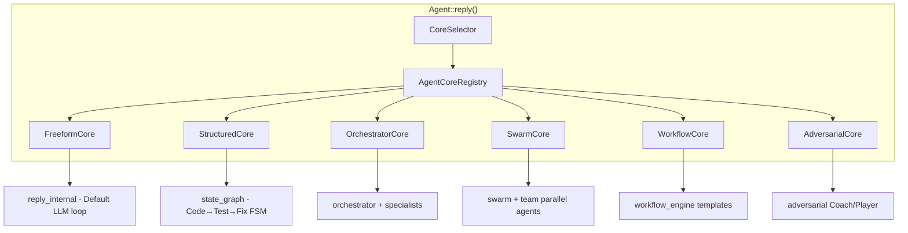
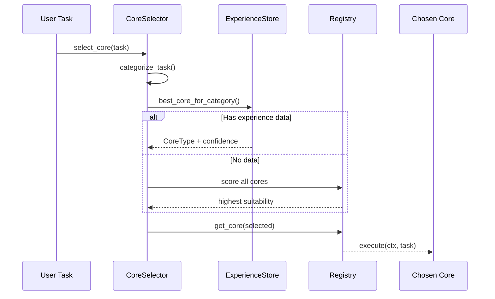
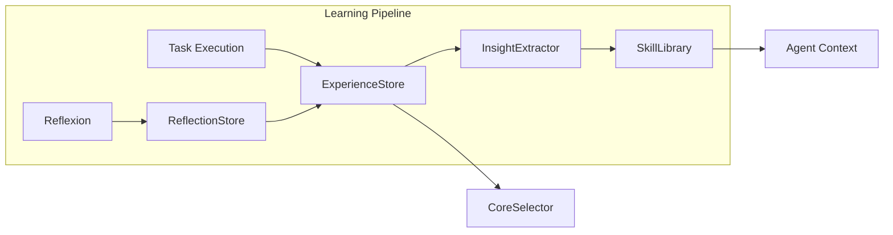

# Agentic Core System

Super-Goose extends goose with a **swappable agentic core system** — six specialized execution strategies that can be hot-swapped at runtime. Each core wraps an existing subsystem and presents a unified interface through the `AgentCore` trait.

## Architecture Overview



## The Six Cores

| Core | Strategy | Best For |
|:--|:--|:--|
| **FreeformCore** | Default LLM conversation loop | Chat, research, open-ended tasks |
| **StructuredCore** | Code→Test→Fix finite state machine | Deterministic code generation with test validation |
| **OrchestratorCore** | Multi-agent specialist DAG coordination | Complex multi-file tasks requiring multiple specialists |
| **SwarmCore** | Parallel agent pool | Large-scale refactoring across many files |
| **WorkflowCore** | Template-based task pipelines | CI/CD, deployment, release workflows |
| **AdversarialCore** | Coach/Player adversarial review cycle | Security audits, code review, quality gates |

## AgentCore Trait

Every core implements the `AgentCore` trait, which provides:

| Method | Purpose |
|:--|:--|
| `name()` | Unique identifier matching `CoreType` enum |
| `core_type()` | Returns the `CoreType` variant |
| `capabilities()` | Declares what this core can do (code gen, testing, parallel, etc.) |
| `description()` | Human-readable description for `/cores` listing |
| `suitability_score(hint)` | Scores how suitable this core is for a task (0.0–1.0) |
| `execute(ctx, task)` | Runs the task within this core's execution strategy |
| `metrics()` | Returns current performance metrics |
| `reset_metrics()` | Clears metrics (e.g., on session start) |

## Hot-Swap Commands

Switch cores at runtime without restarting:

| Command | Action |
|:--|:--|
| `/cores` | List all 6 cores with descriptions and capabilities |
| `/core freeform` | Switch to FreeformCore |
| `/core structured` | Switch to StructuredCore (Code→Test→Fix) |
| `/core orchestrator` | Switch to OrchestratorCore (multi-agent) |
| `/core swarm` | Switch to SwarmCore (parallel) |
| `/core workflow` | Switch to WorkflowCore (templates) |
| `/core adversarial` | Switch to AdversarialCore (review) |

Aliases are supported: `struct`, `orch`, `wf`, `adv`, `coach`, `parallel`, `ctf`, etc.

## CoreSelector (Auto Selection)

The `CoreSelector` automatically picks the best core for a given task by:

1. **Categorizing** the task via keyword matching (code, refactor, research, docs, security, deploy)
2. **Querying** the `ExperienceStore` for historical performance data
3. **Scoring** each core's suitability for the task category
4. **Falling back** to suitability scoring if insufficient experience data exists



## Persistent Learning Engine

The learning engine enables cross-session improvement:



| Component | Purpose |
|:--|:--|
| **ExperienceStore** | SQLite cross-session learning — stores task, core used, outcome, cost, time, insights |
| **InsightExtractor** | ExpeL-style pattern analysis — extracts insights about core selection, failures, and optimizations |
| **SkillLibrary** | Voyager-style reusable strategies — stores verified skills ranked by keyword relevance |
| **ReflectionStore** | Persistent Reflexion data — verbal reinforcement learning across sessions |

### Learning Commands

| Command | Action |
|:--|:--|
| `/experience` | Show recent task experiences |
| `/experience stats` | Show core performance statistics |
| `/skills` | List verified reusable skills |
| `/insights` | Extract and display pattern insights |

## Per-Core Metrics

Every core tracks performance metrics:

| Metric | Description |
|:--|:--|
| `total_executions` | Number of times this core has been used |
| `successful_executions` | Tasks completed successfully |
| `failed_executions` | Tasks that failed |
| `avg_turns` | Average number of turns per task |
| `avg_time_ms` | Average execution time in milliseconds |
| `avg_cost` | Average cost per execution |

## Test Coverage

| Module | Tests | Status |
|:--|:--:|:--:|
| Core (6 cores + registry + selector) | 87 | ALL PASS |
| ExperienceStore | 11 | ALL PASS |
| InsightExtractor | 7 | ALL PASS |
| SkillLibrary | 7 | ALL PASS |
| ReflectionStore | 7 | ALL PASS |
| Reflexion | 7 | ALL PASS |
| Planner | 13 | ALL PASS |
| **Backend Total** | **139** | **ALL PASS** |

## File Structure

```
crates/goose/src/agents/core/
├── mod.rs                  # AgentCore trait, CoreType enum, CoreCapabilities
├── context.rs              # AgentContext, TaskHint, TaskCategory
├── freeform.rs             # FreeformCore implementation
├── structured.rs           # StructuredCore (Code→Test→Fix FSM)
├── orchestrator_core.rs    # OrchestratorCore (multi-agent)
├── swarm_core.rs           # SwarmCore (parallel agents)
├── workflow_core.rs        # WorkflowCore (template pipelines)
├── adversarial_core.rs     # AdversarialCore (Coach/Player)
├── registry.rs             # AgentCoreRegistry (hot-swap)
├── metrics.rs              # CoreMetrics, CoreMetricsSnapshot
└── selector.rs             # CoreSelector, SelectionResult

crates/goose/src/agents/
├── experience_store.rs     # SQLite cross-session learning
├── insight_extractor.rs    # ExpeL-style pattern analysis
├── skill_library.rs        # Voyager-style reusable strategies
└── persistence/
    └── reflection_store.rs # SQLite-backed Reflexion data
```
