# Autonomous Daemon

The Autonomous Daemon runs Super-Goose as a background service that can schedule tasks, manage branches, create releases, generate documentation, and watch CI pipelines — all without human intervention.

## Architecture Overview

```mermaid
graph TB
    subgraph Daemon["Autonomous Daemon"]
        TS[TaskScheduler] --> BM[BranchManager]
        TS --> RM[ReleaseManager]
        TS --> DG[DocsGenerator]
        TS --> CW[CiWatcher]
    end

    subgraph Safety["Safety Layer"]
        FS[Failsafe] --> AL[AuditLog]
    end

    TS --> FS
    FS --> Daemon

    style Safety fill:#1a0a0a,stroke:#ef4444
```



## Components

| Component | Purpose |
|:--|:--|
| **TaskScheduler** | Cron-like scheduler for recurring autonomous tasks |
| **BranchManager** | Creates feature branches, manages merge strategies |
| **ReleaseManager** | Tags releases, generates changelogs, publishes artifacts |
| **DocsGenerator** | Auto-generates documentation from code changes |
| **CiWatcher** | Monitors CI pipelines and triggers fixes on failures |
| **Failsafe** | Kill switch and resource limits to prevent runaway behavior |
| **AuditLog** | Immutable log of every autonomous action for traceability |

## Slash Commands

| Command | Action |
|:--|:--|
| `/autonomous start` | Start the autonomous daemon |
| `/autonomous stop` | Stop the daemon gracefully |
| `/autonomous status` | Show daemon status, active tasks, and recent actions |

## Safety Design

The Autonomous Daemon is designed with defense-in-depth:

1. **Failsafe**: Hard resource limits (CPU, memory, disk, time). If any limit is exceeded, the daemon stops immediately.
2. **AuditLog**: Every action is logged with timestamp, component, action type, and outcome. Logs are append-only and cannot be modified.
3. **Task Isolation**: Each scheduled task runs in its own context with limited permissions.
4. **Human Override**: The `/autonomous stop` command immediately halts all autonomous activity.

## File Structure

```
crates/goose/src/autonomous/
├── mod.rs              # Module exports and daemon lifecycle
├── task_scheduler.rs   # Cron-style task scheduling
├── branch_manager.rs   # Git branch operations
├── release_manager.rs  # Release tagging and publishing
├── docs_generator.rs   # Documentation automation
├── ci_watcher.rs       # CI pipeline monitoring
├── failsafe.rs         # Kill switch and resource limits
└── audit_log.rs        # Immutable action logging
```

## Test Coverage

| Module | Tests | Status |
|:--|:--:|:--:|
| Autonomous daemon (all 8 modules) | 86 | ALL PASS |
