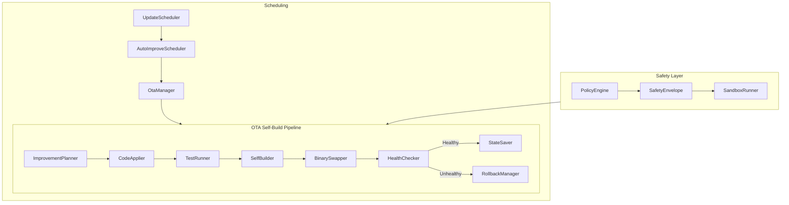

# OTA Self-Build Pipeline

Super-Goose can recompile itself, swap its own binary at runtime, and roll back if something goes wrong. This is the **Rust self-compilation** capability that distinguishes Super-Goose from every other AI coding agent.

## Architecture Overview



## Pipeline Stages

| Stage | Component | Purpose |
|:--|:--|:--|
| **Plan** | ImprovementPlanner | Analyzes experience data and proposes code changes |
| **Apply** | CodeApplier | Patches source files with proposed improvements |
| **Test** | TestRunner | Runs `cargo test` to validate changes compile and pass |
| **Build** | SelfBuilder | Compiles the new binary with `cargo build --release` |
| **Swap** | BinarySwapper | Atomically replaces the running binary (rename + signal) |
| **Verify** | HealthChecker | Confirms the new binary starts and responds correctly |
| **Save** | StateSaver | Persists the successful state for future rollbacks |
| **Rollback** | RollbackManager | Restores the previous binary if health check fails |

## Safety Mechanisms

The OTA pipeline never runs unsupervised code without guardrails:

- **PolicyEngine**: Defines what kinds of changes are permitted (e.g., no changes to auth, no dependency additions without review)
- **SafetyEnvelope**: Enforces resource limits (CPU, memory, disk, time) on the build process
- **SandboxRunner**: Executes the new binary in an isolated environment before promoting it
- **RollbackManager**: Maintains a history of working binaries and can restore any previous version

## Slash Commands

| Command | Action |
|:--|:--|
| `/self-improve` | Run the full OTA pipeline |
| `/self-improve --dry-run` | Plan improvements without applying them |
| `/self-improve status` | Show current OTA pipeline status |

## Scheduling

The `AutoImproveScheduler` can run the OTA pipeline on a configurable schedule (default: nightly). The `UpdateScheduler` coordinates with the `OtaManager` to ensure only one improvement cycle runs at a time.

## File Structure

```
crates/goose/src/ota/
├── mod.rs                    # Module exports
├── state_saver.rs            # Checkpoint persistence
├── self_builder.rs           # cargo build --release wrapper
├── binary_swapper.rs         # Atomic binary replacement
├── health_checker.rs         # Post-swap health verification
├── rollback_manager.rs       # Binary version management
├── update_scheduler.rs       # Scheduling infrastructure
├── ota_manager.rs            # Pipeline orchestrator
├── test_runner.rs            # cargo test wrapper
├── improvement_planner.rs    # Change proposal engine
├── code_applier.rs           # Source file patching
├── auto_improve_scheduler.rs # Nightly automation
├── policy_engine.rs          # Change permission rules
├── safety_envelope.rs        # Resource limit enforcement
└── sandbox_runner.rs         # Isolated execution
```

## Test Coverage

| Module | Tests | Status |
|:--|:--:|:--:|
| OTA pipeline (all 13 modules) | 198 | ALL PASS |
