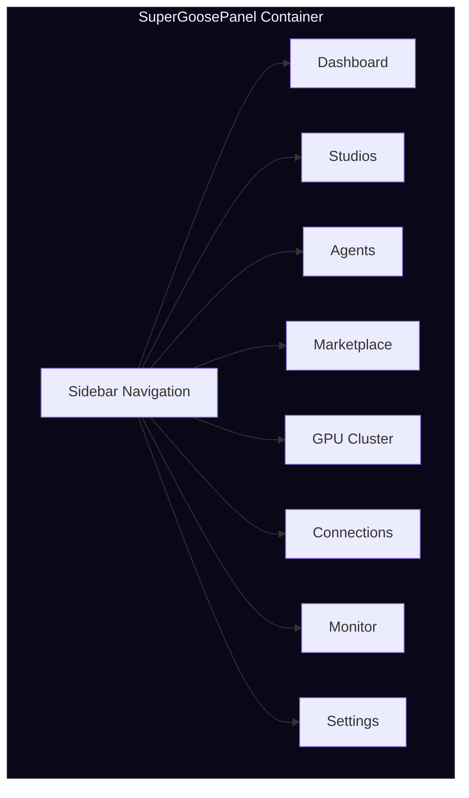

# Super-Goose 8-Panel Sidebar

Super-Goose includes a dedicated panel system with 8 specialized views, each providing controls and visibility for different aspects of the agentic platform.

## Panel Architecture



## Panel Overview

| Panel | Purpose | Key Features |
|:--|:--|:--|
| **Dashboard** | System overview and quick actions | Stats grid (4 cards), quick actions, hardware status, recent activity |
| **Studios** | Training and development environments | 6 studios: Core, Agent, Data, Eval, Deploy, Vision |
| **Agents** | Core management and monitoring | Active agents, 6 core types with Select buttons, core builder |
| **Marketplace** | Core trading and sharing | Browse, My Cores, Sell tabs |
| **GPU Cluster** | GPU resource management | Local GPU status, cloud BYOK (RunPod, Lambda, Vast.ai) |
| **Connections** | External service integrations | GitHub, HuggingFace, Docker, W&B, Ollama, Claude, OpenAI |
| **Monitor** | Cost tracking and live logging | Session/today/budget cost tracker, agent stats, live logs |
| **Settings** | Configuration and feature toggles | Feature toggles, storage info, version display |

## Design Token System

All Super-Goose panels use a dedicated CSS token system scoped via `data-super="true"` attribute. This ensures complete color isolation from stock goose components.

### Color Palette

| Token | Color | Usage |
|:--|:--:|:--|
| `--sg-bg` | #080818 | Deep space background |
| `--sg-surface` | #0a0a1f | Panel surfaces |
| `--sg-card` | #0f0f23 | Card backgrounds |
| `--sg-gold` | #fbbf24 | Branding accent, pricing |
| `--sg-indigo` | #6366f1 | Primary actions |
| `--sg-emerald` | #10b981 | Success, connected, active |
| `--sg-amber` | #f59e0b | Warning, in-progress |
| `--sg-red` | #ef4444 | GPU, training, errors |
| `--sg-violet` | #8b5cf6 | Cores, studios |
| `--sg-sky` | #0ea5e9 | Marketplace, info |

### Text Hierarchy

| Token | Color | Usage |
|:--|:--:|:--|
| `--sg-text-1` | #f1f5f9 | Brightest text (headings) |
| `--sg-text-2` | #cbd5e1 | Secondary text |
| `--sg-text-3` | #94a3b8 | Muted text |
| `--sg-text-4` | #64748b | Dim text |
| `--sg-text-5` | #475569 | Dimmest text |

### Utility Classes

| Class | Purpose |
|:--|:--|
| `sg-card` | Card container with border and background |
| `sg-badge-*` | Status badges (emerald, amber, red, violet, sky, gold) |
| `sg-btn-primary` | Primary action button with gradient |
| `sg-btn-ghost` | Ghost/outline button |
| `sg-status-*` | Status indicator dots |
| `sg-sidebar` | Sidebar navigation container |
| `sg-tabs` | Tab navigation system |
| `sg-progress` | Progress bar component |
| `sg-section-label` | Section heading label |

## Dual Color System

Super-Goose maintains complete color isolation:

| Scope | Colors | Components |
|:--|:--|:--|
| **Stock goose** | Block teal (#13bbaf), orange (#ff4f00), neutral scale | Chat, settings, extensions |
| **Super-Goose** | sg-* tokens (gold, indigo, emerald, etc.) | All 8 panels, pipeline viz |

CSS scoping is achieved via the `.super-goose-panel` class and `[data-super="true"]` attribute selector. No Super-Goose styles leak into stock goose components.

## File Structure

```
ui/desktop/src/components/super/
├── SuperGoosePanel.tsx      # Container + sidebar nav + panel switching
├── DashboardPanel.tsx       # Stats grid, quick actions, hardware
├── StudiosPanel.tsx         # 6 studio cards
├── AgentsPanel.tsx          # Active/Cores/Builder tabs
├── MarketplacePanel.tsx     # Browse/My Cores/Sell tabs
├── GPUPanel.tsx             # Cluster/Jobs/Launch tabs
├── ConnectionsPanel.tsx     # Services/Models/API Keys tabs
├── MonitorPanel.tsx         # Cost tracker, agent stats, live logs
├── SGSettingsPanel.tsx      # Feature toggles, storage, version
└── __tests__/
    └── SuperGoosePanel.test.tsx  # 11 vitest tests
```

## Test Coverage

| Component | Tests | Status |
|:--|:--:|:--:|
| SuperGoosePanel navigation | 8 | PASS |
| CSS scoping (data-super) | 1 | PASS |
| Badge display | 1 | PASS |
| Default panel | 1 | PASS |
| **Total** | **11** | **ALL PASS** |
